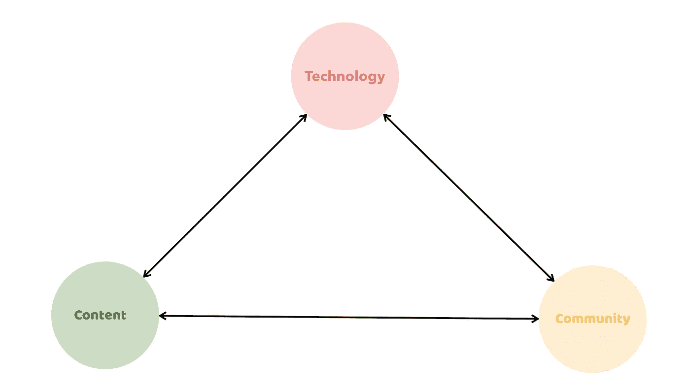
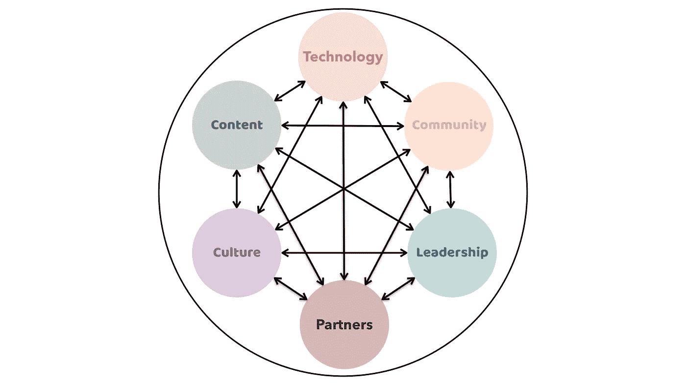

# 现在有哪些创业公司(以及我们所有人)可以向苹果学习

> 原文：<https://medium.com/hackernoon/what-startups-and-all-of-us-can-learn-from-apple-now-166ad2fe2065>

## ***从产品到平台再到生态系统(而且不仅仅是关于技术)***

Photo by [Aidan Hancock](https://unsplash.com/photos/UeqEo3EFBhE?utm_source=unsplash&utm_medium=referral&utm_content=creditCopyText) on [Unsplash](https://unsplash.com/@aidanmh?utm_source=unsplash&utm_medium=referral&utm_content=creditCopyText)

越来越多的文章、博客和视频预测苹果的*时代即将结束。*

我甚至读过一个将苹果和诺基亚进行比较的故事。我们现在都知道，这不会有好结果。

但是所有这些文章都忽略了一个重要的点。他们倾向于孤立地看待苹果产品:“iPhone 销量下降”或“iMac 失去魔力”

然而，苹果最成功的决定是它从“成为一家科技公司”到“成为一个生态系统”的转变生态系统非常有弹性，即使在环境发生最剧烈的变化时也能生存下来。

这就是为什么我相信苹果生态系统依然强大，并将继续在科技、工作和社会的未来发挥关键作用。

我们仍然可以向苹果公司学习。

在我评估了几个创业投资提案后，我写了这篇文章。商业计划的重点是健康、保健和福祉。

看到新兴技术如何从根本上改变行业是非常有趣的。例如，区块链的初创公司为当前医疗保健系统中的许多低效、错误和官僚主义提出了解决方案。想想改善患者记录的可访问性，以及跟踪药品和药物的生产和分销。

其他初创公司使用“人工智能”来改善医疗诊断。机器人辅助手术的创新令人振奋。

但是，大多数提议都认为医疗保健的未来是“平台”

“平台理念”是有道理的。人口正在老龄化，随之而来的是老年疾病和健康并发症的增加。需要通过促进和协调两个或更多用户组之间的平滑和直接连接来创造价值的技术。想想病人、护理人员、医疗专业人员等。这些平台还允许为医疗和健康应用创建警报、收集和分析数据。

# 平台什么时候会成功？

我看到的大多数创业公司都把他们的提议集中在平台技术上。他们解释了为什么他们的算法、数据、传感器优于竞争对手使用的技术。

> **但是最好的创业公司都不卖平台。他们认识到建立一个或多个生态系统的好处。**

根据维基百科的定义，生态系统是“一个有生命的有机体与其环境中的非生命组成部分的共同体，作为一个系统相互作用。”

评估完商业计划后，我可以大致区分两个生态系统:(1)网飞生态系统和(2)T2 苹果生态系统。

*网飞*生态系统使用“微服务”架构来加速增长，适应变化，并为服务的最终用户提供更多价值。可以将这些生态系统看作是松散耦合的应用程序的集合，这些应用程序被配置为通过应用程序编程接口(API)进行交互。

API 方法为新的和其他生态系统提供了灵活性和窗口。它还允许生态系统从第三方开发者那里吸引创新的想法。

 [## 网飞是如何工作的:每次点击播放时都会发生的(极度简化的)复杂事情

### 不久前，《纸牌屋》第五季回归，终于结束了全世界狂热观众的漫长等待

medium.com](/refraction-tech-everything/how-netflix-works-the-hugely-simplified-complex-stuff-that-happens-every-time-you-hit-play-3a40c9be254b) 

苹果是另一个被广泛使用且广为人知的生态系统例子。我是一个狂热的苹果用户，可以订阅互联、互操作和无缝交互的产品/设备(iMac、iPad、Apple Watch、AirPods)的“技术生态系统”的优势。

在我所回顾的医疗保健生态系统中，我们可以区分其他两个重要的组成部分:(1)内容(连接、监控、分析、预测)和(2)护理者、患者等的社区。

3 Components of an “ecosystem” that were addressed in the startup proposals I reviewed in February 2019

# **三个缺失的组件**

通常给我留下深刻印象的是，生态系统的提议往往很快就会变得重复。在解释了技术、内容和潜在社区之后，提案通常会包含更多的插图和解释。

这是令人惊讶的，因为网飞和苹果的例子都表明，在一个繁荣和有吸引力的生态系统的创建中(至少)还有另外三个要素。

## **#领导**

第一个缺失的部分是领导力。在波士顿举行的 1997 年 Macworld 大会上(史蒂夫·乔布斯刚刚回到苹果公司)，焦点并不在技术和内容上。

为了建立苹果生态系统，领导层的变动是必要的:

*“那么，我们要开始采取哪些步骤呢？首先要做的一件事就是从顶层开始。苹果在底层做了很多改变，我认为这种改变需要从高层开始，董事会应该关注相关性。”*

领导力是关于使命、愿景和创造力的。“领导层”必须在其所有决策和运作中确定并“遵循”一套核心价值观。1997 年末，*苹果*采用了“与众不同”的口号来重新推出这个品牌，回归基础，专注于“真正重要的东西”我看过的大多数商业计划都没有提到领导力(包括顾问的角色)，或者只是顺便提一下。

## **文化# T3**

第二个缺失的(相关的)部分是(生态系统的)文化。我们都知道，强大的文化可以带来更高的忠诚度和社区意识，从而吸引并帮助留住人才、第三方开发者和用户等。强大的文化确保生态系统是统一的，其利益相关者共同努力实现共同的目标。

什么是强势文化？

当然，*网飞*文化跃入脑海，公司的核心价值观决定了谁被“雇佣和解雇”此外，一个生态系统需要向利益相关者提供一个可访问的、诚实的体验。请记住，如果一个生态系统未能以负责任的方式行事——在如何处理隐私数据、服务提供商或任何平台利益相关方方面——那么用户将很快迁移到另一个生态系统。因此——考虑到留住用户对网络效应的依赖——这个生态系统将面临严重破坏甚至崩溃的风险。

此外，生态系统必须促进与对他们“重要”的用户社区的联系。他们必须“邀请”真正的用户创意和参与。

*苹果*通过其流行而著名的主题演讲与市场沟通。事实证明，苹果公司在发布会前的大肆宣传是激发人们对其生态系统的兴奋和兴趣的有效手段。

 [## 苹果主题演讲的隐藏结构

### 苹果最成功的产品之一——很少被认为是这样——不是由铝和玻璃制成的，而是由…

qz.com](https://qz.com/261181/the-hidden-structure-of-the-apple-keynote/) 

今天，社交媒体和社交媒体平台发挥着至关重要的作用。然而，太多的初创公司(尤其是当它们是大学的副产品时)依赖科学论文和其他学术成果来创造新市场、激发兴趣和建立社区。他们没有意识到，在现代数字社会和移动世界中，每个公司都在从事媒体业务。

然而，为了取得成功，生态系统需要收集来自社区的反馈，并确保用户的兴趣和关注定期整合到其服务和运营中。

而且，社交媒体的巧妙运用正在做到这一点。

## **#合作伙伴**

建设生态系统需要创新的合作伙伴。1997 年，史蒂夫·乔布斯这样描述它:

*“现在，我想谈谈有意义的伴侣。苹果生活在一个生态系统中。这意味着来自其他伙伴的帮助；意思是帮助其他伙伴。”*

这句话今天仍然适用。创新伙伴关系涉及重新思考生态系统的外部边界，以纳入对决策和行动具有重要影响的行为者。

主要合作伙伴现在包括研究中心、大学和其他公司。

传统上，这些合作伙伴被概念化为一个组织的外部或外围，但对包容性伙伴关系的需求意味着这种隐喻不再合适。

最近宣布的苹果公司与全球投资银行 T2 高盛公司的合作显示了合作关系在今天的重要性。对于*苹果*来说，它打开了进入金融生态系统的大门，或者为其现有的生态系统带来金融服务。

 [## 大型科技公司和大银行的最新组合是苹果-高盛信用卡

### 美国一些最大的科技公司正在与该国最大的银行进行合作。最近的婚姻是…

qz.com](https://qz.com/1555937/apple-and-goldman-sachs-are-launching-a-credit-card/?utm_source=email&utm_medium=daily-brief) 

# **一个生态系统是活的**

The 6 Components of an technology/business ecosystem

最后一个例子揭示了一个重要的观点；生态系统进化。

*苹果*就是这方面的绝佳例证。1997 年，领导力、文化和伙伴关系是苹果最初成功背后的重要驱动力。这些年来，关键角色被技术、内容和社区所取代。领导力、文化和伙伴关系并没有被忽视，但都不太重要。例如，苹果的主题演讲远没有五年前那么激动人心。

但这即将改变。随着越来越多的用户迁移到其他生态系统(至少在我的环境中)，可以预期的是*苹果*未来会更加重视领导力和文化。与高盛的新伙伴关系和提供新的金融服务只是苹果生态系统转变的迹象之一。

这是大多数创业提案中缺少的最后一样东西。

如今，公司、平台和生态系统在高度竞争的全球市场中运作，其背景是指数级的技术增长、快速发展的业务和不断变化的消费者需求。这种新的运行环境给生态系统带来了持续的压力。对现有服务进行简单的“调整”不足以在中长期内生存。

事实上，如果我们观察任何一个主要的生态系统，我们都可以看到技术、内容、社区、领导力、文化和合作伙伴关系的不断扩张。

强大生态系统的弹性——适应环境中最具威胁的变化的能力——可能是从苹果公司和 T21 公司学到的最重要的一课。

*感谢您的阅读！请点击*👏*下面，还是留下评论吧。*

*每周都有新的故事。因此，如果你关注我，你不会错过我关于数字时代如何改变我们生活、工作和学习方式的最新见解。*