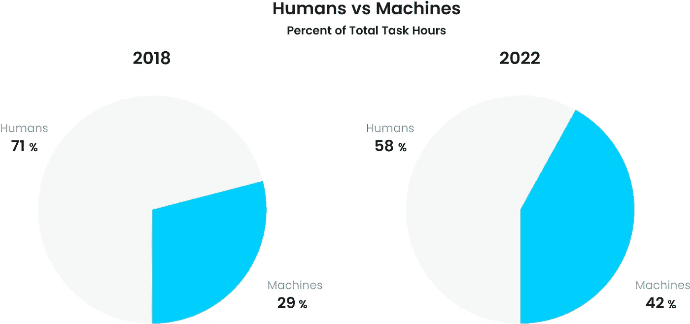
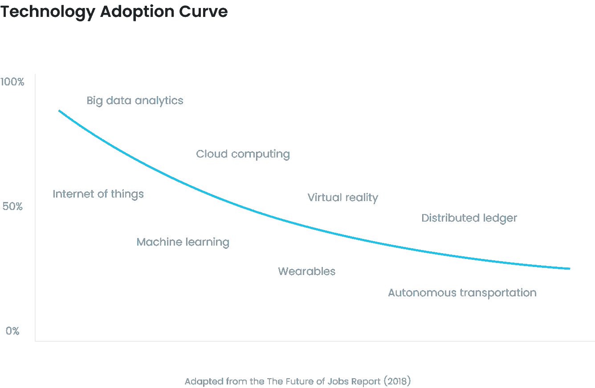
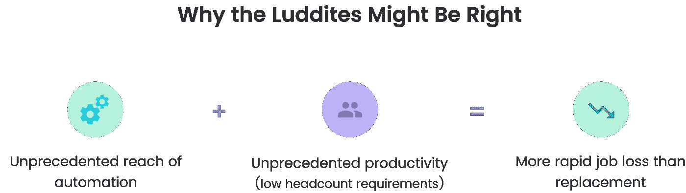

# 世界经济论坛对就业前景的误解是什么

> 原文：<https://medium.com/hackernoon/what-the-world-economic-forum-got-wrong-about-the-future-of-jobs-372bf4f7aa05>

Photo by [Dominik Scythe](https://unsplash.com/photos/Sot0f3hQQ4Y?utm_source=unsplash&utm_medium=referral&utm_content=creditCopyText)

# 【TL；博士]

*   WEF 估计，到 2022 年，技术将创造 1.33 亿个就业岗位，减少 7500 万个，净增加 5800 万个
*   盲目乐观会让我们对劳动力的长期结构性变化毫无准备
*   自动化的不断进步可能会摧毁它接下来创造的就业机会
*   及时对大量工人进行再培训可能不切实际或不可能

世界经济论坛发布了年度[就业前景报告](http://www3.weforum.org/docs/WEF_Future_of_Jobs_2018.pdf)，概述了未来五年将扰乱全球经济的重要趋势。最大的收获是:到 2022 年，新技术和自动化将创造 1.33 亿个就业岗位，减少 7500 万个，净增加 5800 万个。

什么在推动增长？无处不在的高速移动互联网、人工智能、大数据分析的广泛采用以及云技术。

自动化在迅速发展，机器在更加努力地工作。通过计算任务时间，我们可以比较人类和机器在各自任务上花费的总时间:

> “2018 年，在报告涵盖的 12 个行业中，平均 71%的总任务时间由人类执行，而由机器执行的比例为 29%。到 2022 年，这一平均水平预计将转变为 58%的任务时间由人类完成，42%由机器完成。”

世界经济论坛称这个技术变革的时代为第四次工业革命。根据 WEF 的说法，第四次工业革命将是大规模的工作自动化，但更大的工作增加。随着一些工人的再培训，未来应该是光明的。

但这是乐观的 WEF 报告所忽略的。

# 1.自动化压路机

接受 WEF 调查的企业报告了不同的技术采用率:

采用，上图中的纵轴，只是创新等式的一半。新技术发展，横轴，平行加速。

因此，自动化的速度比技术采用的速度更快(T2)。我们自动化得越多，我们就能越快地自动化未来的工作。

例如，优步已经实现了自动拼车，创造了 200 多万个就业岗位。但是，随着优步和谷歌追求自动驾驶汽车技术，这些新创造的就业机会是砧板上的下一个工作机会。

优步司机面临着一个奇怪的生存危机——他们*知道*他们雇主的未来策略是让他们失业。

让我们看看今天其他新创造的工作，比如数据科学家。他们重复的任务，比如数据争论和数据可视化，会被未来的服务自动化吗？数字化支持的新工作尤其面临风险，因为它们已经由软件支持，并创建了可以通过机器学习进行优化或自动化的数据足迹。

即使软件和机器学习只是提高了工人的生产力(而不是完全消除工作)，不可避免的事实是，管理整个工作所需的人员将越来越少——随着时间的推移，任何特定功能所需的员工数量都会减少。

创造的 1.33 亿个工作岗位会是下一个消失的吗？

# 2.再技能瓶颈

随着技术采用率的提高，软件开发商的前景保持强劲也就不足为奇了。几十年来，我们都知道开发人员越来越重要。非营利组织，像昆西·拉森的[免费代码营](https://www.freecodecamp.org/)，甚至会免费教你编码。

那么为什么开发者是如此稀缺的资源呢？根据最近的一份 Stripe 报告，在创新方面，公司将[开发商视为比资本](https://www.software.com/review/developer-productivity-a-bigger-constraint-to-innovation-than-capital)更大的限制。

虽然技术可能会创造大量的新工作，但这些工作对于大量劳动力来说可能很难学习和完成。

更糟糕的是，再技能瓶颈和自动化存在于反馈循环中。瓶颈越大，就越有动力将这些工作自动化，或者通过提高工人生产率来减少工作岗位的数量。

# 3.卢德谬论和盲目乐观主义

WEF 报告在很大程度上对就业的未来持乐观态度。马克·安德森表示赞同，他说，“这是一个谬论…这是一种反复出现的恐慌。这种情况每隔 25 或 50 年就会发生一次，人们会兴奋地说‘机器将取代所有工作’，但这种情况从未发生过。”

但盲目乐观的观点，如果不正确，会大大减少应对大量失业所需的时间。

这一周期不会像工业革命那样发展，可能有一些原因。软件已经是几乎每一个大中型公司的支柱，允许自动化达到前所未有的程度。

此外，随着服务、设备和平台的激增，几乎所有行业和岗位的工人都变得越来越有效率，从而减少了可用工作的总数。

因此，失业的速度可能远远快于就业岗位的创造和工人技能的再提高。‍

‍We 可以寄希望于世界经济论坛和马克·安德森的预测是正确的。但如果他们不这样做，我们就需要开始计划在不断的技术进步和自动化面前创造真正的、可持续的就业机会。

感谢阅读。如果你是一名开发者，看看你能从*的编码数据中学到什么。*

* [## 软件|在文本编辑器或 IDE 中跟踪代码时间

### 实时自动跟踪您的编程活动。查看您的编码数据以增加流量，减少中断…

www.software.com](https://www.software.com)*