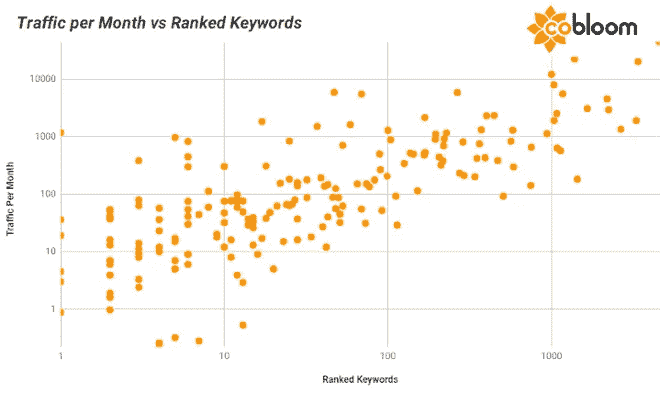

# 承认下放一切不管用后怎么办

> 原文：<https://medium.com/hackernoon/what-to-do-after-you-admit-decentralizing-everything-doesnt-work-4f89e53eef64>

## <[查看黑客正午 2.0](https://hackernoon.com/tech-newsletter-0309-decentralizing-everything-never-seems-to-work-nnt13158) >的这份简讯

## 权力下放是新的颠覆。

## ***本报讯由*** [***倾情赞助***](https://hackernoon.us19.list-manage.com/track/click?u=b48b0ec2173fecf2586c00e80&id=2fb9c52ab2&e=46d726253d) ***。***

*Headquarters of the Internet Archive, home of the Decentralized Web conferences (Wikimedia Commons).*

与此同时，像温顿·瑟夫、布鲁斯特·卡尔和蒂姆·伯纳斯·李这样的互联网先驱正试图重新分散网络。

他们通过加倍努力开发新的、更好的去中心化技术来应对基于监控的平台垄断的崛起。

**他们似乎没有注意到这个模式:** [***光靠去中心化的技术并不能保证去中心化的结果。***](https://hackernoon.com/decentralizing-everything-never-seems-to-work-2bb0461bd168)

当集权在一个明显分散的系统中的其他地方出现时，它会令人吃惊或者被忽视。

——内森·施耐德的故事

## [**读其余的**](https://hackernoon.com/decentralizing-everything-never-seems-to-work-2bb0461bd168)

# 更多今日顶级科技故事

***【上】***[***node . js***](https://hackernoon.com/tagged/nodejs)*[***s***](https://hackernoon.com/tagged/digital-transformation)[***tartups***](https://hackernoon.com/tagged/startups)*[***SaaS***](https://hackernoon.com/tagged/saas)********

## ***✳️ [到底是什么让 Node.js 变得伟大](https://hackernoon.com/the-power-of-nodejs-xtj4307y)***

***由@ [itsknk](https://hackernoon.com/@itsknk)***

> ***在连续吃了 3 次 40 分钟的番茄红素(顺便说一下，它真的很有效，我很快会写下来)和 3 杯黑咖啡后，我想我终于明白了。***

## ***✳️ [技术营销人员的网络抓取用例](https://hackernoon.com/automation-vs-scraping-cheerio-and-puppeteer-for-marketers-qjg330mg)***

***由@ [丹卡梅尔](https://hackernoon.com/@dancarmel)***

## ***✳️ [为什么你的创业公司需要花钱来赚钱](https://hackernoon.com/why-your-startup-needs-to-spend-money-to-make-money-k4ya34gf)***

***由@ [CherylContee](https://hackernoon.com/@CherylContee)***

> ***你想以某种方式花钱或烧钱，从而获得巨大的吸引力，无论是销售额或月用户数的增加，还是你衡量吸引力的方式。***

## *****✳️** [**克服机器学习中的费用、劳动力和时间约束障碍**](https://hackernoon.com/expensive-labour-intensive-time-consuming-overcoming-barriers-in-machine-learning-l0ae3s61)***

***由@ [ca](https://hackernoon.com/@ca)***

## ***✳️ [3 零信任对客户信息安全的好处](https://hackernoon.com/3-benefits-of-zero-trust-to-customer-information-security-7c1dd48of)***

***由@ [阿尤尼斯](https://hackernoon.com/@ayoonis)***

> ****每天都在收集如此多的数据，其中 90%是在过去三年收集的，消费者应该知道零信任如何帮助保护他们的信息。****

## ***✳️ [实时预测被涂鸦的图像——我们如何构建它](https://hackernoon.com/quickdraw-final-project-implementing-lstm-vn2gy3jl7)***

***by @ [samanvya_tripathi](https://hackernoon.com/@samanvya_tripathi)***

## ***✳️ [作为一家 SaaS 公司，征服内容游戏的 5 种方法](https://hackernoon.com/5-ways-to-conquer-the-content-game-as-a-saas-startup-oa2wh314p)***

***由@ [dmytro-spilka](https://hackernoon.com/@dmytro-spilka)***

> ***网站流量和大量关键词内容之间有着明确而一致的相关性。***

******

# ***然而，更多的顶级技术阅读***

****[***编码***](https://hackernoon.com/tagged/coding)*[***p***](https://hackernoon.com/tagged/digital-transformation)[***编程***](https://hackernoon.com/tagged/programming)***[***加密货币***](https://hackernoon.com/tagged/cryptocurrency) ***，***********

## **✳️ [如何成为全栈开发者的 6 个基本技巧](https://hackernoon.com/6-essential-tips-on-how-to-become-a-full-stack-developer-1d10965aaead)**

**由@[tristalling](https://hackernoon.com/@tristaljing)**

## **✳️[angular vs react vs vue:2019 最佳选择？](https://hackernoon.com/angular-vs-react-vs-vue-which-is-the-best-choice-for-2019-16ce0deb3847)**

**由@[M](https://hackernoon.com/@sumit)t[artin](https://hackernoon.com/@Martin)**

## **✳️ [50+数据结构与算法程序员面试问题](https://hackernoon.com/50-data-structure-and-algorithms-interview-questions-for-programmers-b4b1ac61f5b0)**

**by @ [j](https://hackernoon.com/@derek) [阿文保罗](https://hackernoon.com/@javinpaul)**

> ***#4:如何找到一个整数数组的和等于给定数字的所有对？***

## **✳️[2019 年网络开发者路线图](https://hackernoon.com/the-2019-web-developer-roadmap-ab89ac3c380e)**

**by @ j[j](https://hackernoon.com/@derek)avinpaul**

## **✳️ [Fortnite 和 Roblox 正在改变我们所知的社交媒体](https://hackernoon.com/fortnite-and-roblox-are-changing-social-media-as-we-know-it-joc531pl)**

**by @[ti](https://hackernoon.com/@thatproductguy)mmutoke**

## **✳️ [保护你账户安全的最佳 Instagram 机器人](https://hackernoon.com/the-best-instagram-bot-that-will-keep-your-account-safe-4aaf0ccaee4d)**

**由@ [theeduardomorales](https://hackernoon.com/@theeduardomorales)**

## **✳️ [好得难以置信:这些免费字体附带商业许可](https://hackernoon.com/too-good-to-be-true-these-free-fonts-come-with-a-commercial-license-a4c8a2db26ad)**

**由@ madihayameen**

****

## **✳️ [我经历了 7 天的禁食](https://hackernoon.com/my-7-day-water-fast-journey-8312e53ca3cb)**

**jonathanpuc**

> ***每个人自我提升的方法和定义都不一样。我的很简单。寻求去做你从未想过自己能做的事情。***

## **✳️ [Git 推拉技巧和窍门](https://hackernoon.com/git-push-and-pull-tips-and-tricks-7f9163539f02)**

**由@ [kenichishibata](https://hackernoon.com/@kenichishibata)**

## **✳️ [如何赚取比特币:赚取更多比特币的 5 种简单方法](https://hackernoon.com/how-to-earn-bitcoin-5-simple-ways-to-earn-more-btc-40ecfd1480c4)**

**作者@ [布拉德·迈克尔逊](https://hackernoon.com/@bradmichelson)**

## **这份时事通讯是由[真正的总理](https://hackernoon.us19.list-manage.com/track/click?u=b48b0ec2173fecf2586c00e80&id=2fb9c52ab2&e=46d726253d)赞助的。**

# **[回到 2.0](http://hackernoon.com/) ，**

**@ [hackernoontech](https://hackernoon.com/@natasha)**

**✳️ [*附:想定制你从我们这里收到什么样的电子邮件？管理您的主题偏好。*](https://hackernoon.us19.list-manage.com/profile?u=b48b0ec2173fecf2586c00e80&id=fa796741e6&e=46d726253d)**