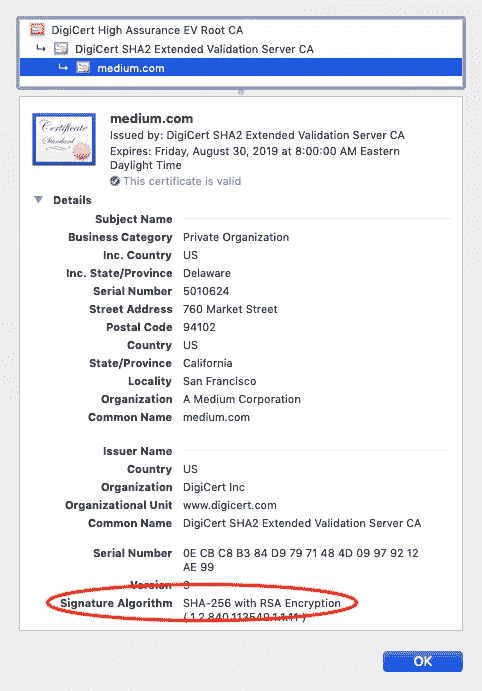
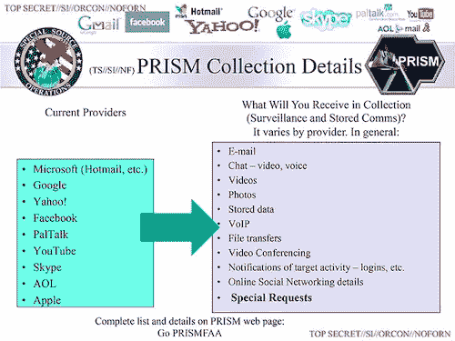
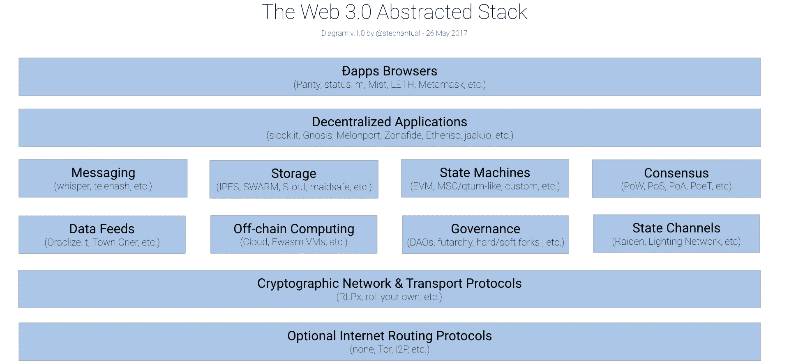

# 我们能从 Crypto 的反英雄身上学到什么

> 原文：<https://medium.com/hackernoon/what-we-can-learn-from-cryptos-anti-hero-302f6346c524>

## 清算天才和可怕的蒂莫西·梅，最初的秘密无政府主义者

> "赛佛朋克的房子有很多房间."
> 
> 蒂莫西·梅

上个月，颇具煽动性的 Cypherpunks 邮件列表的联合创始人、《加密无政府主义者宣言》的作者蒂莫西·梅(Timothy May)去世，给加密领域留下了一份复杂的遗产。

梅在 20 世纪 80 年代末发起了 Cypherpunk 运动，为今天的加密浪潮铺平了道路。Cypherpunks 邮件列表是像 Adam Back (hashcash)和 Nick Szabo (smart contracts)这样的加密先驱的论坛，它列出了许多功能和协议，这些功能和协议将成为中本聪 2008 年比特币解决方案的基础。

但在后来的几年里，梅疏远了自己的社区和亲密盟友。即使是最坚定的第一修正案拥护者，也很难接受他在网络论坛上偏执的评论和极端的观点。

清算梅的遗产是一项长期挑战，即承认我们的文化建筑师，而不掩饰他们有时不可调和的行动和忠诚。杰斐逊的奴隶种植园。海德格尔在纳粹党下的教区长职位。我们怎样才能舒服地从这些了解他们生活的现实的知识巨人那里学习呢？

每个人都可以建立互联网——这是一件令人惊奇和不安的事情。也许有一天，蒂姆·梅的协议会名存实亡。但是回顾过去可能有助于我们理解今天隐球的形状以及我们仍然需要解决的紧张局势。

# 加密无处不在

如果您右键单击并检查验证您与此页面的连接的服务器证书，您会发现指纹、签名和一种称为 SHA-256 的安全哈希算法。您的浏览器和为该网页“提供服务”的中型公司的远程服务器之间的这种瞬间问候是一种传输层安全协议，通常称为 TLS 握手。您的浏览器需要证明这些内容来自您可以信任的地方和人。

在许多方面，握手是我们最初的加密工具之一。密码学是保护通信安全的实践。在过去，握手可以证明我们没有携带武器，我们的联系是安全的。

20 世纪 90 年代末，随着网络在全球范围内的扩张，有很多握手要做——在数据库和服务器之间，在网络浏览器和电子邮件客户端之间。互联网架构的分散数字层为恶意的、有时只是好奇的行为者打开了各种后门，让他们侵入账户，将内容伪造到网络浏览器中，在一个成熟的案例中，失去了对自我复制、消耗带宽的计算机蠕虫的跟踪。网景公司的工程师们花了几年时间才设计出一种协议，可以处理服务器和客户机之间的微协商，并最终保证网络通信的安全。

那个协议并不完美。现在仍然不是。2001 年，美国国家安全局通过发布一套加密哈希函数的免版税专利，帮助了互联网握手。这一套包括 SHA-256 算法，目前正在帮助您的网络浏览器信任这些内容。然而，在那年晚些时候，NSA 还启动了一项名为 Stellar Wind 的监控计划，这是一项大规模的数据挖掘操作，可以捕捉和分析从公民的 IP 日志到财务记录再到电子邮件元数据(你的收件人、发件人和密件抄送信息)的所有内容。

作为公民，我们对这些监控项目越来越警惕，尽管许多项目已经在新的名称和新的政府下重新启动。

A slide overviewing the NSA’s PRISM surveillance program, which began in 2007.

作为一个人，我们正在慢慢学会质疑日常生活的例行数据收集。脸书的剑桥分析公司丑闻是公众觉醒的开始，但对于普通公民和消费者来说，这可能仍然太深奥了。政治条件听起来像是一种学术抽象。然而，《纽约时报》最近关于[移动定位行业](https://www.nytimes.com/interactive/2018/12/10/business/location-data-privacy-apps.html)——智能手机应用如何向广告商和对冲基金出售你的地理数据——的报道，让我们清楚地看到系统化的数据收集如何影响和操纵我们的身体。

蒂姆·梅写道:“我们身边到处都有加密技术。“我们口袋里的钥匙，我们驾照上的签名……门上的锁，保险箱的密码。”然而，在我们的数字生活中，我们一直缺少密码，我们需要的强大的密码——不一定是为了隐藏，而是为了证明我们是我们所说的那个人。计算机网络规模迅速扩大，却没有适当的协议来保护个人用户，因此网络既连接又隔离了我们，解放了我们，也征服了我们。梭罗在 1854 年写的关于铁路的名言也适用于今天的互联网:“我们不乘坐铁路；它骑在我们身上。”

# 强加密是一种权利

## 名单

1992 年，三位工程师聚在一起研究计算机网络的加密基础设施。他们的名字是约翰·吉尔摩、埃里克·休斯和蒂莫西·梅。起初，他们在吉尔摩的工作场所相遇。最终，他们搬到了网上，建立了一个邮件列表——一个运行在多个节点上的分布式邮件转发程序，它使用加密技术来隐藏发件人的身份信息。

这份名单是折衷的。有密码学家和数学家，但也有左派、共和党、政策专家、摇摆派、自由主义者、资本家、无政府主义者、无政府资本家。他们自称塞弗朋克。他们没有领袖。

这个疯狂的大约 700 人的邮件列表成为了一场运动的生命力。我想象它就像是我公司里一丝不苟、突然变得富有哲理的开发人员 slack channels。充满了代码片段和公式，偶尔提到斯蒂格利茨和亚当·斯密和无产阶级。亚当·贝克在名单上。戴伟在名单上。尼克·萨伯在名单上。哈尔·芬尼在名单上。朱利安·阿桑奇在名单上。

## 赌注

上个月，卡梅隆·文克莱沃斯在推特上写道，“2018 年，每个人都想加入 crypto。2019 年，我们会发现谁真正想在 crypto。”赛博朋克会抛弃这种想法。Crypto 不是一个俱乐部，或一个冒险，或某种三狗大冒险。加密是我们的天性。正如蒂姆·梅(Tim May)所写，“所有的都是加密的一部分。”问题是，你的密码有多强？

问这个问题的另一种方式是，你的演讲有多安全？你的数字演讲形式有多安全？有人能偷听吗？知道有陌生人在听，会影响你去哪里，分享什么吗？

还有你的钱。“金钱，”梅大胆地说，“越来越只是一种语言。”金钱表达了你的兴趣、计划、恐惧、欲望和支持。你转移资金的方式不受干扰吗？

到了极限，强加密是一个危险的前提。塞弗朋克乐队和蒂姆·梅承认了这一点。但他们主要关注的是言论自由，以及混乱的电子网络如何一下子就加剧并危及了这种自由。梅关心政治先例:“从来没有一项规则或法律规定人们必须用窃听者可以理解的语言说话。”对梅来说，自由和监控之间存在巨大的鸿沟，一端是无政府状态，另一端是奥威尔式的国家——无论多么微妙或看起来多么方便:“匿名可能不好也可能不好，但禁止匿名需要一个警察国家来执行。”

# 在加密领域，声誉比以往任何时候都重要

> “把你的好名声视为你可能拥有的最富有的珠宝——因为信用就像火；一旦你点燃了它，你可以很容易地保存它，但如果你一旦熄灭它，你会发现重新点燃它是一个艰巨的任务。”苏格拉底

蒂姆·梅最出名的可能是他在 1988 年散发的秘密无政府主义宣言。在宣言中，梅做了一个顺便但非常重要的评论:一旦秘密的无政府主义革命成为现实，“声誉将是至关重要的，在交易中甚至比今天的信用评级更重要。”

对加密运动的一个误解是，它呼吁不受约束的匿名网络，在这个网络中，没有人被追究责任。事实上，恰恰相反。

通过匿名，密码朋克很大程度上意味着假名:某人可以为自己创建一个带有声誉和凭证的数字名称，但这不一定会追溯到他们的实际身份。(梅承认完全匿名的缺点:“我经常不太重视‘匿名’信息。”)非对称加密技术使某人有可能开发一个持久的、但不可追踪的数字角色。Reddit 的 karma 系统可以被视为 Cypherpunks 设想的那种基于声誉的系统的准系统、单一平台版本(中国的社会信用体系是远端的汇总和集中版本)。

声誉是一个我们都知道和理解的游戏——你信任哪个朋友推荐电影，你经常去的餐馆。一位同事冒着名誉受损的风险为一位他们从小就认识的候选人担保。赛博朋克的使命是将“一个人的话就是他的契约”融入互联网的结构中。你是否散布谣言，你是否在商业交易中烧伤了某人，你是否在最后期限前完成，你的评论是否刻薄？你的指纹，你的生物特征不如你的公钥和它周围的行为历史重要。May 在[的 Cyphernomicon](https://nakamotoinstitute.org/static/docs/cyphernomicon.txt) ，Cypherpunks 邮件列表的常见问题中明确表示:“你是你的钥匙。”

博弈论发挥了作用。是的，你可以反复烧录你的密钥并创建新的用户名，但是你必须从头开始反复建立信任。

这是一个奇怪的循环——我们无法轻松地向蒂姆·梅的工作致敬，这证明了声誉资本是真实的，基于声誉的系统是有效的:我们不太重视梅的加密贡献，因为他的名字后面附有评论。

为什么他把自己的名字附在所有东西上？名气？只是一个疏忽？在他的名誉游戏上加倍下注？说不准。

# 无政府状态是关于结构，而不是混乱

> "批评家不是拆穿的人，而是集合的人."布鲁诺·拉图尔

赛博朋克想要——并且仍然想要——给网络空间带来结构，而不是拆除它。认为 Web3 将是盗版的狂野西部的想法是错误的。毕竟，海盗是“攻击的人”没有适当的通信和交易协议的快速计算机化正是使用户暴露于监视、利用和攻击的原因。“加密，”梅在密码会议上解释说，“为网络空间提供了‘可靠性’，也就是说，创造了墙、门和永久结构。”Solidity 是用于编写运行在以太坊虚拟机上的智能合约的编程语言的名称，这也许不是巧合。

Source: [Stephan Tual](https://medium.com/u/1998e2015f47?source=post_page-----302f6346c524--------------------------------)

无政府状态，来自希腊语 *an-arkhos* ，简单的意思是“没有统治者”蒂姆·梅(Tim May)的加密无政府主义议程是关于使用加密协议建立共享结构，可以在没有支配性统治者的情况下运行。市场结构。支付结构。声誉结构。激励结构。1997 年，在 T4 举行的计算机、自由和隐私会议上，梅在 T2 的一次演讲中提出，在一个加密的对等网络中，“诚信建立在本体层面，而不是监管层面”——这是软件属性的本体含义。这是一个深奥却深刻的观点。想想我们正在兴起的区块链网络:分布式状态机取代了中央集权制，让用户别无选择，只能诚信行事。

密码朋克和密码无政府主义者承担了为互联网中途创建结构的艰巨任务，这让长期利用互联网瘦协议的当局和公司非常懊恼。无政府状态迫使我们质疑我们经常在无政府状态和秩序之间画出的硬二元。秘密的无政府主义者的愿景是一种无领导的秩序。议定书赋予了权力。塞浦路斯朋克的努力是建设性的，最终不是破坏性的。“强密码，”梅认为，“是网络空间的‘建筑材料’。”

# 密码朋克写代码

赛博朋克没有领袖，没有办公室，没有标志，没有品牌。他们并不总是对新来的人有耐心。他们最接近的口头禅是“密码朋克写代码”他们决心将学术抽象付诸实践，并付诸实践:

> “比起仅仅谈论事情‘应该’如何，赛弗朋克更重视实际改变事情，实际得到工作代码。”蒂姆·梅

密码朋克致力于 PGP 加密程序，他们写邮件，他们创造了伪随机数发生器，他们概述了数字现金系统。2008 年万圣节，一个化名为“中本聪”的用户或用户组向一个加密列表发布了比特币白皮书，该列表是由 Cypherpunks 邮件列表发展而来的。加密命运的一个奇怪转折是，SHA-256——由美国国家安全局申请专利，目前正在保护你与中型企业服务器的连接——成为了比特币区块链中用于验证交易块的相同算法，帮助用户直接信任彼此，而无需中央服务器。

然而，“密码朋克编写代码”并不是防弹密码学家和协议工程师的专利。咒语延伸到了命令行之外:

> “‘密码朋克写代码’，应该是打个比方。我认为‘写代码’意味着作为个人采取单方面的有效行动……重要的是，密码朋克们承担起个人责任，赋予自己对抗隐私威胁的能力。”蒂姆·梅

蒂姆·梅写代码。他也只是写，并传播这个词。他百科全书式的 Cypherpunk FAQs 证明了他关心现场的人员。他向新来者介绍书籍和期刊。他引用了有更好答案的专家。他与吉尔摩和休斯一起推出的邮件列表是为了动员一个社区，并为其他人创造空间来写作和赋权——如果没有新的代码，至少有新的修辞。

# 牙齿和爪子都是红色的互联网

> “现实世界中的密码无政府状态将是混乱的，‘牙齿和爪子都是红色的’，并不像数学书上说的那样干净整洁。”尼克·萨伯

现实世界中的秘密无政府主义者是混乱的，并不像他们的代码那样干净整洁。蒂姆·梅就是一个最好的例子——一个杰出的工程师，也是一个私生子。“对于谁使用了强密码，我们无能为力，”他在他的密码会议上预先警告道。

如果声誉系统按照密码圈设想的方式工作，用户将会对他们在网络空间选择的分叉路径进行长时间的思考，并思考将自己降格到网络的 Voats、Gabs、Hatreons 和 8chans 是否值得与其他人失去联系。

记住，这是互联网的样子:

r/place — Reddit’s social experiment from April 1, 2017 (Source: [Gurkengewuerz](https://www.youtube.com/channel/UCRAxkrLjQ20ZiKPUsUahtFw))

国安局的工具被密码朋克重新使用。纳粹党所用的十字记号突然出现，然后变成大多数人想要的标志。美国国旗燃烧，然后愈合。虚空总是隐现。

我们不能等待，萨伯给赛弗朋克写道，“直到完美的系统出现。”蒂姆·梅拒绝等待。因此，互联网成了他的一座拼凑的纪念碑，也成了许多匿名和假名的人的纪念碑，他们给我们留下了建立一条更安全、更高尚的网络通道的材料。