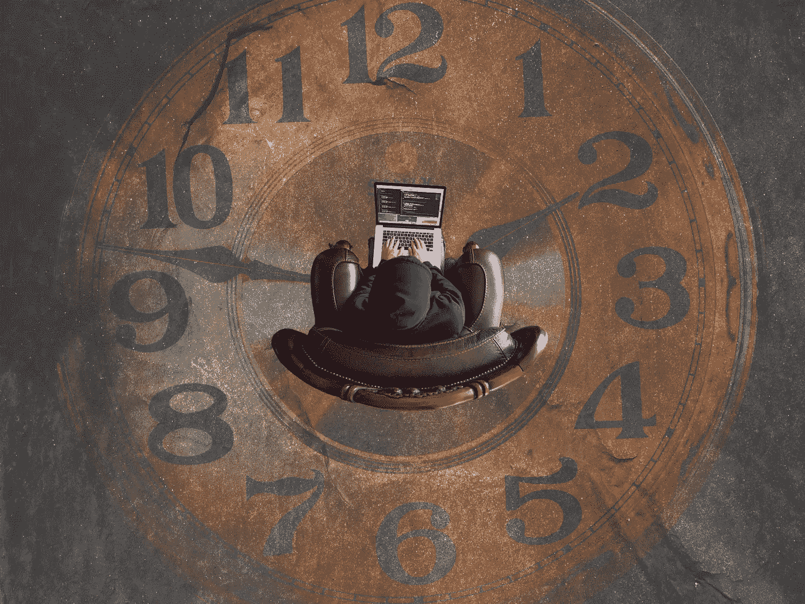

# 明天你将做什么？

> 原文：<https://medium.com/hackernoon/what-will-you-do-tomorrow-efd4d69296c>

## ***我的工作经历告诉我,“远离科技”是最糟糕的建议***

Photo by [Kevin Ku](https://unsplash.com/photos/aiyBwbrWWlo?utm_source=unsplash&utm_medium=referral&utm_content=creditCopyText) on [Unsplash](https://unsplash.com/search/photos/technology?utm_source=unsplash&utm_medium=referral&utm_content=creditCopyText)

看到问题“你明天要做什么？”上周在广告牌上。广告中有一张厨房厨师和机器人的照片。

我认为这是一个非常重要的问题，我们都需要问自己。我准备好在一个互联的世界中生活和工作了吗？

我看到的最糟糕的建议是“脱离技术”最近我经常听到这样的话:

*“忘掉社交媒体吧。减少你的屏幕时间。数字技术令人分心。他们在扼杀你的隐私。它们是浪费时间。它们会上瘾。他们扰乱了健康的工作生活平衡。”*

这种思路的终点永远是一样的。

*“而且反正。这整个数字化转型的事情被极大地夸大了。”*

拒绝和否认。

我能理解为什么很多人得出这个结论。毕竟，科技公司和加密货币——举两个引人注目的例子——似乎在过去一年失去了很多魔力。

当然，我也看到了数字化转型的“负面影响”。但我们不能忽视“数字变化”，继续沿用旧世界的思想、概念和模式。如果我们这样做，我们就会被抛在后面。

相反，我们应该做的是开发新的思维方式来理解和受益于这个复杂现实的不同方面。然后，在此基础上，我们应该采取更适合我们当前情况的新的工作方式。

至少，这是我在过去三十年的工作中，在一个联系日益紧密的世界中学到的。

在我 1995 年去法学院之前，我在空军服役了四年，见证了模拟通信技术向数字通信技术转变的早期阶段。那是从 1988 年到 1992 年。

我在军队里学到了很多。关于纪律，秩序，等级的利弊。

而且和很多人一样，离开后的一段时间，我也是略显失落。我在一家快餐连锁店担任过几个管理职位，同时我也在思考我的余生该做些什么。

从法学院毕业后，我得到了一份大学研究员的工作。我喜欢法学院，并愉快地接受了这个职位。然而，为了更好地理解和掌握现实世界/法律实践中发生的事情，1998 年，我还在一家大型电子公司担任了兼职内部法律顾问。

“理论”和“实践”的结合被证明是非常成功的。在 90 年代末和 21 世纪初，学生们喜欢来自企业界的真实故事。作为一名从业者，我对公司生命周期、企业文化和治理的研究也获得了很多帮助。

给我留下深刻印象的是，我们在法学院教给学生的东西与实践中的要求之间存在脱节。数字化转型(计算机、电子邮件等)。)只是拉大了差距。

我的研究使我在 2003 年获得了公司法和经济学的博士学位。我有幸研究和分析了本世纪初的公司丑闻以及各种监管反应。我也迷上了世纪之交跌宕起伏的风险投资行业。

2005 年，我被任命为大学教授，2008 年被任命为这家跨国公司的高管。一路走来，我合著了几本学术书籍，发表了 70 多篇学术文章(主要是关于公司、创新和金融)。

在我的“另一份工作”中，我大量参与了许多公司的撤资和拆分，以使公司的部门和业务能够在网络化和数字化的环境中更好地竞争。我帮助建立了一个企业风险投资基金，试图让公司变得更加敏捷，对变化更加敏感。

所有这些举措无疑都有助于我们的企业文化从官僚文化转变为注重颠覆性创新和创业精神的文化。

但是，这些举措足以让我——或者任何人——为明天的世界做好准备吗？

从我自己的经验(在传统的企业环境中接受教育、培训和工作)来看，答案是“不”。以复杂的层级(和政治)结构、组织孤岛以及遗留流程和程序为特征的传统企业环境正在悲惨地失败。

颠覆性技术的指数级增长正在迅速改变我们的世界。这里我不仅仅指社交媒体。其他网络技术，如点对点平台、物联网、大数据、区块链、机器人和人工智能，正在创造新的技术和去中心化基础设施，逐渐改变日常生活的方方面面。

这些技术发展的社会影响是深远的。技术驱动的千禧年文化重塑了我们对自由、责任和幸福的概念。学生对初创企业和可持续发展的组织感兴趣。

企业界以及程序、纪律和秩序的军事环境已经变得不那么有吸引力了。工作、消费和休闲的意义也受到类似的影响。我们已经从一个利润驱动的社会转变为一个目标驱动的社会。

围绕全球互联技术构建的创新经济已经出现，平台公司利用技术开发新的商业模式，提供不同类型的消费者体验。

所有经济部门都感受到了这些发展的破坏性影响。例如，我妻子的餐馆需要一种新的商业模式来保持吸引力，并为 21 世纪的客人提供正确的烹饪体验。新的交战规则适用于军事行动(如斯坦利·麦克里斯特尔将军的书 *Team of Teams* 所解释的)。

这些变化的综合效应创造了一个新的数字世界。这是一个快速变化的世界，由计算机代码、流动的身份和快速演变的资本主义形式构成。扁平的层级结构、开放的交流/对话、多学科的团队和社区的力量是如何变得成功和有竞争力的新原则和假设。

所以，我来了。我忽略了断开连接的建议。我做了相反的事情。我开始连接。

我每周写一篇博客，围绕新世界的机遇和挑战发起并参与对话。联网也提供了新的机会。我在几家活跃于法律、风险投资、健康和加密领域的组织/公司担任创新顾问/董事会成员。

我仍然是一名大学教授。我帮助我的学生为互联世界做准备。我在世界各地发表演讲，分享关于“数字”连接在新世界中如何至关重要的见解。

在大型跨国公司工作也很有趣。不出所料，数字世界给组织带来了越来越大的压力。很明显，需要一种新型的员工来确保组织在不久的将来保持相关性。

回顾我过去三十年的生活，我对未来的建议很明确:拥抱连接，保持联系。

你必须确保你是有联系的，并且能够在更小更敏捷的团队中联系和工作。你必须能够与更聪明、更智能的机器连接、生活和工作。你必须坚持不懈地工作，创造你自己独特的故事。对我来说，很清楚。变得互联的最佳方式是拥抱数字世界(我不是指简单地在社交媒体上发布图片)。你必须研究新技术及其应用。你必须成为创造未来世界的更大工程的一部分。

你必须从今天开始这样做。

*感谢您的阅读！请点击*👏*下面，还是留下评论吧。*

每周都有新的故事。因此，如果你关注我，你不会错过我关于数字时代如何改变我们生活、工作和学习方式的最新见解。