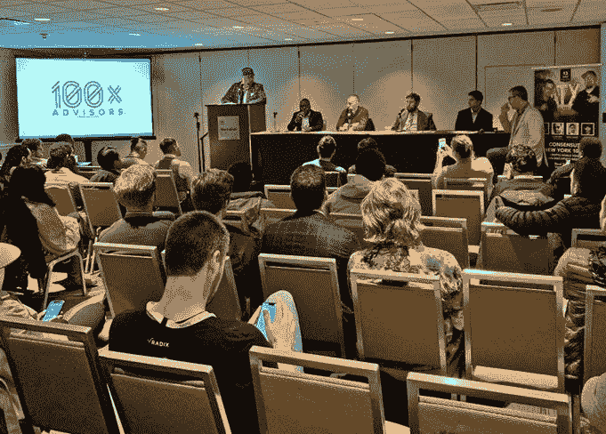

# 纽约市区块链周有什么新内容？

> 原文：<https://medium.com/hackernoon/whats-new-at-new-york-city-s-blockchain-week-74e12eb4e6d3>

CryptoNouveau PHOTO: [R1 LABS](http://www.r1labs.com)

在过去的五年里，每年春天 CoinDesk 都会在纽约市举办区块链技术会议 [Consensus](https://www.coindesk.com/events/consensus-2019) 。这个想法是将加密货币和区块链领域的顶级品牌和开发者聚集在一起，了解什么是新的，什么是下一步。该活动已经发展到包括周围的[区块链周](https://www.eventbrite.com/e/curated-guide-to-2019-nyc-blockchain-weeks-events-tickets-60430600553)，由于参与者的数量，该活动包括官方和非官方活动。

# 区块链有什么新内容？

加密货币正在走过蹒跚学步的阶段，人们开始更加关注区块链的底层技术，因为许多人都在期待[从区块链](https://www.blocksocial.com/how-to-make-money-with-blockchain/)赚钱。CryptoNouveau 活动是一个很好的地方，可以与区块链领域的顶级思想家会面，了解他们对技术未来发展的看法。

eCash 的发明者 David Chaum 在那里代表他创建的公司[elix sir](https://elixxir.io/)，并谈论 [cMix](https://elixxir.io/cmix-whitepaper) ，该公司使用区块链创建一种安全、匿名、数字的通信、支付和应用程序创建和使用方法。这有可能是革命性的，因为它将速度与元数据保护结合在一起，这是许多区块链应用程序都无法做到的。

IBM Blockchain Ventures 合伙人、Prose Ventures 联合创始人兼合伙人朱尔斯·米勒(Jules Miller)在开场白中谈到了 IBM 的区块链加速器。随后，其他行业领袖进行了一轮闪电般的简短会谈。

Tomer Sofinzon 是 [20|30](https://2030.io/) 的创始人兼首席执行官，他谈到了他的公司为创建通用钱包所做的努力，以及 Pillar 项目，这是一个开源的非营利性区块链应用程序，将使消费者能够控制自己的个人信息，并重塑消费者和服务提供商之间的关系。

SeedInvest 的 Ryan Feit 讨论了他的公司如何为经过严格审查的初创公司筹集资金，这始于一场改变证券法的运动，允许公司在网上筹集资金，向以前无法获得资本的人开放市场。

塞巴斯蒂安·塞拉诺(Sebastian Serrano)宣布 Ripio 公司推出一体化金融科技平台，该平台服务于传统上无法获得银行和信贷的南美人口。该平台为用户提供智能合同、数字银行等点对点贷款。

在这场闪电回合活动中，其他演讲者包括 [BlockQuake](https://blockquake.com/) 的 Antonio Brasse，这是一个建立在监管和透明度基础上的加密货币网络，以及 [Celsius Network](https://celsius.network/) 的 Alex Mashinsky，这是一个加密货币投资网络，由于其内部规则和方法，可以保证加密货币投资的最高回报。我还在那里遇到了 Brian Zisk，我们谈到了 Chia，一种环保的企业级加密货币。

# 共识:大秀，但不是唯一的秀

去年[达成了共识](https://www.cmswire.com/information-management/blockchain-makes-inroads-in-the-enterprise-at-consensus/)。他们预计有 4000 人，结果却只有 8500 人。因此，人们为该地区的辅助活动制定了计划，共识是不那么拥挤了。停在外面的兰博基尼明显不足，据我所知，由于空间没有过度拥挤，对话更加普遍，质量也更高。

虽然没有注册参加 main event，但我能够与许多行业专业人士聚在一起，与 Tangem 等公司交谈，Tangem 生产具有高等级安全性的智能钞票，并使用不可恢复的私钥来保护用户的加密货币的安全。

100x Crypto Summit PHOTO: BRIAN WALLACE

区块链投资者、顾问和布道者 [Ian Balina](https://ianbalina.com/) 在共识 [100x 加密峰会](https://100xadvisors.com/)上发言。

“我们认为比特币价格已经触底，我们现在正在进入一个牛市，很有可能超过之前 19，000 美元的比特币高点，”巴里纳说。“首次公开募股(IEO)趋势是新牛市的强大催化剂。现在，交易所有责任在向观众提供新代币之前，对其进行尽职调查。在一些司法管辖区，这是监管方面的担忧，但我们认为这一趋势不会消失。然而，随着 IEO 市场变得饱和，投资回报可能会下降。”

区块链周是一个很好的机会，可以结识来自世界各地致力于区块链和加密货币领域发展的人们，无论你是参加官方的共识活动还是非官方的区块链周活动。明年有望更好。

*这个帖子最初出现在* [*CMSWire*](https://www.cmswire.com/digital-experience/update-from-new-york-citys-blockchain-week/) *上。*