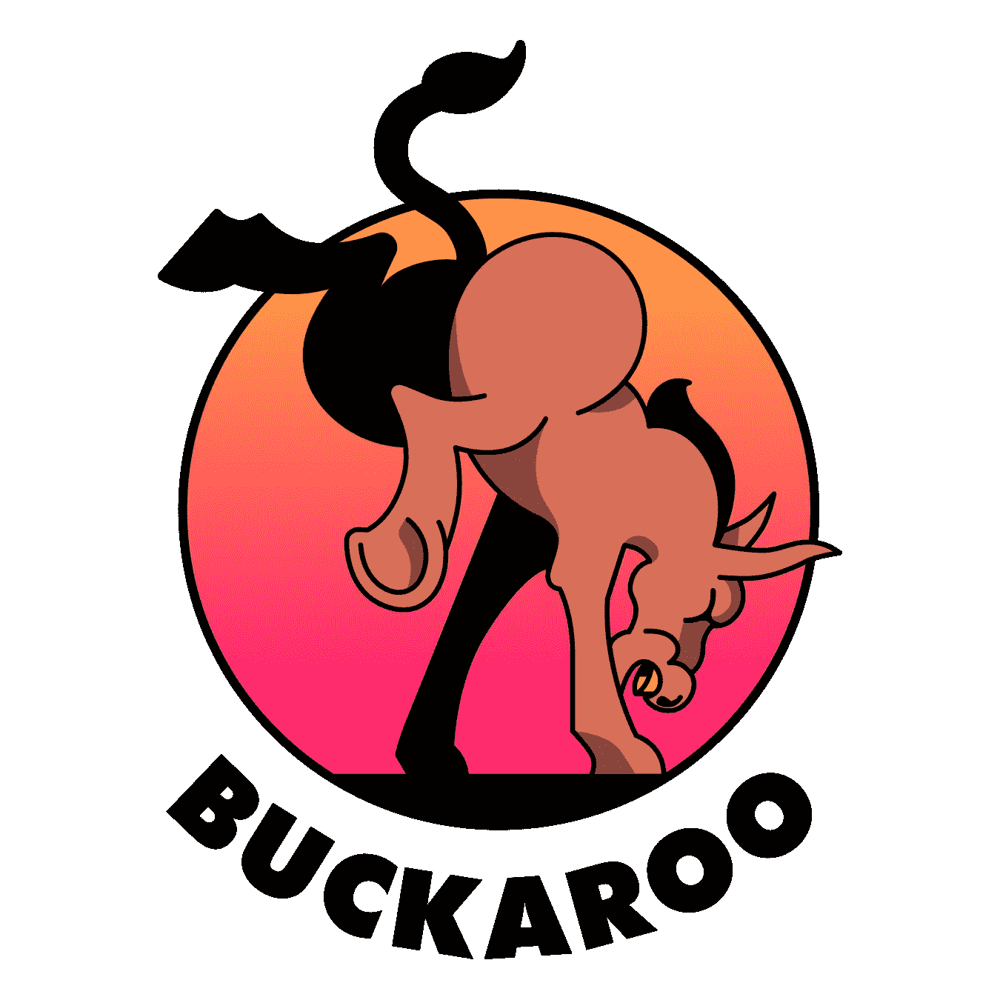

# 《牛仔 2》有什么新内容？

> 原文：<https://medium.com/hackernoon/whats-new-in-buckaroo-2-cd3862f8fc6f>

我们自豪地宣布 Buckaroo v2.0.0！

Buckaroo 经过了重新设计，吸收了从 v1.x 中吸取的经验教训，采纳了您的反馈意见，并在流程中解决了超过 85 个问题。

我们还去掉了 [17k 行 Java 代码，换成了 8k 的 F#](https://github.com/LoopPerfect/buckaroo/pull/285) ！🙌

以下是关键点…

# 住在头上—依靠移动分支和标签

您现在也可以将 Git 分支和标签视为版本了！

由于我们的锁定机制，即使分支或标签被更新，我们也能确保安装是可再现的。当你准备转移到下一个版本时，只需做`buckaroo upgrade`。

## 新的机器人团队成员:升级机器人和补丁机器人🤖

升级机器人和补丁机器人现在已经开始运行，并努力更新和移植软件包到 Buckaroo 生态系统。不过不用担心，他们的贡献都是在 Travis CI 上测试过的。

# 100%去中心化，没有食谱或出版过程

Buckaroo 现在不需要一个包的中央存储库。零！这意味着任何 URL——Git 或 HTTP——都可以安装，只要它有一个`buckaroo.toml`文件。

# 脱机工作—下载一次，安装多次。

我们集中缓存所有包，因此您可以离线工作。重新连接以获取更多版本。

# 避免“依赖地狱”的私有和公共依赖

包可以声明私有的*依赖项，其版本不必与项目的其他部分共享。使用这个特性来逃离依赖地狱！*

# 每个包有多个库，所以像 Lerna 这样的工具是不必要的

现在，您可以将单个组件从包中取出。这对于提供可选附加组件的库来说非常有用。现在你可以只拿你需要的东西。

# 智能版本协调

你知道`boostorg/iterator` `v1.67.0`和`v1.68.0`指向同一个提交吗？

Buckaroo 现在足够聪明，可以发现 Git 上的这两个版本指向相同的修订版，因此是等价的。我们发现，当一个包管理者理解了这一点，就减少了解决许多依赖冲突的需要。

# 没有 Java 依赖性

我们摆脱了 JVM，使用 Warp 捆绑包来为 Linux、Mac 和 Windows 提供自包含的可执行文件。哦，我们还为巴克做了这件事！

只需`wget`就可以了。😎

# JSON 上的 TOML

这看起来像是一个小的修饰性改变，但是我们发现 TOML 不仅更容易阅读，而且还减少了清单和锁文件中的合并冲突。Buckaroo v2.0.0 只使用 TOML。

# 吃什么试试牛仔？

前往我们的 [GitHub 页面](https://github.com/LoopPerfect/buckaroo/)开始吧。❤️