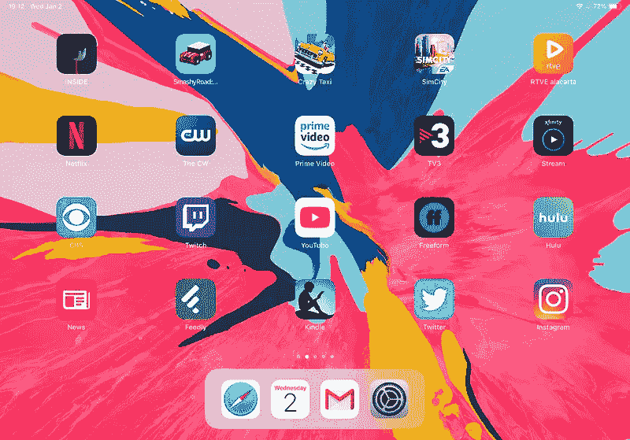
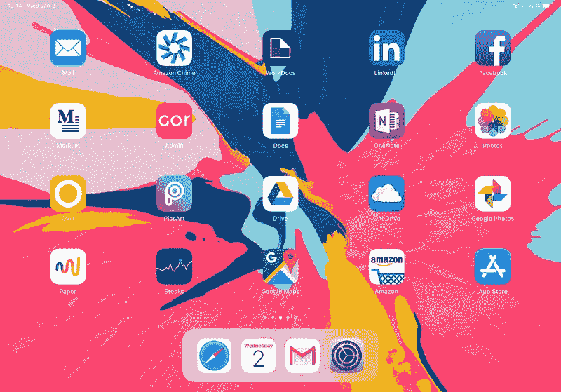

# 我的 iPad 主屏幕上有什么？

> 原文：<https://medium.com/hackernoon/whats-on-my-ipad-s-home-screen-9ddeacbc57a4>

圣诞节那天早上，成千上万的人打开崭新闪亮的 iPads。他们中的许多人将尝试使用新设备作为他们唯一的电脑，他们需要正确的设置才能成功。我已经用 iPad Pro 作为我的主要电脑六个月了，拥有一个有条理的主屏幕是让它成为可能的秘方。

我一般会把 iPad 的主屏幕和手机的主屏幕区别对待，主要是我的速度要求不一样。在我的手机上，最常用的应用程序往往位于主屏幕的第一页——目标是在解锁设备后尽快完成一项任务(阅读[我的手机主屏幕上有什么？](https://geekonrecord.com/2017/12/04/whats-in-my-phones-home-screen/))。然而，在我的 iPad 上，我将应用程序按任务分类，目的是将相关的应用程序尽可能放在一起。

**码头**

从看电影到写博客，Dock 是我用 iPad 做任何事情的核心。我保持它的整洁，只有四个应用程序可以让我做我能做的最重要的任务:浏览网页，查看我的日历或电子邮件，以及访问设备的设置。

**Safari** 是我的主要浏览器，因为它与 iCloud Keychain 完美集成，通常在请求大多数网站的桌面版本时效果很好。苹果的**日历** app 汇集了我所有的日历。iPad 上的 Gmail 能够显示按标签分类的邮件，这是我处理邮件的首要要求。

**第一个主屏幕页面:娱乐**

正如我之前所说，我按照任务类别来组织应用程序。这意味着，当我用我的 iPad 娱乐几个小时时，我喜欢在同一个屏幕上显示我可以选择的所有应用程序。考虑到丰富的可用空间，这个组织让 iPad 屏幕感觉像一份美味的菜单。

我不是一个大的 iPad 游戏玩家，尤其是因为许多游戏都是基于奖励和疯狂的时间投资(像**模拟城市**或**疯狂出租车**)，但里面的**在我心中有着特殊的地位，如果你喜欢益智游戏，我完全推荐它；它的环境音乐和灯光治疗是值得的票价。**

如今，视频流世界被许多应用程序瓜分，所以我在我的第一个主屏幕页面上有广泛的选择。你可以找到常见的嫌疑人，像**网飞**、 **Prime Video** 、 **YouTube** 或 **Hulu** ，也有一些小众 app 像 **Twitch** (我不喜欢玩贼海，但是看别人玩很好玩！)或者西班牙电视应用 **RTVE alacarta** 和 **TV3** 。这证明了对于插队者来说，情况已经变得多么荒谬。我可能不会为有线电视付费，但我仍然是一些基于订阅的服务的奴隶。

阅读是我生活中的一大部分，我离不开**微软新闻**(谷歌新闻没有的西班牙报纸聚合) **Feedly** (谷歌阅读器的最佳替代品) **Kindle** 和 **Twitter** 。

**Instagram** 是我的朋友们唯一还会发布个人内容的社交网络，所以它也是我第一页的必备内容。

**第二个主屏幕页面:生产力**

亚马逊给工程部门的每个员工都发了一台笔记本电脑，这样他们就可以远程办公了；我总是直接在这里工作，因为 VPN 已经设置好了，但是也可以在这里访问我的电子邮件、会议和在线设计文档。苹果的 **Mail** 应用很容易配置亚马逊的网络，所以它是对 **Chime** 和 **WorkDocs** (亚马逊员工的企业应用)的很好补充。

我的大多数朋友已经放弃了脸书，他们只用它来消费迷因、新闻或其他有趣的文章。我用它来分享我在 geekonrecord.com 和 hackernoon.com 写的东西。我对 **LinkedIn** 和 **Medium** 也是如此；我发现这些都是联系其他科技专业人士的好应用。

写一篇文章需要无数的应用程序，首先是 **Google Docs** (这使得与我的编辑器分享内容变得容易) **OneNote** 和 **Paper** (我在那里勾画想法) **Photos** 、 **Over** 和 **PicsArt** (用于图像合成)，以及 **Google Drive** 或 **OneDrive** (用于文件存储)。

我也考虑**股票**、**谷歌地图**和**亚马逊**生产力类 app，但是和工作或者写作无关。

第三和第四个主屏幕页面包含像 **Skype** 或 **Messenger** 这样的通信应用，以及其他苹果股票应用或像内容拦截器这样的**后台实用程序**，所以我不会用细节来烦你。

底线是，拥有正确的主屏幕结构是为了减少你和设备之间的摩擦；在不同的页面中按任务类别分发应用程序可能对你不起作用，但一旦你找到了所有应用程序的正确位置，使用你的 iPad 应该会变得直观和轻松。

你呢？你有什么整理 iPad 主屏幕的小技巧和窍门？

另见:[我为什么用 iPad Pro 取代我的笔记本电脑](https://geekonrecord.com/2018/11/07/i-replaced-my-laptop-with-an-ipad-pro/)

你喜欢这篇文章吗？ [**订阅**](https://geekonrecord.com/subscribe/) **通过邮件获取新帖。**

*原载于 2019 年 1 月 3 日*[*geekonrecord.com*](https://geekonrecord.com/2019/01/03/whats-on-my-ipads-home-screen/)*。*