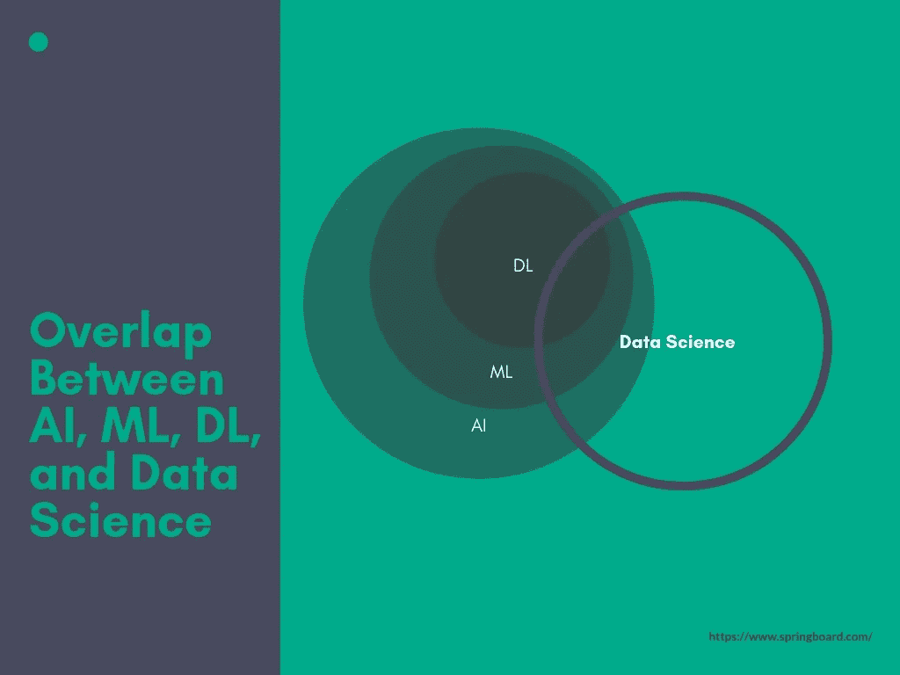
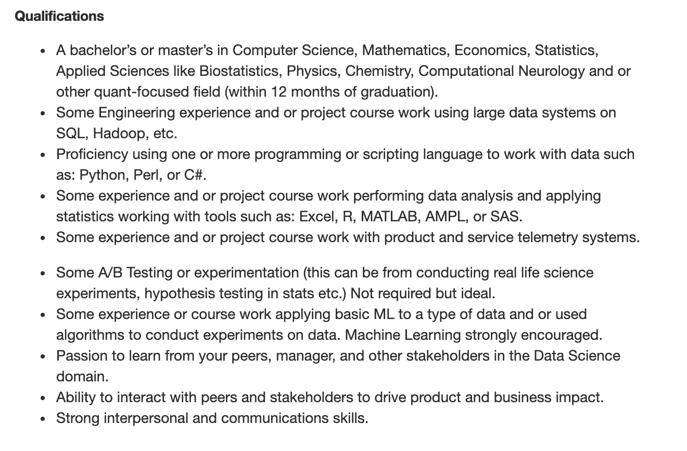
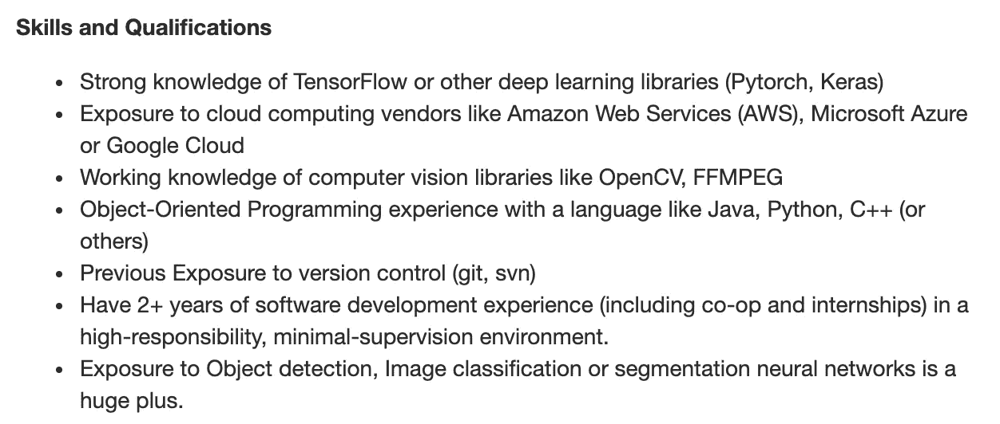

# 数据科学和机器学习有什么区别？

> 原文：<https://medium.com/hackernoon/whats-the-difference-between-data-science-and-machine-learning-35bb7fddefb3>

## 你可能听说过，在人工智能的世界里，正在出现三个重叠的学科:机器学习、深度学习和数据科学。它们重叠的原因之一是它们都以这样或那样的方式处理数据。海量数据。

*这是摘自*[*AI/ML 岗位跳板指南*](https://www.springboard.com/resources/guides/ai-ml-careers-guide/) *为我们研究准备的跳板*[*AI/机器学习职业轨迹*](https://www.springboard.com/workshops/ai-machine-learning-career-track/) *。用它来理解这两个领域的区别，尤其是在找工作和招聘不同职位的时候。*

让我们先来看看一家公司，它让律师的生活变得更加轻松，让他们的工作变得更加出色。 [Everlaw](https://www.everlaw.ca/) 开发了一种技术，在发现过程中浏览案例法，以找到与案件相关且重要的文件。他们帮助律师事务所、政府机构和公司在大型诉讼和调查中筛选数百万份证据文件，以找到众所周知的大海捞针。

他们是怎么做到的？通过创建和维护用于数据分析、存储和报告的数据管道，并使用统计方法和机器学习模型从各种数据源中获得洞察力。在 Everlaw 的案例中，在那里工作的数据科学家承担着上述所有任务。他们帮助机器学习工程师设计和构建更好的 ML 算法，并使用 ML 技术来协助开发人员实现新的 AI 功能。

Everlaw 的数据科学家的角色是一个很好的例子，说明了这份工作在基础层面上的要求。本质上，一个数据科学家寻找新的数据源，为这些数据创建管道，设计能够理解这些数据的仪表板，并帮助 ML 工程师构建更好的算法。

另一个例子是 Airbnb 的数据科学家做的事情。他们的角色主要集中在分析和构建数据管道，以帮助制定商业决策。他们找出当今对组织最重要的指标，并以正确的方式分析它们。

另一方面，**机器学习工程师构建和维护基于核心计算机科学概念(如数据结构、算法、分析和优化)的可扩展 ML 算法**。**机器学习工程师比数据科学家编写更多的代码**，而**数据科学家理解推动业务发展的数据**。

Instagram 的数据科学家 Mansha Mahtani 在我们询问她对职业之间的主要差异的看法时这样说道。

“鉴于这两个职业都相对较新，在如何定义机器学习工程师和数据科学家方面，往往会有一点流动性。我的经验是，机器学习工程师倾向于编写生产级代码。例如，如果你是一个机器学习工程师，正在创建一个产品来给用户提供建议，你实际上是在编写活代码，这些代码最终会到达你的用户手中。数据科学家可能会成为这一过程的一部分——可能会帮助机器学习工程师确定模型中包含哪些功能——但通常数据科学家更倾向于推动商业决策，而不是编写生产级别的代码。”

## **为什么有关系？**

在实践中，数据科学和机器学习角色都是处理数据的好方法。然而，他们需要稍微不同的技能和不同的培训方法。数据科学家更像是多面手，懂得大规模的算法和统计，但可能只负责在较小规模的数据集上实现模型。机器学习工程师可能是具有生产工程技能的人，他们将被要求使用他们对机器学习算法的理解(通常被认为比数据科学家的理解更高级和有限)，并创建一个数据科学家可以进行实验的大规模管道。

这两个角色是互补的，但它们并不完全相同，为一个角色雇佣了错误的简历，或者试图在一个你的技能不适合的领域找到一份工作，都可能是一场灾难。

## 数据科学家工作要求

这是一个面向即将成为微软数据科学家的应届毕业生的初级职位。请注意对通信和量化领域的强调，同时对大规模工程经验没有很高的要求。

## 机器学习工程师工作要求

来自一家初创公司(indus.ai)的这份工作公告已经给了你一个略有不同的轮廓，具有强大的机器学习框架知识和所需的软件开发经验。与数据科学角色相比，统计和沟通部分没有被提及太多。

## 机器学习与数据科学

总之，机器学习和数据科学是互补的领域，但在个体角色中有非常不同的要求。数据科学侧重于理论和管理预测模型，然后将其传达给利益相关方。机器学习工程师将通过创建生产工程管道来处理数据，处理数据科学模型所需的数据，从而帮助支持这一过程。

*这是由*[*@ thaalexpalm er*](https://twitter.com/ThatAlexPalmer)*撰写的节选，经允许在此发表。*