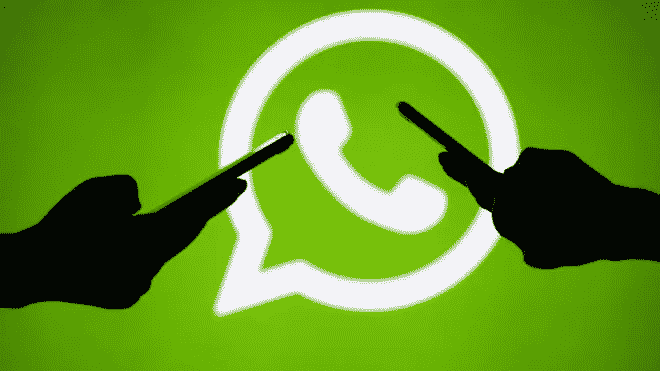

# Whatsapp 怎么了？

> 原文：<https://medium.com/hackernoon/whats-up-with-whatsapp-d6d9a906fc4c>

你可能已经看到了本周大量的媒体文章建议你更新你的 Whatsapp。这个建议来自脸书旗下拥有 15 亿用户的 Whatsapp。

要求人们更新智能手机上的应用程序的原因是发现黑客能够通过应用程序中的“重大漏洞”在手机上远程安装监控软件。据英国广播公司(BBC)报道，WhatsApp 表示，此次攻击针对“特定数量”的用户，由“一名高级网络演员”策划。

脸书在本月早些时候发现了这项技术的缺陷。它威胁要打破 Whatsapp 对其用户的承诺，即成为一个安全的“通信应用，其消息是 [**端到端加密的**](http://www.bbc.co.uk/news/technology-35374169) ”。这意味着它们只能以清晰的形式显示在发送者或接收者的设备上。然而，监视软件会让攻击者阅读目标设备上的消息。

Whatsapp 团队上周五找到了问题的修复方法，此后人们可以下载没有“错误”的新应用，尽管一些用户似乎对脸书没有发布任何关于修复本身的说明感到不满。

保护记者委员会的艾哈迈德·齐丹告诉 BBC，那些手机可能成为黑客目标的人很可能是“记者、律师、活动家和人权捍卫者”。

**黑客是如何利用安全漏洞的？**

他们做的一件事是使用 Whatsapp 的语音通话功能拨打目标的电话。即使目标没有接电话，他们的手机上也安装了监控软件。此外，该电话已从通话记录中删除，因此没有接听的人甚至不会看到他们错过了一个未知号码的来电。

脸书和 Whatsapp 周一告诉媒体:“这次攻击具有一家私人公司的所有特征，据报道，这家公司与政府合作，提供接管手机操作系统功能的间谍软件。”

它还向安全专家发布了一份简报，称“WhatsApp VOIP[互联网协议语音]堆栈中的缓冲区溢出漏洞允许通过发送到目标电话号码的一系列特制 SRTCP[安全实时传输协议]数据包来远程执行代码。"

这次攻击很老套

正如艾伦·伍德沃德教授指出的，这是一种“相当老式”的攻击方法。他解释了发生的原因:“缓冲区溢出是指程序运行到它不应该访问的内存中。它溢出了它应该拥有的内存，因此可以访问可能运行恶意代码的内存。如果你能通过应用程序传递一些代码，你可以在那个区域运行你自己的代码。在 VOIP 中，有一个拨号并建立呼叫的初始过程，缺陷就在这一点上。因此，你不需要响应攻击的号召。”

我们不知道有多少人在这次攻击中成为目标，关于更新手机上的应用程序是否能有效地彻底清除间谍软件，还有一些问题需要回答。此外，WhatsApp 没有说明攻击是否会超出 WhatsApp 的范围，触及手机上的其他个人数据。

但是，即使你不是记者、律师或人权活动家，也要下载这款应用的新版本，因为一如既往，安全总比后悔好。