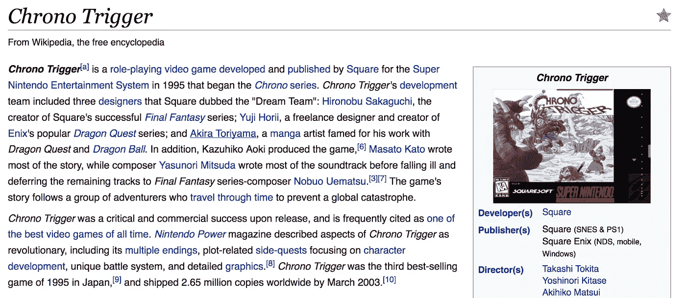

# 你最喜欢的老式电子游戏是什么？

> 原文：<https://medium.com/hackernoon/whats-your-favorite-old-school-video-game-893583fc4da6>

## 随便你怎么定义“老派”。 [**由奥斯普科斯**](https://community.hackernoon.com/u/austin) **。** *继续讨论*

**

*我个人很想知道 HN 社区珍视哪些游戏。*

*我最喜欢的是[计时触发器](https://en.wikipedia.org/wiki/Chrono_Trigger)。它有鸟山明的艺术作品，龙珠的名气，时间旅行，会说话的青蛙…所有的基本元素都在那里。这是典型的 JRPG——如果你没尝过，我怎么推荐都不为过。*

*荣誉奖:[最终幻想六](https://en.wikipedia.org/wiki/Final_Fantasy_VI)。这是当时最伟大的 RPG 游戏(超过 12 个可玩的角色！)直到今天，它仍然是有史以来最好的 RPG 游戏之一。*

*你最喜欢的老派游戏是什么？是什么让他们如此伟大？*

**在*[【community.hackernoon.com】T21](https://community.hackernoon.com/t/whats-your-favorite-old-school-video-game/752)继续讨论*