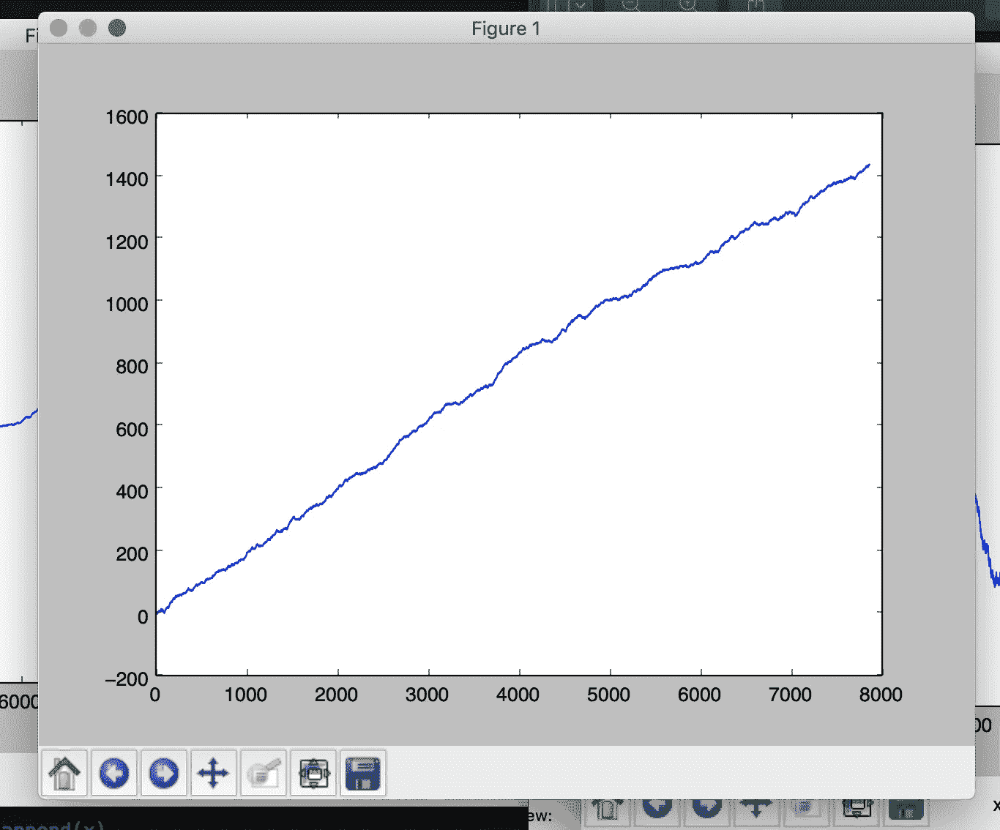
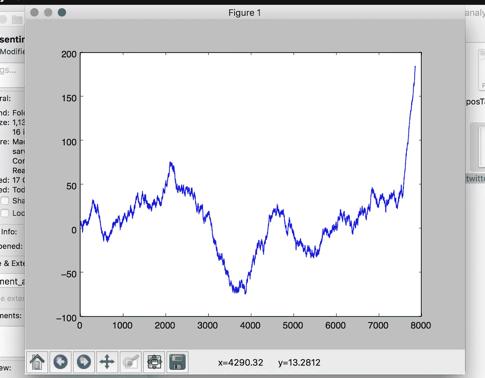

# 当我的一小段代码预测了美国总统选举的命运。

> 原文：<https://medium.com/hackernoon/when-a-small-piece-of-my-code-predicted-the-fate-of-us-presidential-elections-e6f2a0cced4a>

> 我在 2015 年完成了我的硕士学位，重点是观点挖掘(情绪分析，如果你没有听说过，请耐心等待，这会很有趣)。我开始工作时是一名 web 开发人员，已经失去了对数据挖掘领域的了解(我的项目论文)。然后，在一个晴朗的周六晚上，我躺在沙发上，看着互联网上流传的 2016 年美国总统大选竞选活动(最终选举尚未举行)。那时我对世界政治不太感兴趣，但这个话题本身就引起了我的兴趣。
> 
> 我坐了一会儿，想，互联网上有这么多关于竞选和选举前的资料，我可以利用，然后深入其中，找出在更大的画面中到底发生了什么。因此，我的道路是为周末准备的，但我将要发现的是我做梦也没想到的事情。

# 问题陈述

我决定收集 twitter 数据，并用它来推断人们在谈论什么。所以，这是一个三步走的过程

1.  从 Twitter 上收集有关选举的数据(tweets)。
2.  对这些推文运行一些程序，找出这些推文是关于什么的(或者人们在这些推文中谈论什么)。
3.  总结步骤 2 的结果。

我们来详细算一下每一步。

# 收集数据

因此，我使用下面的脚本在实时模式下获取推文(即，在推文到来时获取推文)。

为了让上面的代码工作，你将需要 ***tweepy*** (你可以使用 pip 很容易地下载它)，只需使用下面的

> pip 安装套件

这段代码使用 twitter 流获取发布的推文(动态地)。运行上面的代码将为我们获取大量 tweets(我们可以选择存储它以备后用)。

以类似的方式，我们也可以使用*Twitter stream . filter(tract =[" Trump "])*提取唐纳德·特朗普的推文

# 分析收集的数据

让我们绕一点弯路开始真正的部分-

你们中的一些人可能会想，到底什么是观点挖掘/情感分析？为了满足你的好奇心，我想先回答这个问题-

根据维基百科-

> **观点挖掘**(有时也称为**情感分析**或**情感 AI** )是指利用[自然语言处理](https://en.wikipedia.org/wiki/Natural_language_processing)、[文本分析](https://en.wikipedia.org/wiki/Text_analytics)、[计算语言学](https://en.wikipedia.org/wiki/Computational_linguistics)、[生物统计学](https://en.wikipedia.org/wiki/Biometrics)对情感状态和主观信息进行系统的识别、提取、量化和研究。情感分析广泛应用于[客户之声](https://en.wikipedia.org/wiki/Voice_of_the_customer)材料，如评论和调查回复、在线和社交媒体以及医疗保健材料，应用范围从[营销](https://en.wikipedia.org/wiki/Marketing)到[客户服务](https://en.wikipedia.org/wiki/Customer_relationship_management)再到临床医学。

用我自己的话说-

> **观点挖掘**是从文本中提取信息，并确定特定的一组单词/句子描述的是什么情感，即句子描述的是积极意义/消极意义还是纯粹的中性意义。这可以应用于电子商务，例如亚马逊产品评论，它可以自动计算出一个产品收到了多少正面/负面评论以及它的严重性。

从第一步开始，我收集了大量关于希拉里·克林顿和唐纳德·特朗普的推文(阅读了数千条)，这些数据就在我的系统中等待分析。

那么，接下来呢？

我需要创建一个数据科学模型/分类器，我可以在上面输入这些推文并获得结果。所以下一个目标是创造这样一个模型。这是棘手的部分。

> 声明:我绝不是数据科学家，这只是我在大学时代完成项目论文后继续的爱好项目。所以我用了一些幼稚的方法得出结论。

## 创建数据科学模型-

1.  从可靠的来源收集一些训练数据，该来源应该具有(句子->情绪)格式的数据，例如(“你今天做了美味的食物”->“积极的”)/“道路状况非常糟糕”->“消极的”)
2.  清理数据([停字清除](https://www.geeksforgeeks.org/removing-stop-words-nltk-python/)、[炮泥](https://en.wikipedia.org/wiki/Stemming)等。)
3.  在清理后的训练数据上创建分类器/模型。

所以我在网上收集了数据，部分数据如下所示:-

> **肯定句**
> 
> 这块石头注定是 21 世纪的新“柯南”,他将比阿诺德·施瓦辛格、让-克劳德·范·达姆或史蒂文·西格尔引起更大的轰动。
> 这部《指环王》三部曲的华丽精致的延续是如此巨大，以至于一栏文字无法充分描述联合编剧兼导演彼得·杰克逊对 j . r . r .托尔金的中土世界的扩展视野。
> 有效但不温不火的传记片
> 如果你有时喜欢去电影院玩，芥末是一个开始的好地方。
> 作为一部罕见的议题电影而出现，这部电影如此诚实且被敏锐地观察到，以至于感觉不像是一部。
> 这部电影深刻洞察了所有漫画的神经质思维——即使是那些已经登上游戏巅峰的漫画。
> 提供罕见的娱乐和教育结合。
> 也许没有一幅画比这幅画更真实地表明通往地狱的道路是由美好的愿望铺成的。
> 在一部边缘卷曲的时髦电影剧本中控制转弯；它太聪明了，你想讨厌它。但他还是成功了。
> 照顾我的猫提供了一个令人耳目一新的亚洲电影的不同部分。
> 
> **否定句**
> 
> 简单化，愚蠢和乏味。这太幼稚了，只有十几岁的男孩才会觉得好笑。剥削性的，基本上缺乏深度和复杂性，这使得观看这种对犯罪的生动处理是可以忍受的。
> 【加布斯】抛弃了病理学研究的潜力，取而代之的是挖掘出环境状况的扭曲的情节剧。视觉上华而不实，叙事上晦涩难懂，情感上索然无味，风格神秘。
> 这个故事同样毫无新意，已经被循环播放了无数次。这部电影唯一可以加分的地方就是虚张声势——拿出一个完全陈旧的概念，再一次将它推入观众的绞肉机。与其说是闹剧，不如说是酸溜溜的。不幸的是，这个故事和演员都被提供了一个蹩脚的剧本。相对来说，这部电影没有血腥的连环谋杀暗示更加令人不安，但它试图将主题人性化的努力失败了。一团听起来永远不真实的伤感。虽然表演通常很吸引人，但这些松散的即兴表演可能会成为一部一小时的电视纪录片。
> 有趣，但不引人注目。在剪辑室的地板上。。。可能没有这样的镜头是尖锐的，讽刺的文化讽刺，而不是令人沮丧的失败。

然后，我使用通常的停用词移除过程和词干处理([波特·斯特梅尔](http://snowball.tartarus.org/algorithms/porter/stemmer.html))来清理数据。

现在我面临着为这项工作选择最佳分类器的挑战，因为我在这个领域并不精通，我选择了任何天真的数据科学爱好者都会选择的东西，我的穿着闪亮盔甲的骑士 ***朴素贝叶斯分类器。***

我决定使用这个分类器，使用我拥有的[训练](https://hackernoon.com/tagged/training)数据创建了一个模型，然后在我的 Twitter Tweets 上运行相同的模型，我得到的结果不是我预期的那样，我可以清楚地看到许多准确性问题。我还能做什么更好！

再说一次，我只是一个数据科学爱好者，但我记得我从 pythonprogramming.net[的一门课程中学到的一个技巧，其中讲师(在类似的 Twitter 情绪分析课程中)建议使用不止一个分类器，然后在所有分类器中投票决定。所以我就这么做了。我做了 7 个分类器，而不是 1 个，并存储了它们(如果你用的是 python 行话，就把它们腌起来)，用于 Twitter Tweets 的运行时分析。](https://pythonprogramming.net)

这样，7 个简单的分类器就准备好了。接下来的工作是将每条推文分别输入 7 个分类器，并得到它们的结果。投票算法将决定该推文是正面还是负面。也就是说，如果 7 个分类器中有 4 个说该推文是正面的，其中 3 个说它是负面的，那么我们将该推文标记为正面的。

# 结论和结果

有了这些武器库，我终于在我的分类器上运行了实时推文，它们给了我结果(正面/负面)，我将这些结果存储在文本文件中。我试着用下面的[代码](https://hackernoon.com/tagged/code)将它们标绘在图上:

运行上面的代码来绘制结果，我得到了以下结果-

Trump’s tweets sentiment analysis

Hillary’s tweets sentiment analysis

上面的图是从大约 7-8k 条推文中获得的，我有更多的数据，我运行了相同的代码 2-3 天，我得到了类似的结果，特朗普在 Twitter 上的情绪分析几乎没有下降，而希拉里的情绪分析有很大的波动。

有传言称，推特在总统选举期间被俄罗斯人劫持，他们从希拉里那里抢走了选票，并以某种方式使特朗普获胜。英国广播公司称，普京与克林顿有私人恩怨，因此策划了劫持美国总统选举。我也有自己的疑惑。在那个美好的日子里，我做了一个情绪分析，这就是我得到的结果。

我把对我工作的分析留给外面的政治专家，我只是一个碰巧在那个晴朗的周六晚上有空的技术爱好者。我没有政治宣传。

PS:希望大家喜欢我的文章，如果我哪里说错了请指正。这个项目的灵感来自于一门关于 pythonprogramming.net 的课程，这要归功于 Harrison Kinsley。你真棒，先生！