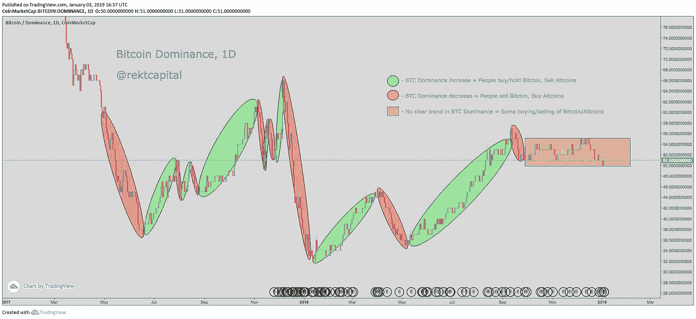
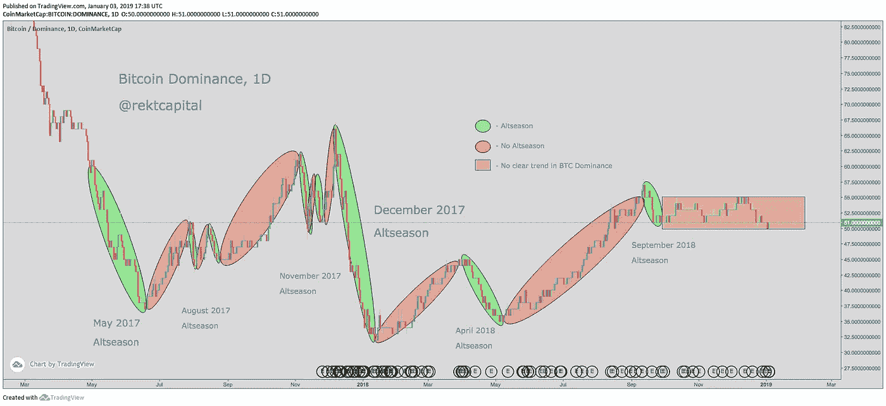
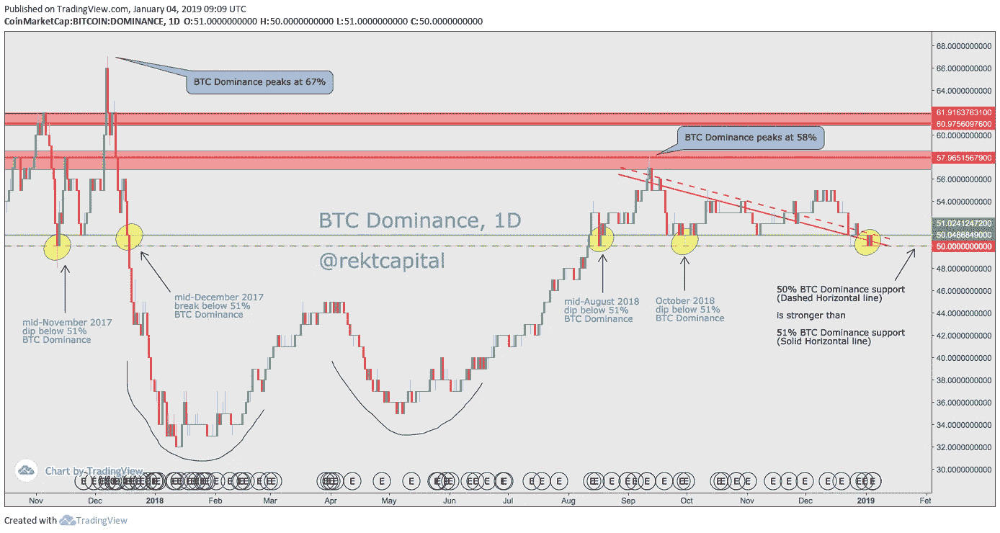

# “Altseason 什么时候？”—如何确定加密货币市场最有利可图的时期

> 原文：<https://medium.com/hackernoon/when-altseason-how-to-time-the-most-profitable-period-in-the-cryptocurrency-market-440c82a056dd>

Altseason 就像加密货币领域的圣诞节。

Altseason 是 Altcoin Season 的简写，是一年中加密货币市场的大多数人对 Altcoin 产生非常积极情绪的时候。

这转化为替代硬币(即比特币的替代硬币)的指数收益。

在过去，替代硬币在替代季节获得了巨大的收益。

最值得注意的是在 2017 年 12 月，在几周持续、几乎不间断的上涨趋势中，大多数(如果不是全部)替代硬币的初始市场估值翻了很多倍。

无论你是交易还是投资替代币，以赚取更多比特币或更多菲亚特，替代季是市场中大多数交易者和投资者一年中赚取大部分利润的时期。

就像花卉生意一样，它的大部分收入来自一天，那就是情人节(365 天中的一天= ~ 0.3%)。

2017 年，Altcoins 在总共约 10 周的时间里获得了巨大的收益，相当于全年的 19%。

Altcoins 在 2017 年 5 月反弹了一个月左右。

以及 2017 年 8 月和 2017 年 12 月各几周。

但 2018 年标志着加密货币市场经历了 2017 年 12 月指数上涨的长期后遗症，当时比特币创下了 20，000 美元的历史新高(ATH)。

出于这个原因，2018 年只在 4 月份和 9 月/10 月份为加密货币社区提供了相当短暂的替代季节。

2018 年的替代季节很少，这就是为什么 Twitter 上的加密货币社区(又名“ [Crypto Twitter](https://twitter.com/rektcapital) ”)的许多人一直在问像我这样的加密货币分析师以下问题:

“Altseason 什么时候？”

在这篇文章中，我将揭示一个我在交替季节计时中使用的有用指标，并解释你也可以如何使用它。

# 替代赛季计时的终极标准

理解替代季节何时可能发生的一个有用指标是比特币的主导地位。

**比特币统治地位**是比特币占加密货币总市值的百分比。

换句话说，比特币统治地位代表了目前市场上有多少人在购买和持有比特币。

关于比特币的统治地位，你应该记住两个核心原则。

**原则#1:**
当越来越多的人购买或仅仅持有比特币时，比特币的主导地位就会增强。

**原则#2:**
当越来越多的人出售比特币时，比特币的统治地位降低。

只要看一眼这两个核心原则，你就会发现，当比特币的主导地位处于上升趋势时，囤积替代币并不是一个理想的策略。

这是因为人们更愿意持有比特币，而不是替代币。

这通常会转化为人们购买比特币并出售替代币。

换句话说，这通常会转化为比特币的价格上涨和各种替代币的价格下降。

在这种时候持有替代硬币将是一笔亏损的交易，也是一笔巨大的机会成本。不仅在比特币霸主地位上升的时候用 Altcoins 赔钱，还失去了用比特币赚钱的机会。

Figure 1 — Bitcoin Dominance chart illustrating different market behaviours based on changes in trend.

但当比特币的主导地位下降时——那就完全是另一回事了。

正如原则 2 所建议的，当越来越多的人*抛售*比特币时，比特币的统治地位就会下降。

你如何*卸载*比特币？

两种方式——要么通过:
a)将比特币卖给法币(如美元、欧元、英镑)，要么通过，
b)将比特币卖给替代币。

你可以想象，当比特币的统治地位正在下降时，这是持有替代币的最佳时机。

原因是越来越多的人以比特币为代价购买替代币，从而推高了替代币的价格。

按照这个推理，你可以从下面的比特币统治地位图表中看到，当比特币统治地位经历下降时，就出现了交替季节。

事实上，表现最强劲的淡季发生在比特币的统治地位经历了最剧烈的下跌时。

Figure 2 — The sharpest declines in Bitcoin Dominance resulted in Altseasons.

这向我们介绍了关于比特币统治地位的另外两个原则:

**原理#3:**
当比特币统治地位降低时，人们更容易购买山寨币，导致山寨季。

**原则#4:**
比特币统治地位下降越剧烈，奥特季就越强。

# 为什么我们正处于交替季节的边缘

比特币主导地位的急剧下降总是会导致替代币的巨大估值收益。

因此，为了确定替代季节的时间，评估比特币统治地位急剧下降的可能性很重要。

这时候对于比特币支配地位最重要的水平就是 50%支配地位水平。

Figure 3 — The Bitcoin Dominance chart is currently at a historically significant level of 50%.

50%的目标至关重要，原因如下:

12 月 19 日是比特币统治地位最后一次突破 50%的水平(即图表上绿色的虚线水平线)，导致了加密货币历史上最伟大的 Altseason。

从那以后，比特币的主导地位跌至 32%，并再次突破 50%的大关，甚至在 2018 年 8 月中旬、10 月初反弹，并且…

2019 年 1 月 2 日。

根据比特币统治地位的历史数据，从 50%的水平突破导致加密货币市场上大多数(如果不是全部)替代币的价格呈指数级增长。

50%关口的崩溃只发生过一次。

但当它发生时，比特币的主导地位在急剧加速的下降趋势中下降，导致了替代比特币市场的不对称结果。

# 接下来会发生什么？

过去的数据趋势并不总是转化为未来的数据趋势，但用马克·吐温的话来说——“历史不会重演，但它经常会押韵。”

50%比特币统治地位的崩溃大大增加了替代季节发生的可能性。

当然，比特币的主导地位可能会从 50%的关口反弹，并继续上升，这种情况有一些技术上的理由。

然而，最终重要的是能够冷静地理解 50%比特币统治水平的历史意义，以及替代加密货币(即替代硬币)可能处于其价格行为的重要十字路口的事实。

更重要的是，它是关于发展一种理解，即比特币的统治地位和这些替代硬币的价格行为之间的奇怪相互作用。

Altseason 今天可能发生也可能不发生。

从现在起的一周内，赛季可能会发生，也可能不会发生。

但当它真的发生时，至少做好准备是明智的。

感谢您的阅读。

附:如果你有兴趣了解更多关于加密货币市场的信息，请随时注册我的电子邮件简讯[**【rektcapital.co】**](https://rektcapital.co/)并在[推特](https://twitter.com/rektcapital)上关注我。