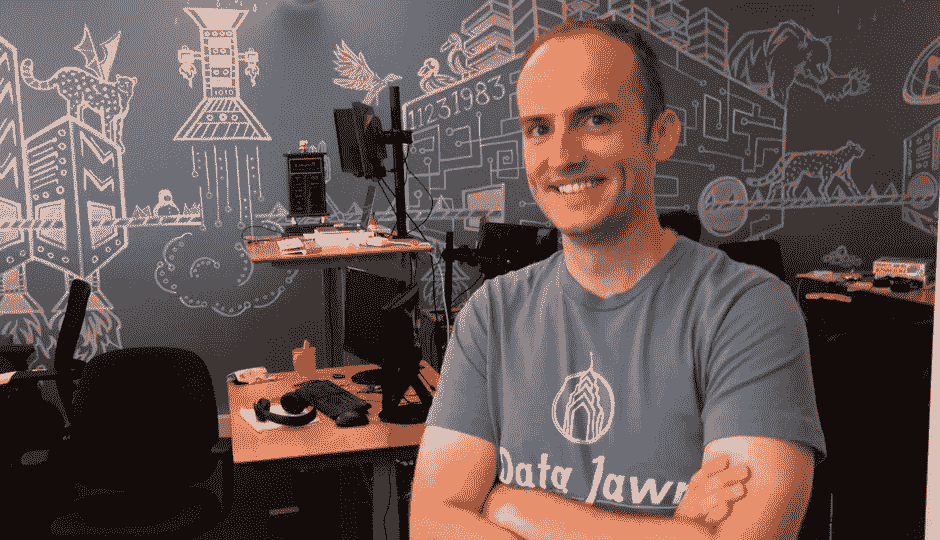

# 准备什么时候养 A 轮？当顾客说，“这东西改变了我的生活”

> 原文：<https://medium.com/hackernoon/when-are-you-ready-to-raise-a-series-a-when-customers-say-this-thing-changed-my-life-d520436b52f9>

对于鲍勃·摩尔(Bob Moore)来说， [Stitch](https://www.stitchdata.com/) 和 [RJ 度量](https://blog.rjmetrics.com/)(2016 年被 [Magento](https://magento.com/products/business-intelligence) 收购)的创始人来说，一家公司简单地导致另一家公司。

数据协作平台横梁是鲍勃的第三家公司。把它作为另一个创始人挠自己痒的案例归档。

“基本上，我们通过识别共享客户和潜在客户等事物，帮助公司以更加数据驱动的方式相互合作，”鲍勃说。

在他以前的公司，Bob 意识到如果双方不透露他们所有的数据，他无法确定他是否会像另一家公司一样追求相同的客户。

“如果你有一个可信的第三方来执行这种分析，你可以获得更深入的见解，同时仍然保持你的其他数据的隐私和安全，”鲍勃说。

他解释说，可以把横梁想象成“数据的 LinkedIn”。

“你在发送邀请，并与你的合作公司中拥有适当代理级别的人联系，”Bob 说。

斯科特，给我一轮种子赛！

横梁实际上是鲍勃第一次经历提高种子轮。

他为自己的前一家公司 RJ 度量公司试探了一下融资，但 2009 年他成立时，市场形势并不乐观。随着经济的复苏，这家公司有了几年的发展。最终，鲍勃和他的团队能够开始寻找投资者，RJ 度量公司在三年内获得了 2500 万美元的资金。

尽管 Bob 最初没有为 RJ 运行正式的流程，但在他的创业期开始时，他差点就拿到了一份投资意向书。

“事实上，我非常高兴我们没有这样做，”他说。“6 个月后，当我们发行可转换债券时，它的估值是我们之前的两倍多。”

从 RJ 退出后，鲍勃利用他的关系开始了关于横梁的谈话。

“在一个风险投资资金流动的市场中，作为重复创始人的好处之一是，你可以依赖那些现有的关系，”鲍勃说。

经过几个月的辛勤工作，Bob 为 Crossbeam 完成了一轮 350 万美元的种子融资。来自[首轮资本](https://firstround.com/)的比尔·特伦查德和来自[的](https://uncorkcapital.com/)[安迪·麦克洛林](https://www.linkedin.com/in/andymcloughlin/)共同领衔种子轮。

“我会说我运行了一个迷你流程，”Bob 说。“甚至在我开始尝试达成交易之前，我就已经挑选出这两家公司作为我的理想合作伙伴。他们是以投资组合为平台的最好的两家公司。你的学习能力、走向市场的能力、获得早期客户的能力以及让人们真正感受到对你成功的投资的能力都非常高。”

**爆破工设置为…双重检查**

对 Bob 来说，甚至在你开始要求资本之前，就已经开始获得资金了。“在你筹集下一轮资金进入首轮之前，确保你已经步入正轨，”鲍勃说。

一旦资金到位，改变方向可能就为时已晚。

“如果你把它想象成你在建造一艘火箭船，你会想在开始给它加满燃料之前确保它完全指向正确的方向，”鲍勃说。“当你点燃点火起飞时，无论如何都要关掉两度，这可能是极其灾难性的。”

但是你怎么知道你是否被指向正确的方向呢？

“这完全是为了证明你正在建造的东西的产品市场适应性，以证明你增加烧钱的速度是合理的，”鲍勃说。

仅仅有一个伟大的想法是不够的。对更多的资本将如何影响你公司的未来有一个清晰的认识。

鲍勃说，在他非常确定自己的客户之前，他甚至不会考虑再融资。

他说，他不会为横梁筹集 A 轮融资，直到他觉得自己拥有“一个真正强大的代表性客户群体，所有人都愿意拿起电话说，‘这东西改变了我的生活’”。

“另外，我想要更多像他们一样的人的证据，以及我们知道如何联系他们的证据。”

但是用实际的推销来平衡这种自信也是一个好主意。鲍勃建议企业家在最初几轮向投资者推销时，把重点放在讲故事上。

“非常透明和诚实地回答‘我不知道’的问题是可以的，”鲍勃说。

对他来说，“筹集种子资金与数据无关。这一切都与我们的愿景和能力有关，让我们相信这是一个巨大的市场，而我们的团队正是追求这个市场的正确人选。”

**越过(移动中的)终点线**

连续创业改变了鲍勃对成功的定义。

“随着你职业生涯的进展，你开始考虑成功，”他说。“当我们开始使用 RJ 指标时，稀释敏感性实际上是为了保护下行风险。如果我们在几年内以 300 万或 400 万美元的价格出售这项业务，这真的会让我们感到兴奋吗？

"嗯，是的，只要我们不欠投资者 500 万美元."

但是随着两家成功公司的出现，鲍勃说他的心态已经改变了。

“当我想到横梁时，我想到的是速度、增长和寻找具有巨大潜在市场和潜在成果的机会的重要性，”Bob 说。

基本上，他对拥有更多的业务不感兴趣，只希望通过销售赚几百万。

“销售的经济利益虽然重要，但并不代表新的里程碑或新的成功水平，”Bob 说。“创办另一家公司的原因是，我们要非常努力地挥动球棒，确保我们在做真正大的事情。”

内森·贝克德(Nathan Beckord)是一个筹集资金的软件平台 Foundersuite.com**的 CEO。自 2016 年以来，Foundersuite 已帮助企业家筹集了超过 10 亿美元的种子和风险资本。本文根据 Foundersuite 的《我如何筹集资金》播客* *中的一集* [*改编，一窥创业公司创始人如何筹集资本的幕后。*](https://soundcloud.com/user-2586856/ep-99-how-i-raised-it-with-bob-moore-of-crossbeam-on-2252019)*