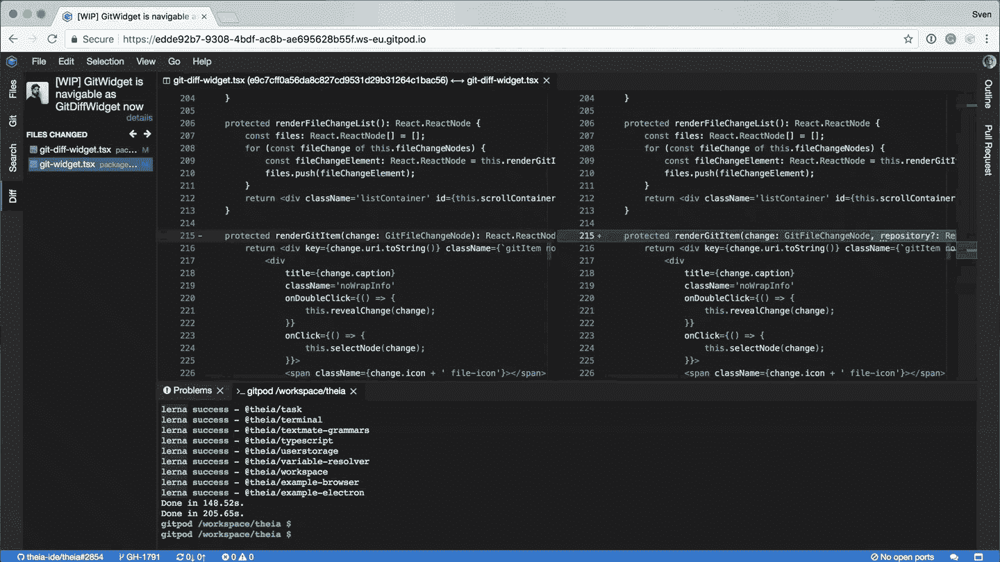
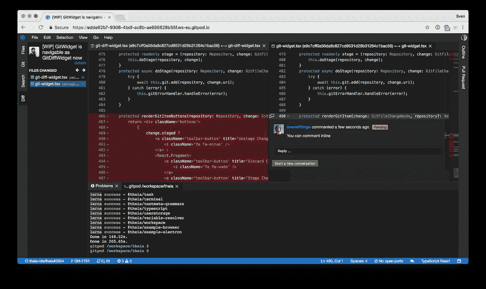
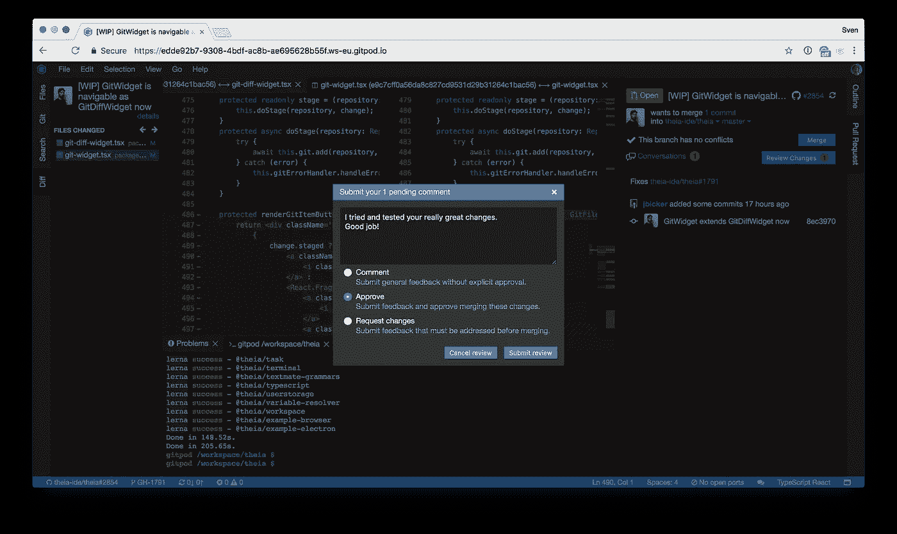

# 当代码评审 LGTM 时——和肤浅的评审说再见吧！

> 原文：<https://medium.com/hackernoon/when-code-reviews-lgtm-say-goodbye-to-shallow-reviews-a4e01b84ddef>

了解如何简化您的代码审查体验。

Photo by [NESA by Makers](https://unsplash.com/@nesabymakers?utm_source=medium&utm_medium=referral) on [Unsplash](https://unsplash.com?utm_source=medium&utm_medium=referral)

代码审查是保持你的[代码库](https://hackernoon.com/tagged/codebase)干净的最好方法之一。他们提高代码质量，减少代码所有权，让你从你的队友那里学到很多东西。

关于个人、团队和代码库的代码评审的[优势](https://blog.codinghorror.com/code-reviews-just-do-it/) [已经说得很多了。研究发现，进行适当的代码评审的项目识别出](https://www.quora.com/Why-is-code-review-so-important-in-the-software-industry)[“…代码评审中超过一半的缺陷”](https://web.archive.org/web/20151009203148/http://ieeexplore.ieee.org/xpl/login.jsp?reload=true&tp=&arnumber=4815279)。

假设你理解了它的重要性，我想讨论一下工具、流程，以及如何使用 [Gitpod](https://www.gitpod.io) 和 [GitHub](https://hackernoon.com/tagged/github) 的新应用来改善你的代码评审体验，让你进行深入的代码评审。

# 上下文切换和肤浅的评论

代码审查非常有价值，但是它们会给我们的日常任务增加摩擦。如果没有评审，你可能会整天写代码，可能会到处讨论。但是你通常会做一个任务或者至少一个接一个地做。

因此，在不同的分支之间改变我们的本地开发环境是我们想要避免的。尤其是如果设置时间(重建等。)都很长。因此，我们经常走捷径，在代码评审工具中在线浏览代码，而不是帮助我们的同事并提供适当的代码评审。无论是 GitHub、Gitlab、Bitbucket 还是 Gerrit，它们都只是呈现了语法颜色的差异。这些工具允许我们浏览变更，但是我们不能运行代码、导航(并使用智能编辑特性)或者甚至添加代码(例如测试)。

因此，在这种肤浅的代码审查中，许多错误没有被发现，潜在的错误假设也没有被识别。

# 深度代码审查

我们应该在真实的开发环境中检查分支，而不是浏览 GitHub 上的变化。因此我们可以读取、运行和测试它们。

是的，它打乱了我们的本地开发环境，甚至可能需要一点时间来设置。是的，我们必须回到在线代码审查工具来添加我们的评论。这一切都有点麻烦，所以… **也许为了这个小小的改变，我可以来个快速 LGTM？**

我理解你的痛苦，但你不应该走捷径。它最终会反击的。相反，让我们改进我们的工作流程，简化上下文切换并消除不必要的开销。

# 输入 Gitpod

Gitpod 为您提供了一个完整的开发环境，只需点击一下 GitHub 上的任何拉取请求。您不必在本地开发环境中手动设置甚至更改任何东西。只需点击一个按钮，您就拥有了两个世界的精华:

*   完整的开发环境(类似于 VS 代码)
*   伟大的代码审查体验(类似于 GitHub)

# Gitpod 中的代码审查

当您从一个 pull 请求启动一个 Gitpod 工作区时，它会自动打开，并在左侧显示变更列表。现在，您可以使用光标键或鼠标来逐个查看更改。

打开的 diff 编辑器是成熟的代码编辑器，因此您可以导航以检查引用并轻松地检查替代代码。你甚至可以在这些编辑器中进行评论。

构建是自动开始的，所以当您进行评审时，您已经可以发现任何出现的问题。

启动测试，甚至运行和尝试应用程序也是好的代码评审的一部分。

您要做的最后一件事是提交您的审核并关闭浏览器选项卡。

# TL；速度三角形定位法(dead reckoning)

虽然在进行代码评审时，我们不能完全摆脱上下文切换，但是我们可以简化和自动化这些切换，从而减少耗时和干扰。

Gitpod 将 GitHub 的审查功能集成在一个在线 IDE 中，只需点击一下就能提供自动化的体验。你需要的只是一个浏览器，一旦你完成了审查，你只需关闭窗口，不需要回头看。

Gitpod 是免费的，你现在就可以使用它。只需在 GitHub 上找到任何一个 pull 请求，并在 URL 前加上前缀。` gitpod.io# `，例如
[https://git pod . io # https://github . com/THEIA-ide/THEIA/pull/1204](https://gitpod.io#https://github.com/theia-ide/theia/pull/1204)