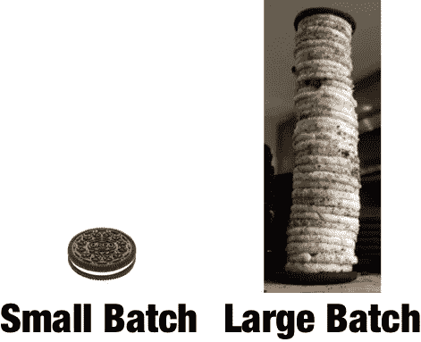

# 当尽力而为是最坏的选择时

> 原文：<https://medium.com/hackernoon/when-doing-your-best-is-the-worst-option-9e70b9f6217b>

关于个人天赋有很多可说的，也许更多的是关于个人的卓越。这是我们所有人都在努力的目标，我们都在为我们所做的每一件事追求卓越而努力。充分发挥我们的才能，每天都做到最好。我们很少停下来思考，尽力而为是最好的做法吗？个人的，个体的优秀呢？这属于基于团队的敏捷工作文化的范畴吗？

对我来说，所有的敏捷都可以归结为以下 4 点

1.  小批量工作
2.  限制正在进行的工作
3.  获得反馈
4.  不要破坏你做前三点的能力

不幸的是，我们被教导的一切，我们以个人卓越的名义学习做的一切都与所有这些背道而驰。当谈到以敏捷的方式工作时，尽力而为(传统意义上的个人卓越)是你能做的最糟糕的事情。

# 小批量工作

我受过工程师的教育。我们被教导解决问题，建造东西。你解决的问题越大，你就越优秀。你能建造的东西越大，你就越有创造力。我相信每个人的教育都是如此。我们都被教导，被鼓励去做大事，去努力超越那些只做常规的、普通的事情的人。当我们参加工作时，这种情况还在继续。得到奖励的是那些解决了棘手问题的人，那些建造了大工程的人，那些花了无数个夜晚和周末建造了最大、最糟糕、最宏伟的工程的人。个人的卓越几乎总是比团队的卓越和制造小东西的谦逊更受尊敬和奖励。不足为奇的是，当我们作为教练和领导者鼓励人们小批量工作时，对于那些经常因大批量交付而获得奖励的人来说，感觉完全违背直觉。

# 限制正在进行的工作

我们一向重视能完成很多事情的人。我们也重视那些看起来很忙的人。事实上，为了显得有价值和/或重要，我们经常试图表现出我们可以完成很多事情并且非常忙碌。个人卓越的另一个标志是，人们可以把多个球抛向空中，而不让其中任何一个掉下来(直到它们掉下来)。敏捷建议限制正在进行的工作，或者换句话说，在任何给定的时间尽可能少地工作，这对于大多数努力证明他们已经尽力了的人来说是非常违背直觉的。很难说服那些经常因同时处理多件事情而受到表扬的人，以及那些为被多人需要而自豪的人，因为他们忙于明确限制他们正在做的事情的数量。

“限制正在进行的工作”的建议难以坚持还有另一个原因。我们都是喜欢取悦别人的人，尤其是那些做我们绩效评估的人。因此，当有人，尤其是管理人员要求我们做某事时，很少有人会说“不”或“还不行”。我们大多数人接受这个任务是为了取悦他人，并且知道我们在最好的情况下也能处理好。因此，膨胀我们个人的工作进展。

# 获得反馈

递送大件物品并不是我们获得奖励的唯一原因，我们还会因为第一次尝试就做对而获得奖励。从幼儿园教室里老师第一次提问开始，我们就被灌输了要成为第一个有正确答案的人的竞赛。成为第一个给出正确答案的人让许多中层经理得到了提升。成为第一个提出成功解决方案的人是个人卓越的代名词。相反，提出错误的解决方案或接受我们不知道理想的解决方案，在传统上被等同于平庸。定期从客户那里获得反馈意味着承认两件事——1)你不确定你得出的答案是否正确，2)你很快就会发现你提出的解决方案是否是错误的，这迫使你在老板面前承认这一点。这也难怪，获得定期客户反馈以了解你何时出错的敏捷建议，并不适合大多数只是尽力而为的人。

# 蓄意破坏

以上三个问题的结合严重破坏了我对敏捷定义的最后一点。这一点可能最好用一个例子来说明—

考虑一个用于医院安排预约、轮班、保存患者信息等的系统。换句话说，这个系统负责医院的日常运作。最近护士们抱怨说，当病人入院或预约时，很难将病人以前所有就诊的信息送到医生手中。在患者的详细信息屏幕上，您必须逐个点击之前的每次就诊，并逐一打印出详细信息，以将其放入医生剪贴板。如果有一种更简化的方法来获取患者的所有就诊记录，并且耗时更少，那就太好了。

负责该系统的团队被要求解决这个问题。该团队包括 BAs、UX 设计师、开发人员和 QA。让我们举两个例子-

## 案例 1——每个人都尽力而为

BAs 和 UX 的设计师承担了将这一功能做到最好的任务。他们很快发现，这需要一个现代化的报告系统，一个响应迅速且易于配置的系统。我们向几个用户展示了一些纸质原型，发现他们希望能够设置日期范围，突出显示特定的就诊，甚至改变可能干扰当前治疗的药物的字体。这是令人兴奋的。当我们交付这个系统时，它将提供巨大的价值。

当我们对所做的研究感到满意后，这些信息将提交给开发人员和 QAs 进行联合设计会议。更多的设计可能性被勾画出来并投票表决。团队开始围绕一个解决方案团结起来。我们将引入一个报告引擎，它可以位于我们现有的数据库之上，并为我们的 UI 构建一些响应组件，这些组件可以连接到报告系统。我们的高级开发人员知道至少有三个我们可以使用的报告系统。让我们为我们研究这些报告系统的实现旋转一些“尖峰”。此外，由于我们有公司范围的 DevOps 计划，我们应该研究适合该功能的云基础架构。会议中的一位 QA 人员提出了一个观点，即新的报告系统需要遵守我们的基础系统符合的所有 HIPPA 和隐私法。

我们可能会继续深入 3-6 个月(或更长)项目的细节，以及它可能遇到的所有障碍。我们甚至还没有谈到在这个特性的开发过程中会出现的其他“高优先级”项目。希望您能看到“我需要能够打印病人的所有就诊记录”的请求是如何转化为高度可配置的报告系统的实现的。

## 案例 2——获得反馈的最小批次

我们把同样的问题交给处理问题方式略有不同的团队。没有太多的前期设计。其中一个开发者建议我们可以建立一个包含所有过去访问的详细信息的页面。一位分析师提醒说，需要有一个打印按钮，因为这些需要打印出来交给医生。

新页面被创建，顶部有一个打印按钮。测试并在几天内推向生产。根据用户的反馈，可以添加日期范围或单词高亮显示。

从我的角度来看，第二种解决方案更加灵活，是解决客户问题的更好方法。它解决了手头的问题，并允许我们迭代到最佳特性集。这也让我们能够更快地解决其他问题。当每个人都被要求尽自己最大的努力时，这并不是解决方案。在团队环境中为个人的优秀而优化可能，而且通常会，导致低效和过度设计的庞大功能集。

这本质上同时也是敏捷最显著的优势和缺陷。优势在于能够为客户确定最佳解决方案。缺陷在于，我们明确地告诉人们，我们不希望你做你传统上认为“最好”的事情。相反，我们正在帮助您为我们的客户实现“最佳”结果。