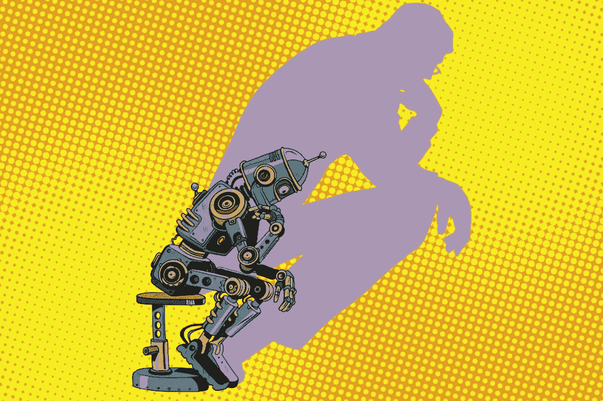

# 当谈到人工智能时，有很多噪音，但很少清晰。

> 原文：<https://medium.com/hackernoon/when-it-comes-to-ai-theres-a-lot-of-noise-out-there-but-very-little-clarity-729fe2d48692>

## 人们需要了解人工智能的现实和前景。

> **由** [**安吉拉·胡德**](https://www.minutesmagazine.com/author/angela-hood/) **，ThisWay Global 创始人兼首席执行官**

> 揭开人工智能的神秘面纱:它是什么，又不是什么

如今，很难读到任何没有提到人工智能的科技新闻——但缺少的是对人工智能是什么和不是什么的清晰视角。

[特斯拉的埃隆·马斯克认为人工智能](https://www.industryweek.com/technology-and-iiot/how-should-ai-be-regulated)对“人类文明的存在构成了根本性的风险”，并呼吁“在为时已晚之前”进行积极的监管。与此同时，相信人工智能将“让我们用更少的劳动力生产更多的商品和服务”的比尔·盖茨预见了劳动力的错位，甚至建议对机器人征税。

有了这样的标题，难怪人们对人工智能有矛盾的感觉。恐惧在这些感觉中排名如此靠前也就不足为奇了。

事实是，当谈到人工智能时，有很多噪音，但很少清晰。

> *大部分人不明白 AI 真正的*是什么。如果他们知道，他们可能就不会这么担心了。

像任何技术一样，人工智能伴随着潜在的危险，但它也有巨大的潜力。具体来说，它可以使人类在平凡、重复的任务上花费更少的时间，让他们有时间从事更有意义的工作。这将有助于更好地平衡工作和生活。

没有理由恐慌。以下是人们需要了解的人工智能的现实和前景:

# 人工智能并不是新东西——远远不是。

人们第一次开始谈论人工智能是在第二次世界大战期间。

这在很大程度上要归功于艾伦·图灵。在第二次世界大战期间，图灵为盟军服务，利用自动化和机器学习来破解他们的恩尼格玛机创造的德国密码。这就是我们现在看到的那种人工智能的出现，尽管人们直到 20 世纪 50 年代才开始使用“人工智能”这个术语。然后，在 20 世纪 60 年代，麻省理工学院的教授创造了一个名为[伊莱扎](http://www.med-ai.com/models/eliza.html)的计算机程序，它可以与人类互动。

但是，曾经需要专门的实验室、房屋大小的大型机和超级计算机的东西，现在已经部署到我们的手机上了。

今天，AI 已经成为我们日常生活的一部分，我们大多数人甚至没有意识到这一点。它几乎在我们做的每一件事情中都发挥着作用，从驾驶方向到回复电子邮件。例如，Gmail 使用人工智能过滤来防止超过 99%的垃圾邮件进入你的收件箱，它使用人工智能来自动回复电子邮件，并附上简单的短语，如“太好了，谢谢！”

另一个例子:当我们在网上购物时，聊天机器人会识别单词和短语，向有常见问题的客户提供有用的内容。通常，他们是如此的准确，以至于我们认为我们在和一个真实的人交谈！

在某种程度上，考虑到我们每天使用人工智能所获得的所有好处，对人工智能的如此抵制令人震惊。

# AI 戴着不同的脸。

不是所有的 AI 都是一样的。把它分成四个独立的类别是有帮助的。

首先，你有我们俗称的“机器人”这包括认知网络安全、手术机器人和机器人个人助理等。虽然这是最让人紧张的一类，但我个人从外科机器人的创造中受益匪浅。2012 年，我需要做紧急手术——一个多臂机器人[“达芬奇](https://en.wikipedia.org/wiki/Da_Vinci_Surgical_System)”让手术变得简单多了。如果由人类来做，将需要三个医生和三个独立的手术，总共 15 个小时。但是因为它是一个机器人，我只在水下呆了五个小时，而且只需要休养一次。

第二，我们有游戏部门。这包括实时通用翻译、虚拟现实和“思想控制”游戏。这些都是新兴技术，人们看到后会说，“我不太清楚这里发生了什么。”但总的来说，人们认为它更令人兴奋而不是具有威胁性。现实世界的应用也有助于更好地准备工人，例如那些前往海上钻井平台工作的工人，为工人和我们的环境更好地准备和更安全地操作钻机。

第三，我们有实时情绪分析。这包括能够察觉到一些事情，比如一个人是在撒谎还是真的会购买你的产品。人们对人工智能的这种使用持谨慎态度，因为它可能具有侵入性，并且严重依赖于个人数据的挖掘。此外，在这一点上它不是很有效，因为人类的决策是复杂的，难以察觉。

最后，还有我们一直在使用的人工智能。这包括我们的手机、聊天机器人、Siri、Alexa 和其他我们在日常生活中使用的技术。还记得必须使用纸质地图来获取方向吗？今天，谷歌地图使用人工智能、交通分析，有时还使用你的摄像头来提供视觉和语音方向。我们都有过这样的经历，当你知道一条比地图程序更好的路线时，你会自由地选择不同的方向。然而，同样的技术为您提供了其他方式无法提供的洞察力，例如哪里发生了事故或即将发生的绕道和道路封闭。更广泛的信息和明智的建议的融合降低了我们每个人决策的认知负荷。那么作为人类，我们可以在技术的帮助下做出更好的决定。

因此，当人们对人工智能产生误解或恐慌时，他们通常不会意识到他们每天使用多少种人工智能技术。其中大部分对我们有帮助，而不是构成威胁。

# 人工智能可以处理高科技，但我们需要人类来进行高接触。

人们害怕人工智能有各种各样的原因，失业一直是最主要的原因。

这些担忧并非完全没有根据。英国最近的一项调查估计，自动化在未来十年可能会夺走 400 万份英国私营部门的工作。在美国， [47%的工作岗位](https://www.cnbc.com/2017/11/13/ex-google-china-president-a-i-to-obliterate-white-collar-jobs-first.html)被认为因实施人工智能而面临“高风险”流失。

> *尽管负面预测充斥着媒体，但仍有大量理由对我们从人工智能的使用中获得的优势感到乐观。*

人工智能擅长处理重复性、计算性和数学任务，如扫描数据、计算非常复杂的方程或在工厂组装零件，但人工智能不擅长许多技能，如沟通、创造力、战略思维和艺术表达。

它擅长于加速任务完成和自动化，但在深层次的人类技能方面存在困难，如移情、判断、一般生活经历和关系建立。人工智能擅长计算解决方案，但对他人的情绪没有感觉或反应。换句话说，人工智能依靠人类的洞察力和专业知识来产生人类认为有价值的预期结果。

换个角度看，如果对我们来说很难，比如确定月球的轨道速度，对 AI 来说就很容易。反之亦然:从冰箱里拿牛奶，倒一杯对我们来说很容易，但对 AI 来说很难！

虽然人工智能将不可避免地取代一些工作，但它将为人类发展创造更多的机会。最终，人工智能将处理无需动脑的任务，让人类员工解放出来进行战略性、创造性和批判性思考。例如，招聘人员不必花时间筛选成千上万份简历。相反，他们可以花时间与候选人交谈——这是 AI 做不到的。请记住，人类从一开始就一直在将新技术引入我们的社会，几乎总是为了所有人的利益。

目标是消除繁重的任务，让人们有更多的时间做高价值的工作。

# 我们不应该害怕人工智能，而是要学会如何与它合作。

给机器人编程来完成简单的任务是很昂贵的。

但是有些用途是绝对值得的。一个例子是炸弹处理。我们在世界各地有大量的未爆炸装置，这些装置可以追溯到第一次世界大战，我们当然不希望人们冒着生命危险去寻找和处理它们。因此，机器人被用来清除这些炸弹，并安全地收回土地。

我们不应该让恐惧控制我们，而应该看到人工智能的本来面目 **:** 一个利用我们的时间做更多事情并利用我们的技能来完成新事物的机会。假设你是一名图书管理员，你失业了，因为图书馆完全数字化了。你仍然拥有一些技能，通过少量的再培训，你可以将其转化到技术领域，最终你会赚更多的钱。

如果你有韧性，你会成功的。但一直都是这样。人类在不断发展，工作场所也在不断发展。公司需要注意对员工进行再培训的大好机会。员工将从抓住在线培训和技能提升课程提供的机会中受益。

我们距离人工智能拥有人类继承的细微技能还有很长的路要走。与此同时，我们必须适应并不断学习如何使用新技术。

毕竟，人工智能不会去任何地方，它会帮助我们去任何我们想去的地方……甚至是火星。

*原载于* [*分钟*](https://www.minutesmagazine.com) *。*