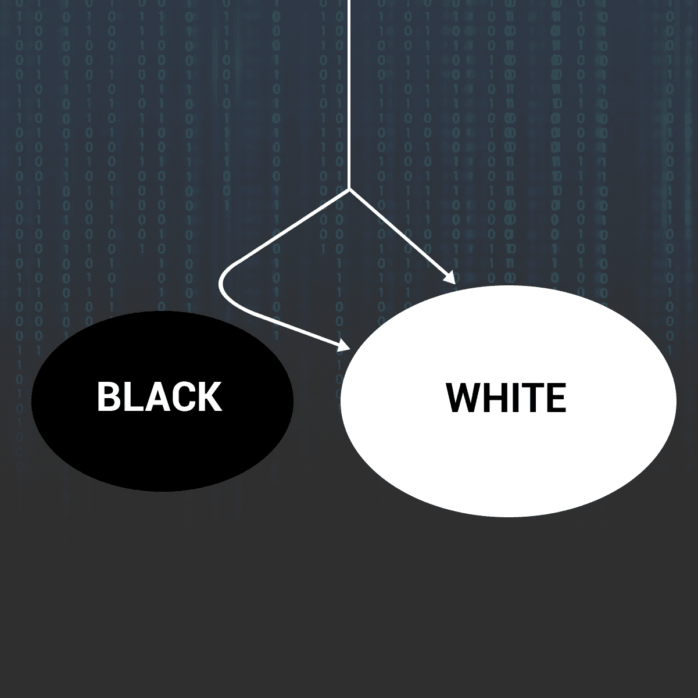
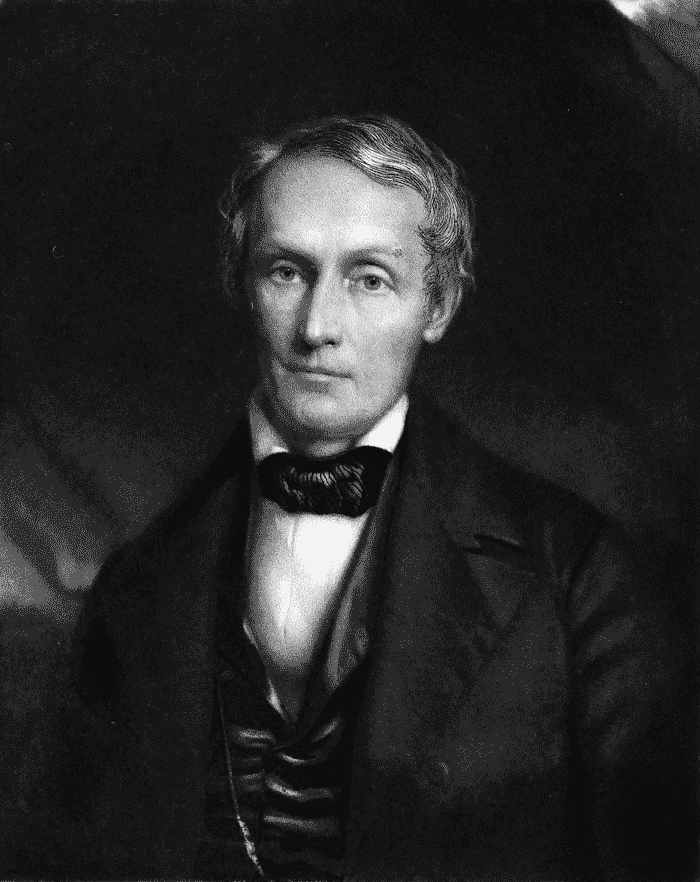
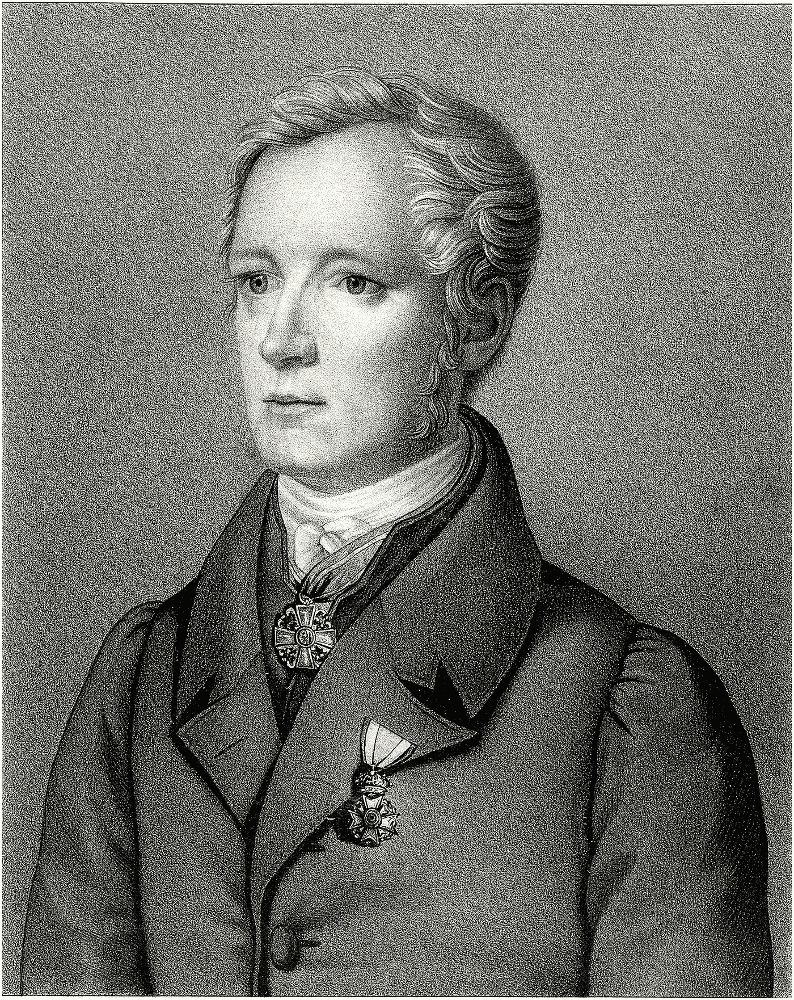

# 当机器知道罪恶:技术的算法偏见

> 原文：<https://medium.com/hackernoon/when-machines-know-sin-the-algorithmic-bias-of-technology-82402b70dfd0>

随着技术和机器的进步，它们变得越来越像我们。但这种模仿已经跨越到我们更黑暗的偏见，采用了困扰社会如此之久的偏见。

机器学习是人工智能发展最快的应用，如今被广泛应用，从 Snapchat 过滤器等毫无意义的应用功能到执法等重大应用。

人工智能助手做出政治和社会决策的日子不远了。尽管如此，我还是忍不住质疑，把更多的信任放在机器身上，而不是放在一个普通的老派人身上，是否明智。

至少，在我们继续用[不平衡的数据集](http://markyatskar.com/publications/bias.pdf)训练人工智能算法之前不会，这些数据集混合了性别和种族刻板印象，强化了那些建立在社会秩序顶端的特权。

这就是设计技术时完全无视其社会影响的危险所在。

# 机器学习数据中的性别偏见和种族主义

在复杂的计算中，一个算法可能是刻板的，并显示出对某些群体的偏好，这听起来很奇怪。

挑战数学算法冰冷的客观性，并厚颜无耻地认为它们犯有偏见判断的罪行，这有意义吗？

事实证明，这完全有道理。事实上，我们完全有理由怀疑我们技术的公正性。

让我们来看几个例子:

弗吉尼亚大学的一组研究人员发现，用于训练机器学习算法的图像数据集具有性别偏见的特点，其中主要包含男性图像。在微软和脸书共同赞助的图像数据集 [COCO](http://mscoco.org/) 以及华盛顿大学 [ImSitu](http://imsitu.org/) 中，女性的代表性严重不足

研究人员发现了一个性别刻板印象的经典案例，当时在 ImSitu 上训练的视觉识别算法将站在厨房里的男人误标为“女人”。但是性别歧视并不是复杂机器犯下的唯一错误。

在另一项对预测犯罪累犯的软件的研究中，发现该算法给予黑人的[高再犯罪风险分数](https://www.propublica.org/article/machine-bias-risk-assessments-in-criminal-sentencing)是白人的两倍。一名有四次少年轻罪的黑人妇女被贴上“高风险”标签，而一名有两次持枪抢劫前科的白人男子被贴上“低风险”标签。毫无疑问，这位女士没有再犯，但这个男人继续犯下了重大盗窃案。

类似的种族和性别歧视也出现在微软和 IBM 的人脸识别软件中，与白人男性相比，这些软件识别黑人女性的准确性要低得多。

这是怎么回事？

简单来说，机器学习算法依赖于用来训练它们的数据集。如果数据是倾斜的，软件将显示出对在数据集中具有多数代表性的组的偏好。科技公司只是把自己的偏见输入到机器中。

上述案例只揭示了让机器进行不公平歧视的两种方式之一。这些都是*坏*数据集被用来训练*好*算法的例子。但是算法本身有偏差怎么办？

如果你正在寻找这样一个算法的例子，只需看看谷歌的搜索引擎就行了。

# 谷歌的偏见

例如，在谷歌上搜索“亚洲女孩”，搜索结果会把衣着暴露、姿态诱人的亚洲女性推上任何其他可以找到亚洲女孩的地方。拉丁美洲人也是如此。

(这种搜索过去会直接指向色情内容，但值得一提的是，谷歌现在已经屏蔽了大部分内容。尽管如此，与这些查询相关的大量搜索结果仍然会导致对有色人种女性的过度性化描述。

谷歌使用预测技术来预测用户在输入搜索查询时的意图。现在，如果大多数人真的以性娱乐为目的输入“亚洲女孩”，我不会感到惊讶，但谷歌有责任在平衡的背景下显示结果，而不是盲目地助长种族偏见。

纠正这些问题可能需要修改现有的谷歌算法，该算法目前在为一个查询生成搜索结果时会考虑大约 200 个因素。显示没有明显歧视的搜索结果，同时又不破坏理解用户意图的准确性，这可能是一个挑战，但这是一个值得谷歌立即关注的问题。

照目前的情况来看，在谷歌这样无处不在的平台上奖励多数人的特权不利于争取一个更加公平和平等的社会。

谷歌的案例很好地说明了数据和算法(或者换句话说，数据的解释)都需要避免偏见，以提高准确性，并改善人工智能系统的公平性。

# 科学种族主义的幽灵

在某种程度上，歧视性技术的问题可以追溯到科学种族主义。有一个有趣的例子,在研究不同人种的比较能力时，好的数据导致坏的结论，这激起了 19 世纪一些有影响力的科学家的兴趣。

其中最主要的是美国医生塞缪尔·莫顿，他是颅骨测量术的创始人。这位教授被认为是当时收集人类头骨最多的人，拥有来自五个不同种族的 900 多个头骨，他将这些种族分为高加索人、非洲人、美洲土著人、蒙古人和马来人。

Samuel George Morton (1799–1851)

从 1839 年到 1844 年，莫顿煞费苦心地进行他的研究，测量这些头骨的大小，并对每个种族群体的结果进行平均。他发现白种人的头骨最大，非洲人最小。由于根据当时的科学智慧，大脑的大小被认为是决定智力的唯一因素，莫顿可能刚刚为高加索人的智力优势和非洲人的劣势找到了科学依据。

大约在同一时间，德国解剖学家弗里德里克·蒂德曼(Friederich Tiedemann)正在进行同样的颅骨测量实验，以观察不同种族的头骨是如何联系起来的。奇怪的是，这个人得出了一个完全不同的结论。Tiedemann 注意到所有被测种族的头骨大小之间有明显的重叠，很明显不同种族群体的头骨容量之间不存在显著差异，因此，种族主义没有科学依据。

Friederich Tiedemann (1781–1861)

这里要注意的重要一点是，两位科学家获得的数据几乎是相似的，并且在科学上是合理的，但它导致了这些人截然相反的结论。如果蒂德曼专注于平均值，他可能会得出与莫顿相同的结论。但是引起蒂德曼注意的测量方法是每个种族的头骨大小范围，而不是每个种族的平均值，这恰好是莫顿关注的唯一焦点。

这种简单的解释方法的变化是铁德曼的奴隶制和压迫黑人人口的不公正的明显证据，而莫顿提交了他可能固有的种族主义信念时，发音所有非洲人低于白种人。

如果有什么东西可以从这个案例中得到并应用到我们目前的场景中，其中解释者和决策者都是机器，那就是清除我们的算法中的偏见。否则，现代技术只会延续类似科学种族主义的危险偏见。

# 我们现在去哪里？

在我看来，我们行为不端的机器的问题间接源于世界各地社会结构的不平等，直接源于领先科技公司(如谷歌、脸书、苹果和亚马逊)缺乏多样性。

在所有主要科技公司中，谷歌的黑人形象最差并不奇怪。事实上，女性和少数族裔在整个科技行业的代表性低得可怜。

多样性的缺乏助长了一种环境，这种环境缺乏对歧视性观念(有意识或无意识的)传播到这些公司生产的产品中的任何检查。加州理工学院(California Institute of Technology)教授阿尼玛·阿南德库马(Anima Anandkuma)曾研究过亚马逊的人工智能系统，他说，*“多样化的团队更有可能在产品推出之前就发现可能产生负面社会后果的问题。”*

可以说，没有哪个行业比科技行业对社会的影响更大。如果组成这个行业的公司几乎全部由白人男性代表，那么他们的产品最终对其他种族产生偏见就不足为奇了。

只要技术公司被同质群体垄断，他们之间很少或没有多样性，偏见就会蔓延到这些公司创造的系统和软件中。

理解有偏见的机器的所有社会含义并不容易。但是，如果我们对未来的社会有什么可以说的，我敢打赌，它将受到技术的严重影响，谷歌、脸书和亚马逊是这个世界的主要股东。迈向一个机器被连线以展示刻板偏见的未来可能是灾难性的，只会加剧现代社会的社会两极分化和不平等。

犯错是人之常情，这正是我们需要技术的原因。

为了我们自己，我只希望犯错的倾向只存在于人类中。