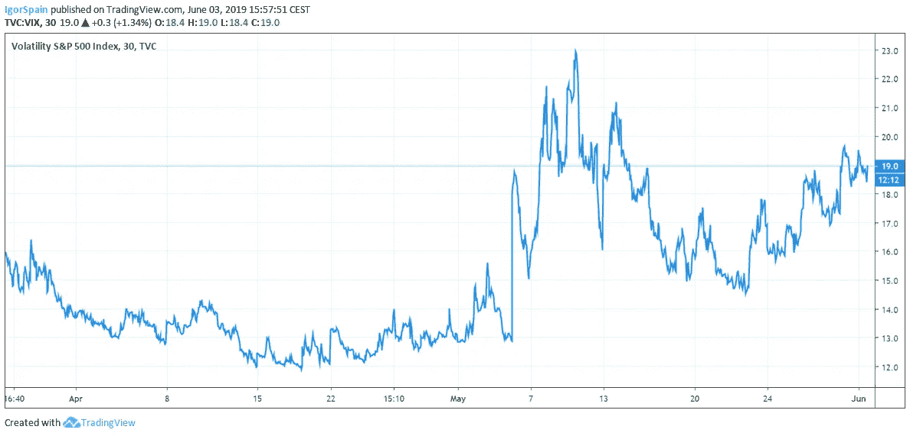
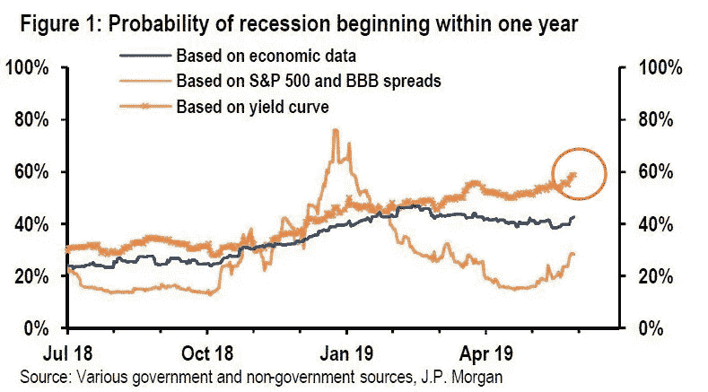

# 下一次衰退什么时候会袭击美国？

> 原文：<https://medium.com/hackernoon/when-will-the-next-recession-hit-america-a263cc3b47f3>

新的一周——新的关税。自 5 月初以来，这一规则不仅成为美国总统的新现实，也成为世界其他国家的新现实。谁能想到全球经济会面临另一波保护主义和某种民族主义？

> 这是否意味着我们不能从过去的错误中吸取教训？

不幸的是，这个问题没有简单的答案。相反，不同的方面有不同的真相。

**例如，当唐纳德·特朗普总统说他坚信自由贸易，同时引用亚伯拉罕·林肯的话说“放弃保护政策将产生匮乏和毁灭”时，他是什么意思？**

根据[美国经济学家 Walter Williams](http://www.aei.org/publication/walter-e-williams-on-the-mercantilists-call-for-free-trade-but-fair-trade/) 的说法，“任何时候有人声称他们支持‘自由贸易但公平贸易’，这种说法总是伴随着某种类型的保护主义贸易政策的呼吁，以使国际贸易在主观上‘更加公平’——但仅限于国内生产者。

换句话说，“公平贸易”实际上是“保护主义”的代名词，因此，从国内生产者的角度来看，它永远都是“公平的”，因为他们受益于针对外国竞争的保护，而从不考虑消费者的观点。"

> 有一点是肯定的——消费者是买单的人。越来越多的美国公司警告关税对美国消费者的负面影响。

耐克和其他 172 家鞋类公司敦促特朗普将鞋类从面临 25%额外关税的进口清单中删除，并警告称，此举可能会使消费者每年额外损失 70 亿美元。

> 世界上最大的零售商沃尔玛和连锁百货公司梅西百货警告说，由于对来自中国的商品征收更高的关税，购物者的价格将会上涨

世界上最大的零售商沃尔玛和连锁百货公司梅西百货警告说，由于对来自中国的商品征收更高的关税，购物者的价格将会上涨。

可能对美国有利的一件事是，消费者会希望购买本地制造的产品，而不是外国进口产品。

但是如果我们漏掉了什么呢？为无益于自己人民的事情而争斗是没有意义的。根据两位英国研究人员进行的一项研究，这种报复是出于政治动机。

参与贸易争端的大多数国家的报复反应都是针对美国出口的，例如波旁威士忌，它产于参议院多数党领袖米奇·麦康奈尔(Mitch McConnell)的家乡肯塔基州。中国(以及墨西哥)瞄准了猪肉和大豆，后者是美国对中国最重要的农产品出口之一，这不成比例地影响了参议院农业委员会(Senate Agriculture Committee)颇具影响力的共和党成员查尔斯格拉斯利(Charles Grassley)的家乡艾奥瓦州。

如果特朗普上周没有表示，如果该国不停止主要来自中美洲的非法移民流，他将于 6 月 10 日对墨西哥商品征收 5%的关税，所有这些都可能停留在理论领域。

“墨西哥将派出一个大型代表团来讨论边界问题。问题是，他们已经‘谈’了 25 年，”特朗普在推特上写道。“我们要行动，而不是空谈。如果他们愿意，他们可以在一天内解决边界危机。否则，我们的公司和工作会回到美国！”

然而，他威胁对美国最大和最重要的贸易伙伴之一墨西哥增加关税，实际上达到的目的是放大对经济增长放缓的担忧。

衡量标准普尔 500(T2)股票看跌期权和看涨期权隐含波动率水平的 VIX 指数从 5 月 1 日的低点 12.74 升至 6 月 3 日的 19.00 以上。

因此，投资者担心持续的贸易战会阻碍经济增长，因此将资金转移到债券上也就不足为奇了。

总之，一切都表明衰退的可能性继续上升。现在的问题不是它是否会发生，而是什么时候会发生。