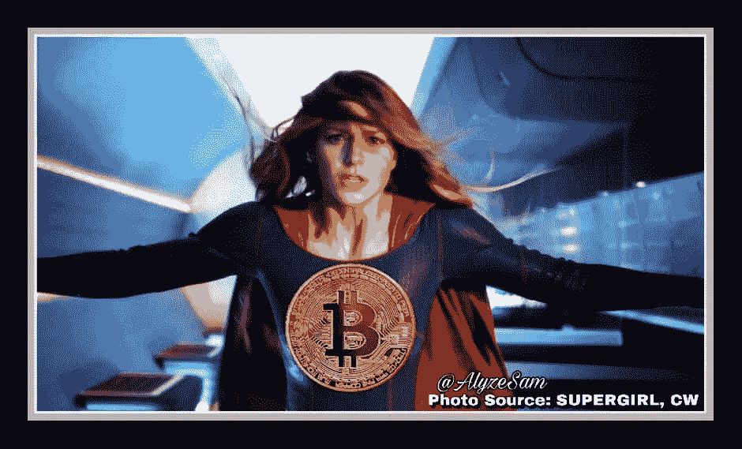
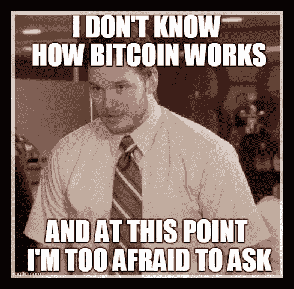
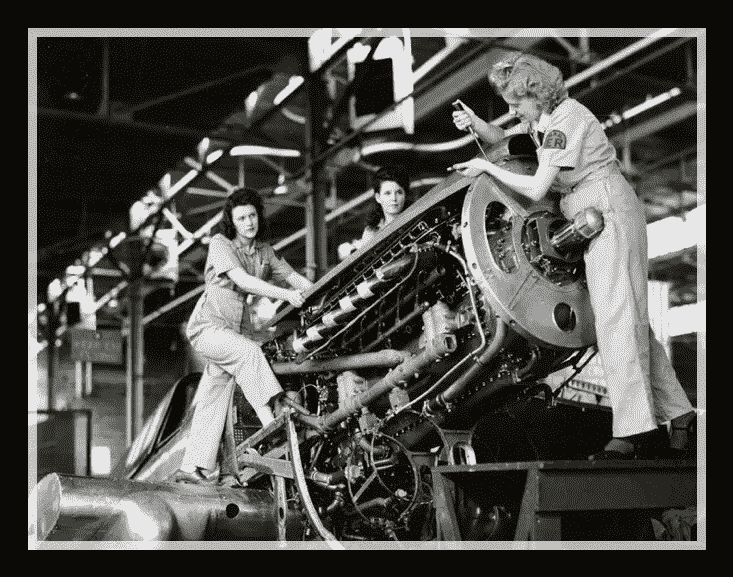

# 我的区块链小姐都在哪里，在？

> 原文：<https://medium.com/hackernoon/where-are-all-my-blockchain-ladies-at-76ea978f6cac>

(ICO 的过去任务)

[Photo Source](https://cryptocoin.news/news/30-of-the-most-innovative-and-exciting-women-to-watch-for-blockchain-and-crypto-insights-5200/amp/)

每天早上我都和我的 ***区块链姐妹们一起享用早咖啡。*** 我们欢笑，分享，哭泣，传递积极的模因，就像“**老板宝贝**”一样，我们就是！(# ***少女时代*** )

在一个独特的周日，在吃早午餐时，我们几个人分享了我们每天的肯定话语，但我们决定变得比平时更有哲理。那个周末，我扮演“记者”，因为我要求强调区块链女性面临的问题。我不是一个真正的万事通，所以我问了真正的专家们的意见。

我很难过，因为 crypto 中一些最知名的名字有着令人惊讶的答案。所有成功的技术女孩、我的朋友和我都在思考为什么我们的领域需要更多女性，我们的头脑风暴让我们所有人都感到沮丧。

***没有方向。导游很少，很少甚至没有导师，并且非常需要优秀的女性领导者。***

# 有什么大惊小怪的？

《福布斯》杂志去年写了 10 多篇关于金融科技领域缺乏女性的文章，很容易通过谷歌快速搜索找到。“区块链的女人”似乎是最近密码社区中的另一个短语，用来推动各地成千上万次峰会的门票！为什么？

*   区块链对女人来说是什么？
*   为什么女人会想参与进来？
*   为什么人们一直说他们的参与不利于成长？

老实说，我最喜欢的硅谷小妞 Tam Sanchez 说得很好，“我之所以涉足区块链科技和加密，是因为我认为这是赋予女性权力的一种方式。”

为什么授权？**那很简单**！Tam 让我回想起我学习如何在[我经常不得不提醒自己，在花了 30 多年的时间，给一个随机的陌生人我的社会安全号码后，为什么我需要记住 583 个单词来访问我想象中的钱。我把钱交给他们后，他们向我收费，我会打电话问他们在我名下的超级秘密账本上有多少钱，祈祷他们没有技术困难。现在你要我相信一台电脑？！他们总是责怪电脑！！！！](https://medium.com/u/cbf746b5126f# shehasjokes！).</em>
</blockquote>

</blockquote>

</blockquote>

</blockquote>

</blockquote>

</blockquote>

</blockquote>

</blockquote>

</blockquote>

</blockquote>

</blockquote>

</blockquote>

</blockquote>

</blockquote>

</blockquote><p id=)

[Photo Source](http://explorepahistory.com/displayimage.php?imgId=1-2-EDE)

# 最后

我最亲爱的密码爱好者；我用@JanGupta 作为结束语，因为我没有更好的词。“*山姆，对我来说，区块链为我们提供了一个机会，让我们重新定义所有衡量我们自己和彼此的标准，这个过程颠覆了束缚人类创造力的模式。”*

这需要一些工作，但我们可以使用区块链技术来重新定义许多事情。我们可以一起继续探索和寻找多种解决方案，吸引更多女性加入科技行业。

## 只有女性(和男性)共同努力的集体力量才能让世界变得更好。

非常感谢！

