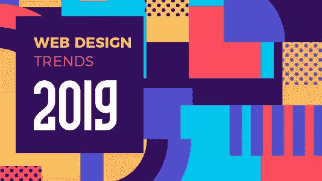
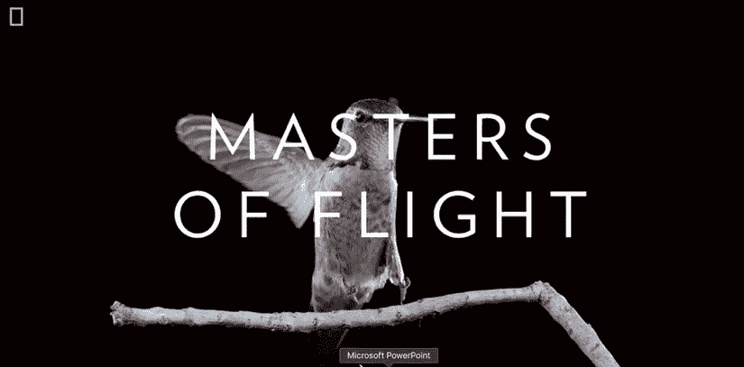
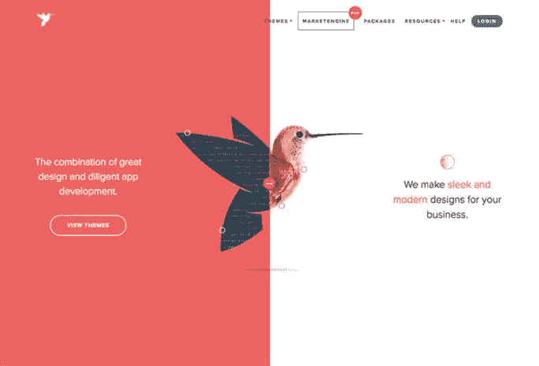
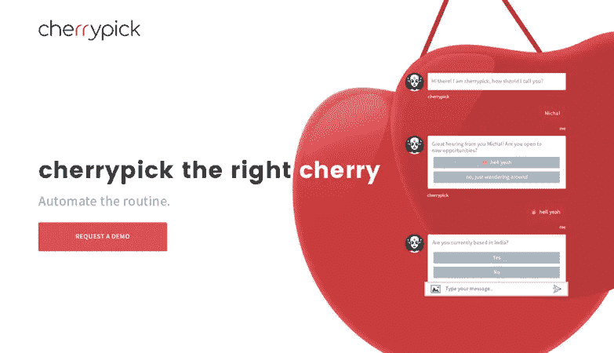
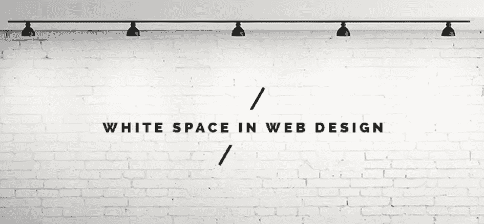
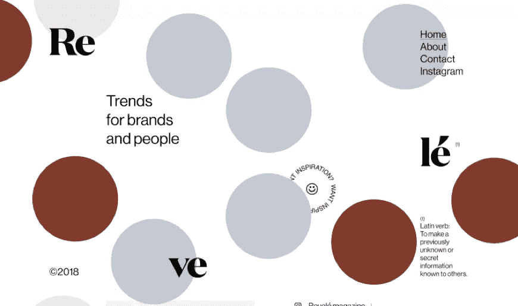
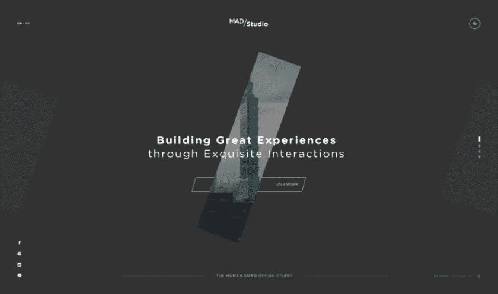
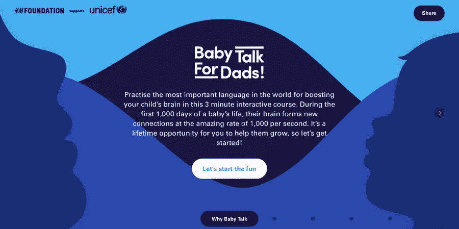
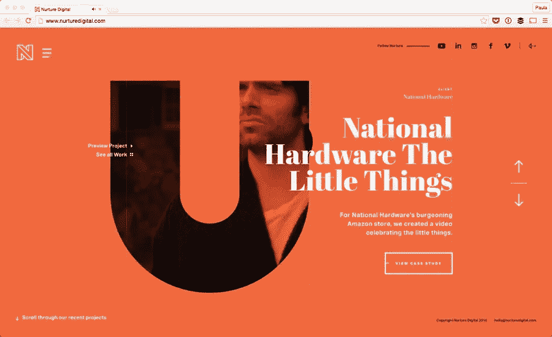

# 2019 年网页设计的发展方向

> 原文：<https://medium.com/hackernoon/where-web-designing-is-going-in-2019-a12c6ac59441>

W eb 设计已经转向 rife 设计，包括从布局到颜色、空白到排版的一切选择，以及这两者之间的一切——2019 年的网络设计趋势中没有任何设计元素可能被遗漏。

2019 年网页设计将成为趋势:

1.动画 gif

2.视差滚动

3.对话机器人和机器学习

4.破碎的网格和不对称的布局

5.空格

6.重叠设计元素

7.有机造型的使用趋势

8.印刷术的独特性和创造性

# 1.**动画 gif**

动画一直被用作用户界面设计的空灵效果，反过来打破了对称设计的网格，为网站增添了活力。

动画总是在设计中提供独特性和交互性，这使得元素脱颖而出，提供视觉愉悦，用户参与，并通过上下文帮助鼓励交互。

动画的不同用法在网站可视化中增加了不同的效果，无论是圆圈中的图像，图像中的旧黄金效果，还是绘图中的阴影光线效果，图像的旋转视图每一点的过渡都是吸引用户眼球的网站设计视觉效果。

Animated GIFs Website

Via 国家地理

# 2.视差滚动

网页设计中使用的特殊滚动技术视差正在打破模块化网格系统。它创建了一个 3D 效果，就像在网站上滚动一样，因为看起来背景图像比前景图像移动得慢。

视差滚动使用了一种微妙的实现方式，在标题排版上吸引了更多的注意力，并让用户深入到页面的内容中。

Parallax Scrolling Website

Via 设计师杂志

# 3.对话机器人和机器学习

具有人工智能趋势的网站也见证了同样的设计模式，让用户通过听觉或文本方式进行对话。

谷歌的自动建议或对用户的即时响应提高了效率和节省时间的转换，网站设计者已经在网站中加入了这一概念，使其易于获取信息。

Artificial Intelligence Website

通过 cherrypick

# 4.空格

白色空间作为一种有效的设计工具已经使用了几十年。留白是留在元素之间的画布空间，防止设计过于杂乱或混乱。它有时指的是负空间，页面上没有标记的部分。在设计术语中，它意味着页边空白、文本、栏和页面中其他元素之间的空间。

留白使网站设计看起来更加动态、活跃和优雅，强调结构和元素的自由，因为它不是指空白空间，而是指栏、文本、图像和其他元素之间的空间。

White Space Website

通过 psd2html

# 5.破碎的网格和不对称的布局

网格的使用是为了保持对称，并把页面分成相应的部分。但破碎的网格和不对称的布局是网站设计师展示设计创意和自由的新趋势。

网格将页面划分为行和列，使其具有对称的外观。破碎的网格使页面看起来不那么僵硬，使其引人注目，这在未来一年中会越来越频繁地使用。

Asymmetrical Layouts Website

Via StudioRevele

# 6.重叠设计元素

I 文字或图标重叠(通常不会相互接触)的图案在网站设计中创造了一种分层效果，是打破网格的最流行的设计之一，赋予了 UI 元素深度的外观。

当顶层与网格的指引重叠时，深度和层间的分离感出现，增强了场地的整体美感。重叠必须以这样一种方式来完成，即保持 UI 元素的设计和网格设计的独特性。

Overlapping Website Design

Via mad-studio

# 7.有机造型的使用趋势

O 有机体的形状是不规则和不均匀的，因为它们不受模式或精确尺寸的控制。这些图像是在自然界中发现的形状，具有随机性和自由性，为网站提供了一种创造性的设计方法。

网站设计者利用有机形状的流动、柔软和平静的特性，以更加手绘和人性化的外观展示设计。这给人一种个人的感觉，并通过图像的深度说明吸引用户的注意力。

Organic Shape Website

通过给爸爸的婴儿谈话

# 7.印刷术的独特性和创造性

提高可用性和优化易读性设计是网页设计的永恒趋势和核心基础。一个显著的和迷人的体验是通过交互式排版以它自己设计的方式讲述一个网站的故事来实现的。

字体设计通过使用不同的字体、样式、页边距、间距对齐、行高来打破网格，让你保持设计结构。

Typography Website

Via Nurture Digital

# 作者简介

由 [Sandeep Mehta](https://www.sandeepmehta.co.in/) 网站设计师撰写的上述文章简要展示了他在上述领域的整个旅程中获得的技能和经验。我有 5 年的网站设计经验，我的技能是 PHP，HTML，CSS，Javascript，XML。