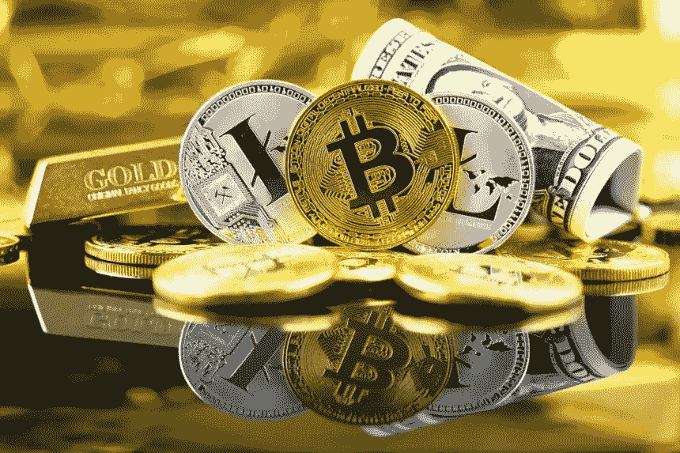

# 2019 年及以后的加密货币

> 原文：<https://medium.com/hackernoon/which-cryptocurrencies-should-you-hold-for-2019-and-beyond-c6c2b169aeb6>

## 随着加密货币市场数月来首次显示出增长迹象，现在是购买一些新硬币/代币或增加现有硬币/代币的好时机。但是，有超过 1200 个可用，2019 年你应该持有哪些？

现在是进入加密空间的激动人心的时刻，因为有许多负担得起的选择。然而，目前 Coinmarketcap 上至少有 1200 种不同类型的硬币。哪些会占上风？哪组硬币会长期存在？2019 年你应该拥有什么样的硬币/代币？

这些都是棘手的问题，因为我们只能推测。显然，区块链技术将会长期存在，并且在不久的将来会越来越多地被使用。但是很难知道一年后哪些硬币/代币还能使用。

从现在起一年后，在评估不同硬币的未来时，你应该尽可能地着眼于大局。我的方法是首先考虑哪些类型或组别的硬币有可能在不久的将来被采用。例如，我认为隐私硬币是未来采用的可靠赌注。另一组值得关注的硬币是那些涉及社交媒体和区块链技术整合的硬币。这种桥接项目——将传统技术与区块链和加密货币连接起来的项目——将在不久的将来成为区块链采用的重要驱动力。

带着这些想法，下面是 2019 年值得关注的一些加密货币。

## 以太坊

毫无疑问，以太坊仍将是 2019 年的一个替代硬币。ETH 已经成为低费用和快速交易的新标准。目前也有如此多的基于以太坊网络的 ERC20 代币，在可预见的未来它将会蓬勃发展。ETH 是任何加密投资者都应该考虑在 2019 年拥有的东西。

*购买 ETH on***或* [*Kucoin*](https://bit.ly/2uhEX0V)*

## *隐私币*

*出于实际和政治原因，隐私币在加密货币领域很受欢迎。实际上，许多人喜欢能够在不受国家或私人公司监视的情况下私下交易的想法。在政治上，许多加密货币爱好者反对国家干预我们的个人生活，并支持破坏这种权力或使其更难应用的项目。*

*如果你对隐私币感兴趣，我推荐 XMR 或 PIVX。这两个都是已经存在了一段时间的强大项目。对于新的东西，你也可以看看 XSPEC，因为如果它能实现它的提议，它将比其他人处于另一个水平。*

**在* [*上购买 XMR 和 PIVX【币安】*](https://bit.ly/2EqGqdZ) *或* [*Kucoin*](https://bit.ly/2uhEX0V)*

**在*[*live coin*](https://livecoin.net/?from=Livecoin-tzCtyXnV)上购买 XSPEC*

## *社交媒体整合和货币化*

*有可能立即采用区块链的一个领域是那些试图将现有技术与区块链联系起来的项目。在这方面有很大发展的一个领域是社交媒体整合和货币化。在这方面，我认为最好的项目是 TRX，它最近收购了 BitTorrent 和 KIN。*

**购买 TRX*[*币安*](https://bit.ly/2EqGqdZ) *或* [*Kucoin*](https://bit.ly/2uhEX0V)*

**在* [*Fatbtc*](https://www.fatbtc.com/) 上购买 KIN*

## *投资新连锁店*

*虽然以太坊和比特币是最著名的区块链，但也有一些新的竞争对手。其中一些正在努力比 BTC 和瑞士联邦理工学院更快更有效。其他公司则根据特定的使用案例(如高度监管的市场)来定制他们的链。如果你有兴趣投资新的连锁店，多看看 ITC(也称为“中国的 IOTA”)、IOTA、EOS 和 ADA。*

**买 EOS 和 ITC 上* [*Kucoin*](https://bit.ly/2uhEX0V)*

**买 IOTA 和 ADA 上* [*币安*](https://bit.ly/2EqGqdZ)*

## *试图取代法定货币的硬币*

*区块链技术的第一个用例是通过使用加密货币执行分散的金融交易。比特币是第一种为此目的设计的加密货币，但自问世以来，其他几种硬币也已开发出来，它们也有望取代传统的基于国家的“法定”货币。如果你对区块链的这个用例感兴趣，考虑一下 XRP，它也在试图取代菲亚特。*

**买 XRP 上* [*币安上*](https://bit.ly/2EqGqdZ)*

## *交易算法*

*随着加密货币交易的普及，越来越多的人希望通过日益复杂的交易策略来实现利润最大化。鉴于加密货币价格目前难以置信的波动性，许多日间交易者利用编程的交易算法来跟踪市场趋势，并在预设的情况下进行交易，从而获利。如果你对交易算法和辅助交易感兴趣，你可以多看看 COV(或 COVX，取决于交易所和 CND。*

**在* [*上购买 COV*](https://bit.ly/2uhEX0V)*

**购买来电显示于* [*币安*](https://bit.ly/2EqGqdZ)*

## *实用令牌*

*如果你对基于区块链技术的各种应用感兴趣，你可能会考虑研究实用硬币。公用设施令牌在特定应用程序中使用，通常用于访问公司的产品或服务。如果你对公用令牌感兴趣，我推荐你去看看 THETA 和 TEL，因为它们在未来都有很好的潜力。*

**买 THETA 上* [*币安*](https://bit.ly/2EqGqdZ)*

**在* [*上购买电话*](https://bit.ly/2uhEX0V)*

## *交易所专用硬币*

*许多人预测，加密冬天将在 2019 年结束。如果这种情况发生，这意味着许多曾暂停交易的狂热分子会回来。这也意味着新的交易者将进入加密货币领域。出于这些原因，我认为 2019 年一个有趣的投资是交易所专用硬币。这些硬币在特定的交易平台中用来支付费用。许多交易所都有自己的标志，但我建议今年看看币安的 BNB 和库科恩的 KCS。*

**买 KCS 上* [*币安上*](https://bit.ly/2EqGqdZ)*

**购买 BNB 上* [*Kucoin*](https://bit.ly/2uhEX0V)*

## *结论*

*2019 年还有很多其他硬币和代币值得一看。我提到的几个并没有完全列举出来。尽管如此，我的目标是提供一些有用的起点，使研究你自己的投资更容易。祝你好运！*

**订阅我的* [*中*](/@minadown) *和* [*推特*](https://twitter.com/minad21) *频道如果你想了解更多关于区块链和加密货币项目的信息，

如果您对本文有任何疑问，请在下面的部分发表评论。谢谢大家！**