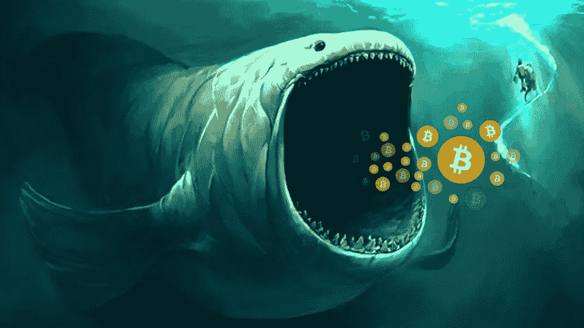

# 谁是加密货币巨鲸&他们如何影响硬币市场

> 原文：<https://medium.com/hackernoon/who-are-the-cryptocurrency-whales-how-they-affect-to-the-coin-market-a42d2291cbe3>

Designed by LUKRUM

在比特币的世界里，有机构投资者，也有鲸鱼。高盛(Goldman Sachs)等机构投资者正成为重要的加密投资者，但自数字货币(尤其是比特币)诞生以来，鲸鱼就一直存在。但是他们是谁？鲸鱼的比喻很好——这些是 BTC 最大的霍德勒(比特币的持有者)，他们中的大多数不时浮出水面。

最著名的鲸鱼是你不太可能看到的，或者至少即使看到也不知道。这个人就是中本聪，他发明了现代加密货币，并于 2009 年 1 月 3 日开采出第一枚比特币。因为我们可以确定哪些钱包可以存放他挖掘的比特币，所以我们可以估计 Satoshi 拥有大约 100 万枚比特币，尽管他持有的全部数量不得而知。这些钱包的任何交易活动都会在整个密码社区引起轰动，因为他的真实身份是猜测的对象。

在光谱的另一端，文克莱沃斯双胞胎泰勒和卡梅隆生活在聚光灯下，通过他们备受尊敬的双子座加密货币交易所，专门为机构投资者进行数字货币交易，包括比特币和比特币。他们可能是最著名的加密投资者，特别是在 2013 年起诉马克·扎克伯格和脸书成功后购买了 1100 万美元的比特币。据估计，文克莱沃斯双胞胎一度拥有所有比特币的 1%。

并非所有的鲸鱼都是个体。潘迪拉资本成立于 2013 年，是美国第一家比特币投资公司。潘迪拉资本投资于[【区块链】和数字资产相关公司的授权来自其创始人丹·莫尔黑德，他也是加密货币交易所 Bitstamp 的董事会成员，CME 使用该交易所获取比特币和替代比特币的现货价格。](https://hackernoon.com/tagged/blockchain)

当比特币价格大幅下跌时，尤其是在确定下跌原因之前，鲸鱼会被特别频繁地提及。不管真假，鲸鱼也经常被指控操纵市场。因为数字空间的市值仍然相对较小，加密货币交易所的大规模移动将使市场大幅下跌。然而，市场的相对流动性是机构投资者经常通过场外交易(OTC)从鲸鱼手中购买数字货币的原因。这样，双方可以在不影响整个市场的情况下就价格进行谈判。

**你已经用过卢克拉姆了吗？**

最人性化的加密货币投资组合管理器。该应用程序允许与所有 exchange 帐户或区块链钱包自动同步，以跟踪数字资产。开始使用免费的&安全应用程序进行交叉投资组合分析&了解最有利可图的策略。 *LUKRUM 让管理您的加密资产变得简单而安全。*

我们很高兴听到您的任何反馈或意见，以改善应用程序，让您的生活更轻松。因此，请随时通过以下任何渠道联系，包括[电报](https://t.me/LUKRUMapp)、[推特](https://twitter.com/LUKRUM_app) & [脸书](https://www.facebook.com/LUKRUMapp)。

