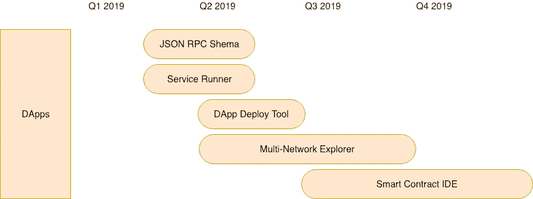

# “谁来搭建积木？”

> 原文：<https://medium.com/hackernoon/who-builds-the-building-blocks-9e358d5e0753>

## 跨分散组织实现工具和程序的现代化

Photo by [Chris Gray](https://unsplash.com/@hourglassdev?utm_source=medium&utm_medium=referral) on [Unsplash](https://unsplash.com?utm_source=medium&utm_medium=referral)

# TLDR 版本

以太坊经典实验室核心(ECLC)团队[最近创建了 OpenRPC 规范](https://github.com/open-rpc/spec)，旨在改进所有区块链 dapp 开发。该规范模拟 OpenAPI，open API 是一种成功的、广泛采用的 REST APIs 规范。通过启动这一计划，开发人员将能够节省手动编写代码的时间，并通过消除对支持哪些服务和功能的猜测而进行更好的组织间交流。**这不仅仅是针对 ETC 或 ETH 的，这是一个可以改善所有区块链开发的规范。**

> OpenRPC 规范为[JSON-RPC 2.0 API](https://www.jsonrpc.org/specification)定义了一个标准的、与编程语言无关的接口描述，它允许人类和计算机发现和理解服务的能力，而不需要访问源代码、额外的文档或检查网络流量。当通过 OpenRPC 正确定义时，消费者可以用最少的实现逻辑理解远程服务并与之交互。与接口描述为低级编程所做的类似，OpenRPC 规范消除了调用服务时的猜测。

虽然这是由 ECLC 创造的，但其影响应该贯穿于区块链 dApp 的发展。

这篇 Twitter 帖子总结得最好:

# Parlez-Vous 区块链？

## 不可阻挡的代码。不可审查的消息。不兼容的协议

当然，我们都喜欢在没有人负责所有事情的情况下建造东西的想法。这些系统的好处是一个新版本的自由，我们都还在思考，但是它的缺点已经在建设中被感觉到了。开发人员使用的工具和协议没有标准化，这导致在试图组织全球生态系统时不可避免的复杂化，这些生态系统应该最终在没有任何人类干预的情况下工作。

Photo by [Paul Green](https://unsplash.com/@pgreen1983?utm_source=medium&utm_medium=referral) on [Unsplash](https://unsplash.com?utm_source=medium&utm_medium=referral)

JSON-RPC 是区块链客户端和服务器用来通信的事实上的数据交换协议。尽管大多数现代框架依赖于 RESTful API，但“RPC 更适合，因为它简单、快速，并且与通信通道无关。”ECLC 开发商谢恩·乔纳斯说

就以太坊而言，大多数开发人员使用 Web3，这是 JSON-RPC 的 javascript 包装器。这样做的好处是为不熟悉区块链的开发人员提供了一个非常快速和用户友好的界面，让他们无需太多 RPC 背景知识就可以开始使用。这对于面向广泛的受众来说是非常好的，但是它会导致开发时间变慢，甚至会开始创建过多的不匹配的更新和库。

[谷歌的 API 设计指南](https://cloud.google.com/apis/design/glossary)将*网络 API*定义为:

> 在计算机网络上运行的应用程序编程接口。它们使用包括 HTTP 在内的网络协议进行通信，并且**通常由不同的组织产生，而不是由消费它们的组织产生**。

随着我们继续建设，不同的组织会变得不同步。这是一个**与你自己的**之外的系统交互的问题，不可避免地，这将成为我们建立能够相互合作的分散系统的集体目标的障碍。通过为 RPC(几乎每个区块链都使用它)创建规范的定义， **ECLC 创造了整个生态系统需要的东西。**

Photo by [Ilya Pavlov](https://unsplash.com/@ilyapavlov?utm_source=medium&utm_medium=referral) on [Unsplash](https://unsplash.com?utm_source=medium&utm_medium=referral)

# OpenAPI 为 API 描述的采用设定了标准

这不是一个新的、新奇的想法。OpenAPI 是 REST APIs 最常用的规范，它受到了广泛的欢迎，现在得到了 Linux 基金会(包括 Google)的支持，这证明了拥有这种全球一致同意的协议的重要性。

> OpenAPI 规范并不是第一个 API 描述格式，但是到目前为止它是使用最广泛的。在我们有 API 描述格式之前，人们手工为他们的 API 编写代码。然后他们手写这些 API 的描述，并把它们交给想要使用这些 API 的人，这些人然后手写代码来调用这些 API。所有这些手写导致了很多变化和错误。作为一种正式的描述格式，OpenAPI 为我们提供了一种很好的方式来交流 API，并在我们基于 API 的系统中有更少的错误和更多的成功

OpenRPC 规范建立在与 OpenAPI 相同的理念和方法之上

# 好处

*   自动更新
*   高质量
*   工具作业
*   已知服务

There’s more than just a specification….

# 下一步是什么

ECLC 团队设计的路线图表明，这只是构建更好的 JSON-RPC 框架的第一步。

> **JSON RPC Schema ~ Q1—Q2 2019:**创建 ECLIP，从 Classic-Geth 和 Multi-Geth 自动生成 JSON Schema。这将降低与图书馆相关的运营成本。这一改进将通过消除对 Web3 或 Emerald JS 等 RPC APIs 的需求，使 DApp 开发环境更加高效。

# 更多关于 JSON-RPC 和 API 的资源

 [## 开放式-RPC/规格

### 开放 RPC 规范库。在 GitHub 上创建一个帐户，为 open-rpc/spec 开发做贡献。

github.com](https://github.com/open-rpc/spec)  [## 主页——open API 倡议

### 2019 OpenAPI 倡议。版权所有 2016 Linux 基金会。保留所有权利。Linux 基金会有…

www.openapis.org](https://www.openapis.org)  [## shanejonas/awesome-json-rpc

### JSON-RPC 资源的精选列表。在…上创建一个帐户，为 shanejonas/awesome-json-rpc 开发做贡献

github.com](https://github.com/shanejonas/awesome-json-rpc)  [## asyncapi/asyncapi

### AsyncAPI 规范允许您创建机器可读的异步 API 定义。…

github.com](https://github.com/asyncapi/asyncapi)  [## twitchtv/twirp

### 带有 protobuf 服务定义的简单 RPC 框架——twitchv/twirp

github.com](https://github.com/twitchtv/twirp)  [## GraphQL:一种 API 查询语言。

### GraphQL 在您的 API 中提供了完整的数据描述，使客户能够准确地要求他们…

graphql.org](https://graphql.org/)  [## REST vs JSON-RPC？

### 我试图在 REST 和 JSON-RPC 之间做出选择，为 web 应用程序开发 API。哪个更好用…

stackoverflow.com](https://stackoverflow.com/questions/15056878/rest-vs-json-rpc) 

**你可以在这里** 阅读我们的完整路线图和简介

**以太坊经典实验室的任务是加速以太坊经典社区&生态系统的发展。这将通过为以太坊经典开发提供一套产品，并支持基于以太坊经典的项目获得启动专业知识和资金来实现。我们的工程师团队多年来一直致力于以太坊经典项目，并处于以太坊经典开发的最前沿。凭借指导初创企业的悠久历史和我们尖端的核心开发团队，我们很自豪能够打造以太坊经典区块链的未来。**

****对更多地参与 ETC 感兴趣？我们致力于加速以太坊经典的开发，需要您的帮助！请联系我们，看看您今天如何能更多地参与进来！****

****我们的团队链接:**[**Github**](https://github.com/etclabscore)**，** [**中**](https://medium.com/etclabscore) **，** [**推特**](https://twitter.com/etclabscore)**

****来和我们一起聊聊** [**不和**](https://discordapp.com/invite/NgzMPaj)**

*****现在就申请 ETC 实验室加速器吧！*****

**ETC 实验室今年夏天将在旧金山举办第二次群组加速器！申请截止到 5 月 1 日。在 https://etclabs.org 了解更多信息**