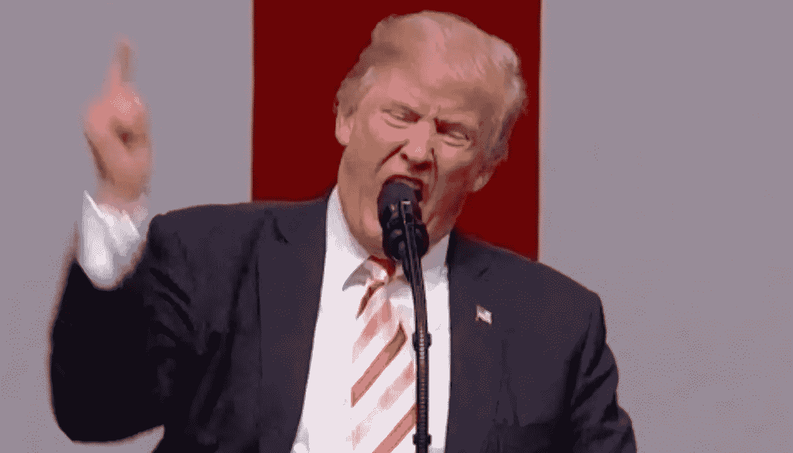
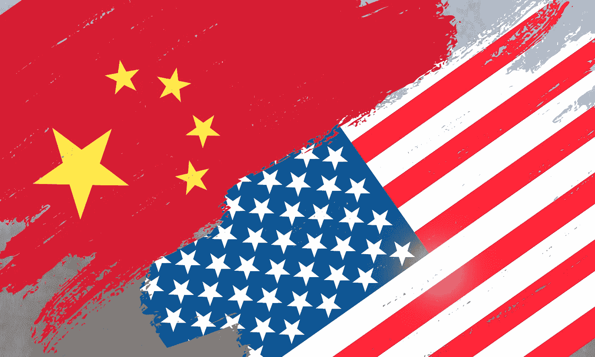

# 谁能阻止你买华为？

> 原文：<https://medium.com/hackernoon/who-can-prevent-you-from-buying-huawei-701f98f56973>

华为的情况——让我简单解释一下。中美之间的贸易战始于特朗普政府的决定。中国试图以友好的方式化解紧张局势。所以华为跟着中国友好的方式。除了这场贸易战，所有的贸易市场都存在显著的波动。

欧元区和亚洲贸易市场已经承受了太多的贸易增长、创新和生产率风险。中国从欧元区和亚洲进口。美国正在阻止中国所做的一切努力。

谷歌是一个丰富的话题:Android 是该公司的工具。如果安卓是开源的，为什么谷歌关于华为的宣言会让别人担心？由于政治试图控制技术，人们不会购买被禁止的产品。谁能评判华为或者其他公司呢？消费者和开发者可以决定产品的命运。无论是特朗普政府，还是中国有趣的政府，都无法决定消费者的选择。所有人都知道民主已经死亡。如果我想买一部智能手机，没有人能阻止我的决定。我不会因为川普而买贵的苹果 iPhone。

如果消费者不买这个产品，华为就完了。另一方面，任何政府或独裁者都无法决定。这是我们的决定。