# 谁是 Satoshi？比特币采访合集

> 原文：<https://medium.com/hackernoon/who-is-satoshi-a-collection-of-bitcoin-interviews-def08f8dc35>

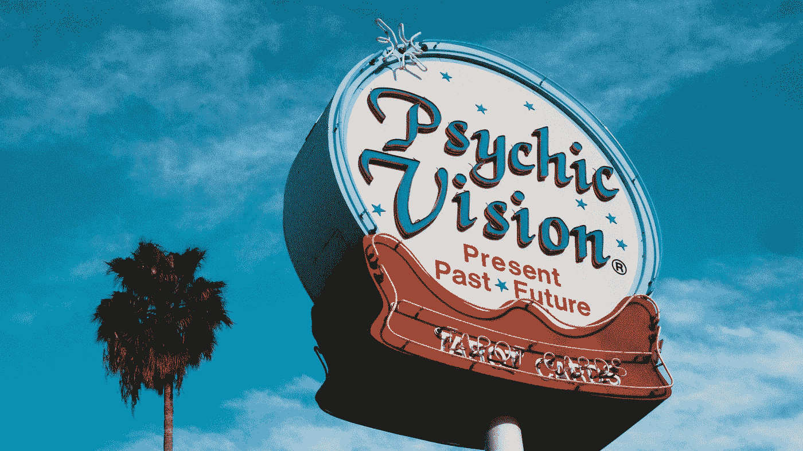

以下三段对话代表了区块链行业中一些最有影响力的人物的丰富知识。

Arianna Simpson 提供了一些风险投资前沿的专家评论，Peter Todd 分析了[比特币](https://hackernoon.com/tagged/bitcoin)的技术背景，Tone Vays 提供了食肉动物饮食的第一手资料(以及其他一些见解)。

# [安全性、风险资本主义和加密的宏观趋势:与 Arianna Simpson 的对话](https://btcmanager.com/security-venture-capitalism-and-macro-trends-in-crypto-a-conversation-with-arianna-simpson/)

如果你没有听说过 [**阿里安娜·辛普森**](http://www.ariannasimpson.com/) **，那么很有可能你刚刚加入加密世界。这位**[**BitGo**](https://www.bitgo.com/)**PM 出身的风险投资家从 2012 年开始涉足这一领域，在这个隐秘的年代，这足以巩固一个人的可信度。辛普森自从六年前阅读了** [**聪的白皮书**](https://bitcoin.org/bitcoin.pdf) **后，与** [**詹姆森·洛普**](https://lopp.net/) **共事，经历了熊市和牛市，现在正式投资太空。所以，如果你只是加入谈话，只有几个更好的地方开始。**

2018 年 4 月 23 日， *BTCManager* 采访了辛普森，稍微谈了一下她与[比特币](https://bitcoin.org/)的开始，以及她在上述加密安全公司的工作。现在，她帮助管理一家专注于技术的开放式投资基金 [Crystal Towers Capital](https://www.crunchbase.com/organization/crystal-towers) ，以及她自己的 Autonomous Partners，一家专门投资于虚拟货币和该领域区块链项目的加密基金。中间发生了很多事情，这让辛普森在这个领域的顶级女声中赢得了一席之地，但也许她解释其余部分是最好的。

## 你能告诉我们一点你是如何开始的吗？你在脸书，然后开始投资比特币，这有什么原因吗？这两件事有关联吗？

不完全是，我对这个领域的兴趣真正起源于 2013 年我去津巴布韦的一次旅行。我花了一些时间在 T2、南非和津巴布韦旅行，在津巴布韦经历了最严重的恶性通货膨胀。他们转而使用美元来稳定经济，但是他们仍然面临着许多经济问题。当我回到美国时。

我思考了很多关于替代金融系统的问题，以及在一个腐败的中央政府无法控制所有货币政策和交换手段的世界里，可能会发生什么。当我的一个朋友向我介绍[比特币](http://bitcoin.org/)白皮书时，我脑海中的一切都豁然开朗了。

那时，我正在脸书工作，但我认为该公司实际上在采用任何与加密货币或比特币相关的东西方面进展相当缓慢。最终，全职进入这个行业对我来说是有意义的，因为我开始写博客，并就这个主题做了大量的发言。结果是，我对加密货币的思考比我的实际工作多得多。

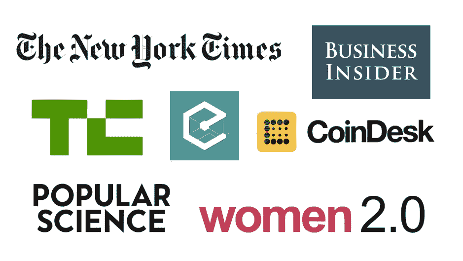

Source: [*AriannaSimpson.com*](https://www.ariannasimpson.com/#press-and-speaking)

## 从那里你开始和 BitGo 一起工作。你已经和那里的人有联系了吗？

不完全是。[本·达文波特](https://twitter.com/bendavenport?lang=en),[ BitGo]的联合创始人之一也曾在脸书工作，但我们并不真正了解对方，因为他在门洛帕克办公室，而我在纽约工作。

实际上，我写了一篇关于多签名的博文，BitGo 是第一家将多签名钱包商业化的公司，我在博文中提到了它们。我把它发给他们，觉得如果他们想把它发表在博客上或者查看一下，可能会很有趣。然后他们告诉我，“嘿，这太棒了，你为什么不来聊聊呢，”于是一件事接着一件事，他们邀请我加入。

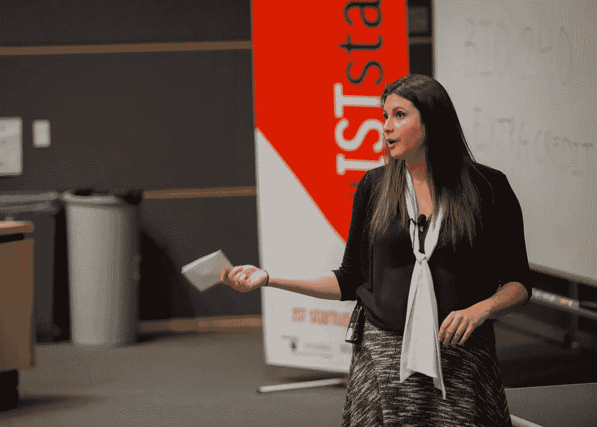

Source: [*Penn State*](http://news.psu.edu/story/353481/2015/04/16/heard-campus-arianna-simpson-bitgo)

## 既然你不再与 BitGo 合作，你是否注意到该公司的工作重心发生了变化？

BitGo 一直致力于为企业技术客户提供非常安全的解决方案。我认为有一件事已经改变了，那就是市场。当我在 BitGo 工作的时候，该公司采用的是 AUN 模式，在比特币价值 200 或 300 美元的时候，这显然是一种难以维持的定价模式。

由于价格大幅上涨，这种商业模式现在变得更加可行，我知道该公司经营得非常好。所以，这是一个变化，但它与公司的所作所为没有任何关系，只是市场方面的一个转变。

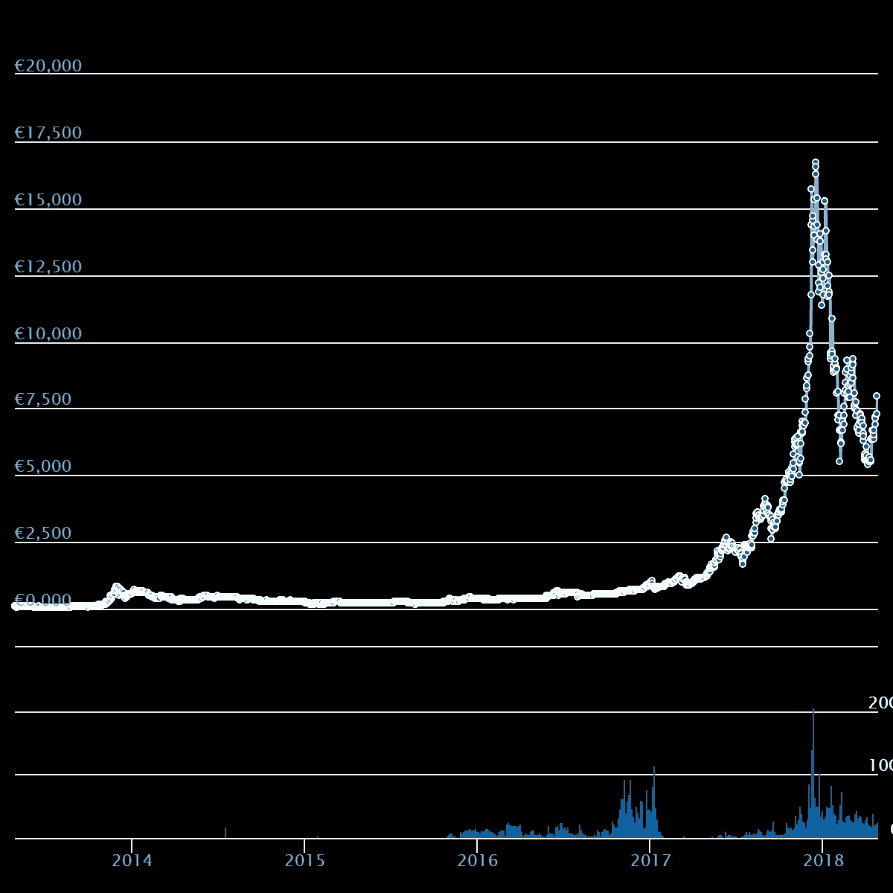

Source: [*CoinGecko*](https://www.coingecko.com/en/coins/bitcoin)

## 基本上，仅仅是持有加密货币的价格就已经使安全性成为更优先的事项，从而使 Bitgo 受益。

是的，没错。即使是同样数量的客户，对公司来说利润也要高得多。交易所、基金、很快机构投资者的兴趣越来越大，人们开始直接持有硬币(而不是投资于公司或 ETF)。

## 这正在成为 2018 年和 2017 年底的一个主题，但你认为机构投资者很快会有更正式的进入，还是你认为这只是空话？例如，像[蒂姆·德雷珀](https://btcmanager.com/american-investor-tim-draper-predicts-bitcoin-to-hit-250000-by-2022/)这样的人，渴望说出“比特币将在几年内达到 25 万美元”这样的话，我想知道你是否认为机构投资者的到来是合法的，并将很快发生？

不，我认为这真的会发生。我不喜欢做具体的价格预测，因为我认为这是一件很难做对的事情。我要说的是，机构投资者，甚至是政府的兴趣水平只会随着时间的推移而增加。

如果你只是考虑比特币的供应有限而需求总体上不断增长的事实，显然这是价格上涨的好兆头，但很难预测具体的价格点，特别是在有限的时间内。我们仍在处理一些非常不稳定的事情，但我仍然认为总的趋势是“上升”，否则我不会花所有的时间做这件事。

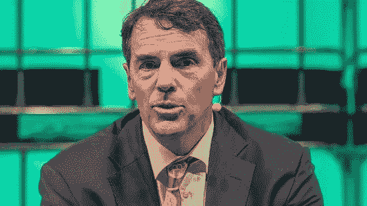

Source:[*CNBC*](https://www.cnbc.com/2018/04/11/tech-investor-tim-draper-defends-zuckerberg-this-guy-is-a-hero.html)

## 此外，[比特币基地](https://btcmanager.com/?s=coinbase)最近让维基解密和其他一些网站转向托管服务之类的，我想知道你是否认为比特币基地将继续成为机构投资者最可靠的用户友好型网站？或者你认为会出现另一家公司，做得更好，更开放？

比特币基地已经宣布了他们的机构托管产品，我认为他们可能会做得很好，因为他们在这个领域有如此强大的品牌。不过，我认为，我们需要一个以上的提供商，我不认为这是一件坏事，这些都是市场扩张，因为总体而言，拥有加密货币的机构(甚至个人)的总数非常低，我认为所有这些都是该领域的净利好。我认为比特币基地会做得很好，但我认为还有其他人成长的空间。

## 回顾一下你从 BitGo 转向风险投资家的经历，你是否发现这种转变也伴随着你对加密货币整体看法的转变？

我认为，作为一名投资者，在这个领域的多个不同领域工作对我来说无疑非常有帮助。第一，我理解公司面临的一些挑战，其方式与我只做投资者时不同，我认为这非常有帮助。这也给了我一定程度的可信度，如果我只是一个投资者，我不会有这种可信度；尽管 2017 年是梦幻般的一年，但之前的几年相当艰难。

2014 年到 2015 年组成了这个漫长的熊市，这是一个在这个行业工作的艰难时期。因此，身处这个领域并亲身感受到这种痛苦，让我获得了一定程度的“街头信誉”，如果我在 2017 年的牛市期间大摇大摆地走进来，这可能会很难。所以这对我也很有帮助。最后，它让我结识了业内的许多人，并在所有宣传之前真正了解了人们，这在许多不同的方面都得到了回报。

## 在[安全](https://btcmanager.com/tag/security/)方面，你认为行业需要重点关注哪些方面？下一步是什么？人们对多 sig 钱包和去中心化交易所[[dex](https://btcmanager.com/?s=Decentralized+exchanges)]相当感兴趣，但还有其他人们需要注意的话题吗？

从广义上讲，密钥管理仍然是一个显而易见的问题，但它仍然不是一个解决的问题，因为即使你使用多签名钱包，也存在一定程度的风险，坦率地说，对大多数人来说，可用性还没有达到可接受的水平。

在安全性和可用性之间有一个权衡，我不认为业界已经找到了正确的折中方案。当然，你可以买一个[气隙机](https://bitcointalk.org/index.php?topic=1647662.0)，你可以用 USB 传输离线钱包软件，然后将离线电脑存储在保险库中，但所有这些都是可用性的主要障碍，超出了大多数用户的能力和/或兴趣。他们会把硬币留在交易所之类的地方，然后变成蜜罐，最后被[黑掉](https://btcmanager.com/bitcoin-exchange-coinsecure-victim-of-3-6-million-theft-through-fault-of-their-cso/)。

最终，真正的问题是我们还没有好的密钥管理解决方案，既易于使用又安全。现在，我认为这是一个将会被解决的问题，但是我们可能还需要几年才能看到它发生。老实说，我不认为我们在过去五年里在这一领域取得了很大进展，因为我个人仍然看到许多与我在 2012 年和 2013 年首次进入该领域时相同的斗争。

## 你认为这归结于关于这是怎么回事的一般教育，还是你认为这与没有用户可以存储他们的密钥的简单易用的产品的事实有更大的关系？

是产品问题。期望大多数人理解密钥管理到目前必要的程度是不现实的，也是不可取的。在大多数主要的技术浪潮中，所发生的是，许多复杂性最终被抽象掉，最终看起来不可能或像魔术一样的事情最终变得司空见惯。这里也是如此，但在某些方面，它只是以相当缓慢的速度前进。

## 你知道目前有哪些公司正在解决这个具体问题吗？

当然是比特哥。他们既有企业产品，也有可供消费者等其他人使用的钱包。有一个 [Casa](https://btcmanager.com/new-casa-bitcoin-cold-storage-wallet-hackers-stand-no-chance/) ，它有一个涉及许多不同人的方案，类似于五个不同的数字钥匙(存储每个顾客的加密货币)。

还有一些公司正在使用多方计算来拆分密钥，以使密钥管理更加安全，并消除单点故障，这与 multi-sig 类似，但在技术层面上并不完全相同。所以，是的，有公司在研究这些问题的解决方案，但我还没有看到一个解决方案，我会说，“好吧，哇，这真的是*it*。”

另一个问题是财务激励并不一致，因为消费者已经一次又一次地表明他们并不特别愿意为软件安全产品付费。当然， [Ledger](https://btcmanager.com/?s=Ledger) 在硬件设备的销售方面取得了令人印象深刻的一年，但我认为硬件设备在消费者购买心理方面有一点不同。尽管如此，我们还是听说有人不断遭到黑客攻击，我们肯定还没有到解决这个问题的阶段。

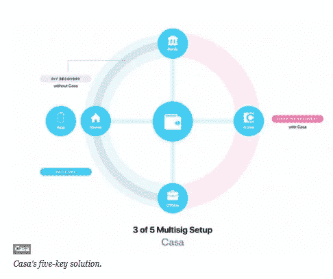

Source: [*Forbes*](https://www.forbes.com/sites/jeffkauflin/2018/03/02/bitcoin-thieves-beware-super-secure-wallet-maker-casa-raises-2-million/#1ca897044230)

## 你说的“消费者购买心理”是什么意思？

消费者已经习惯了不为软件产品付费。几乎没有为安全软件产品付费的动机，问题是，尽管这是一个非常理性的消费决定，比如说每月 10 美元来保护价值 10 万美元的加密货币，但大多数人不会这样做。

这是一种你不希望自己被黑的事情，直到你被黑。这是一项具有挑战性的销售，因为你不是在帮助人们赚更多的钱，你是在保护他们免受可能发生或可能永远不会发生的负面影响。这是让人们在个人基础上为此付费的挑战的一部分。

## 你认为 Ledger 这样的硬件钱包达不到软件产品吗？

不，他们可能是目前最好的解决方案。也许更好的是硬件和软件的结合。例如，BitGo 的多签名钱包允许你将他们的软件产品与他们的账本设备结合使用，这很有趣，因为这样你就有了这个离线生成并保存的密钥，但你仍然有一个多签名方法。

攻击者很难窃取您的硬币。类似这样的东西可能是用户友好和安全的最佳结合。当然，每个人的需求不一样。例如，基于他们需要交易的频率，但是还有其他各种各样的考虑。

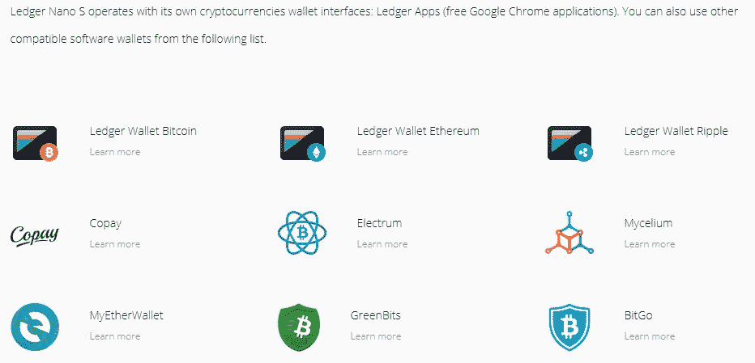

Source: [*Ledger*](https://www.ledgerwallet.com/products/ledger-nano-s)

## 与投资者的角色相比，你是否怀念与 BitGo 这样的团队一起工作，努力开发产品？

不，一点也不。这并没有对 BitGo 或我工作过的任何其他公司造成不良影响，但我刚刚发现，我本质上是一名投资者。许多企业家在职业生涯的某个阶段最终成为投资者，只是因为在作为企业家取得一定程度的成功后，这似乎是许多人遵循的一条自然道路。但说实话，我很高兴我很年轻就开始投资，因为这绝对是我想用余生去做的事情。

不管是好是坏，我花了大量的时间去思考如何分配资本、市场、团队等等，所以对我来说，这是我百分之百想做的事情。我很幸运很早就发现了这一点。[投资](https://btcmanager.com/?s=investing)，对我来说，既是一种孤狼，也是一种非常社会化的活动。

一方面，你可以用一个很小的团队来管理大量的资金，而这种方式你永远也不可能，至少到目前为止，用一个很小的团队来管理一个 500 亿美元的公司，但是你可以用一个很小的团队来管理一个 500 亿美元的基金。这是一种不同于你在公司看到的动态。所以，我经常会见企业家、开发者和这个行业的其他投资者，但另一方面，这也意味着我要花很多时间阅读和研究。最终，对我个人来说，这是一个完美的组合。

## 你在 Crystal Towers Capital 的角色和你在 Autonomous Partners 的角色不同吗？

是的。水晶塔是我和我的合作伙伴[吉洪·伯恩斯塔姆](https://www.bloomberg.com/research/stocks/private/person.asp?personId=51994208&privcapId=138945792)在 2015 年开始建造的。那个基金是早期的通才基金；我们投资了大约 35 家企业，主要是位于旧金山、纽约和洛杉矶的初创科技公司，涉及多个领域。我们做了一些自动驾驶汽车，医疗保健和一些不同的事情。我的第二个基金，我最近的基金 Autonomous，我在 2017 年开始，是百分之百专注于加密的。所以我投资于外汇，但也投资于该领域的公司。

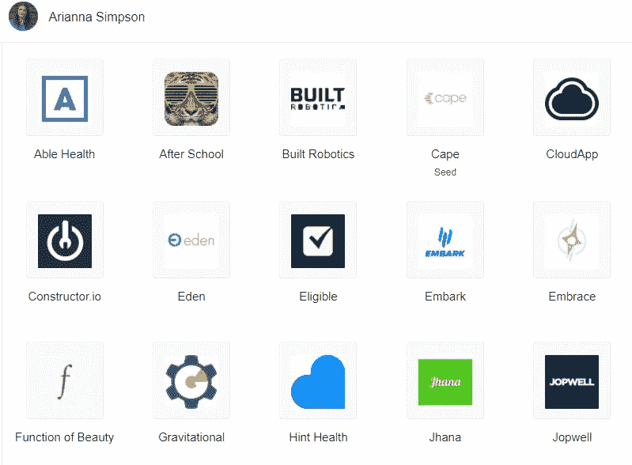

Source: [*Angel List*](https://angel.co/arianna-simpson)

## 比起投资公司或项目，你更倾向于直接投资硬币吗？

他们绝对是非常不同的。很明显，我相信这一领域在许多不同方面都有很大潜力，所以我构建了一些东西，以便能够在外形方面有一定程度的灵活性。一些团队正在筹集股权，其他团队正在筹集 [SAFTs](https://btcmanager.com/?s=SAFT) ，其他团队正在发行没有任何 ICO 的硬币。有很多不同的模型正在被使用，并且仍在被使用。我只是希望能够尽可能多地参与其中，因为在这个特定的时间点上，有许多伟大的团队正在使用许多不同的结构。

## 作为一名投资者，你现在可能对市场的宏观趋势有了更广阔的视角，因此，你对 2018 年或未来几年有什么特别的预期，人们可能会忽略这些预期？

我非常看好基础设施。我们现在所处的周期中，仍然有许多基础设施的基础需要奠定。就像我们讨论过的安全性，还有可伸缩性。因此，真正占主导地位的可扩展[智能合约](https://btcmanager.com/?s=smart+contracts)平台以及交易所基础设施，包括集中式和分散式交易所。基本上，我认为生态系统在真正成为主流之前需要具备的所有基础要素。这就是我花了很多时间看的东西。

## 因为你在美国，你认为这个国家正在成为密码领域的贱民吗？你是否觉得你的工作受到了任何阻碍，或者你是否很少接触到你仅仅从监管角度想接触的项目？

是的，一些团队肯定会决定将他们的公司设在[或者在其他地方推出他们的 ico](https://btcmanager.com/singapore-hong-kong-emerging-worlds-top-crypto-friendly-business-cities/)并且可能只允许非美国投资者。但对我来说，这并不是一个非常重要的问题，因为到目前为止，我已经能够投资我想投资的所有东西。如果这开始成为一个问题，我可能会选择开设一个离岸实体。不过，现在这还不是我最关心的问题。它也可能改变，如果美国变得更加封闭，在它允许的事情的类型方面，那么这可能是一个真正的挑战。

我希望情况不是这样，因为我认为这也是美国帮助推动事情向前发展并保持技术发展主导地位的一个大好机会。然而，我看到的是，伟大的球队来自不同的地方，你可以看到柏林、新加坡或香港。观察监管格局如何演变以及最终会产生多大的影响，将会非常有趣。

## 因为你发现自己实际上不受美国法规的限制，但你也注意到许多其他地方正在变成这些“避风港”这仅仅是由于他们的加密友好的性质，还是有其他因素？

很大一部分肯定与监管有关，但肯定不是全部。瑞士是另一个对加密项目非常友好的地方，你开始看到一个中心出现在楚格，许多团队决定以那里为基地。所以，是的，法规确实对项目迁移的地方有影响。这也是为什么最终任何国家决定完全禁止或让项目很难在他们的管辖范围内落户都是一个非常糟糕的主意的另一个原因。

最终，总会有一个地区变得更加友好，他们将从下一次主要的技术浪潮中获益。如果你看看像纽约州这样的州，例如，拥有[比特许可证](https://btcmanager.com/?s=bitlicense)，我认为这真的是一个非常糟糕的主意，项目并不基于这里。他们搬到新泽西、特拉华、加利福尼亚，他们搬到其他州只是因为这些挑战。它最终对地理的伤害比对项目的伤害更大。

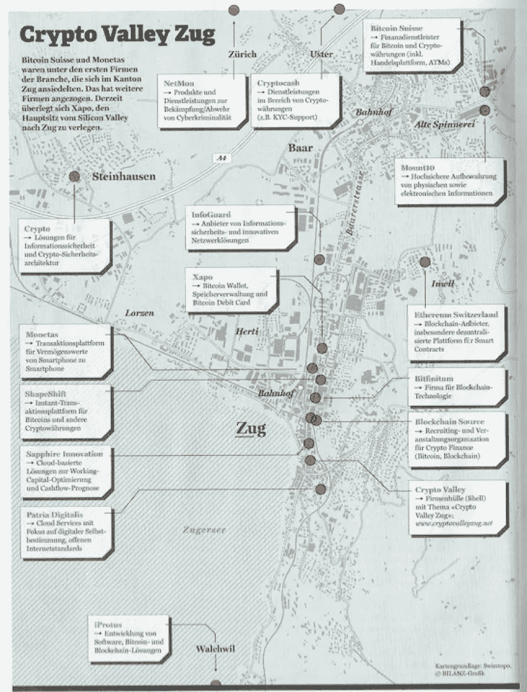

Source: [*Brave New Coin*](https://bravenewcoin.com/news/cryptovalley-zug-well-positioned-to-become-the-silicon-valley-of-finance-in-europe/)

## 你也写了不少关于加密的文章和综合报道，你认为媒体报道如何才能更好地改进？

很大程度上归结于没有耸人听闻的事情。不幸的是，我看到*美国消费者新闻与商业频道*和其他一些人基本上是一种特殊的硬币，我认为这是坦率地不负责任的，因为虽然我们愿意认为每个人都会在购买之前做自己的研究，花几个小时阅读开发者文档，但这是不现实的。因此，公然鼓励消费者购买某种硬币是一个非常糟糕的主意。

没有人能保证价格会上涨，如果散户投资者遭受损失，最终会带来更多的暴力，并可能导致整个市场的倒退。最后，重要的是不要夸大价格活动，更多关于基本面的实际工作将会很好。显然，点击是重要的，价格戏剧推动了更多的点击，最终我不认为这是我们应该努力获得空间的地方。

## 你认为加密货币有部落主义问题吗？

我认为某些项目会，但我不认为这是整个领域的主要问题。一些一般性辩论是有益的，我们已经看到了相当多的这种情况。但是某些人真的不顾一切地兜售他们自己的项目或他们大量投资的项目(也许不披露)，这又开始成为问题。不过总的来说，我不会说这在相对较少的项目之外是个太大的问题。

## 还有你觉得媒体哪里做得好？

我认为有些媒体做得很好。例如，[劳拉·申](https://twitter.com/laurashin?ref_src=twsrc%5Egoogle%7Ctwcamp%5Eserp%7Ctwgr%5Eauthor)的播客非常棒。当然，还有许多其他人做了非常好的工作，这对他们自己有好处，对这个空间也有好处。更多的事情，比如深入某些项目和开发人员正在做的事情，是值得庆祝的。

## 另一个流行的观点是，许多机构对[区块链技术](https://btcmanager.com/?s=blockchain+technology)比对加密货币更感兴趣，但这些机构中的许多都提供私人或经许可的区块链。你认为这有问题吗？更重要的是，这种区块链的非公开演出会成为一种行业趋势吗？

总的来说，我对私人连锁店相当怀疑。在许多情况下，我看到的是，他们真的只是需要一个工作的数据库。因此，对私人连锁店的过度关注给了公司或银行一种他们正在创新和进步的印象，但实际上并不需要这样做。然而，我认为也有例外。

例如，[嘉手纳](http://kadena.io/#/)，我是其中的投资者，我认为他们有一个有趣的模式，他们既有私人链，也有公共链。私有链的一个用例涉及到一个实例，其中你有多个利益相关者，他们是独立的公司，不一定相互信任，但是需要在一个特定的主题上合作。

在这个例子中，私有链可能很有趣，因为有一个财团负责维护分类账，每个人都可以看到它得到了适当的维护，事情就像每个人所说的那样发生了。他们仍然需要对自己的数据有一定的控制，并有更多的能力来授予和取消对参与者的访问权限，这在处理非常敏感的信息方面是有潜力的。在这种特殊情况下，许可链可能是有意义的，但在其他情况下，我认为它更多的是炒作驱动和跟风，因为它听起来更好，而不是他们实际需要的技术。

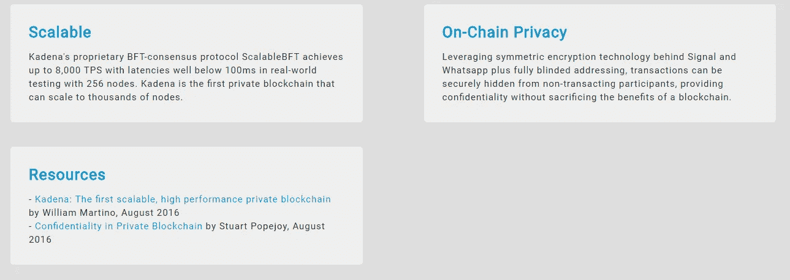

Source: [*Kadena*](http://kadena.io/#/enterprise)

## 最后，有没有你认为人们应该注意的插头或文章？

我最近读到的一件我认为很有趣的事情是最近的一篇文章，这篇文章是由 [0x](https://btcmanager.com/0x-an-open-protocol-for-decentralized-exchange-on-the-ethereum-blockchain/) 发布的。

我花了很多时间思考交易所的基础设施，我听到传统对冲基金领域的机构交易员反复提到的一个问题是，他们不能在(dex)上交易。一方面是因为业绩问题，另一方面是因为 KYC 和反洗钱要求，以及需要了解交易对手是谁。因此，[博文](https://blog.0xproject.com/compliant-peer-to-peer-trading-4dab8e5c3162)基本上解释了什么是有效的许可池，为了在特定池中交易，你必须满足某些 KYC/反洗钱要求，然后才能进入该池，其中的每个人都以同样的方式获得预先批准。

这是一个非常有趣的概念，有助于弥合监管和实际技术可行性之间的差距。我还认为这预示着我们的发展方向，也许是一些更大的趋势。

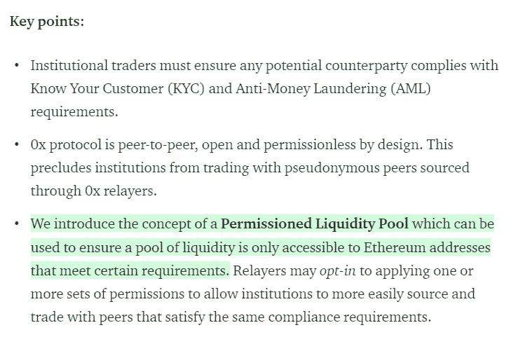

Source: [*Medium*](https://blog.0xproject.com/compliant-peer-to-peer-trading-4dab8e5c3162)

## 结论

关于辛普森在这个领域的下一步行动的更多信息，你可以在[的 Twitter](https://twitter.com/AriannaSimpson) 和[的 AngelList](https://angel.co/arianna-simpson) 以及她的[网站](https://www.ariannasimpson.com/)上找到她。

# [比特币、骗局以及介于两者之间的一切:与彼得·托德的对话](https://btcmanager.com/bitcoin-scams-interview-peter-todd/)

**彼得·托德是比特币******领域呼声最高的开发者之一，这是有充分理由的。这位 33 岁的加拿大软件工程师已经摆弄先锋加密货币有一段时间了，当细读他的** [**博客**](https://petertodd.org/) **时，这项工作的大部分也塑造了许多加密叙事。****

**围绕这一点，Twitter 上出现了一些与[以太坊](https://www.ethereum.org/)联合创始人[维塔利克·布特林](https://btcmanager.com/tag/vitalik-buterin/)的争吵，他与 [OpenTimestamps](https://petertodd.org/2016/opentimestamps-announcement) 的合作，以及对[在太空开采比特币的“硬科幻”的反思](https://btcmanager.com/prediction-near-future-bitcoin-mining-space/)。在捷克布拉格举行的 2018 年[黑客大会](https://btcmanager.com/the-hackers-congress-paralelni-polis-2018-hcpp18/)上的以下对话中， *BTCManager* 与这位编码高手坐在一起，讨论了加密领域的一些主要话题。**

## **我的第一个问题是，在你成为比特币开发者之前，你在做什么，这是否也是开源工作。**

**这是非常不开源的工作。无数的 NDAs 报道了这件事。它实际上是一个模拟电子设计师和一个地球物理学初创公司。本质上，我的工作是设计连接到物理硬件本身的电子设备，然后将这些信号转换为数字信号。就在过渡区。**

## **你能比较两者吗？你更喜欢使用开源代码还是封闭代码？**

**是的，绝对是开源的。我的意思是，做软件只有一种方法。**

## **你对此有如此强烈的感觉吗？**

**不，封闭源代码是扯淡。尤其是涉及到安全的时候。我的意思是，一般来说，开源是有意义的，但是在软件中，它的经济性是如此明显地支持开源。校正成本为零。经济是由实际建造它决定的，建造它是最便宜的，所以你可以看到一切。**

## **你认为这些经济模式会受到像微软、IBM 这样的公司的威胁吗？例如，微软不久前刚刚收购了 GitHub。**

**我会说实际上正好相反。**

## **你认为他们受到攻击了？**

**我认为微软之前的商业模式完全辜负了他们。微软不得不接受这样一个现实，即封闭源代码不是出路。例如，他们的云计算产品 Azure 目前在大多数情况下运行的是 Linux，而不是 Windows。这是微软自己的产品。他们只在早期开始使用 Windows，他们不得不很快放弃，因为 Windows 无法与之竞争。当我做咨询的时候，比如安全咨询，如果一个客户建议我们在他们的系统中使用一个闭源组件，我只会说“不”，这是不可接受的。你怎么知道它在做什么？**

## **当你第一次开始使用比特币时，它有没有吸引你的地方，现在你会觉得“这不再是一件有趣的事情”，或者“这已经被揭穿了”，或者“这太老套了？”**

**没想到什么。**

## **真的吗？**

**没什么。**

## **很公平。从软件和社区的角度来看，你认为比特币目前最大的陷阱是什么？**

**我认为社区的东西比软件更重要。这里涉及的风险要大得多。软件，你可以相对容易地解决问题。如果你在顶层构建层，比特币当然不会在核心层扩展，但我们找到了在顶层扩展[的方法。](https://btcmanager.com/tag/lightning-network/)**

## **你对这些解决方案有信心吗？**

**相当自信。他们还能再活十年。到那时，再过十年，谁知道人们会想出什么。此外，重要的不是比特币本身，而是免费的数字货币。这才是最重要的。如果比特币的架构被证明不太合适，那么其他东西可能会随后出现。**

## **如果一个更自由的比特币到来，你会更赞同吗？**

**就自由而言，比特币是自由的。但是，如果它是技术上更好的东西，如果它真的出现了…但是目前，我没有看到任何考虑到所有事情的东西。**

## **您认为目前您最关注第二层解决方案吗？**

**社区主要关注第二层的东西。我关注的是完全不同的东西。现在，我没有积极地为比特币核心做贡献。我正在围绕它做一些事情。**

## **介意我问一下你在做什么吗？**

**实际生产中最常见的是 [OpenTimestamps](https://opentimestamps.org/) ，它可以证明数据有多旧。打个比方，这有点像[碳数据](https://carbondata.apache.org/)，你想显示一些数据存在于遥远的过去。如果它存在于过去，那么坏人没有时间机器。如果他们没有时间机器，那么你知道攻击只能发生在现在，然后你就可以排除攻击。这通常非常有价值。**

## **你认为最近这个威胁双倍支出的 [CVE 漏洞](https://btcmanager.com/bitcoin-core-0-16-3-security-lightning-network/)这个 [DDOS 攻击的威胁](https://www.cloudflare.com/learning/ddos/what-is-a-ddos-attack/)是不是被过分强调了？这是不是太小题大做了，或者你认为有合理的担忧？**

**你可以说两者同时都是真的。比特币的纯宕机成本高得令人难以置信。光是小收入，我可能会给你错误的数字，但肯定是每天几百万的数量级。你不会想去的。**

**最重要的是，商业也非常昂贵，等等。但要让这种情况发生并扼杀欧元，许多其它事情都将出错。这并不意味着不严重。例如，飞机灾难在他们讨论情况时使用了瑞士奶酪模型。当瑞士奶酪生产线上所有的洞。所以，我们在瑞士奶酪上有一个大洞，但是我们有其他不是洞的东西。**

**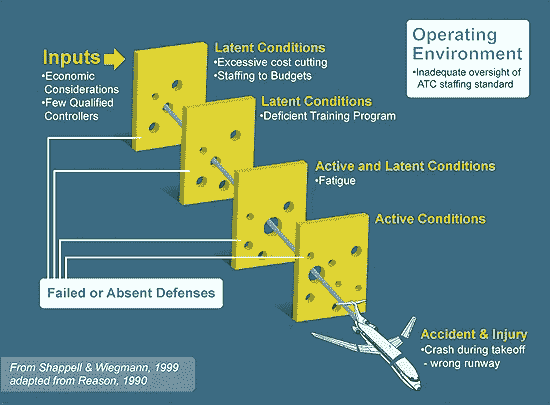**

***Source*: [Aviation Safety Journal](http://asj.nolan-law.com/2007/10/failure-to-recommend-corrective-action-a-lost-opportunity-controllers-union-says/)**

**一个很好的例子是，是的，你可能花了双倍的钱，但是足够多的人以各种方式观察这个链，他们可能已经注意到出了问题，因为各种实现和审计的东西已经离线了。一旦这个通知出现，人们就会开始发出警报。而推特一个人；你可以在几分钟内从零观众变成百万观众。**

**修复这个 bug 只需要很少的时间，而且在这种情况下，您很可能会回滚到十几个街区之类的地方，然后从那里继续。这不是世界末日。这很昂贵，但这不是一个长期的灾难。**

**另一方面，在一个不同的场景中，比如以太坊的发展方向。他们很少有人真正关注这个链条。**

## **你能准确定义你所说的不同的“观看”方式是什么意思吗？**

**实际上，有一个链条的副本。**

## **因为大家都在跑光节点。**

**没错。在以太坊中，很少有人拥有完整的节点，而且完整节点的实现也不是很好。正因为如此，如果你不能监控它，你就不会注意到这些东西，或者也许你会在三天后注意到。**

**三天后，你是回滚链条还是只是接受有人凭空赚了一堆钱？它变得更加可疑。这也使得攻击更加有利可图。如果你试图用这个漏洞攻击比特币，你必须花大量的钱来创建一个无效的区块，然后在你花了那些钱之后，你必须通过欺骗人们来赚回来。**

**你要投入一堆投资，回报是不确定的。最有可能的情况是它被注意到并相对快速地得到修复。你很可能一分钱也赚不到，因为之后你怎么拿到钱呢？**

## **这有点像你必须考虑的商业模式攻击。**

**这就是我给客户建议的原因。我的意思是，如果他们在客户的道路上接受大量比特币存款，他们应该强烈考虑在真正认为它们有效之前等待一天。因为如果你等了一段时间，等了一天就意味着，你欺骗了我们吗？不。好吧，我们现在就接受。如果是的话，我们不会把钱还给你的。链条被卷了回来。你的交易从未存在过。**

## **你认为会有一群开发人员专门考虑这些类型的攻击吗？或者你认为对每个开发人员来说，不管他们在做什么，这都是次要的吗？**

**可能两者都有一点。**

## **就像一个超级安全小组什么的。**

**我敢肯定，比特币的批评者会一直关注这种东西。**

## **是啊，那是真的。**

**你知道吗？**

## **是啊，绝对的。**

**这是件好事。有那些人看着真好。还有，比特币监控服务之类的东西。 [Blockchain.info](https://www.blockchain.com/explorer) 一开始只是展示交易、统计数据等等。这些人最终会重新实现一些东西，这总是一个进行理智检查的机会。这是所有比特币供应增加的地方，而它不应该增加，这要么是你的代码中的一个错误，要么是比特币协议中的一个错误。**

**当你看到这种情况时，自然会发出警报，你开始问为什么你的网站会给出虚假的结果。嗯，可能是因为有东西真的坏了，不仅仅是你的网站。
有很多人做那样的事情。**

## **稍微远离比特币，在 2018 年 10 月 1 日的一条推文中，你提到了路透社的[文章](https://www.reuters.com/article/us-britain-eu-hammond-border/blockchain-may-resolve-irish-border-brexit-problem-hammond-idUSKCN1MB3FM)，该文章描述了区块链将如何在英国退出欧盟期间帮助爱尔兰解决边境问题，你提议他们应该使用块状网格而不是区块链。你是认真的还是…**

**非常非常讽刺。我希望你注意到那上面的照片，那是一个字面上的块状网格。如果你真的看到了那张照片，那才是更好的笑话。我认为这是一个很好的例子，人们只是说“区块链”,当他们只是试图让它听起来像他们正在做一些事情来解决问题。**

## **我想那里没有真正的天才。**

**没有。另一方面，我的意思是你肯定可以在任何事情上找到区块链的用例。区块链只是一串积木。这是我使用的定义，一个区块链在各种事情上都是有用的。**

**你电脑中的文件系统也有大致相同的技术。不过，使用区块链，您现在可以验证内容是否发生了意外更改。如果一粒灰尘落在您的硬盘上，将会擦除一些数据，并且您希望使用与区块链技术相同的技术来确定，自我们上次散列后，数据是否发生了变化？比特币最终就是这么简单。**

## **[Nic Carter](https://twitter.com/nic__carter?lang=en) 最近写了一篇[文章](/s/story/blockchain-is-a-semantic-wasteland-9450b6e5012)，他在文章中描述区块链是一个“语义荒原”，我们应该想出新的方式来描述什么是区块链。你认为这是必要的还是被过度使用了？你认为它用在了错误的地方，还是你认为我们可以用另一种方式来思考它？**

**我不完全同意他的文章。**

## **好吧。**

**从某种意义上说，他是对的，语义是一片荒地，但我不确定解决方案只是说“我们会提出全新的术语。”**

**首先，无论如何，一两年后，全新的术语可能会有同样的语义问题。这并不是源于人们的误解。这很大程度上源于纯粹的欺诈。以太坊就是一个例子。它的开始部分源于欺诈，源于人们编造显然永远不会奏效的用例，并向容易受骗的投资者宣传。如果你想到 Vitalik，在以太坊之前，他正在进行一场量子计算骗局。**

**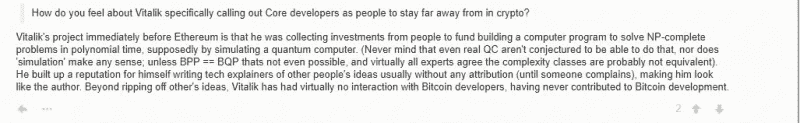**

***Gregory Maxwell commenting on Buterin’s quantum computing operation prior to Ethereum.*
*Source*: [Reddit](http://archive.is/VZbPs)**

## **真的吗？**

**是啊。他的借口是他 18 岁了，他不知道自己在做什么。当然，它被描绘成一个年轻的少年，这不是真的，他是一个成年人。他当时在上大学，或者我应该说当时的北美术语是大学，这是非常可疑的。他知道自己在做什么；他不傻。**

## **实际上，我在推特上看到你们撞了几次头，你认为-**

**你注意到这种情况越来越少了吗？我想他意识到他赢不了这种辩论。他最好还是和志同道合的人保持距离。他不怎么和人辩论。**

## **你认为这种隐秘的推特现象，这种人们不断评论的巨大的开放媒体来源，是有益的还是有害的？还是你觉得两者都有点？**

**可能两者都有一点。它可以非常有助于迅速发出警报和发现问题。但是，就像一般的媒体一样，它不一定那么有效。大多数问题实际上源于这一大群人，他们本来是相当诚实的，但他们愿意容忍欺诈。**

**举个具体的例子，我曾经更尊敬的一个人是克里斯托弗·艾伦。他想要一个好的时间戳协议存在，长话短说，我有一段时间打开和关闭时间戳。实际上，我让它达到了正常工作的程度，大约在同一时间，另一个竞争对手出现了，并开始做他们的时间标记工作。过了一会儿，他们发布了一个 ICO，[谎称](https://petertodd.org/2017/misleading-and-inaccurate-tierion-ico-claims)他们的系统相对于我的系统能做什么。**

**克里斯托弗·艾伦(Christopher Allen)和其他几个人来了，说“你知道我们应该私下谈谈这件事，”以及“不要大惊小怪，等等，等等。”嗯，对不起，这是不诚实的。你很清楚[蒂里昂](https://tierion.com/about)对他们产品的功能撒了谎。没有理由掩饰这一点。他们撒谎了，他们应该为此受到严厉的惩罚。**

**正确的结果是他们道歉并撤下这些东西。当然，他们不会这么做，因为他们对投资者撒了大谎。他们挖了一个洞。克里斯托弗·艾伦是做什么的？他后来从这些人那里拿了一大笔钱来资助他自己的一个项目。你可以看到动机是什么。**

**即使不是故意的，你只是对人好一点，你会因此得到回报。但这对公众来说并不好。**

## **Twitter 很适合解决这种事情。它像野火一样蔓延。**

**我注意到，总的来说，那些极力主张文明的人，通常是那些与骗子同床共枕的人。这真的很可悲，因为，在任何其他领域，你都希望自己能做到这一点。一般来说，这种加密金融是一个非常特殊的案例，因为你通过诈骗人们赚了很多钱。**

**如果我是说编程语言设计，这将是一个完全不同的讨论，因为没有这些机会来赚钱的骗子。没有人会通过引入一个新程序来赚钱。至少不在你在 ICO 里骗人的水平上。**

**这些领域的假设应该是“我们假设诚实。”向后弯腰以假装良好的意图。在加密金融领域，情况并非如此。在加密金融领域，更有可能的是，这个人说了一些误导性的话。他可能是为了赚钱而撒谎。**

## **最后一个问题:稳定的硬币，被高估还是被低估？**

**嗯，你要问什么类型。算法稳定的硬币，没有任何东西支持它们，它们可能是彻头彻尾的危险。有很好的理由认为，如果市场参数失控，它们都可能失败，但更无聊的稳定硬币，实际上有一些东西支持它们，它们足够合理。**

**最疯狂的是，甚至有些事情是可疑的，比如泰斯公司还没有进行适当的审计。从一个投资者的角度来看，他们只是想买一些系绳来转移一些资金，即使支持不存在，他们也可以做得很有意义，这有点疯狂。但你会希望市场最终会找到更好的选择。**

## **你觉得人们是不是太渴望这种东西了？**

**我认为令人着迷的是它们对投资者来说是一个很好的故事。不是说有用不有用；这是对投资者的一个很好的叙述。他们是从这类事情中走出来的，在这种情况下，对投资者撒谎是相对可以接受的。如果他们中的许多人真的不工作，他们会失败，一大笔钱会丢失，我不会感到惊讶。**

## **你可以把它们和[屎币](https://btcmanager.com/the-big-discussion-are-stablecoins-quintessentially-shitcoins/)堆在一起。**

**我是说，我希望我不必。**

## **他们都没有给你留下任何印象？**

**嗯，让我印象深刻的是那些技术上更简单的，它们只是，“我们把我们的鸭子放在一排，我们想出了规则，这是我们的产品。”**

**我想我可能记错了，但我认为比特币基地或者一家主要的知名公司最近宣布他们将做一个，这是合理的。它将只是一枚无聊的硬币。不涉及任何复杂的技术。这很容易评估，然而算法上的东西，我们知道它们会失败。**

**只是需要一点时间让参数变得不正常，最终它会内爆。我们以前见过他们失败。**

**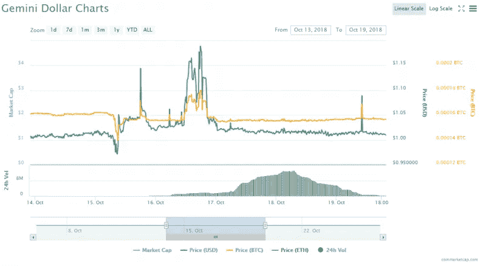**

***The Gemini Dollar market valuation from October 14 to October 19, 2018.*
*Source*: [CoinMarketCap](https://coinmarketcap.com/currencies/gemini-dollar/)**

## **最后，你对阅读有什么建议或想法吗？**

**当然，我会推广我自己的博客，它在 PeterTodd.org。而我经常给人的标准建议就是读 [Bruce Schneier 的《密码学工程》一书](https://www.amazon.com/Cryptography-Engineering-Principles-Practical-Applications/dp/0470474246)。原因是，这只是一个简单的密码介绍，除非你理解的基础，你有点游泳在深水区。**

# **[如何做空 Shitcoins，做多比特币布道者 Tone Vays](https://btcmanager.com/short-shitcoins-long-trading-bitcoin-tone-vays/)**

*****BTCManager* 谈到了 Tone Vays 和比特币价格之外的一切围绕比特币的事情。老师转行企业——金融家变回老师，区块链顾问，而萌芽期的食肉动物早在** [**纳西姆·尼古拉斯·塔勒布的**](http://www.fooledbyrandomness.com/) **系列小说之前就已经在游戏中有了皮肤。然而，通往** [**~166，000 名推特粉丝**](https://twitter.com/tonevays) **并成为密码游戏中知识主节点的路线，已经远离传统。****

**自从在纽约州立大学获得数学和地质学学士学位后，他成了纽约市的一名高中老师。幸运的是，对于加密社区来说，这个角色并没有真正坚持下来。**

**从那里，维斯获得了佛罗里达州立大学的金融工程硕士学位，然后从贝尔斯登(危机前)跳槽到摩根大通(危机后)，并在世界金融体系这个庞大的体系中获得了一个前排座位。现在，他站在金融界一边，试图用比特币重新发明轮子，而且只有比特币。**

**作为一个不妥协的纯粹主义者，Vays 在接下来的采访中解释了他对 altcoin 市场的厌恶，比特大陆阴暗的商业行为，以及他试图像一个真正的食肉动物一样生活(提示，这很棘手)。所有这些都很有见地，但没有一条是财务建议。**

*****以下采访是在 2018 年 10 月 5 日至 7 日于 Cryptoanarchy 研究所举办的*** [***黑客大会***](https://neworder.hcpp.cz/) ***期间进行的。你可以在这里*** ***找到 BTCManager 对事件*** [***的报道。***](https://hackernoon.com/the-soft-power-of-decentralization-b3163fccaeec)**

## **虽然你对许多其他项目都很了解，但我认为很多人会因为你作为交易者的名声而追随你。有着摩根大通和其他一些传统金融机构的背景，是什么让你迷上了加密货币交易？**

**在那之前，我在摩根大通和贝尔斯登工作过。我第一次迷上交易和技术分析是在我第一份工作之前。我在 2004 年学会了如何交易，我在华尔街的第一份工作是在 2007 年，但我在那里的工作不是交易，而是为对冲基金建立风险模型。虽然我一直想成为一名交易员，但我最终在 2015 年辞去了工作，成为一名传统交易员。甚至在那之前，我已经爱上了 crypto，但主要是[比特币](https://bitcoin.org/)。**

**所以，我所有的经验都是在交易传统资产，即使当我开始交易加密时，我也不喜欢交易加密。我不信任交易所，也不喜欢流动性差的市场，所以我只交易了一小会儿。**

**即使在今天，我唯一做的交易是在传统市场上，但我教人们交易，因为我有很大的教育背景。我喜欢交易，我擅长解释事情，在加密领域，我发现了一个利基市场，人们都是交易者，但他们从来没有“学会”它。**

**凭借我所有的经验和技能，我几乎可以主宰[密码交易教育](https://tonevays.com/learntrading)市场。但是就“*我交易什么，”*我仍然交易传统资产，因为我觉得我可以获得更好的回报。或者，不一定有更好的回报，但有更好的风险回报比。我可以以低风险的方式在传统市场交易，我可以获得足够好的回报，我不需要增加更多的风险就可以在加密领域获得更高的回报。**

**我教授的技能集涵盖所有资产，而不仅仅是加密。只是我的客户往往来自加密领域。**

## **你认为这是为什么？**

**因为我所有的视频都是关于我对比特币的热爱，我对区块链的解释，以及报道区块链新闻。我做这些是因为你不能将这些内容货币化。所以，来参加会议和演讲是为了让我传播比特币的知识，但我从我最擅长的事情中赚钱，这就是交易。**

## **这是一种技能而不是爱好。**

**没错。我的技能是交易，我可以教交易，但我的激情是比特币福音。我可以通过教育加密领域的交易者来赚钱。**

## **离开这个教育方面，你给不同类型的交易者提供了什么样的资源？如果我们设想三层交易者，你会给从传统股票市场进入加密行业的人开什么样的资源处方？**

**如果一个人有交易传统市场的经验，我没有很多额外的资源可以给他们。如果有的话，我必须警告他们，当你在传统市场交易时，你不必担心你的资金会消失。但在加密市场，这是一个风险。**

**前几天，一家名为 [1Broker](https://btcmanager.com/u-s-sec-file-charges-bitcoin-1pooll-ltd/) 的交易所被美国政府查封，我在那家交易所有一些比特币，因为我曾经在那里交易。我还有一些在那里，我总是懒得撤回，现在它不见了。这就是政府认定交易非法并没收资金的风险。**

**然后可能会发生外部黑客攻击，甚至可能会发生内部黑客攻击，比如员工携带资金潜逃。这些都是传统交易者不用担心的风险。我不必担心我的退休基金会带着我的钱跑路，那是不会发生的。当然，有被政府没收的风险，但是在传统环境中比在加密环境中要小得多。**

**至于交易技巧，我介绍了一个非常受欢迎的华尔街指标。它被称为 [TD 序列](https://www.investopedia.com/terms/d/demarkerindicator.asp)，是专业交易者使用的，但不是业余交易者。原因是这是一个非常昂贵的许可指示器，据我所知，除非你想自己写代码，否则你只能通过[彭博终端](https://www.bloomberg.com/professional/solution/bloomberg-terminal/)获得。**

## **比如专有软件？**

**是啊。彭博终端只是一个昂贵的终端。彭博终端给你这么多信息，其中一部分信息就是这个指示器。除非你愿意每月花 3000 美元在彭博终端上，否则你就无法使用这一特定指标。正因为如此，很少有人知道如何交易它。他们只是顶尖的职业交易员。这些知道如何交易的人，他们不是做教育的。他们做的是坐在家里交易的生意。**

**我相信我向加密交易员介绍了这个指标，现在我可以说，所有比特币交易员中有 20%到 30%的人都在关注这个他们从未听说过的指标。我可能是最好的，如果不是唯一的资源，不仅是密码交易者，而且是有传统交易经验的交易者，来学习如何交易这个特殊的指标。**

**现在，如果他们想要实际的版本出现在他们的图表上，他们仍然需要向彭博支付 3000 美元，但至少通过我，他们学会了如何使用它。**

## **所以，当他们使用这个软件时，他们得到了物有所值。**

**不管怎样，他们都要物有所值。但是指标的数学是众所周知的，我已经为 [TradingView](https://www.tradingview.com/) 编写了代码，这是我和大多数人在 crypto 中使用的制图软件。其他人也对它进行了编码，所以现在，这个指标有几十个版本。有些编码比其他的好。我只信任我的开发人员编写的代码，但任何人都可以编写代码，但我是将它引入这一领域的人。否则，没有人会听说过它，因为可能只有不到百分之一的全球交易使用它。**

**但我相信这是最准确的指标。我为引入这种交易方法感到自豪，因为它给了我一些专业知识。这就是为什么人们继续出现在我的研讨会上，主要是学习这个指标以及我的其他交易知识。**

**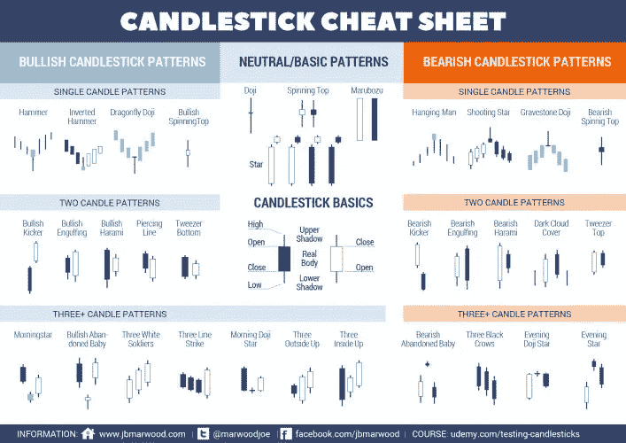**

***Source*: [Tone Vays](https://tonevays.com/learntrading)**

## **说到对加密货币交易感兴趣的其他两类人，你会向刚入门的人推荐这个指标吗？**

**这是一个非常先进的指标。然而，仅仅因为它是一个先进的指标，这并不意味着你不应该学习的基本交易指标，同时帮助你。例如，当我在 21 世纪初学习交易时，在得知交易存在的六个月内，我学会了如何交易 T2 期权 T3。**

**期权交易可能是世界上最高级也是最危险的交易。**

## **就像离密码只有一步之遥。**

**不，更糟。除了赔钱的部分。期权是在 1992 年几乎拖垮金融系统的长期资本管理。整个金融行业不得不救助一家对冲基金，该基金由发明期权定价模型的诺贝尔经济学奖得主[经营。](https://btcmanager.com/blockchain-startups-hiring-nobel-laureates-as-advisors/)**

**他们几乎用期权搞垮了整个金融体系。期权是一种非常危险的工具，我不建议任何人交易，但我在六个月内学会了它，所以我的交易，我所有的交易，都集中在期权上。**

**关于 TD Sequential，只是因为某个东西高级复杂，真的是因人而异。虽然我提醒人们要确切地知道自己在交易中做什么，但一开始就学习最有用的工具并不一定是件坏事。它可以让你从一开始就朝着正确的方向前进。**

## **当你沿着这些向量评估交易时，你看的是图表，你基本上是在处理数字。但当你从更长远的角度投资时，你看到的是一组非常不同的信息。基本上，硬币是如何运作的。人们会交易 shitcoins，不管它是不是好技术；因为它是[泵送或倾倒](https://btcmanager.com/breakdown-cryptocurrency-pump-dump/)。但当你考虑这些长期投资时，尤其是考虑到你在风险管理方面的经验，你会考虑哪些方面？**

**这是一个有趣的问题。对我来说，基本面分析的终点是比特币。然而，在加密领域有一些项目，而不是代币，我确实找到了长期的好投资。比如[比特弗瑞](https://bitfury.com/)。我认为 Bitfury 是一家伟大的公司，我认为他们会继续做得很好。**

## **什么叫“基本面分析止于比特币？”**

**长期生存能力。我认为，比特币是长期投资级品质的唯一表征。其他的一切，每隔一个令牌，从[莱特币](https://litecoin.org/)、[莫内罗](https://getmonero.org/)，一直到你的 [ICOs](https://btcmanager.com/guide-initial-coin-offerings-icos/) ，我觉得都是短线仙股。我绝不会用这些硬币来保值。也许，最坏的情况是几秒钟，最好的情况是几个月。**

**也就是说，我告诉人们，你可以交易任何你喜欢的东西。但如果你打算长期持有你的钱，加密领域唯一能做到这一点的代币就是比特币。现在，因为我的旅行日程，也因为我不信任交易所，我决定对比特币有一个长期的展望。尽管我一直[看跌](https://btcmanager.com/bitcoin-and-ethereum-market-recap-august-23-2018/)比特币的价格，并预测自今年 1 月 10 日以来比特币价格将低于 5000 美元，但我仍然持有我的大部分比特币。我对比特币的时间跨度是多年以后。**

**我确实卖了一点我的比特币来预付今年的一些账单。然而，我对比特币的长期看法让我可以放心地继续持有，看着它贬值。我只是没有从任何其他令牌上看到这一点。**

## **除了加密货币之外，这个社区中还有其他领域，比如采矿或安全，你也认为很重要，因为它们解决了真正的问题？**

**矿业公司可能会非常成功，你只需要选择正确的矿业公司。我认为[比特大陆是有问题的](https://btcmanager.com/could-this-be-the-end-for-bitmain/)，我永远不会投资他们。但是，Bitfury 和 Avalon [ [迦南](https://canaan.io/shop/) ]似乎是非常好的公司。**

## **你为什么不在比特大陆投资？**

**我认为比特大陆[在玩很多会计花招](https://btcmanager.com/bitmain-reports-2-8-billion-in-revenue-ahead-of-ipo/)，我认为他们有 100 万美元现金( [BCH](https://coinmarketcap.com/currencies/bitcoin-cash/) )头寸是个大问题。他们在市场上做了很多不道德的事情。**

## **你是指他们垄断市场的企图吗？**

**这不是从权力角度垄断市场，而是我听到的所有关于他们压榨供应商和竞争对手的传言。他们还以一种在社区中被认为是不道德的方式进行开采，他们有一种绅士的契约，但是他们违反了。**

**他们不会和他们的竞争对手合作得很好。还有很多其他不正当的行为会给他们带来很多问题。他们是领先的芯片开发商，已经辞职创办了一个竞争对手，当你失去了你的头号工程师，他去创办了一个竞争对手，这是一个大问题，你的公司。**

**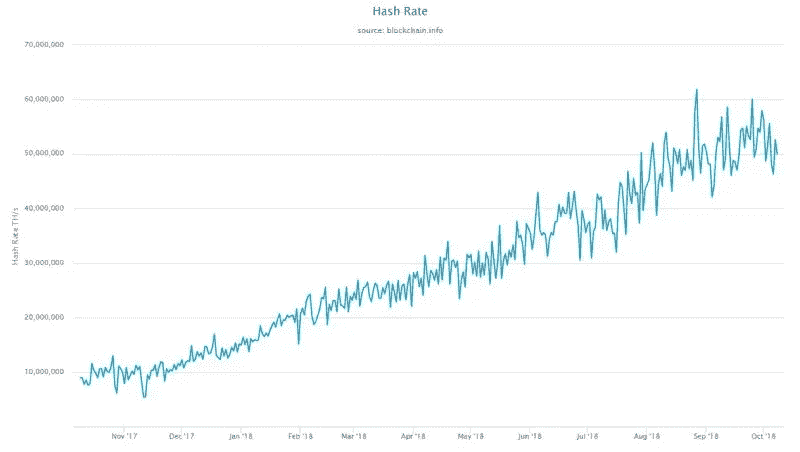**

***Source*: [Blockchain](https://www.blockchain.com/en/charts/hash-rate)**

**所以，我认为比特大陆是一个非常糟糕的投资，他们最大的创新是供应链，而不是 ASIC 芯片。这就是为什么 Bitfury 是一项更好的投资。此外，像 AMD 和 Nvidia 这样的传统公司也是有趣的投资。**

## **英伟达不是已经决定[停止](https://btcmanager.com/nvidia-says-its-crypto-businesses-is-never-coming-back-officially-out/)追求加密货币挖矿了吗？**

**因为比特币的价格已经下跌，所以它不再可行，但我们会看到在上涨的过程中会发生什么。这也是 Nvidia 的优势，当他们在后台工作一些好的 R&D，直到他们突然推出一些东西。你必须小心这些公司公开说的话。**

## **说得好。**

**对于采矿业和芯片制造业，如果你对这些公司进行适当的研究，你会做得很好。我认为参与水文、冷却和通风管道研发的公司也很有意思。这些采矿作业需要这些。能源公司、可再生能源和廉价能源。这些传统公司在不久的将来会受益匪浅，如果你选择了合适的公司，这将有助于在 T2 挖掘比特币。这可能是一项伟大的传统投资。**

## **但你提到的所有这些公司或行业都取决于这种资产(比特币)的成功。**

**当然了。它们取决于比特币的成功。此外，我认为可能会发生，但它看起来不像是这样，在加密空间的交流也可能是一个很好的投资。目前的交流仍然是业余的，但想法是，网飞只是一鸣惊人，但在互联网上。但是他们做得太好了，以至于他们让百视达退出了把电影送到你家门口的业务。**

**我不认为这将会发生，但这是一个想法:当你有一个加密交易所，在订单路由和订单匹配方面雇佣了最聪明的人，并且该交易所拥有最好的技术，并且该交易所正在赚很多钱，他们可以将该技术引入传统交易所。例如，如果比特币基地做了正确的事情，他们有正确的工程师，我们就可以看到比特币基地收购了 T4 纳斯达克(NASDAQ)的未来，可以收购拥有纽约证券交易所(New York Stock Exchange)的洲际交易所(ICE)。**

**但是由于加密交易没有升级，他们错过了机会。密码芯片厂商，比如 Bitfury，有机会干掉 [IBM](https://www.ibm.com/) ，干掉 [AMD](https://www.amd.com/en) ，干掉 [Nvidia](https://www.nvidia.com/en-us/) ，做世界前五的公司。**

## **作为加密货币之外的芯片制造商。**

**正确。你赚的钱越多，你的创新就越多，你从大学里获得的才能就越多，你能拓展的领域就越多越好。亚马逊开始在网上卖书，现在他们主导网络服务。谁会想到呢？他们正在挑战网飞的电影流媒体服务。他们在挑战音乐流媒体。这实际上是关于你从核心业务中赚了多少钱，以及你在哪里拓展业务。**

**加密交易所本有机会成为接管传统市场的大公司，但现在看来，情况将会相反。但是，还有时间。你只需要看看这些其他行业，它们可能会从加密领域发展出来，并主导传统领域。**

## **每个人似乎都痴迷于比特币对环境如此可怕的叙事，但没有被谈论的是这种制造绿色能源开采比特币的平行运动。**

**正确。很多人都忽略了一个事实，那就是寻找最廉价、最高效的电力来开采比特币将造福全世界。很多人都忽略了这一点。除非你在开采比特币上有优势，否则不需要可再生能源。**

## **这就像是终极激励。**

**就像石油价格涨到每桶 100 美元以上，太阳能做得很好，因为人们寻找替代能源。而且每次油价跌到 20 美元，就没人关心太阳能了，因为他们的能源很便宜。**

## **因此，我们有采矿社区、绿色能源社区、交易所，他们可能错过了机会，也可能没有，但在硬件领域呢？**

**你手机里的热钱包很难赚钱，但人们保存比特币的[冷藏](https://btcmanager.com/tag/ledger/)能力和创新，是可以赚钱的。硬件钱包和其他保管解决方案，让人们有权成为自己的银行，这些可能会变得非常强大，非常有利可图。这也非常具有挑战性。**

**比特币在某些方面做得很好。如果得到妥善保护，比特币是世界上第一种不可没收的资产。比特币是抗审查的价值转移，在菲亚特的世界里是不存在的，除非是徒手交易。比特币有一个类似黄金的[硬货币政策](https://btcmanager.com/bitcoin-foundation-austrian-economics/)，几乎不可改变。**

**但是比特币仍然在交易速度、交易成本以及隐私方面苦苦挣扎，尽管这比去年好了很多。但有一个路线图，在未来两年内，比特币应该会有非常快、非常便宜、更多的私人交易。**

## **你是说用[mimble](https://github.com/mimblewimble/grin)和这种东西？**

**更像是[的 Schnorr 签名](https://btcmanager.com/schnorr-signatures-make-bitcoin-efficient/)和[的 bullet proof](https://btcmanager.com/tag/bulletproof/)。MimbleWimble 技术上有点棘手。任何情况下都有许多解决方案，许多伟大的事情即将到来。但比特币仍然在波动性中挣扎，比特币的价值需要很多年才能上涨到足以让你的小额交易价格不会波动。**

**此外，比特币的安全性也是一个挑战。为了让它不被没收，这样你就不会失去它，仍然需要进行大量的创新。它必须更加用户友好，我认为可以为那些能够解决存储挑战和托管挑战的人赚钱。**

**你死后会发生什么？你的比特币会怎么样？我的永远消失了。你呢？**

## **是的，如果我死了，我的比特币可能会丢失。**

**没错，这些都是仍然需要解决的挑战，解决这些问题可以赚钱。**

## **作为我的最后一个问题，你认为自己是食肉动物吗？你只吃红肉吗？**

**我已经尽力了！在我进入比特币之前，我的爱好是饮食和运动。**

## **比如大力士比赛？**

**只是看起来更好，感觉更健康。比赛就像是艰难的泥地或障碍挑战。我在玩竞技体育。**

## **你演奏了什么？**

**主要是排球，但也玩棒球和垒球。我也试着控制我的饮食，保持身材。我一直是旧石器饮食法的忠实粉丝，因为它对我很有帮助。而且最近我一直在尽全力做一个食肉动物，但是这需要时间。**

## **作为一个杂食者，甚至喜欢吃蔬菜的人，这太疯狂了。你会得坏血病的。**

**有两件事。成为食肉动物*是可持续的，不会危害健康。真正的挑战是去做。只吃肉，而且只吃红肉，会变得很无聊，虽然减少蔬菜很容易，但我仍然喜欢我的水果，我仍然喜欢我的酒。***

## **也不喝酒吗？**

**如果你是一个纯粹主义者，不。我认为这是我尝试某些饮食的一种方式，最终，在我的下一个爱好生活中，我将在旧石器时代和食肉动物之间的某个地方设计我自己的最终饮食计划。请留意托尼·瓦伊的独家食谱。**

## **松散的末端**

**最后， *BTCManager* 询问了一些外界的阅读资料以及 Vays 推出比特币的哲学基础。自然，赛费丁·阿摩斯的书[、比特币标准](https://btcmanager.com/new-book-the-bitcoin-standard-touts-bitcoin-as-an-alternative-to-central-banking/)以及任何围绕[奥地利经济学](https://mises.org/)的东西都受到了强烈推荐。**

**之后，他向马丁·阿姆斯特朗(Martin Armstrong)和阿姆斯特朗经济学(Armstrong Economics)解释了他的知识债务，因为他们提供了“关于市场如何运作的高层次观点”，并公开表示后悔没有看完整篇博客。最后，他对马克斯·凯瑟(Max Keiser)大呼小叫，因为他把“比特币放进了维斯的脑袋。"**

**想了解更多关于托尼·瓦伊斯的生活和时代的信息，读者还可以看看他的博客 [LibertyLifeTrail](https://www.libertylifetrail.com/about/) ，深入探讨主权思维和促进独立的生活方式。之后， [Tone Vays Trading](https://tonevays.com/) 提供关于交易策略、研讨会和咨询机会的内容。**

> **每个采访最初都发布在 BTCManager 上，可以在这里[找到](https://btcmanager.com/security-venture-capitalism-and-macro-trends-in-crypto-a-conversation-with-arianna-simpson/)，在这里[找到](https://btcmanager.com/bitcoin-scams-interview-peter-todd/)，在这里[找到](https://btcmanager.com/short-shitcoins-long-trading-bitcoin-tone-vays/)。**