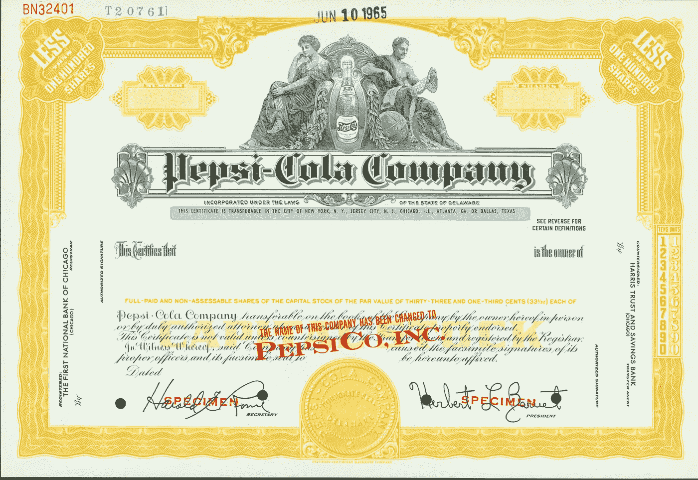
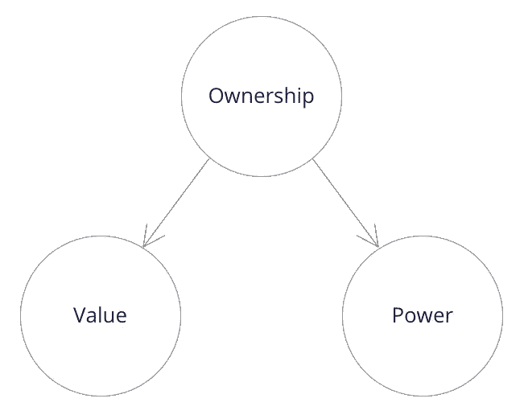
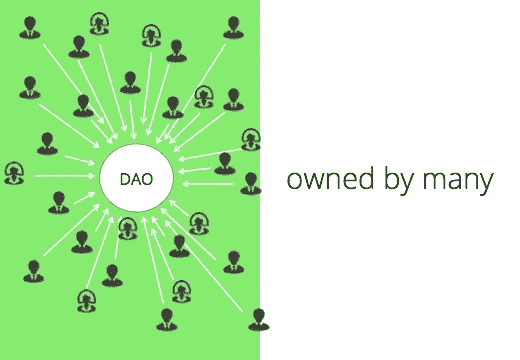
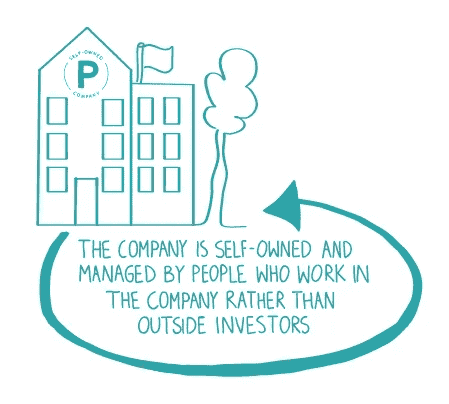
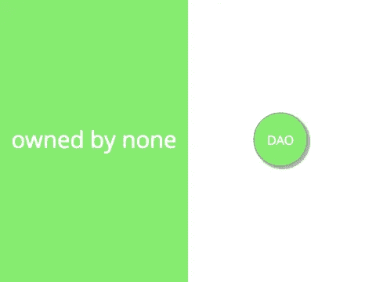
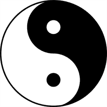
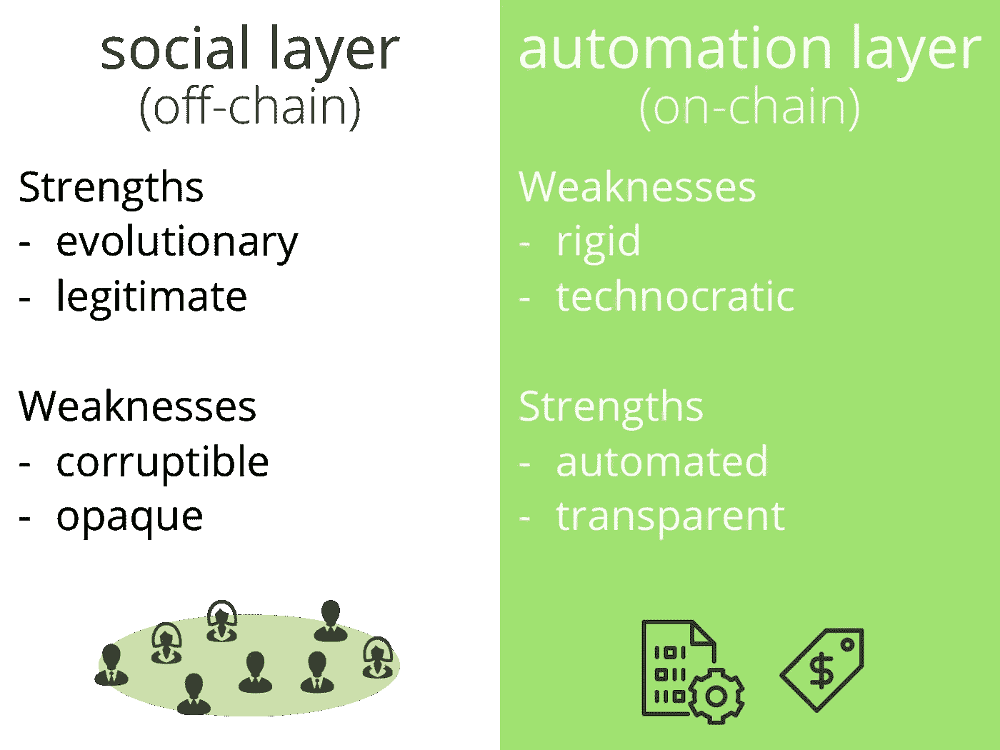

# 我的刀是谁的？

> 原文：<https://medium.com/hackernoon/who-owns-my-dao-93cb87a24561>

Share certificates materialize the ownership of a firm

作为一名企业家，我曾就联合创始人的股份、投资合同中的稀释性条款以及投资者对高管团队实际能力的限制进行过激烈的讨论。尽管如此，和大多数创始人一样，我一直很享受自己当老板的感觉，当公司成功时，我有权做出决策，并从自己的努力中获得公平的回报。

*当我开始冒险进入秘密世界时，我的视角发生了一点变化。区块链是一种去中心化的技术，但是基于区块链的项目也应该去中心化吗？谁应该拥有分散式应用程序？谁应该决定如何设计和推广它？谁应该从中提取一些经济价值？*

围绕开源应用和经济激励建立社区是一件新鲜事。对我来说，很明显，通常的创业模式并不是策划大规模合作游戏的最佳方式，而区块链和密码经济学使这种合作游戏成为可能。使用 DAOs(去中心化自治组织)作为一种新的工具来操作去中心化项目的想法看起来更有说服力。

不过话说回来，谁会拥有这把刀并制定游戏规则呢？现在的 Dao 大部分好像都是由集中式团队开始的，类似于创业公司。这些团队控制他们的 Dao 的方式和联合创始人控制一家初创公司的方式一样吗？毕竟，有可能拥有一把刀吗？这篇文章试图对这个问题作出谨慎的解释。

不管你喜不喜欢，私有制是我们文明的基石。自蒲鲁东的著名口号" La propriété，c'est le vol！"(*“财物被盗！”*)。但是大多数现代的所有权集体化的尝试——由共产主义国家和小规模社会如集体农场进行——都失败了。

财产权仍然被视为一种自然权利，约翰·洛克从理论上认为它与公共自由不可分割，1789 年《法国人权和公民权利宣言》将其界定为不可侵犯和神圣的权利，并在《世界人权宣言》第 17 条中得到确认。

在罗马法中，所有权被定义为三种权利的结合: *usus* (使用商品的权利)*fruit*(从商品中获取经济价值的权利) *abusus* (处置商品的权利)。作为一辆车的拥有者——让我们说一辆战车，回到过去——你可以用它开车去某个地方，把它租给别人赚钱，或者卖掉它。

所有者的控制权可以暂时让渡，例如，当所有者将一件商品的用益权(用益权和果实的组合)授予他人时。所有者的至高无上取决于他们对 abusus 的权利，这导致了一个有趣的悖论:行使所有权的更真实的方式是摆脱它！

## 价值和权力

另一种看待所有权的方式是指出它的两个本质方面:价值和权力。所有者有能力从他们所拥有的东西中提取**价值**，作为公用事业或财政收入。他们也有**权力**来决定如何从他们的货物中提取价值(通过 usus，fruit，abusus)或者不这样做(例如一个地主决定让他的一些财产空置)。

实现公司所有权的公司股份结合了这两个方面:

*   对公司战略和资源的权力通过**投票权**来行使，投票权与股东拥有的股份数量成比例。
*   **股息**，作为对公司所产生的经济价值的一种衡量，按照股东的股份比例分配给他们。

## 分权如何影响所有权

安吉拉·瓦尔希试图给“去中心化”下一个定义。从根本上来说，去中心化就是将权力从一个控制中心分散开来。“去中心化”这个词经常受到批评，因为它是一个否定的表达:它说它不是什么，而不是它是什么。然而，瓦尔希的定义有些实质性:

*   作为一个国家的去中心化:或多或少的权力分散。
*   权力下放是一个过程:将权力从单一控制点推开。

如上所述，权力是所有权的基本属性。随着对某事物的权力被分散，该事物的所有权也必须随之转移，脱离中心关系。

尽管如此，我们选择的定义为不同的解释留出了空间。如果分散化意味着“没有控制的中心点”，它并没有说太多关于**如何**施加控制，也没有说太多关于**由谁**施加控制。

# 那么，谁拥有刀呢？

“道”代表去中心化的自治组织。应用前面的定义让我们假设这样的组织没有**中心控制点**。

但是这意味着什么呢？

一种理解方式是假设 Dao 有很多个控制的实例，而不是一个。

如果一个 DAO 由多方所有，那么控制实体之间的权力或多或少是平均分配的，因此单个层级或一小组成员对整个组织施加不相称的权力的风险较小。

"一体行动"的权力下放程度则由该组织成员的数量和各自的影响力来界定。例如，在加密网络的情况下，分散化将是节点数量、挖掘者或赌注者的数量、令牌持有量的分布、贡献开发者的数量等的函数。

还有另一种方法来防止一个组织被一个单一的实体所接管:所有权除了给组织本身之外，不能给任何其他人，而不是分配给多方。而不是被很多**拥有，被一个都没有**拥有。

这就是道的“A”——作为自主的“A”——发挥作用的地方。道可以理解为一个自我拥有的实体，除了自己，不能被任何人控制。

## 什么是自我拥有？

公司应该由内部控制**——而不是依赖远方股东的意愿和突发奇想——这个想法并不新鲜。合作社是保持组织内部权力的一种方式。[关于合作社身份的声明](https://www.ica.coop/en/cooperatives/cooperative-identity)指出，合作社是一个“**自治的**协会，人们自愿联合起来，通过**共同拥有的**和民主控制的企业来满足他们共同的经济、社会和文化需求和愿望。”**

防止公司异化的另一种方式在于经济和法律概念*管家所有权*，它试图将公司的所有权限制在它的*受托所有人，即控制公司但不持有红利股份的管家*。

这种自有公司已经存在了一个多世纪，主要在北欧。他们依靠法律机制来确保公司的控制权不会落入追求自身私利的人手中。实现这一目标的一种常见方式是**将投票权授予与公司没有经济利益关系的受托人**，通常是通过基金会。大部分利润要么再投资公司，要么捐赠。

正如阿明·斯图尔内格尔指出的那样，“(T2 的)自有公司挑战了关于私人公司所有权重要性的传统观念。“由于**控制权与经济权分离**，管理者不拥有经济激励，这违背了将企业绩效与所有者的经济激励联系起来的主流观点。事实上，自有公司的平均表现优于市场，包括数十亿美元的业务，如博世或蔡司。

与合作社相比，自有公司不太强调民主治理(权力下放)，因为管理者通常是执行官和经理。另一方面，它们利用法律机制确保公司本身的利益优先于任何私人利益(自主权)，包括其内部利益相关者的利益。

## 基于区块链的自治组织

Dao 为组织的“自我拥有”赋予了新的含义。Dao 按照规则工作，这些规则通过运行在无审查的分布式网络上的代码来执行。任何一方都无权强迫道协会暂停或改变其活动规则。政治、经济和社会力量对受公共区块链保护的软件结构几乎没有影响力。

从这个意义上说，道是真正“自治的”(从αὐτός——奥托斯，“自我”，νόμος——诺莫斯，“法律”)，即他们由自己管理。由于法典的解放力量，他们实现了某种形式的自我主权，即使周围的管辖区不承认他们为法人。他们的代码是他们的本质。只要它运行在不受政治和经济力量影响的公共区块链，没有什么能改变他们的行为。事实上，他们拥有自己，没有人真正拥有他们。

同样的逻辑也适用于所有权的价值方面。DAO **控制它自己的加密资产**并且可以使用它们来延续自己——如果这是它的代码所要求的。除非道法授权，否则任何一方都不能没收这些资产。

## 无法缓和的紧张局势

从这种权力下放和自治之间、许多人拥有和无人拥有之间的紧张关系中，我们能得出什么结论呢？它会如何影响我们设计 Dao 的方式？

我们在这里考虑道的两个不可约维度:

*   “由许多人拥有”指的是社会层面，即一个对一个道的管理有影响力的多元化团体。
*   “归 none 所有”指的是表达和自动化 DAO 工作规则的自动化层。

作为一个确定性的协议，自动化层从根本上来说不能改变自己，以提供对进化压力的充分响应。

当然，通过指定各方如何表达他们的偏好以及如何做出决定，包括可能改变协议本身的决定，可以通过自动化层组织社会过程。然而，社交层和自动化层的这种融合，通常称为链上治理，有其局限性。

法学家[卡尔·施米特断言](https://en.wikipedia.org/wiki/Carl_Schmitt#On_Dictatorship)君主的职能是将一种情况视为需要启动例外状态的紧急情况，从而中止正常的法律秩序，并执行可能导致新秩序的决定。这样做需要个人判断——可以是*集体*个人判断——而不仅仅是算法的执行。

[Reijers，w .、Wuisman，I .、Mannan，m .等人](https://link.springer.com/article/10.1007/s11245-018-9626-5)认为以太坊社区在 2016 年 DAO 袭击后采取的措施可以用类似的方式进行解释。黑客行为扰乱了社会常态，为以太坊本身带来了系统性金融风险。最终，一个**硬分叉**被决定并实施，这可以比作一个**新法律秩序**的开始。

道戏剧是社会层面和自动化层面之间紧张关系的一个突发性例证。从比特币块大小的争论到最近关于萨伯定律的争论，这种紧张关系一直在加密网络中起作用。

# 互补——道之道

一个道作为一个**自治实体**属于它自己还是作为一个**分散体**属于多方？我认为，在社交层和自动化层之间看似紧张的关系中，隐藏着 DAOs 作为一种社交技术的真正潜力。

社交层显示了两个关键特征:

*   **合法性——**形成于政治和社会过程之外。一个社会中的共识可能是显性的或隐性的，粗糙的或正式的，作为一个法律体系或作为一个编码体系来实施。但即使是最正式的、自我实施的协议也需要参与方的批准，这是“思想的交汇”，没有这一点，它就会被视为非法的、独裁的过程。
*   **适应性—** 得益于人类的创造力和韧性。
    *当面临进化压力和异常状态时，弹性系统能够自我改造，让新的功能出现。复杂系统的这种转换能力超出了协议中编码的确定性过程的能力。*

另一方面，社会进程更容易腐败，天生不透明。这就是自动化层的亮点:

*   **透明度** —由区块链提供，作为交易的分布式公开记录。
    *社会群体内部的信息不对称导致剥削行为，破坏同伴之间的合作。共享和权威的决定和贡献记录对于在一个广泛的生态系统中开展和扩大监测、问责和冲突解决至关重要。*
*   **自我实施** —通过将治理规则作为智能合同来实施。
    *治理规则的自动化降低了具有孤立流程和信息系统的松散耦合组织之间的交易成本，并使不依赖中央权威的协调成为可能。*

设计 Dao 需要关注这两个方面。一旦集成，社交层和自动化层就会相互补充。

**自动化层通过透明(促进信任)和自我实施(防止权力过度集中)来保护社会层的去中心化**。

**社交层通过合法性(防止分叉)和适应性(提供弹性)保护自动化层的自主性**。

Hasu 证明了社交层和自动化层之间的共生关系是比特币的核心。有了 DAOs，任何大规模、开放的组织或运动都将能够驾驭同样强大的动力。

*特别感谢西奥·比特尔、哈苏、卢克·乔丹、杰克·莱恩、塞夫拉姆·卢、玛丽娜·马克季奇。*