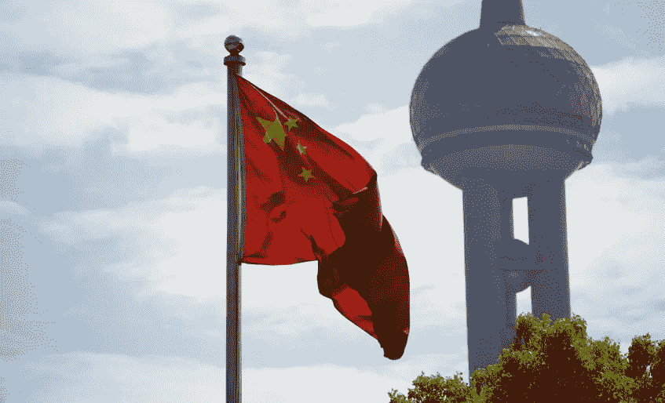

# 谁是世界上最流行的免费 VPN 的幕后黑手？

> 原文：<https://medium.com/hackernoon/whos-really-behind-the-world-s-most-popular-free-vpns-d74bafc82178>

继 Whatsapp、Snapchat 和脸书之后，VPN 是世界上搜索次数最多的应用程序。“VPN”是仅次于“游戏”的第二高的非品牌搜索词，免费应用完全主导了搜索结果。最受欢迎的应用程序在全球范围内积累了数亿次安装，但似乎很少有人关注它们背后的公司，也很少有人代表托管它们的市场进行审查。

当有人选择在他们的设备上安装 VPN 时，他们实际上是选择将他们的数据托付给该公司，而不是他们的 ISP 或无线运营商。VPN 提供商可以检查你的流量，修改它，记录它，如果他们的政策允许，发送或出售到其他地方。鉴于这些数据被滥用的可能性，消费者明智地选择他们的 VPN 提供商至关重要。

我们调查了 App Store 和谷歌 Play 商店中排名靠前的免费 VPN 应用。我们发现，这些非常受欢迎的应用程序中，很少有足够值得那些希望保护自己在线隐私的人信任的。

## 这项研究

我们在英国和美国地区的 App and Play Store 中记录了“VPN”搜索结果中的前 20 个免费应用。总的来说，这些应用程序每月从谷歌下载 8000 万次，从苹果下载 400 万次。关于我们的完整方法和被调查的每一个 VPN 的列表，请看完整的[报告](https://www.top10vpn.com/free-vpn-app-investigation/)。

在这个高度敏感的领域，消费者可能期望谷歌和苹果对开发者施加高标准，但我们发现情况正好相反。这些应用程序中的大部分都来自不知名的、高度保密的公司，它们故意向消费者隐瞒自己的信息。

这些 VPN 应用程序已经从全球最大的应用程序市场下载了数千万次，但用户很少或根本没有关于它们背后的公司以及它们每天通过服务器的大量敏感流量的信息。

我们的调查发现，超过一半的顶级免费 VPN 应用程序要么拥有中国所有权，要么实际上位于中国，中国近年来大力取缔 VPN 服务，并在其境内保持对互联网的铁腕控制。此外，我们发现这些应用程序中的大多数都没有足够的正式隐私保护和不存在的用户支持。

**所有权和网络存在**

尽管中国严格禁止虚拟专用网和臭名昭著的互联网监控制度，但超过一半(59%)的被研究应用最终拥有中国所有权或位于中国。这引发了一个问题，为什么这些拥有如此庞大国际用户群的公司被允许继续运营。

美国、英国、拉丁美洲、中东和加拿大的用户已经下载了中国拥有的 VPN。其中三款应用——TurboVPN、ProxyMaster 和 snap VPN——被发现存在关联所有权。在他们的隐私政策中，他们指出:“我们的业务可能要求我们将您的个人数据转移到欧洲经济区(“EEA”)以外的国家，包括中华人民共和国或新加坡等国家。”

其中一款名为 VPN Patron 的应用由总部位于香港的 IST 传媒公司所有，该公司在中国将自己定位为一家利用用户互联网行为赚钱的移动广告公司。

由于这些公司不遗余力地隐藏其最终所有权，因此要核实这些应用程序的幕后操纵者往往非常困难，远远超出了一般消费者的发现能力。

同样，64%的供应商没有专门的网站或网络存在，超过一半的列出的支持电子邮件是个人帐户，如 Gmail 或雅虎地址。超过 80%的客户支持请求被忽略。

尽管不透明，但这些公司能够凭借被苹果和谷歌批准在其应用商店上市，在不知情的消费者眼中赢得信誉。

**隐私政策、跟踪、用户登录**

虽然这些应用程序的绝对受欢迎程度可能足以让大多数用户相信它们是值得信赖的，但更仔细的检查会发现严重的问题。

[合法的虚拟专用网](https://www.top10vpn.com/best-vpn/)，无论是免费的还是基于订阅的，通常都有详细的隐私政策，概述他们的做法，阻止他们监控和记录用户的网络流量。

然而，许多最受欢迎的移动免费 VPN 应用程序在他们的政策中没有类似的东西，许多根本没有政策。这凸显了海量用户数据正在发生什么的令人不安的模糊性，并引发了人们的担忧，即全球数百万用户正在允许未知和潜在的敌对实体访问他们的网络流量。

我们发现，在 App Store 和 Google Play 上托管的这些应用程序中，有 86%有不合标准的隐私政策，这些政策严重缺乏甚至侵犯了用户隐私。其中一些应用程序允许完全访问用户的互联网流量，跟踪用户，并向中国第三方发送数据。从用户处收集的数据点包括访问的网站、IP 地址(包括用户位置)、浏览时间和持续时间、独立设备标识符、电子邮件地址等。

我们在隐私政策中发现的常见问题包括:

o 跟踪用户活动

o 与第三方分享用户行为

o 缺乏关于日志记录策略的关键细节

o 没有 VPN 特定条款的通用政策

o 完全没有政策

o 明确与中国第三方共享数据

超过一半的隐私政策(55%)是以业余方式发布的，包括带有广告的免费 Wordpress 网站或匿名网页上的纯文本文件，这进一步加剧了人们对这些公司合法性的担忧。

## 这是什么意思？

在消费者看来，官方应用商店上的每个应用都被苹果或谷歌认可为合法和安全的。然而，鉴于围绕这些名单的错误信息和模糊不清的程度，很明显对这一类别的监管力度很小。

不知情的用户通过这些公司运营的服务器路由他们的整个移动互联网流量，其中大多数公司没有提供防止滥用这些数据的保护措施。这是世界上最大的两家科技巨头的失职，他们松散的控制可能会让数百万客户在在线保护的幌子下大规模收集数据。

这些发现也提出了重要的问题，即为什么中国允许这些公司无视禁止使用 VPN 软件的严格法律开展业务，以及一旦收到这些数据，会与谁共享。

除了发现中国在该地区的这种程度的影响力引发的许多问题外，这些发现给苹果和谷歌带来了压力，要求它们向消费者解释，为什么它们会批准没有网站、公司信息很少或具有误导性的出版商的应用程序，这些出版商的隐私政策很薄弱，甚至是反消费者的。

谷歌和苹果允许这些不透明和不专业的公司在其商店中托管潜在危险的应用程序，表明它们未能适当审查利用其平台的出版商，也未能管理其中推广的软件。如果对这种运行不良且有潜在危险的应用程序进行如此少的质量控制，那么高调展示隐私意识的监管将是徒劳的。