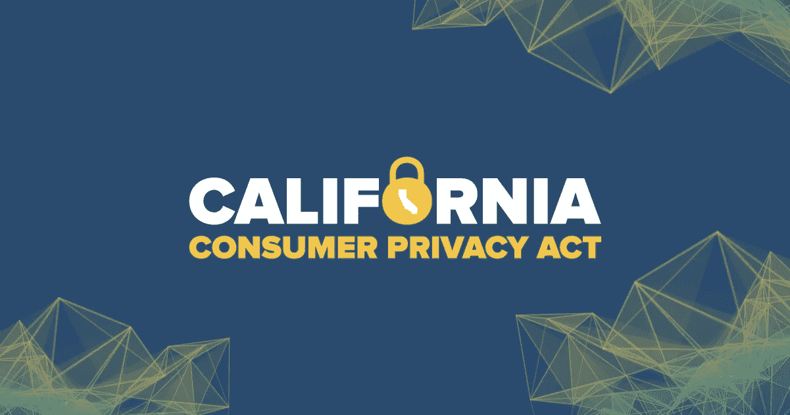

# 为什么美国各州都需要隐私法，如加州消费者隐私法

> 原文：<https://medium.com/hackernoon/why-all-us-states-need-privacy-laws-like-california-consumer-privacy-act-5deda0f83fb9>

2018 年 6 月加州通过了 [**加州消费者隐私法案(CCPA)**](https://www.caprivacy.org) 。该法案要求每年收集超过 50，000 名个人数据、年收入超过 2500 万美元的大公司遵守更严格的用户隐私标准。当人们知道他们的信息是如何被收集、存储、处理和共享时，法律赋予了他们更多的权利。

# 加州消费者隐私法(CCPA)有什么作用？

CCPA 深受隐私条例[《一般数据隐私条例》](https://choosetoencrypt.com/privacy/general-data-protection-regulation-gdpr-and-private-search-engines/) (GDPR)的影响，该条例于 2018 年 5 月在欧洲生效。加州官员和隐私倡导者认识到这些大规模数据收集组织引起的问题和担忧。法律保护加州居民和任何在加州做生意的人的权利。

**CCPA 的目的是给加州居民更多的权利:**

1.  人们应该知道公司会收集他们的哪些个人信息。
2.  人们应该知道他们的个人数据是否被出售或共享，以及与谁共享。
3.  人们应该有权拒绝出售或分享他们的信息。
4.  人们应该有权访问他们的信息，即使这些信息已经被收集和存储。
5.  如果人们选择使用他们的隐私权，他们不应该支付额外的费用或被提供不同的服务。

# 哪些类型的数据受到保护？

《CCPA》适用于广泛的“个人信息”，其定义为“识别、涉及、描述、能够与特定消费者或家庭直接或间接相关联或合理关联的信息。”CCPA 给出了一个标准数据点列表，包括社会安全号码、驾照号码和购买历史，还包括“唯一个人标识符”，其中包括设备标识符和其他互联网跟踪方法。

# CCPA 向谁申请？

CCPA 适用于任何收集和使用客户个人数据的商业组织(或任何营利性实体),这些组织在加利福尼亚州开展业务，并且至少符合以下标准之一:

1.  年总收入超过 2500 万美元；
2.  拥有 50，000 或更多消费者、家庭或设备的个人信息；或者
3.  超过一半的收入来自出售客户的个人信息。

加州是这类监管的领导者，这绝非巧合。加州有大量符合这些标准的科技公司。例如，脸书、谷歌、苹果和网飞都在加州运营。但是这些公司的用户群分散在美国和世界各地。

# 为什么其他州需要这样的法律？

仅仅因为最大的科技公司位于加利福尼亚州的 T2，并不意味着类似的规定不能在其他州使用。[脸书](https://choosetoencrypt.com/privacy/how-to-be-invisible-on-facebook/)在美国大部分州拥有数百万用户，因此如果同样的标准在其他州实施，它将符合资格。

目前关于消费者隐私的联邦法规根本不足以保护人们和他们的信息。许多现行法律已经实施了 10 多年，这意味着它们很难适用于现代技术和数据使用。根据 [*全国州议会会议*](http://www.ncsl.org/research/telecommunications-and-information-technology/state-laws-related-to-internet-privacy.aspx)*与互联网隐私相关的州法律列表，加州是少数几个在州一级实施互联网隐私法律的州之一。像脸书和谷歌这样的科技公司在它们存在的大部分时间里都被放任自流，进行自我监管，但近年来它们变得更加强大和有影响力。*

# *为什么监管科技公司很重要？*

*脸书、谷歌、苹果和其他大型科技公司已经显示出垄断趋势。他们的影响力是无与伦比的，而且随着他们获取更多的数据并实现利润最大化，这种影响力还在稳步增长。如果我们让这些公司继续走他们既定的道路，通常很少考虑用户隐私，我们就冒着让他们发展到一个可怕的权力和影响力水平的风险。*

*然而，政府对科技公司的监管存在一些担忧。这是一个坏主意的最大指标是脸书、谷歌和其他科技公司的高级官员在 2018 年举行的参议院听证会。参议员们对像脸书这样的公司如何运作的理解之间存在巨大的知识差距。让科技公司自我监管更有意义，因为它们最了解自己的产品实际上是如何运作的。*

*据《卫报》*报道，像优步和脸书这样的企业认为“现有的规则太过时了，根本不适用于他们。”有一种相当普遍的观点认为，科技巨头需要受到监管，但有权这样做的人不知道从哪里开始。**

****阅读更多:** [***监管是谷歌和脸书的下一步吗？***](https://choosetoencrypt.com/tech/is-regulation-the-only-way-forward-for-tech-companies-like-google-and-facebook/)**

# **商家应该怎么做？**

**CCPA 系统生效的准备工作与组织在 GDPR 系统生效时为确保合规性而采取的步骤非常相似。《新泽西法律杂志》建议企业列出他们从用户那里收集的信息，以及他们需要向每个用户披露的信息。**

**企业还需要验证他们的做法是否符合新规定。对于一些企业来说，这个过程将是快速而简单的。其他公司将很难改造他们的整个数据生态系统。该法案于 2018 年 6 月通过，但要到 2020 年 1 月 1 日才能完全生效和执行。**

****阅读更多:** [***加州的数据隐私法:是什么以及如何遵守***](https://www.dickinson-wright.com/news-alerts/californias-data-privacy-law)**

***原载于 2019 年 4 月 23 日*[*https://choosetoencrypt.com*](https://choosetoencrypt.com/privacy/california-privacy-laws/)*。***

** [## Gdpr -黑客正午

### 阅读黑客正午关于 Gdpr 的文章。黑客如何开始他们的下午？

hackernoon.com](https://hackernoon.com/tagged/gdpr)**