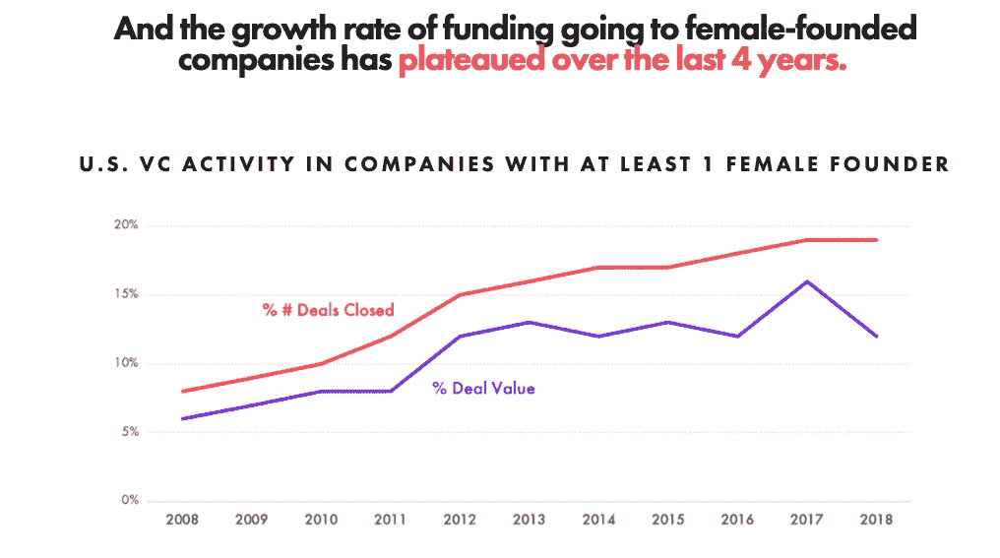
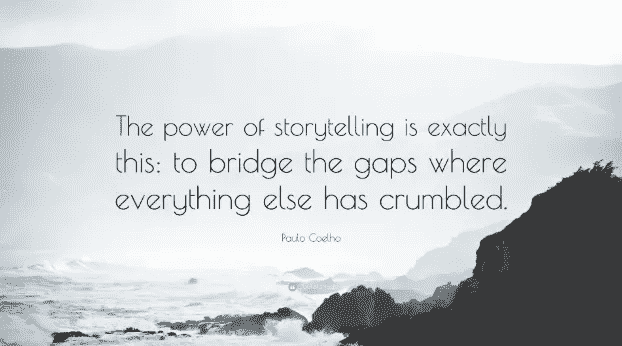

# 为什么我要与“风投中的女性”全球社区一起推出 She-VC？

> 原文：<https://medium.com/hackernoon/why-am-i-launching-she-vc-with-women-in-vc-global-community-b8e933487823>

风险投资通常被称为“兄弟行业”,原因有很多。有人告诉我，我可能是体育风险投资基金中的第一位女性普通合伙人，我很震惊我们仍然在谈论 2018/2019 年的第一次。

“更大的多样性会带来更高的回报。根据波士顿咨询集团对 350 家初创公司的研究，女性创始人的初创公司每 1 美元资金产生 78 美分的收入，而男性创始人的初创公司产生 31 美分的收入—[2018 年美国消费者新闻与商业频道报告。](https://www.cnbc.com/2018/12/18/greater-diversity-among-funders-and-founders-drives-higher-returns.html)波士顿咨询公司的研究报告称，由于创新，更加多元化的管理团队收入增加了 19%。“在销售额和利润方面，男女比例相等的团队比男性主导的团队表现更好。”—哈佛大学肯尼迪学院[报道了一项关于性别多样性对商业团队绩效的影响的研究:来自现场实验的证据。](http://gap.hks.harvard.edu/impact-gender-diversity-performance-business-teams-evidence-field-experiment)

在一个只有 2.2%的风险投资资金进入女性创办的初创公司的行业，我们会发现女性在风险投资基金中担任合伙人、负责人和运营角色，但很少担任合伙人角色，这并不令人惊讶。女性风险合伙人占整个行业的 9%，其中只有 20%的女性合伙人在成长阶段投资，37%的女性合伙人在 B 轮投资阶段投资。这意味着女性创办的初创公司在 B 轮及以后的融资中面临更少的限制，融资变得更加困难。

Courtsey [AllRaise.org](https://medium.com/u/1a382bb669d6?source=post_page-----b8e933487823--------------------------------)

我们该如何参与解决这一巨大的性别差距？ 我们能否让更多的女性投资者讲述她们的故事，以激励和诱导这个代表性不足的社区的资本配置？

如果我们一直在所有我们喜欢的 VC 播客和采访平台上讲述相同的男性伙伴的故事，那就不可能创造改变。很少有女性风投每周都会出现在这样的故事讲述中。让我们在[相似的巴塔哥尼亚背心束](https://fortune.com/2017/09/29/group-of-white-men-in-patagonia-vests-confused-for-vc-fund-raise-500-million/)(双关语)中播下性别平等和多样性的种子，以包括更广泛的投资者阶层，即在各种投资垂直领域创造新市场行为的企业家。

***托里讲述一直是向世界传递思想的最强有力的方式”——罗伯特·麦基。***

如果我们想要包容，人们需要认同我们的故事。有些女性在思考她们的想法是否值得牺牲她们的日常工作，投身到企业家的世界中。有些女性希望进入风险投资领域，但看不到自己所在行业的代表。当女性在其他女性投资者/风投/企业家的生活中看到自己的奋斗时，她们的信念超越了毅力，她们的故事成为了未来的愿景。这些故事的力量创造了一个未来，在这个未来，风险资本的玻璃天花板已经被打破，代表和资本部署在代表不足的社区中。

今天，当 USWNT 创造历史的时候，[耐克播放了他们的性别赋权广告，Meghan Rapinoe 的声音说:](https://heavy.com/sports/2019/07/nike-uswnt-commercial-world-cup/)

## “我相信我们会发出自己的声音，电视节目每天都会谈论我们..不仅仅是每四年一次..那个女人将征服的不仅仅是一个足球场，而是打破每一个玻璃天花板，把她们的脸刻在拉什莫尔山上，我们将不仅为创造历史而战，而且为改变历史而战…永远。

## 这个队赢了。每个人都赢了。

# She-VC

如果我们看到女性和平等的未来，我们需要在女性身上投资，讲述那些创造文化转变的勇敢女性的故事。

在过去的几个月里，我一直致力于此，并非常兴奋地与 [Hackernoon](https://medium.com/u/4a8a924edf41?source=post_page-----b8e933487823--------------------------------) 和“风投中的女性”全球社区合作推出 She-VC 面试平台。由女性创始人基金的合伙人董素天和 MDC Ventures 的合伙人杰西卡·佩尔茨-扎图洛夫创建的“[风投界的女性”名录是全球 46 个国家 1100 多家风投基金中 1700 多位女性风投的自我报告的最大名录。](https://women-in-vc-staging.herokuapp.com/)

我们将从那些令人难以置信的改变游戏规则的女性风险投资人的故事中学习和忘却，这些故事涉及的主题包括创始人市场契合度、创建新基金、从有限合伙人处筹资、投资单一创始人神话、作为风险投资人的销售艺术、性别歧视、风险投资伙伴关系、辛迪加交易、交易流程科学、早期/后期投资、董事会管理、通过条款清单达成交易的艺术、寻找独角兽、风险投资权力法、理解投资者心态、估值艺术与科学、基金经济学、退出策略、创业失败、风险投资 FOMO、风险投资成长心态等等。你会听到很多性别歧视的故事，也会有很多关于倡导性别平等的男性伴侣/同伴的支持和倡议的故事。

She-VC 将以非常规投资故事和需要被倾听的女性 VC 声音为特色，她们想要改变风险投资世界，是的，她做到了。

让我们强调知识的多样性，以体现我们对性别平等的倡导。

欢迎来到 She-VC，和她一起投资就是未来。

 [## She-VC

### 世界上最大的全球风险投资领域女性名录，帮助她们寻找彼此、联系和合作。

风险投资中的女性](https://women-in-vc-staging.herokuapp.com/)