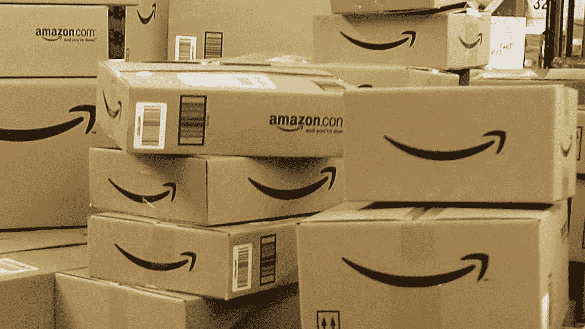
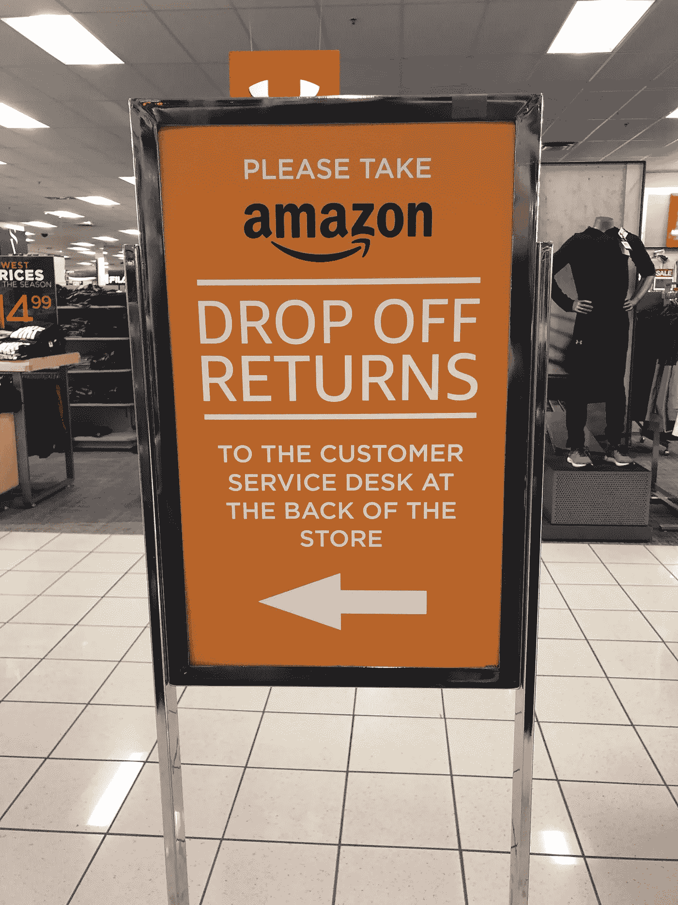
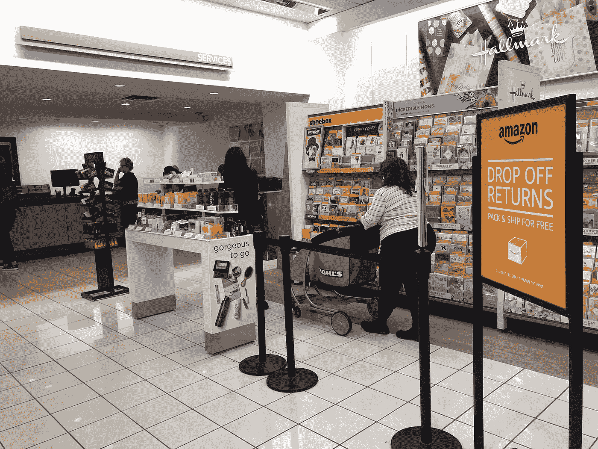
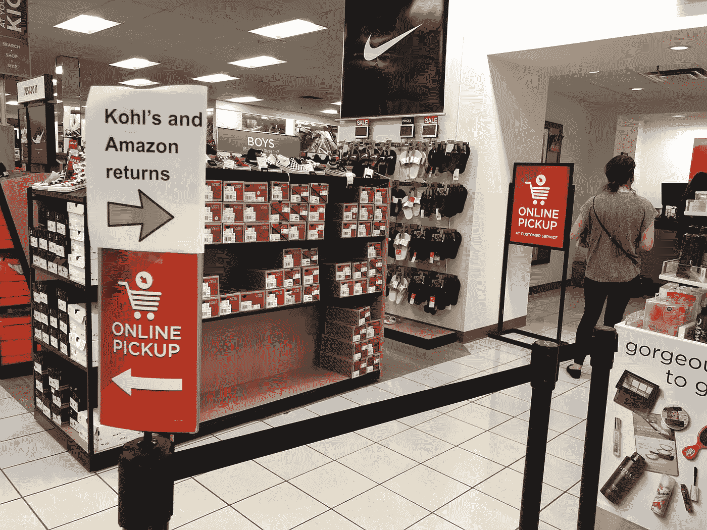
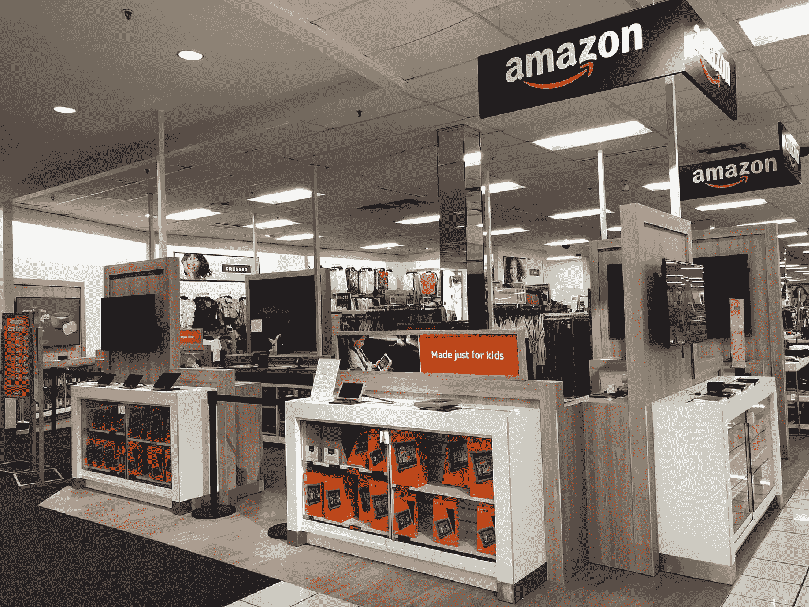

# 为什么亚马逊和美国柯尔百货公司需要对方

> 原文：<https://medium.com/hackernoon/why-amazon-and-kohls-need-each-other-68afe1161a41>

亚马逊和美国柯尔百货公司正在拓展一种似乎有利于这两个敌友的关系。正如[最近宣布的](https://corporate.kohls.com/news/archive-/2019/April/kohl-s-announces-expansion-of-amazon-returns-to-all-kohl-s-store)，全美所有 1150 家美国柯尔百货公司商店将接受亚马逊退货，从而扩大两家公司在 2017 年开始试点的一个项目。美国柯尔百货公司将接受符合条件的亚马逊商品(没有盒子或标签)，并免费为客户退货。因此，美国柯尔百货公司成为亚马逊的退货中心。

# 亚马逊如何回报美国柯尔百货公司的工作

2018 年初，在商店开始接受亚马逊退货后不久，我参观了伊利诺伊州伍德里奇的美国柯尔百货公司商店。商店前面的巨型横幅明确表示欢迎亚马逊退货。指定的亚马逊退货站就设在入口附近。我问一名销售助理，为什么亚马逊退货中心在商店的前面。把购物中心放在后面不是更好吗？这样会给整个商店带来更多的人流量。她回答说，美国柯尔百货公司已经在商店后面设立了自己的退货柜台，在同一区域设立亚马逊退货柜台会让顾客感到困惑。但是为了鼓励客流量，美国柯尔百货公司给亚马逊的顾客提供店内购物折扣券。

2019 年 4 月，我访问了同一家商店。我注意到亚马逊退货台被移到了亚马逊和美国柯尔百货公司客户的通用服务柜台后面(包括在线提货和退货)。整个商店的标志将亚马逊的顾客引向统一退货中心。

服务台的每个人都接受所有退货，无论是来自美国柯尔百货公司还是亚马逊。很明显，根据他们管理过程的速度，这些员工接受了实现这两种回报的培训。一位同事还证实，美国柯尔百货公司继续提供优惠券(有一周的有效期)，以鼓励亚马逊客户留在商店里购买美国柯尔百货公司商品。美国柯尔百货公司的某个人一定已经明白了这一点:当你看到有机会让顾客走进你的商店时，你就会抓住这个机会。随着时间的推移，在清晰标识的帮助下，顾客会知道去哪里取货。

此外，在入口处附近，一家亚马逊品牌的弹出式商店提供了各种各样的亚马逊产品，包括不同的 Echo 扬声器和 Fire 产品。这里有一个尝试，让美国柯尔百货公司通过一个弹出式商店成为亚马逊的经销商。但显然这一尝试没有成功。亚马逊最近[宣布](https://www.retaildive.com/news/amazon-to-discontinue-pop-up-locations/549945/)停止弹出位置，包括美国柯尔百货公司商店的弹出位置。然而，应该注意的是，[美国柯尔百货公司将储备亚马逊产品](https://www.digitalcommerce360.com/2019/03/06/amazon-is-closing-87-us-pop-up-stores/)，只是不是在亚马逊品牌的空间。因此，美国柯尔百货公司最终成为了亚马逊的零售店。如果美国柯尔百货公司会为你的商品进货，为什么还要麻烦一个弹出式商店呢？

# 这个策略有效吗？

来自 Earnest Research [的数据表明](/earnest-research/amazon-partnership-delivers-for-kohls-4d59207ee9a1)这种合作关系正在为美国柯尔百货公司带来回报。Earnest 表示，芝加哥商店在 2017 年开始接受亚马逊退货后，“2018 年芝加哥的销售、交易和客户增长都超过了全国的相同指标”。

即使弹出式商店已经失败，这种关系对亚马逊来说也是有意义的。让美国柯尔百货公司作为履约合作伙伴，解决了网上购物的一个令人头疼的问题:退货容易。亚马逊享受退货柜台的服务，而不必拥有实体店。在亚马逊的所有服务中，比如零售、广告、云计算，零售仍然是特别昂贵的。亚马逊应该找到更好的方法来控制开支(该公司正在根据其最新的季度收益报告来做这件事)。即使是强大的亚马逊也需要合作伙伴

与此同时，美国柯尔百货公司正通过其他方式最大限度地利用其场地价值，比如向 Planet Fitness 租赁场地。美国柯尔百货公司并不是唯一一家租赁店面的零售商。梅西百货一直在向 Sunglass Hut 和 LensCrafters 等零售商出租店面。

# 下一步是什么？

看看这种关系如何发展会很有趣。亚马逊会依靠美国柯尔百货公司销售更多产品吗，比如快速增长的自有品牌？事实上， [Motley Fool 推测亚马逊可能会直接收购美国柯尔百货公司。这个想法并不牵强(见亚马逊收购全食超市)。零售天启还是机遇？敬请关注。](https://www.fool.com/investing/2019/04/25/is-amazon-inching-closer-to-buying-kohls.aspx)

*在推特上我是* [*大卫·迪亚尔*](https://twitter.com/davidjdeal)