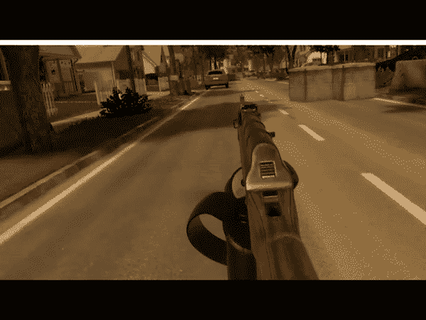
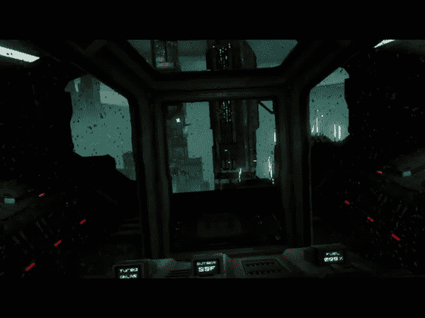
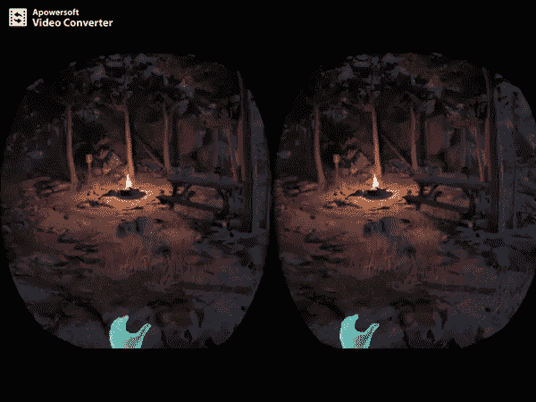
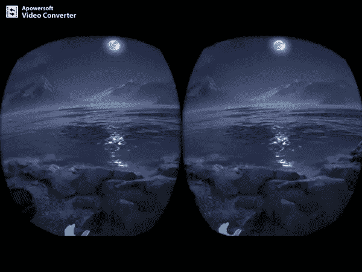

# 为什么在虚拟现实中有这么多的移动方式？

> 原文：<https://medium.com/hackernoon/why-are-there-so-many-ways-to-move-around-inside-virtual-reality-d3db02754be1>

# 在最好的情况下，虚拟现实是最具沉浸感的娱乐形式之一。在最糟糕的情况下，虚拟现实会让用户在几秒钟内感到恶心。

为什么有些人在 VR 里面真的会生病？它始于眼睛看到的东西和大脑处理的东西之间的脱节，或者说不协调。当你在现实生活中坐在椅子上，但你在虚拟现实中前进时，你可能不会很快感觉很好。

开发人员已经创造了相当多的方法来导航 VR 环境，减少眼睛和大脑之间的不协调。首先，我们将检查只有那些胃口最大的人才能处理的遍历方法，最后，我们将检查一些提高沉浸感的方法。

## 这是一些人可以处理的遍历方法

如果你喜欢游戏并且胃口很大，你会爱上第一人称虚拟现实射击游戏。在这个游戏中，遍历是这样工作的:你将 Oculus Touch 控制器握在手中，然后向前(或向后)推动操纵杆来移动自己。看起来很直观，理论上给用户提供了完全的活动自由。

问题是，人类的大脑不习惯这样，因为你在现实生活中实际上并没有移动，作为一种本能反应，你的大脑会引发晕动病。[把这些告诉《前进》的职业玩家吧，他们似乎能处理好这个](https://vr.eslgaming.com/onward/)。

*Forward movement in* [*Onward*](https://store.steampowered.com/app/496240/Onward/)

## 以下是一些增强沉浸感的遍历方法

驾驶舱中的穿越体验，使用心灵运输，或者使用一些过肩第三人称混血儿都有能力提高沉浸感。我们将一起研究这些问题。

**驾驶舱**:

*   优点:稳定、身临其境的体验，有明确的预期
*   缺点:行动自由有限

驾驶舱是一个安全、稳定的选择。你坐在驾驶舱里，典型的科幻宇宙飞船，你按下按钮前进。你可以在各个方向探索和移动，但你可能会被限制在[驾驶舱](https://hackernoon.com/tagged/cockpit)内的车辆般的体验。

*Traversing in the cockpit of* [*Aircar*](https://www.reddit.com/r/oculus/comments/757el6/aircar_is_officially_my_most_immersive_vr/)

你可以在虚拟现实中驾驶你的星际飞船，在类似[精英:危险](https://kotaku.com/10-000-elite-dangerous-players-start-an-18-week-journey-1831702968)的体验中一次减少几个小时。

**瞬间移动**:

*   优点:你可以在整个环境中“行走”和导航
*   缺点:必须花精力积极决定你要走的每一步

这是最常见的遍历实现之一。你向前握住一个扳机，然后按下一个按钮来传送到你想去的地方。这是一个很好的桥梁选择，以沉浸感为代价消除了晕车。理论上你知道你在体验，但它不会完全愚弄大脑。这是一个有点不自然的运动，需要很大的认知负荷，因为你每次都必须主动选择你想去的地方。

*Teleportation in* [*Obduction*](https://www.polygon.com/2016/8/25/12644808/obduction-review-myst-cyan-PC)

与这些遍历方法配对的是一个点击查看选项。在倒推时，你可以左右轻敲你的左操纵杆来环顾四周。对于头部运动可能导致晕动病的人来说，这是一种替代方法。

*Tap-to-look in Obduction*

有一些遍历方法结合了上面的一些元素。在 Rez Infinite 中，你的第三人称化身总是漂浮着，向你所看的地方移动。通过将相机控制与运动结合起来，[你可以无缝地探索沉浸式开放世界，而不会感到晕车](/inborn-experience/vr-user-experience-immersive-locomotion-32f9df4a60f0)，但只能从第三人称视角进行。

我鼓励你尝试所有这些现有的虚拟现实体验，亲自体验一下穿越的感觉。通过弄清楚什么适合你，什么不适合你，你可能会学到很多东西。

有许多方法可以在[虚拟现实](https://hackernoon.com/tagged/virtual-reality)中移动，因为开发者正在试图解决沉浸感和晕动病。如果你有一个强大的胃，你可能能够像在第一人称射击游戏中一样传统地浏览虚拟现实。对大多数人来说，坐在驾驶舱或心灵传输的体验将是舒适和身临其境的。

*如果你喜欢❤的股票形象，你会得到额外的加分*