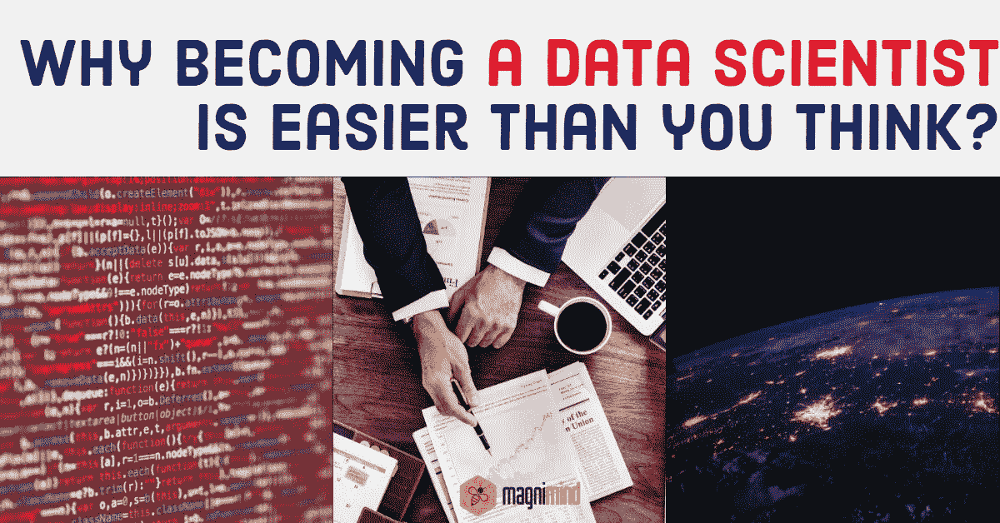
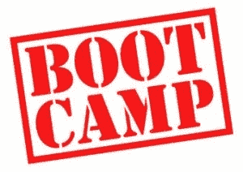

# 为什么成为数据科学家比你想象的容易？

> 原文：<https://medium.com/hackernoon/why-becoming-a-data-scientist-is-easier-than-you-think-aad637caff72>

自从数据科学家的工作被授予 21 世纪最性感工作的桂冠后，科技领域的各行各业的人都试图 ***成为数据科学家*** *。*不幸的是，许多有志者放弃了这个想法，认为成为一名数据科学家会非常困难，而且资源数量有限。

如果你属于这个联盟，我们可以肯定地告诉你一件事——这不是一个困难的任务。在这篇文章中，我们将讨论必要的步骤和大量的途径，你可以使用它们来成功地尝试**成为数据科学家**。

在我们深入研究之前，这里有一些你应该记住的建议。

*   如果你来自一个完全不同的领域，你不可能通过参加一个短期的在线认证项目或 7 天的认证项目**成为一名数据科学家**。
*   你应该对它有现实的期望，并且知道实现你的职业目标需要什么。成为一名数据科学家所需的技能不仅需求量大，而且报酬高，因为这些技能很难获得。所以，你应该准备付出一些真正的努力。
*   在你开始成为一名数据科学家的旅程之前，你应该清点一下你现在的技能和你想去的地方。答案会指引你如何到达那里。

让我们开始讨论。

# 什么是数据科学家？

*简而言之，数据科学家就是以得出结论为目标，捕捉和分析数据的人。*

> ***数据科学家*** 经常开发高度先进的算法，用于确定模式，并从混乱的统计数据和数字中提取数据，为公司或企业提供有用的东西。

其核心是，他们在大量数据中寻找意义。

# 谁是成为数据科学家的合适人选？

*数据科学家的特点有哪些*？你如何确定自己是否有能力成为一名数据科学家？因为这些专业人士身上有很多特质，所以你很可能拥有其中的一种或多种。

> 最重要的是，你需要有一种天生的好奇心，这种好奇心会不断鼓励你不断追求学习。

有如此多的数据点和不同的领域需要分析，数据科学家必须有一种与生俱来的好奇心，这将推动他/她找到答案。还有其他一些特质，比如很强的专注能力、创造力、对细节的适当关注等等，所有这些都会帮助你成为一名数据科学家。

# 成为数据科学家的一般步骤

*虽然*有不同的途径让**成为数据科学家**，但拥有计算机科学、 [***信息技术***](https://searchdatacenter.techtarget.com/definition/IT) 、统计、数学等专业的学士学位是一个普遍要求。你也可以获得这些领域的硕士学位，成为一名数据科学家。

有一些机构提供数据科学学位，这可能是获得必要技能以及获取大量计算机、分析技术和统计等技术信息的绝佳选择。

# 需要记住的关键事项

*在*我们开始讨论**成为数据科学家的资源**之前，这里有一些你应该记住的常见但极其重要的事情。

*   数据科学不是在真空中完成的。因此，每个行业需要不同的编程语言、技能和资格。在你努力成为数据科学家的过程中，你应该将最初的搜索限制在一个行业，以减少要研究的主题数量，并轻松找到相关项目。
*   首先选择一种编程语言，并坚持下去。不要改变选择，坚持不懈地学习，以免放慢你的进度。
*   在做项目的时候，试着通过课程/辅导来增加学习。尝试做一个能让你应用数据科学技能的项目。
*   从一小组资源开始。有大量的资源可以让你学习数据科学的基础知识。找到一套好的资源，从中学习，然后切换资源去学习更高级的话题或者磨练你最近获得的知识和技能。当拿起一套时，记住它应该涵盖不同的主题。
*   加入与数据科学相关的不同社区可以在很大程度上帮助你**成为一名数据科学家**。为此，您可以参加数据科学活动、订阅数据科学时事通讯、加入数据科学在线社区等。
*   试着找一个能在你整个旅程中帮助你的导师。导师仅仅是一个值得信赖的、有经验的老师或顾问。
*   对你的动机保持绝对清晰。这一点非常重要，因为成为数据科学家的过程可能会很艰难，有时会让你失去动力。有了强大而清晰的动力，你就能度过那些艰难的时光。

# 成为数据科学家的资源

这里有一个全面的资源列表，你可以利用它成为一名数据科学家。让我们来看看它们。

## 在线课程

*有些网站为初学者和专业人士提供数据科学的在线课程。例如，您可以考虑“哈佛大学数据科学证书”课程，该课程涵盖数据科学的不同方面，如数据管理、数据采样、预测、数据分析等。*

加州大学伯克利分校信息学院的 MIDS(信息和数据科学硕士)是另一门关于数据科学的课程，面向那些希望使用复杂数据解决问题的专业人士。

## 教程

> *一些*引人入胜的教程由不同的网站提供，可以帮助你理解数据科学的主要概念。

例如，Analytics Vidhya 提供了一个全面的教程列表，将帮助您学习 R 数据科学以及编程基础。它还将帮助你学习预测建模、数据探索、数据操作等。

Topcoder 是另一个提供教程的网站，它关注数据科学中涉及的不同概念。他们还就大量话题提供现实世界的实用建议，以帮助该领域的新手。

## 训练营

*数据*科学训练营是为来自各种技术背景的学生设计的。他们为有一些数据背景的学生提供了精心设计的密集、简短的培训计划。最重要的是， ***训练营*** 意在填补知识空白。训练营通常为参与者提供理论和实践的完美平衡。

技术背后的概念通常由经验丰富的讲师在讲座中解释，材料为学生提供了坚实的基础。训练营有不同的教育要求。有一些训练营提供初级课程，而其他一些可能提供高级课程。

训练营通常提供 3-6 个月的课程，可以帮助参与者 ***成为数据科学家*** *。参加训练营有很多好处。*

*   首先，他们中的大多数都提供网上课程以及兼职和夜校课程，以适应在职学生的时间表。
*   第二，与传统的学位课程相比，训练营的花费更少，时间更短。
*   第三，他们中的大多数提供职业服务，如网络机会，准备工作面试，毕业后的职业指导，等等。

例如，您可以查看由数据科学领域的著名机构***Magnimind Academy***提供的短期课程和训练营。

# 关于工作角色要记住的事情

*在*你开始前往**成为一名数据科学家**之前，建议浏览一些招聘信息，寻找你所选择行业的数据科学家职位。会有一些你不感兴趣的职位。所以，你不需要经历那些职位的技能要求。

还有，有些职位是有要求的。这在你的预算和目标时间内是不现实的。例如，如果一个职位需要一个博士学位，而你没有博士学位，那么不先回学校就去找这个职位可能是不现实的。确定具体的目标同样重要。这些将帮助你明确**成为数据科学家**的必要条件。

# 最后

*上面的*文章应该已经帮助你理解了**成为一名数据科学家并不难**也许并不像你想的那样。所有这一切都要归功于不同在线教育平台的化身，它们运转得非常好。关注他们的主要原因是他们在培养已经很有才华的候选人。有了它们，学生可以按照自己的方便和节奏学习。你甚至可以查看他们和其他一些论坛，在那里你可能会找到很多非常有用的信息。

当然，要成为数据科学家**，你还需要培养很多其他技能。在这篇文章中，我们试图给你一个实现目标的实际难度的提示。理解这一点也很重要，虽然您可能不需要非常深入地了解与数据科学相关的每一项技术，但您需要对它们有足够的了解，以抽象出技术流程。**

*最后，这些职位竞争激烈，并不难获得。在**成为数据科学家**的过程中，保持动力的理想方式是不断学习和实践，同时牢记自己的目标。*

* [## 为什么成为数据科学家比你想象的容易？-马格尼明德学院

### 自从数据科学家的工作被授予 21 世纪最性感工作的桂冠后，来自各行各业的人们…

magnimindacademy.com](https://magnimindacademy.com/why-becoming-a-data-scientist-is-easier-than-you-think/) 

> 在此订阅接收[我们的头条新闻。](http://eepurl.com/gjDwwP)*