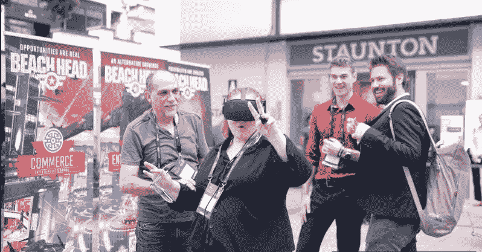

# 区块链和 VR 可以成为数字天堂里的一对

> 原文：<https://medium.com/hackernoon/why-blockchain-and-vr-might-be-a-match-made-in-digital-heaven-3b0c849978cf>

考虑到虚拟现实(VR)技术提供了一些迷人的可能性，它近年来一直难以获得牵引力。TechCrunch 报道称，在 2017 年之前的两年里，虚拟现实耳机制造商 Oculus 和 HTC 可能只卖出了大约 50 万头耳机。

在脸书于 2014 年以 30 亿美元收购 Oculus 后，金融界的批评家[注意到](http://www.fool.com/investing/2018/08/31/why-facebooks-oculus-acquisition-hasnt-paid-off-ye.aspx)这笔交易还没有回报。马克·扎克伯格本人[敦促投资者保持耐心](http://www.fastcompany.com/4029833/zuckerberg-asks-for-investor-patience-on-vr-profitability)，称虚拟现实陷入了一个恶性循环，需要足够的内容来吸引消费者。当然，开发者希望在投资此类内容之前，知道对耳机有足够的需求。

无论如何，虚拟现实市场的分析师仍然乐观，预测硬件和软件的销售额在未来几年将翻两番以上，从 2018 年的 33 亿美元增加到 2021 年的 145 亿美元。

*Image Source: depositphotos.com*

## 融合 VR 和区块链

现在，脸书和其他虚拟现实公司的投资者可能会认为，将虚拟现实与区块链技术融合的项目正在出现是一个好消息。到目前为止，[分散地(MANA)](http://decentraland.org/) 是比较成功的一个。

分散王国建立在以太坊之上，允许用户参与虚拟世界。利用区块链的不变性,“分散之地”的用户可以用法力令牌购买一块虚拟土地，然后随心所欲地在上面建造。他们可以开一家公司，销售其他类型的数字资产，例如，虚拟人物的服装，并以数字货币对他们的商品或服务收费。想象一种在区块链的第二人生项目。

“第二人生”的创造者也在创建一个类似的项目，名为高保真，在 EOS 区块链上开发。虽然第二人生有自己的货币，但区块链为用户提供了在虚拟世界中实际拥有自己资产的机会。该项目筹集了 7000 万美元的资金来开发 VR 平台，该平台基于一个稳定的硬币。

其他项目试图融合虚拟现实和区块链，取得了不同程度的成功。例如， [CEEK](http://www.ceek.io/) (CEEK)是一家专注于娱乐内容的老牌 VR 耳机制造商，与 Lady Gaga 和 Megadeth 等品牌合作。去年，该公司为其 CEEK 令牌举办了一次 ICO，旨在开发一个 VR 娱乐世界，用户可以在那里购买虚拟活动的门票。

与此类似的项目是 [VibeHub](http://www.vibehub.io/) (VIBE)，它允许任何人使用 VIBE 令牌购买或出售 VR 体验。想想一门乐器或外语的教育教程，或者看一场单口喜剧表演。

## **将游戏融入其中**

放眼更广阔的区块链世界，游戏被证明是以太坊或 EOS 等平台上最受欢迎和最持久的分布式应用形式之一。在诸如 dapps[State of Dapps](http://www.stateofthedapps.com/rankings)或 [Dapp Radar](http://dappradar.com/rankings) 等网站上排名靠前的 Dapps 一贯以像 [EOS Knights](http://eosknights.io/) 和 [My Crypto Heroes](http://www.mycryptoheroes.net/) 这样的游戏为特色。区块链能够提供游戏内资产的安全、不可改变的所有权，这对游戏玩家来说是一个诱人的诱惑。

现在， [BeachHead 2020](http://www.beachhead.com/) 正在寻求利用区块链和虚拟现实给现有的游戏模式带来新的变化。与分散土地类似，BeachHead 是一个虚拟世界，用户可以使用平台的原生令牌 BHT 买卖土地、商品和服务。他们还可以享受各种娱乐选择，如体育比赛、音乐会或表演。

然而，与这里提到的其他项目不同，BeachHead 提供了游戏内目标的激励——这是游戏爱好者的一个重要参与策略。前提是虚拟城市被围困，居民会通过防御入侵者来参与游戏。这样做，他们也可以赚取数字货币，在滩头世界消费。

有趣的是，BeachHead 是在双区块链层上建造的，同时使用以太坊和涟漪。这使得开发人员可以利用两个平台的优势。因此，可以使用 ERC-721 标准发行不可替代资产，而 Ripple 引擎则充当一个几乎实时的匹配引擎，将那些有资产可供交易的人与那些有货币或其他资产可供交易的人联系起来。

Pepe Moreno, BeachHead’s Founder and chief visionary officer is showcasing a demo of the BeachHead city for visitors at Block O2O in HongKong

## **觉得你以前听过这个名字吗？**

对于长期的游戏爱好者来说，BeachHead 将是一个熟悉的名字。最初的滩头游戏是在 1999 年作为街机射击游戏发布的。目标是收集足够的弹药来通过关卡，使用包括防空和反坦克炮在内的武器来抵御陆地和空中的攻击。

最初的游戏和 2020 年的新版本都是由佩佩·莫雷诺构思的。莫雷诺在传统和数字艺术形式和娱乐媒体方面拥有超过 30 年的经验。他还创作了世界上第一部数字图像小说《数字正义》。在技术开发方面，BeachHead 团队有前欧洲航天中心的亚历克西斯·西尔基亚和《毁灭战士》和《雷神之锤》的原始游戏程序员之一戴维·泰勒。

鉴于迄今为止虚拟现实的主要用户群一直是游戏玩家群体，区块链项目将游戏和虚拟现实结合起来也就不足为奇了。一些人可能会更惊讶，这样一个项目花了这么长时间才实现。

然而，开发整个虚拟世界的规模不应该被低估。如果这些项目起飞，分析师对虚拟现实市场潜力的乐观情绪甚至可能会比任何人预测的都更加保守。