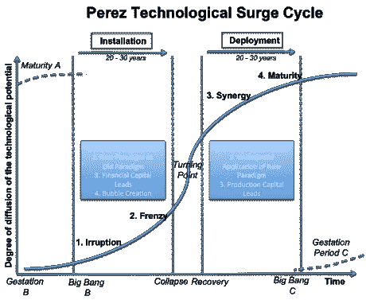

# 为什么区块链不同于传统技术生命周期

> 原文：<https://medium.com/hackernoon/why-blockchain-differs-from-traditional-technology-life-cycles-95f0deabdf85>

## 为什么可能出现另一个泡沫，区块链空间现在应该关注什么

在 2001 年互联网泡沫的余波中，Carlota Perez 出版了她有影响力的书《技术革命和金融资本》 。这项开创性的工作为新技术如何在社会中创造机遇和动荡提供了一个框架。我最初是通过风险投资家弗雷德·威尔逊(Fred Wilson)了解佩雷斯的工作的，他认为这是他的投资论文的关键知识基础。

在 2018 年 ICO 泡沫之后，以及区块链的潜在潜力，许多人将 2001 年的泡沫与 2018 年的泡沫相提并论。最近，我重读了佩雷兹的作品，以思考区块链世界是否能从中吸取教训，并理解当时和现在的相似之处和不同之处。正如马克·吐温可能说过也可能没说过的，“历史不会重演，但它会押韵。”

# 框架概述

在*的《技术革命和金融资本》一书中，* Carlota Perez 分析了过去 250 年中发生的五次“发展浪潮”,每一次都是通过新技术和相关商业方式的传播。数百年后，这些浪潮仍然家喻户晓:工业革命、铁路繁荣、钢铁时代、大规模生产时代，当然还有信息时代。每一个都创造了发展的爆发，新的经营方式，并产生了一个新的成功企业家阶层(从卡内基到福特再到乔布斯)。每个人都创造了经济常识和一套支持新技术的商业模式，佩雷斯称之为“技术经济范式”。每一次激增也取代了旧产业，推动泡沫破裂，并导致严重的社会动荡。

## 技术生命周期

佩雷斯为新技术如何首先在社会中扎根，然后改变社会提供了一个框架。她称这种现象的初始阶段为“装置”在安装过程中，技术展示了做生意和获得财务收益的新方法。这通常会引发对新技术的狂热投资，从而催生泡沫，并引发激烈的技术实验。当泡沫破裂时，随后的衰退(或萧条)是实施社会和监管变革的转折点，以利用狂热期间创造的基础设施。如果发生了变化，随着新技术的有效部署，通常会出现一个“黄金时代”。否则，一个只有富人受益的“镀金时代”就会到来。在这两种情况下，技术最终会成熟，新技术的额外投资和回报渠道会减少。在这一点上，一项新技术的机会出现了。

Image from *Technology Revolutions and Financial Capital*

## 包含-排除

在佩雷斯的框架内，新的技术经济范式通过一个*包容-排斥过程*鼓励和阻碍创新。这意味着，随着新的技术经济范式的部署，它们为企业家提供了动员的机会和创造增长的新商业模式，同时，它们排除了替代技术，因为企业家和资本正在沿着技术经济范式提供的新证明的道路前进。当现有技术达到成熟期，投资机会减少时，资本和人才就会去寻找新技术和技术经济范式。

## 技术结合

一项新技术不足以形成新的技术经济范式。石油和内燃机的结合创造了大规模生产的时代。铁路需要蒸汽机。信息时代需要微处理器、互联网等等。通常，正如佩雷斯所说，一项技术将“孕育”为对现有技术范式的微小改进，直到补充技术被创造出来，旧范式的排斥过程结束。在这个酝酿阶段，技术可以存在相当长的时间，直到技术和机会适合安装阶段开始。

## 狂热和泡沫

在许多方面，安装阶段的狂热所产生的泡沫使得新技术有可能获得成功。泡沫催生了对新技术基础设施(铁路、运河、光缆等)的(过度)投资。).这种基础设施使技术在泡沫破裂后成功部署成为可能。这些泡沫还鼓励了大量新商业模式和新技术的实验，让未来的企业家能够遵循成熟的路径，避免常见的陷阱。虽然泡沫造成了大量的财务损失和经济痛苦，但它对新技术的采用至关重要。

# 将这些点连接起来

快速浏览一下佩雷兹的框架，你会认为 2018 年是区块链的狂热和泡沫，因此我们必须进入区块链的“转折点”这将是一个错误。

我对 Perez 框架的分析表明，区块链实际上仍处于酝酿期，处于安装期之前的技术生命周期的早期。2018 年不是佩雷斯式的狂热和泡沫，因为它没有包括达到转折点所必需的关键成果:重大的基础设施改善和可复制的商业模式，这些模式可以作为部署期间的路线图。泡沫来得很早，因为区块链技术在其生命周期的早期就实现了流动性。

留在酝酿期有三个主要含义。首先，在技术成熟之前，另一场基于区块链的狂热和泡沫可能会到来。事实上，我们可能会面临多个泡沫。第二，成功的最佳途径是从*到*工作，而不是用*对抗*，这是现有的技术范式。第三，生态系统需要大量投资于基础设施，以形成一个新的基于区块链的范式。

## ICO 泡沫不匹配

2018 年确实显示出佩雷斯式的“疯狂时期”进入转折点的许多迹象。赚钱的最佳方式(最终也是最差的方式)是投机。项目的“基本面”很少影响其估值或增长。财富得到了庆祝，个人先知获得了认可。期望一飞冲天。骗局和欺诈盛行。散户投资者蜂拥而入，唯恐错失良机。这种狂热具有典型泡沫的所有迹象。

虽然没有“好的泡沫”，但泡沫可以有好的副作用。在运河热和铁路热期间，运河和铁路的修建几乎没有盈利的希望。投资者亏了钱，但泡沫过后，这些运河和铁路还在。这种新的基础设施使得未来的努力更加便宜和容易。2001 年互联网泡沫破裂后，光缆的售价很低。投资者做得很糟糕，但光纤基础设施为消费者创造了价值，并使下一代公司的建立成为可能。这种对基础设施的过度投资通常是成功部署新技术所必需的。

然而，ICO 泡沫没有佩雷斯式泡沫的副作用。它没有产生足够的基础设施来帮助区块链生态系统向前发展。

与以前的泡沫相比，加密领域在基础设施上的投资很少，很快就会过时。物质基础设施——例如在采矿作业中——不太可能有用。区块链上的额外采矿能力具有显著递减的边际回报和与传统基础设施不同的特征。不像一个城市获得新的光纤电缆或新的运河，新的人不会因为额外的矿工而进入区块链。此外，工作证明采矿不太可能是区块链前进的道路。

非物质基础设施也很少。最能被描述为“核心区块链基础设施”的工具并不容易进入 ICO 市场。开发工具、钱包、软件客户端、用户友好的智能合约语言和云服务(仅举几例)是推动区块链技术走向成熟和全面部署的基础设施。通过 ICOs 提供的廉价资本主要流向了应用层(即使整个房子已经建立在不成熟的基础上)。这激励人们关注那些容易获得资金的东西，而不是最需要的东西。这些不正当的激励措施可能实际上伤害了关键基础设施的发展，并分裂了生态系统。

我不想对生态系统的状况感到绝望。ICO 泡沫带来了一些好东西。人才济济。初创公司一直在尝试不同的用例，看看什么能坚持下来。推出了新的区块链，采用了广泛的新技术和方法。新技术已经进入市场。许多核心基础设施项目筹集了资金，并取得了重大技术进步。企业创造了他们的区块链战略。一些非常成功的公司诞生了，它们将继续资助该领域的创新。整个生态系统继续以极快的速度进化。然而，总的来说，这场泡沫并没有留下人们在佩雷斯式泡沫后所期望的基础设施。

## **流动性提前到来**

2018 年的 ICO 泡沫发生在区块链技术生命周期的早期，即孕育期，这比 Perez 的框架预测的要早得多。这是因为技术本身在生命周期的早期实现了流动性。在基础技术成熟之前，金融资产就变得具有流动性。

在互联网泡沫时期，公司花了很多年才上市，因此有一些质量门槛和一些报告要求。这一过程使技术在流动性到来之前得以迭代和改进。因为区块链启用了几乎可以免费发行的流动代币，所以人们争相创造有价值的代币，而不是有价值的公司或技术。你可以创建一个流动资产，而不需要在底层技术上做任何工作。金融层直接进入流动状态，而技术则被抛在后面。由此产生的代币存在于由动量驱动的非常薄的市场中。

由于早期的流动性，与技术相关的空间的泡沫动力学能够早期开始。毕竟，这不是第一次区块链泡沫(比特币已经有了丰富的泡沫和崩溃历史)。这些资产所在的稀薄市场很可能加速了泡沫的发展。

## **区块链领域现在需要关注什么**

在泡沫的余波中，佩雷斯概述了成功部署新的和持久的技术的两个必要组成部分:经过验证的、可复制的商业模式和易于使用的基础设施。区块链尚未达到这些目标，因此很明显的结论是，区块链尚未处于“转折点”

虽然协议的发展速度很快，但区块链还没有准备好大规模部署到新的技术经济范式中。我们没有经过验证的、可复制的商业模式来扩展产业。交易所和矿业公司是区块链的主要成功案例，它们的商业模式不可复制，也不跨行业。我们还没有大规模采用的基础设施。此外，越来越受欢迎的用例大多支持现有的经济系统。Komgo 正在利用区块链来改善一个令人难以置信的过时行业(贸易金融)，但它仍然在传统的经济模式下运作。

因此，区块链仍处于“孕育期”。在大多数技术能够进入入侵阶段并改变经济之前，它们被用来增强现有的经济。在区块链，这看起来像私人和财团连锁解决方案。

一些区块链人认为这是一个糟糕的结果。我认为这是绝对重要的。如果没有这些实验，区块链就有可能在获得成熟和发展的机会之前，作为一场技术运动逐渐消失。事实上，ConsenSys 没有得到我认为它应该得到的信任的一个领域是将企业带入以太坊区块链空间。这种企业兴趣带来了更多的人才，为额外的基础设施埋下了种子，并增加了空间的可信度。相比任何其他短期发展，我更兴奋的是今天企业对区块链的使用。

## **区块链狂潮的未来**

这不是第一次区块链泡沫。我不认为这是最后一次(尽管希望能从过去的 12 个月中吸取一些教训)。佩雷兹的框架预测，当可复制的商业模式在区块链被发现时，另一轮疯狂投资将会出现，很可能导致泡沫。正如弗雷德·威尔逊(Fred Wilson)所写，“卡洛塔·佩雷斯(Carlota Perez)表示，‘没有崩溃，就没有重要的事情发生。’“考虑到现有的资金规模，我认为这是一个极有可能的结果。鉴于区块链技术的巨大潜力，与 2018 年的泡沫相比，泡沫可能涉及更多的风险资本。

下一次狂热将会有与上一次相同的迹象。基本面的重要性将会下降；散户会因为害怕错失良机而入市；欺诈会增加；诸如此类。

# **区块链企业的教训**

Perez 的框架为 PegaSys 和区块链空间中任何严肃的协议开发项目提供了两个直接的战略教训。首先，我们应该继续与传统企业合作。与企业合作将使技术得以发展，并将推动一些商业模式的实验。这是技术生命周期的关键组成部分，也是帮助生态系统迭代的最佳选择。

其次，我们必须继续投资于基础设施和各种技术，生态系统才能取得成功。这乍听起来可能显而易见，但关键是如果我们只关注今天商业上可行的机会，我们将错过新的技术经济范式。我们在以太坊 1.x 和 2.0 中的努力直接诞生于我们帮助生态系统成熟和进化的目标。以太坊和整个区块链的其他团体正在做的工作也朝着这个目标努力。我们坚定地致力于以太坊路线图，同时也认识到以太坊之外的创新给这个领域带来的价值。以太坊的路线图吸取了其他区块链的教训，就像那些连锁店受到以太坊的启发一样。这就是技术发展和进步的方式。