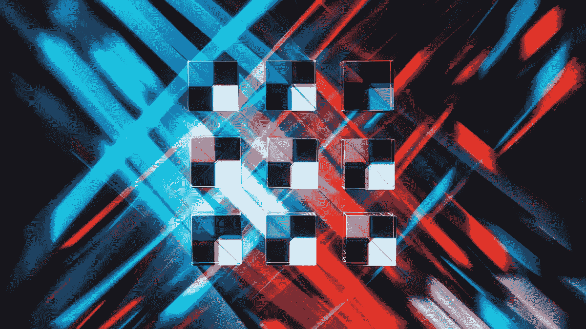

# 为什么区块链是一个寻找钉子的锤子，它可能在哪里找到它

> 原文：<https://medium.com/hackernoon/why-blockchain-is-a-hammer-looking-for-a-nail-and-where-it-might-find-it-adba41facf23>

# 我在这里告诉你大多数人不会说的话

你的项目几乎肯定不会因为选择使用区块链而受益，哪怕是 1%。您没有使用它来做任何创新的事情，这些事情是集中式 Oracle 数据库在 20 年前做不到的。这是故作姿态的区块链影响者和寻求快速赚钱的工程师未能分享的。他们绝对没有做任何新的或创新的事情。

你正在做的是建立一个打击你自我的虚荣项目。你使用区块链技术不是因为你不得不这样做，你使用它是因为你想并且认为它会给其他人留下深刻印象。真可悲。

顺便说一下，人工智能和机器学习几乎普遍如此。两者都已经腐烂，成为空洞的形容词，用来描述两者都没有特征的功能。它们只不过是花哨的客厅把戏，涉及在非常小的特定领域活动的自动化机器人。

可悲的现实是，我们生活在复制时代，创新的欲望无处可寻。相反，人们盲目地关注现有事物的复制。他们在他们的模拟世界中使用什么，并支持他们对这个为数字去中心化时代重建的事物的想象将如何改变世界。当然，这听起来可能令人印象深刻，但当你分析细节时…

对于权力下放是什么、它的目的以及为什么它会是达到目的的一种手段，存在着根本性的误解。不理解在基本原则中，我们被判重复过去的错误。就像互联网爆炸一样，加密和区块链将遭遇自己的清算，而且正在快速逼近。只见树木不见森林变得如此困难，以至于你所遇到的一切看起来要么是革命性的，要么就像一场即将颠覆宇宙的垃圾箱大火。

## 你以为 2018 年的崩盘就是它？

差远了。事实上，这是公众情绪失控，与该领域的投资或创新几乎没有任何关系。是的，ICO 是一种投资，但不是通常意义上的投资，也就是说，筹集的资金来自于“[不老练的投资者](http://Sophisticated Investor - Investopedia https://www.investopedia.com/terms/s/sophisticatedinvestor.asp)”(我并不喜欢这个词，但很适合这个目的)。

> 这意味着这些项目是白象，除了在一包烟的背面画草图外，什么也没有。

没有对他们中的任何一个进行尽职调查，他们在一张白纸上筹集资金。焦点不是集中在真实的和已经有工作原型的东西上，而是转移到了金钱奖励上。事实证明，将贪婪作为参与的动机，不太可能带来巨额回报。

机构资本当然有它的缺点，但在大多数情况下，它可以被用来资助那些符合特定期望的项目。这并不能保证他们的成功，也不能保证投资对象是那些反映了世界多样性的人，但他们在投资上的努力不仅仅是心血来潮和祈祷。

> 这是非常遗憾的。我们关注的是那些唾手可得的果实，这在关注如此新颖的技术时通常是没问题的，但在这种情况下，事实证明它们已经腐烂了。低垂的水果不甜。

那么，解决办法就是要求更好，发展诚信。这是为了确保我们的行为正直而非自负。它是关于变得更加勇敢，拥抱失败的可能性，希望或者到达一个更加令人兴奋的目的地。

> 你在再造轮子吗？如果是这样，请使用已经存在的轮子。

不要让你的自我导致更多的痛苦，就像许多项目爆炸了，现在已经崩溃和烧毁。

> 区块链的承诺很明确。它可以在一个不信任的世界里建立信任。拜占庭将军这个短暂问题的最终解决方案。在历史上需要中介来确保信任的地方，技术可以首先减少我们对中介的依赖，然后让它们变得完全没有必要。

这意味着 Airbnb 不需要平台从你的利润中提成。这意味着优步没有了人人都讨厌的无脸鲨鱼。

> 区块链的杀手级 app 还没发明出来。

那是因为人类的贪婪和个人的自私。我们没有建造不可能的东西，而是推卸责任，走容易的路。

> 区块链残酷的事实是，像雷神之锤一样，很少有人有资格使用它的力量。

# 不像雷神之锤，是你的想象力和梦想的勇气决定了你是否会梦想