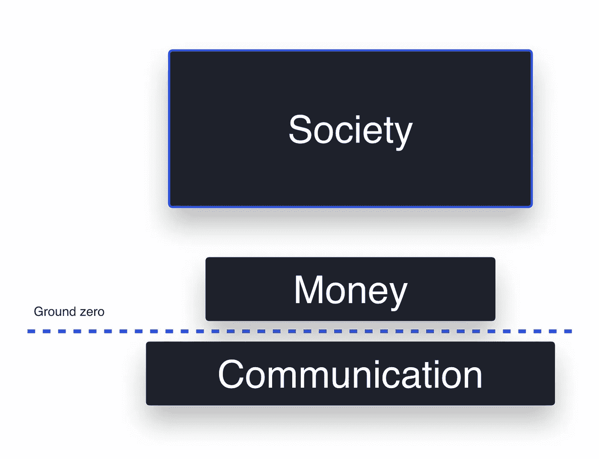

# 区块链为什么重要

> 原文：<https://medium.com/hackernoon/why-blockchain-matters-d8f0cc5f7c8b>

Photo by [Hitesh Choudhary](https://unsplash.com/@hiteshchoudhary)

“比特币是未来，区块链是扯淡”——Andreas Antonopoulous

这句话总结了一种常见的态度，让我觉得既幽默又挑剔。在加密货币的早期，我可能说过类似的话。五年前，我[写了](http://zixg.com/how-not-to-speculate-on-bitcoin)，“无论如何，不要仅仅因为错过比特币而难过就投资另类市场”，这充分抓住了我对另类硬币的厌恶。我的观点现在不同了。我更感兴趣的是将区块链作为一种简单的货币使用，容忍由此产生的任何替代货币。事情变了。

世界一直在与审查制度抗争，但在过去的五年里，数字世界[朝着一个令人不安的方向发展。区块链很可能会拯救世界，而不是比特币。当比特币给了我们金融审查阻力的时候，它也给了我们一个](https://www.politico.eu/article/google-facebook-twitter-censorship-europe-commission-hate-speech-propaganda-terrorist/)[粗糙和不切实际的言论审查阻力](https://bitcointalk.org/index.php?topic=47283.0)的机制。尽管这种机制并不理想，但它继续激励着其他人，如 [Minds](https://www.minds.com/) 和 [Steemit](https://steemit.com) 。

区块链开发者知道使用比特币协议创建内容服务的难度(试着在比特币的基础上建立这种发布服务)。没有妥协和变通办法，这实际上是不可能的。在这里，区块链的狂热分子会争论技术解决方案，但很少有人会争论言论自由的重要性。那么，我们如何建立更好的保护言论自由的内容平台呢？有两种思路:1)创建第二层解决方案，或者 2)创建一个新的、更容易修改的协议。对于比特币最大化主义者来说，后者是一种亵渎。

比特币给了我们一个基本的货币实现，但进一步的扩展是痛苦和尴尬的。当面对一个新的区块链用例时，比特币最大化主义者要么像谚语中所说的“用锤子，一切看起来都像钉子”一样挥舞比特币，要么完全无视这个用例。从经验上来看，这个锤子除了简单的支付之外，并没有取得太多的成就——通常无法满足当今经济的需求。例如，比特币协议不支持循环支付，这是现代数字服务中的一种主要金融方式。相当令人失望。不要担心，我亲爱的读者，并不缺少马克思主义者来拯救。

[https://twitter.com/LukeDashjr/status/1087070372607000578](https://twitter.com/LukeDashjr/status/1087070372607000578)

## 区块链在比特币之外拥有合法性

*技术*往往是解放者，而不是产品。AMD、英特尔或德州仪器的 CPU。古腾堡、牛津公报或企鹅上的印刷机。英语、阿拉伯语或汉语。比特币、以太坊或 EOSIO 上的区块链。最大化主义者只不过是一个忠诚于品牌的消费者，并不比极客们争论苹果和微软好多少。

成功赚钱的基石是自信。因为替代连锁店可能会损害人们对区块链的信心，一些最大化主义者感觉受到了威胁。你当然不能让货币随意涌现来满足每一个突发奇想。[当然](/science-and-technology/how-to-spot-a-weak-argument-83dacb1fe14c)不会！？有时替代区块链是多余和牵强的，但其他时候他们是必要的。当我想到 [Dentacoin](https://coinmarketcap.com/currencies/dentacoin/) 的时候，我仍然会暗自发笑，但是我从来不会为以太坊和 EOSIO 这样令人信服的区块链案例而发笑。有些连锁店是合法的。社会除了钱，还需要去中心化。

“比特币成为唯一选择的那一刻……我们将在比特币社区看到的腐败和滥用权力的程度将要求我们建立一些东西来扰乱它。”— [安德烈亚斯·安东诺普洛斯](https://decryptmedia.com/5253/andreas-antonopoulos-bitcoin-maximalism-adoption-ethereum)

## 最大化是一种干扰

比特币最大化是一种干扰。一篇精心组织的名为“为什么比特币很重要”的文章为比特币最大化的一元天堂提供了支持。这篇文章甚至强调了紧迫性，“作为一个社会，我们有一次机会，如果我们通过在其他垃圾上浪费时间来稀释我们的影响，我们会损失时间和精力(往好里说)，往坏里说；我们输了。”真的吗？一次机会？我最好完全同意，以免社会输掉这场所谓的战斗。

“为什么比特币很重要”对我来说是不可抗拒的，尽管我花时间沉浸在作者的思维模式中，但人们只能到此为止。我以前看过比特币最大化主义者的文章，但从来没有像这样。这是试图证明比特币极大主义。这篇文章引入了一个“社会堆栈”的概念，后来被用来断言比特币的首要地位。虽然我最初发现“社会堆栈”很有趣，但经过几秒钟的考虑后，这个分析框架似乎被设计成限制思维。

The Societal Stack by [Aleksandar Svetski](https://hackernoon.com/@AleksandarSvetski?source=user_popover) in [https://hackernoon.com/why-bitcoin-matters-c8bf733b9fad](https://hackernoon.com/why-bitcoin-matters-c8bf733b9fad)

这叠书有一个奇怪的设计。作者首先从[智人](https://www.amazon.com/Sapiens-Humankind-Yuval-Noah-Harari/dp/0062316095/)那里借用了“共享虚构”的概念，比如国王、宗教、公司、法律、国家、人权和种族——甚至金钱。下一步是用所有的“共享虚构”来填充*社会*的类别，但是**巧妙地省略了金钱**——一个公认的“共享虚构”这是一个貌似有理的步骤。最后一步是安排图表，使*金钱*位于*社会*之下，从而得出结论:社会的基石是语言交流+金钱。

除了天生的语言天赋之外，我们还被引导向一个全是建立在语言和金钱之上的人类的白板。忘记传达我们正义感的镜像神经元。忘记通知我们一夫一妻制行为的进化根源。我们可以忽略这些联系，把一切都扔进社会群体中。有没有可能社会是以人性固有的其他属性为前提的？不，不，*金钱*是这里唯一的支柱，方便地归类在*社会*之外——不需要进一步考虑。因此，分析结论是，比特币，一种货币工具，才是最重要的。很难对图表提出异议。结案了。将死。

## 区块链代币可以不同于比特币

作者指出，比特币是“一种货币现象。不是技术上的。这是大多数人一开始就理解错误的地方。”但是作者从来没有考虑过，也许交替区块链的目的不是为了成为一种“货币现象”也许这是不可理解的，因为“社会堆栈”的限制。

作者在描述那些对比特币的性能或协议不满意的人，以及那些“打算让它变得更快，或者或许赋予它更多功能”的人时表示，“他们完全没有理解比特币‘赚钱’的原因！!"再一次，我们有一个最大化主义者忽视比特币修改可能超越比特币“货币性”的例子。

对于普通的极端主义者来说，交替链及其相应硬币的真实清单是一个过于宽泛的概念。以太坊的令牌 ETH 更像是一种商品——一种具有效用的东西，因为它在网络中的作用就像“气体”。EOS 令牌是网络带宽和 CPU 的分配。这些价值主张与比特币截然不同。作者似乎认为，另类区块链都试图抓住比特币的本质，并因此因不是比特币而失败——这是一个很好的同义反复。

比特币最大主义者的立场往往与比特币关系不大，而与最大主义者的个性关系更大。这是对一个运动队或国家坚定不移的忠诚。他们用最高级和最紧急的语言说话(偶尔给我们看简化的图表)。比特币最大化主义只是许多不同部落中的一个，每个部落都有相同的理由。

要警惕。最大化主义者不会反思或自我质疑。如果我是部落和煽动性的，我可能会说 maximalists 是加密采用的最大威胁，但这根本不是真的。事实是，最高纲领主义者无关紧要，因为我们不需要他们的许可来建设和探索区块链的未来。

“这就是为什么我经常被称为最大化主义者，但我不在乎”——亚历山大·斯维特斯基

*关于作者*

*布里特·金是 Y Combinator 的校友，也是 Patreos 的创始人。他联合创立了 DataRank，该公司于 2015 年被 Simply Measured，Inc .收购。自 2013 年以来，他一直深入参与区块链科技。*