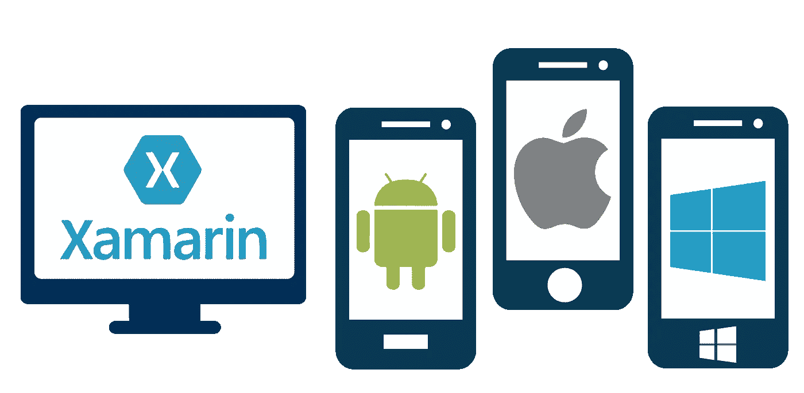

# 为什么面向企业的跨平台移动应用需要 Xamarin 集成

> 原文：<https://medium.com/hackernoon/why-cross-platform-mobile-apps-for-enterprises-need-xamarin-integration-6dde2823da24>

由于我们现在生活在一个高度数字化的世界中，移动应用程序，无论其支撑的平台如何，都越来越受到人们的关注。此外，他们提供的功能和特性极大地方便了用户的生活，他们得到广泛的认可并不令人惊讶。越来越多的企业争相采用它们的趋势也不是罕见的——至少不再是了。然而，对移动应用的这种需求意味着帮助构建它们的人，即开发人员，必须确保利用加固技术来创建它们。因此，就本地应用而言，Xamarin 是一个领先的名字。

然而，人们可能想知道到底是什么使得 Xamarin 如此容易获取。嗯，有各种各样的原因实际上将 Xamarin 推向了开发界的超级明星行列。多年来，这个框架已经证明了它作为一个值得信赖的资源为各种平台(包括 iOS、Windows 和 Android 等)创建高质量移动应用的能力。

现在，让我们详细了解一下为什么每个企业都必须使用 Xamarin 来开发移动应用程序。

1.**高质量的 app 开发:** Xamarin 提供了两个优秀的工具，分别是 Xamarin forms 和 Xamarin Native，有助于原生跨平台 app 的开发。这个框架允许多达 75%的代码与 Android、Windows 和 iOS 的集成用户界面库共享。此外，当使用 Xamarin 进行原生应用程序设计时，您可以放心，该应用程序不仅具有多种特定于设备的功能，还为用户提供了可访问性。

2.**访问语言:** Xamarin 使开发人员能够访问大量编程语言库，包括 C、C++、Java 和 Objective-C

3.**轻松集成:**使用 Xamarin 表单，开发人员可以加快集成和配置过程。该框架还简化了与各种按钮、标签、手势支持和列表等本地应用程序开发环境中必需的控件共享后端代码。

4.**新颖的绑定链接:**如果你正在使用 Xamarin 进行跨平台应用程序开发，那么它的软件开发工具包(SDK)在提供应用程序的流畅使用和导航方面非常方便。此外，它还帮助开发人员避免开发过程中的滞后和错误。

5.**性价比高:**它具有一套独特的功能和特性，有助于降低开发成本和开发人员的工作量。除此之外，Xamarin 强大的数据库、网络支持和序列化等功能进一步帮助节省了资金和宝贵的时间。

当谈到移动应用程序时，今天的用户被宠坏了。虽然这对他们来说很好，但这也意味着企业必须加倍努力，确保他们提供的应用程序高度可访问，并具有出色的功能。那么，有什么比利用 [Xamarin 解决方案](https://www.rishabhsoft.com/mobile/xamarin-app-development-services)的潜力更好的方式来实现这一目标呢？