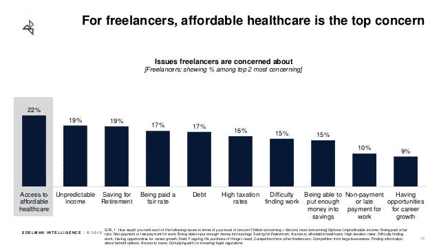
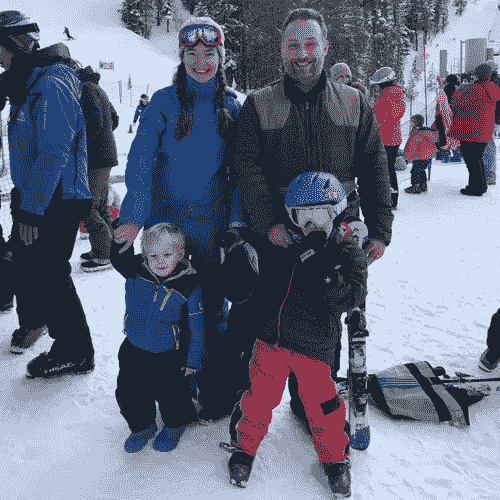

# 为什么正派首先服务于自由职业者

> 原文：<https://medium.com/hackernoon/why-decents-serving-freelancers-first-ff6682f56b30>

## 工作的未来配得上健康保险的未来。

在开始体面的工作之前，我花了六个月的时间做自由职业者。我在旧金山的一个联合办公空间的热门办公桌上做付费增长项目，并认识了那里的其他自由职业者——有天赋的开发人员、创意人员和商业专业人士，他们有勇气和技能为自己下注。我学到了每个在职自由职业者都知道的东西:这个职业令人振奋，但并不容易。往往很孤独。工作是盛宴或饥荒。缺乏负担得起的健康保险会造成伤害。

[Freelancing in America](https://www.slideshare.net/upwork/freelancing-in-america-2018-120288770/1) survey, 2018

我的四口之家在医疗保险上的花费超过了我们预算中的任何项目——包括在海湾地区的房租。感觉不对，事实也的确如此。

My family

[健康保险费和自付费用](https://hackernoon.com/why-is-health-insurance-in-america-such-a-bad-deal-part-1-8888976900e5)处于历史最高水平，而[错位的激励措施](https://hackernoon.com/why-is-health-insurance-in-america-such-a-bad-deal-part-2-fd9b51606c0b)使它们持续上升。将近一半自己买保险的美国人没有得到补贴。许多自雇人士支付短期或灾难性的计划，不包括严重的疾病，或者根本不买保险，把他们的生命和家庭置于风险之中。

我很幸运成为致力于解决这一问题的令人惊叹的团队的一员。我们中 90%的人都是自雇人士，感受到了这些痛苦，我们所有人都从事着我们不喜欢的工作，至少部分是为了获得医疗福利。

今天，超过三分之一的美国人是自由职业者。作为一种职业，自由职业的发展速度远远超过传统就业，尤其是在年轻、高收入和政治活跃的人群中。大多数自由职业者说，再多的钱也无法让他们接受传统的工作。

但是，独立创业比想象的要困难，因为直到最近，雇主们在负担得起的健康保险方面一直处于功能垄断地位。大团体比小团体获得更好的保险费率，历史上自由职业者不能联合起来获得大团体保险费率。但这一切都改变了。

体面将利用新的法规来管理自雇人士负担得起的综合健康计划，包括自由职业者、独资经营者和独立承包商(1099s)。法规不会让我们马上为每个人服务，尽管我们希望最终能这样做。我们今年将从德克萨斯州的奥斯汀开始，最初将服务于在特定商业、创意、健康和技术领域从事知识型工作的个体经营者。看看你或你认识的人是否有资格:

**商业**:会计师、商业分析师、顾问、数据分析师、金融分析师、保险代理人或经纪人、律师、市场研究员、营销人员、房地产经纪人或经纪人

**创意**:演员、建筑师、艺术家、设计师、插画师、音乐家、摄影师、摄像师、翻译、作家

**健康**:持照保健专业人士

**技术**:数据科学家、开发人员、IT 专业人员、QA 测试人员、科学家

如果你或者你认识的个体户符合条件，你可以在[我们的网站](https://www.decent.com/)了解更多。

如果您有任何问题，包括我们何时能够为您服务，请发电子邮件至[hello@decent.com](mailto:hello@decent.com)联系我们。

如果你为自己工作，正派想为你工作。