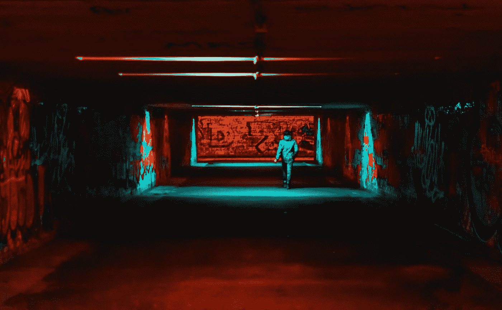

# 黑客为什么要黑？

> 原文：<https://medium.com/hackernoon/why-do-hackers-hack-75820783a15f>

## 职业黑客内部采访。

Photo by [Artem Saranin](https://www.pexels.com/@arts?utm_content=attributionCopyText&utm_medium=referral&utm_source=pexels) from [Pexels](https://www.pexels.com/photo/person-wearing-jacket-walking-on-tunnel-with-red-and-green-lights-1055845/?utm_content=attributionCopyText&utm_medium=referral&utm_source=pexels)

## 是什么让你迷上了黑客？

“我的罪行是好奇心”,这是导师从 1986 年 1 月 8 日写的[黑客宣言](http://phrack.org/issues/7/3.html)中引用的一句话。这份宣言开启了当时我所不知道的东西；对技术各个方面的终生兴趣。在 20 世纪 80 年代末，在正确的地点和时间，我是数字互联网的模拟儿童。我记得看着母亲拆开我们的电视机和录像机，这样她就可以自己解决问题了。我父亲的朋友们会在我们的厨房里，在我们的厨房桌子上修理他的工作电脑，试图从我对他的系统(format.exe)的最新命令和破坏中挽救系统。一直以来，作为一个好奇又感兴趣的孩子，我观察着每一步，对着我不懂的东西提问，在大家都长眠之后，偷偷试着重现我早先目睹的步骤。

出于这种好奇心，我开始对一些事情感兴趣，比如在游戏中编辑我的名字，这让我学会了十六进制编辑，编写病毒，这让我学会了编程语言，最终系统黑客让我有了今天的职业生涯。

> “我的罪行是好奇心。”——[黑客宣言](http://phrack.org/issues/7/3.html)

## **你听过最诡异的被黑的事是什么？**

约翰迪尔拖拉机。几年前，农民面临着严峻的现实:由于制造商安装的固件锁定控制，他们无法对拖拉机进行维护和维修。美国农民想出了如何在拖拉机上加载乌克兰固件，从而允许他们自己进行维修。让我震惊的是，在一个与信息安全完全不同的世界里，有一种职业正在做着诸如绕过固件和制造商锁之类的事情。我非常喜欢能够用您合法拥有的硬件做您想做的事情。

## **你有过最狂野的黑客故事是什么？**

在东海岸的黑客大会上，我结识了一些世界上最好的开锁人和城市探险者。大会在纽约市中心的一家历史悠久的酒店举行，据传闻，这家酒店与废弃的地铁隧道、维修储存设施和无家可归者营地的迷宫相连。这些人是世界上最棒的，他们有无数的技巧，万能钥匙，以及我从未想象过的进入事物的方法。看起来 50 年没碰过的门和锁很快就被打败了。紧张和恐惧是真实的，因为我们谁也不知道下一个黑暗的角落会发生什么。虽然非常危险，但体验纽约市其他人甚至不知道存在的部分也非常值得。

## 我们通过秘密渠道听说你黑了一辆 Lyft 摩托车。告诉我们更多。

哈哈，这不是一个 Lyft 滑板车本身。电动滑板车是最新最酷的硬件之一。虽然它们给了我们一个新的通勤选择，但也给了我们一个新的黑客选择。我用我的一辆个人踏板车做了一些测试，发现了一些我认为值得关注的漏洞。一些早期版本的踏板车可以远程连接，无需凭证，有时会让您能够覆盖各种系统和固件。

 [## 你骑的下一辆电动滑板车可能会被黑

### 欢迎来到未来。

medium.com](/@forwardsecrecy/the-next-electric-scooter-you-ride-could-be-hacked-7cba3dcc64a4) 

## **黑客为什么要黑？**

黑客攻击有各种各样的原因。有些人是为了利润，有些人是为了政治黑客主义，有些人只是享受技术挑战。就我而言，我一直有一种强烈的需求和渴望去理解系统是如何工作的。通过了解系统的规则，我可以找出如何绕过这些规则，甚至重新编写它们，让事情按照我想要的那样进行。有些人需要成为房间里最聪明的人。我需要知道如何黑掉那个房间里的所有东西。

## **关于黑客最大的误解是什么？**

最大的误解一直是黑客是一个书呆子“坐在他们 400 磅重的床上”看星际迷航，而他们试图恐吓你的生活和数据。虽然有些事情是真的，但真正的黑客起源于麻省理工学院、加州大学伯克利分校和各种家酿计算机俱乐部。这些黑客感兴趣的是他们能让一个系统走多远，以及他们能做些什么让它以前没有做过。80 年代末和 90 年代初的黑客们正在测试渗透到我们家庭和生活中的互联网的极限。在现代，黑客有多种形态和形式，从住在街上的无政府资本主义者，一直到军队中执行网络战和间谍活动的超级秘密部门。

## 你收到过的最好的职业建议是什么？

“再努力一点”。这是[攻击性安全认证专家(OSCP)认证](https://www.offensive-security.com/information-security-certifications/oscp-offensive-security-certified-professional/)的口头禅。OSCP 是一项密集的渗透测试认证，最终通过 24 小时的动手黑客考试。没有太多的暗示，大多数情况下，你只能靠自己。“更加努力”的自我服务/自我激励的心态不仅帮助我度过了技术问题，也帮助我度过了人生。

## **如果一个孩子走过来问你的建议，而你只有几分钟时间给他们你最好的建议，会是什么？**

质疑一切，确保你总是不断尝试。毅力是成功黑客的一个关键属性。如果你不知道什么，就去查。找个懂的人。下载源代码，然后自己编译。打破它，重建它。有时候，你需要在凌晨 3:00 撞上那堵疲惫和咖啡因耗尽的墙，然后你才能换个角度看问题，找到正确的答案。

我更实际的技术建议是学习 Python 或 GO 编程语言。我可以编写 HTTP 服务器来快速处理漏洞，管理反向外壳的侦听器，为漏洞创建外壳代码，编写我自己的网络扫描器，以及在您有机会注意到我试图接管您的计算机之前让我的生活变得容易得多的其他事情。