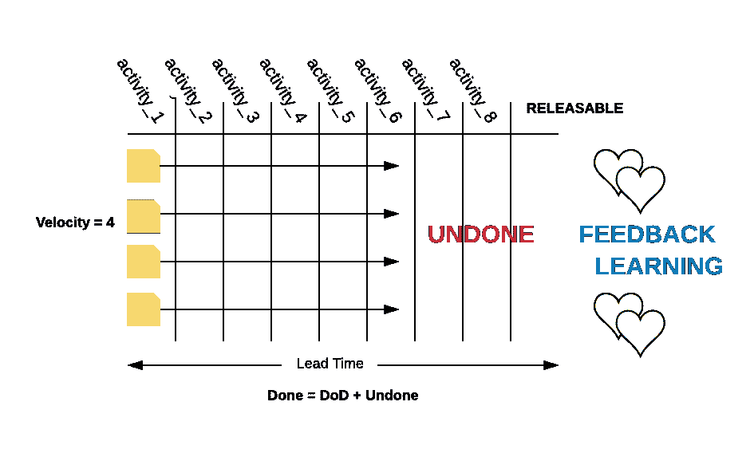
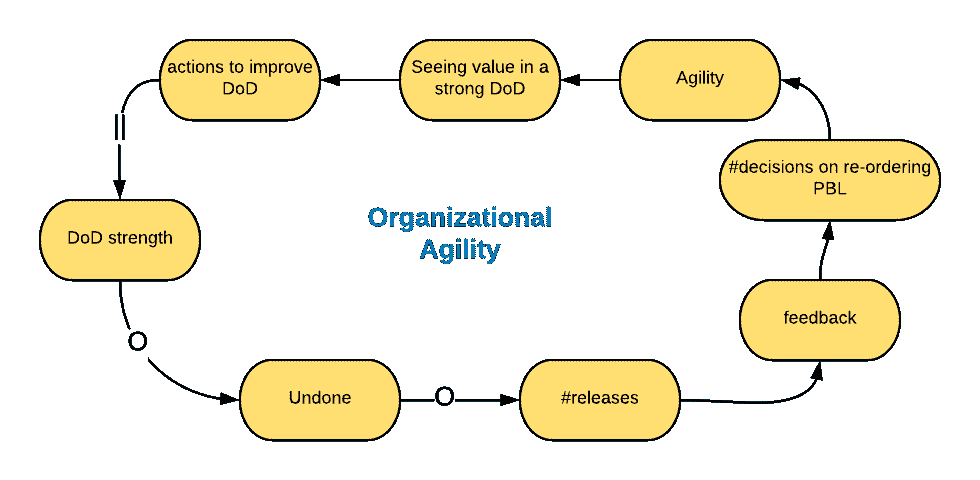
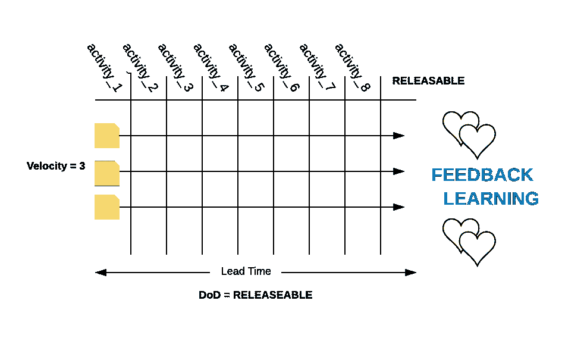

# 为什么关注速度会抑制敏捷性

> 原文：<https://medium.com/hackernoon/why-focus-on-velocity-inhibits-agility-fe12d1396b86>

由专业的 Scrum 训练师，[伊利亚·帕夫利琴科](https://www.scrum.org/user/144)，【Scrum.org】T2

在这篇文章中，我将讨论当产品所有者、Scrum Master 或者组织的管理层将开发团队的注意力集中在速度上时，可能出现的危险动态。

**速度指的是什么？**

速度的概念表示:

开发团队将产品待定项转换成可发布的产品增量的速度。

请特别注意高亮显示的单词。当一个开发团队能够交付一个增量时，特征速度是适用的，这个增量至少在每个 Sprint 中发布一次。在本例中，Done = DoD = releasable。厉害！

但即使在这种情况下，速度也不会显示:

*   客户的问题是否得到解决。
*   团队是否在处理最优先的问题。
*   交付的价值金额。
*   客户满意度。

*速度只能表明团队正忙于某事。*

但是，这是产品和服务成功的准确衡量标准吗？客户对产品的评价是基于公司员工的忙碌程度吗？

换句话说，速度反映了开发团队的产出量。不幸的是，这不足以创造成功的产品和服务。

**组件团队的特征速度= 0**

组件团队拥有最稳定的特性速度。因为它总是等于零。根据定义，组件团队不能将产品待办事项转化为客户的价值。至少他们需要与其他组件团队集成。

**当团队有未完成的工作时**

在我看来，最危险的动态出现在开发团队不能在每个 Sprint 中生成可发布的产品增量的情况下。这意味着 Done = DoD+undo，团队只优化整个流程的一部分。

让我们研究一个系统图，它显示了国防部的力量和组织灵活性之间的联系。

国防部越强大，冲刺阶段未完成的工作就越少。未完成的工作限制了团队潜在发布的数量，因此，也限制了可以从市场收到的反馈的数量。反馈越多，产品负责人就可以做出越多的关于重新订购积压产品的决定。这可以被称为组织敏捷性——能够快速改变产品开发的方向。这可能会促使 Scrum 团队进行额外的改进，以创建一个更强大、更详尽的 DoD。

**通过加强 DoD，速度降低** d **成为现实**

DoD 的加强是如何反映在速度上的？速度至少在短期内会降低。但是如果目标是流程优化(最短交付时间)、学习和敏捷性，这不是问题。速度降低，变得更真实！

但是，如果开发团队知道团队效率是根据速度来评估的，那么他们加强国防部的可能性有多大呢？

我的答案是不太可能。专注于速度让团队远离加强他们的国防部。因此，这抑制了来自市场、学习和敏捷性的反馈。

*关注速度会抑制组织的敏捷性。*

很多年前，当我还是一个年轻的、没有经验的 Scrum 大师时，我把我的团队过度地集中在速度上，这降低了他们的敏捷度，增加了未完成的工作量。如今，我对刚刚起步的 Scrum 大师的建议是这样的:

*如果你的团队不能产生至少在每个冲刺阶段都是可释放的增量，那么忘掉速度吧。首先专注于加强你的国防部。*

那么我们应该衡量什么呢？

我建议关注那些显示向市场交付实际价值和满足客户需求的能力的指标。例如，Scrum.org 开发了框架[循证管理](https://www.scrum.org/resources/evidence-based-management)，并提供了一系列指标，显示:

*   团队长期创造价值的能力
*   价值产生的速度(时间 2 市场)。
*   向市场传递了多少实际价值。

总之，总之

我想再一次重复我想通过这篇文章传达的基本思想。Scrum 的基本思想是创建一个增量，至少在每个冲刺阶段都是可发布的。如果您的团队已经处于那个阶段，那么速度的概念是有用的，并且真实地展示了团队将产品 Backlog 项目元素转化为增量的速度。如果不是，请重点加强完成定义(DoD)和流程优化。

**文章的主要观点**

*   速度表示开发团队将产品待定项转换成可发布的产品增量的速度。
*   速度并不显示客户的问题是否被解决，也不显示价值是否被交付，因为它反映了产出的数量。
*   速度只能表明团队正忙于某事。
*   组件团队的特征速度总是为零。
*   当团队把重点放在速度上而没有完成时，他们不太可能加强国防部。
*   关注速度会抑制组织的敏捷性。
*   关注实际交付给市场的价值。

**争分夺秒！**

*原载于 2019 年 2 月 15 日*[*agilix . nl*](https://agilix.nl/uncategorized/why-focus-on-velocity-inhibits-agility/?lang=en)*。*