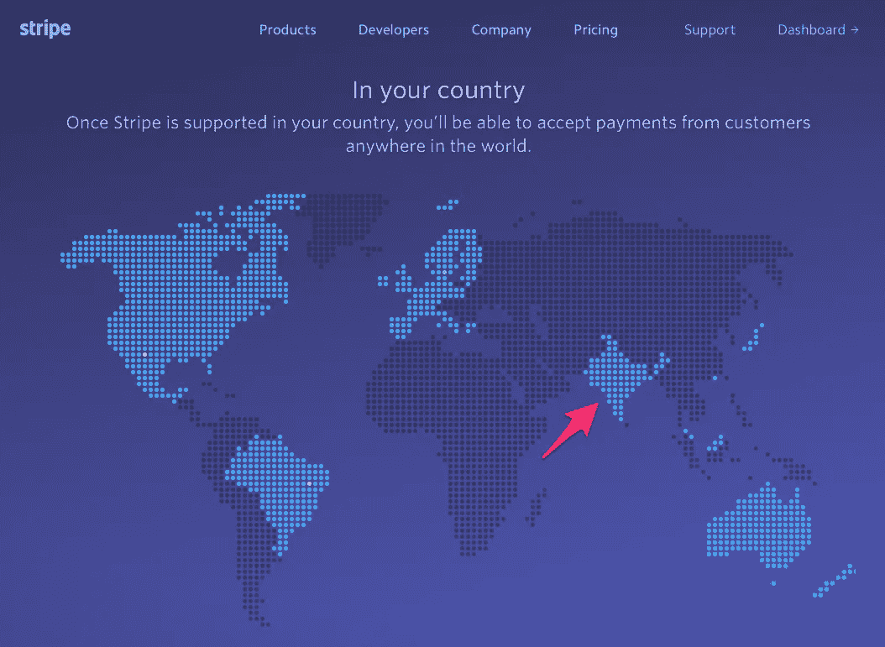
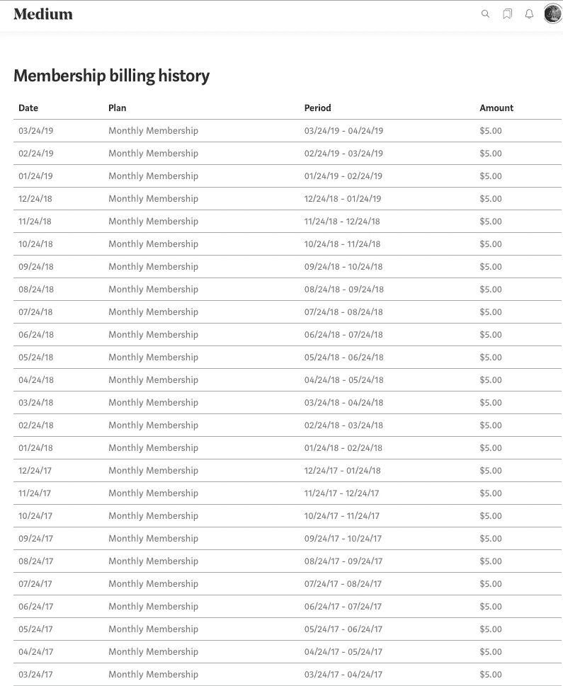
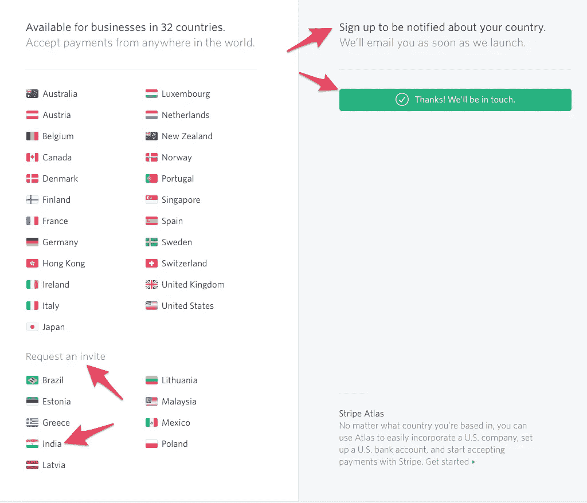
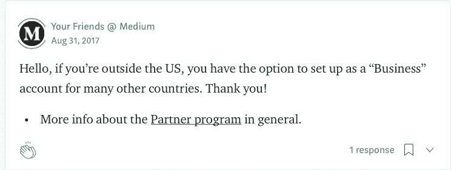

# 为什么我退出我的媒介会员

> 原文：<https://medium.com/hackernoon/why-i-quit-my-medium-membership-909909657ba>

## Medium 不付钱给来自欠发达国家的作家，但对拿走我们的钱毫无顾忌

**Fiction**: This maps shows countries where Medium pays writers (via Stripe), and includes India.

[*(链接*](https://wp.me/pbmBIW-1g) *到 WordPress 上的同一篇文章)*

我是一个住在印度的媒体成员。今天早上，我意识到我的中型账户的信用卡要到期了。所以我去了我的介质帐户的设置页面，检查我是否可以更新我的卡的详细信息。我发现按钮上写着“使用新卡”，但也注意到另一个按钮上写着“查看账单历史”。出于好奇，我点击了它，出现了一长串从 2017 年 3 月 24 日开始每月支付 5 美元的清单。两年，准确地说是 25 个月。会员费总计 125 美元(₹8,645)。这让我停下来，想想我花了 125 美元得到了什么。

## 根据你的居住地进行区分

Medium 有一个合作项目，为平台上的作家付费。这个项目只支付位于 23 个国家的作家，这些国家大多比较富裕。生活在世界欠发达地区的作家得不到报酬，因为 Medium 的支付合作伙伴 Stripe 不在那里提供服务。

简而言之，Medium 避免纯粹根据作家的居住地来支付报酬。这是不对的。

一年前，我写了一篇文章，就如何在 Medium 的魅力圈子之外找到一个向作家支付报酬的变通办法提出了建议。

 [## Medium 是想让富人更富吗？

### 给媒体一些建议，告诉他们如何向第三世界的忠实作者付费

medium.com](/indian-thoughts/is-medium-trying-to-make-the-rich-richer-f47d10217b50) 

媒体声称正在努力解决这个问题。但是自从我的上一篇文章以来，一年过去了，毫无进展。

## 双重标准的震耳欲聋的沉默

对支付相同会员费的 Medium 作家采用两种标准显然是不公平的。尤其糟糕的是，Medium 对这些无报酬作家的问题保持了震耳欲聋的沉默。我浏览了媒体自己的博客。甚至没有提到或讨论关于没有报酬的作家。就像我们不存在一样。这意味着媒体意识到了这个问题，但是如果他们继续忽视它，希望它会消失。

假设 Medium 真的无力支付这些黑名单国家的作家，那么为什么不以其他方式奖励他们呢？

这里有个建议。

来自黑名单国家的作家应该像他们在美国的更幸运的非黑名单同行一样，对他们的“掌声”进行评估。当或者如果这个值等于 5 美元，它应该被用来支付他们下个月的会员费。任何超过 5 美元的款项都可以存入他们的账户，并在 Stripe 解决支付问题时支付。这可能不多，但至少对 Medium 来说是一个好的姿态。

现在，如果我能在不暂停打字的情况下想到这个想法，我相信 Medium 的研究人员应该能做得更好。如果没有，解雇他们，雇用有头脑的人，并确保他们也有一颗心！

我一直相信人性本善。我觉得如果人们有选择，他们通常会做正确的事情。因此，当 Medium 说他们正在试图解决这个问题时，我就假定他们是无辜的，并继续支付了整整两年的会费。

## 好的，坏的，中等的

我和 Medium 的关系始于 2015 年。我完全是偶然发现这个网站的，并且立刻爱上了它简洁的设计和易于写作和发布的独特融合。我非常喜欢这个平台，以至于在接下来的一年里，我发了一大堆文章，也不在乎是否有人阅读。在那个时候，Medium 还没有引入会员费或建立付费墙。所以钱不是问题的关键。事实上，对我来说，除了写我想写的东西的快乐之外，没有什么真正的东西，比如这个关于一个被偷的 iPod 的故事。

三年后，我在 Medium 上的统计显示我已经写了 323 个故事。由于 Medium 将我对故事的回应/评论贴上了个人故事的标签，我猜测我发表的故事的真实数量将接近 200 个。

这仍然是相当多的文字，显示了我对平台的参与。像任何企业一样，我知道 Medium 需要收入才能生存。我也意识到 Medium 在尝试做一些以前没有做过的事情，所以肯定会有错误。所以我并不担心他们会改变方向。就像当初他们允许平台上的广告产生收入，但后来他们改变了决定，从广告转向付费墙。最重要的是，我认为值得称赞的是，他们制定了一个制度，从媒体成员的月费中支付作家。“鼓掌”系统并不完美，但我会给尝试的人打中等分。

我不欣赏 Medium 的是上面提到的歧视。他们为什么这么做？一旦 Medium 开始从会员费中赚钱，情况会有所改变吗？正如歌中所唱，“金钱改变一切。”

## 不称职的合伙人

Medium 已经与一个名为 Stripe 的支付平台合作，向其作者支付报酬。当您尝试加入 Medium Partner 计划(Medium 通过该计划向作家支付报酬)时，您将被引导至 Stripe，该计划声称可在 32 个国家/地区使用。其中，23 个是发达国家。这些国家的用户可以使用 Stripe 进行金融交易，没有任何限制。

印度出现在第二个列表中，甚至出现在 Stripe 的活跃国家地图上(见标题图片)。这似乎意味着用户可以通过请求获得一个 Stripe 帐户“邀请”。这是骗人的，因为在过去的一年里，我已经多次请求邀请 Stripe。忘记邀请吧，我甚至还没有收到 Stripe 对我的许多请求的确认。如果你问我，条纹“邀请”纯粹是一派胡言。

印度有无数不同领域的自由职业者，他们从印度以外的公司接受工作，包括美国和欧洲。他们通过许多可用的金融平台获得报酬。我在一年多前写的上一篇文章中已经详细介绍了这个主题。自那以后，越来越多的选择涌现出来，将资金转移到印度。这包括 Stripe 顺便使用的 Google Pay。

我的一个邻居，一位老太太，有一个住在伦敦的女儿。每周两次，女儿会将新鲜食品送到她在印度的母亲那里，同时从伦敦付款。如果个人可以做到这一点，为什么 Medium 在海外定期付款会如此困难？更重要的是，如果 Stripe 不能安排向印度付款，他们肯定是极其无能的。

这也是我对 Medium 选择合作伙伴持怀疑态度的原因。是 Medium 没有意识到 Stripe 有多无能？还是 Medium 故意坚持使用 Stripe，以便有借口避免向印度和其他地方的作家付费？

## 愚弄我两次，我感到羞耻

适可而止。今天算了一下，让我停了下来。解决一个问题需要两年的时间，而 125 美元对于生活在印度的人来说也不是一个小数目。怀疑灵媒和轻信之间是有区别的，我怀疑我属于第二类。

我在一年前就这个问题写了[我的上一篇文章](/indian-thoughts/is-medium-trying-to-make-the-rich-richer-f47d10217b50)，那时我已经交了整整一年的会员费。从那以后，我交了第二年的会员费，我还在忍受 Medium 的“继续努力”的说法。

老话说‘忽悠我一次，不要脸；愚弄我两次，我感到羞耻。”

我已经没有耐心了，是时候考虑我的选择了。

## 选项 1:获得代理

我有一个简单的方法来获得报酬。只需要求在美国或其他 23 个国家的人代表我收取中型作家付款，通过在我的中型账户上注册他们的银行账号。事实上，我住在英国的哥哥自愿这样做。

我很幸运，我有一个值得信赖的人愿意为我做这件事。但是，其他无法获得这些资源的作家怎么办呢？更不用说我哥哥在报税的时候会有额外的麻烦。所以我谢了我哥，说不用了。

Medium 需要给所有作家付费，我不会给他们轻松的出路。

## 选项 2:获得一个 Stripe 企业账户

当我第一次发现 Medium 不向美国以外的作家付费时，我写信给你的朋友@Medium。他们建议我使用 Stripe 商业账户。

显然，这里面有猫腻。这贵得吓人。我在一年前写我的[上一篇文章](/indian-thoughts/is-medium-trying-to-make-the-rich-richer-f47d10217b50)时检查过这一点，我确信这些数字将仍然相似或者可能更高。在这里，让我引用我以前的帖子。

> 你基本上需要开一家美国公司，注册成本为 500 美元，每月运营成本为 25 美元，代理年费为 100 美元，加上其他杂项费用，如法律咨询费 349 美元，税务准备费 250 美元。

这是敲竹杠。我们继续吧。

## 选项 3:取消我的中等会员资格

选项 1 和 2 对我不起作用。所以取消会员资格似乎是我唯一的出路。

## 取消会员资格会损失什么？

取消我的中级会员资格会对我有什么影响？根据我对媒介合作伙伴计划的理解，如果一个作家想要获得报酬，他或她必须成为一个媒介成员( [kayue](https://medium.com/u/a415bcb3f325?source=post_page-----909909657ba--------------------------------) 告诉我这不是真的——见他对我的帖子的回应)。这个论点是不相关的，因为媒体无论如何不会支付我。

作为媒体上的读者，我会受到怎样的影响？坦率地说，我不知道。就像我说的，在付费墙出现之前，我就开始在 Medium 上写作，在付费墙出现之后，我成为了会员。所以不知道 Medium 的付费墙之外的生活是什么感觉。

根据我模糊的记忆，非付费会员一个月只能看三篇文章。我肯定有漏洞可以绕过这一限制，但为什么要这么麻烦呢？从别处寻找好内容要容易得多。

还有什么？有可能 Medium 会因为我发表了这篇充满了对母平台不爱国想法的帖子而把我踢出去。总是为意外做好准备是个好主意。稍等片刻，我将所有帖子备份到 Medium 上。

完成了。

## 广告蓝调

曾经，广告是任何网络企业的首选收入来源。但是，一旦广告开始到处出现，让读者疯狂，影响编辑，激励像脸书这样的公司窃取我们的私人数据，并改变历史的进程，这个世界就开始反对广告。这导致了广告拦截器之类的出现。

当 Medium 决定从其平台上移除所有广告时，它似乎正乘着这股反广告浪潮。我个人认为这是一件好事，虽然它确实切断了 Medium 一个宝贵的收入来源。

我的观点是 Medium 的付费墙是不可避免的。

## 付费墙是未来

脸书仍然从广告中赚取数十亿美元，这意味着广告业正在适应这个不断变化的世界。但脸书将重心转向合并和加密其三大消息平台(WhatsApp、Instagram 和 Facebook Messenger)似乎表明，脸书知道变革是不可避免的。

谷歌展示了如何负责任地使用我们的数据。我使用谷歌产品已经很多年了，它们在很多方面丰富了我的生活，没有滥用我的数据，但愿如此。搜索引擎 Duck Duck Go 也展示了基于“搜索关键词”的广告是一种可行的业务，尽管不如数据共享那样利润丰厚。

然而，事实是，人们越来越不愿意相信广告，更愿意接受付费墙的想法。像 NYT 这样的出版物已经成功地做了一段时间，更多的已经加入或即将加入。

所以，是的，付费墙是一种趋势，如果我想要好的阅读内容，我迟早会订阅付费墙出版物。

## 媒介就像第二辆车

作为一个阅读兼付费写作平台，Medium 得到了我的投票和资金。但是如果我是一个没有报酬的作家，那么“写作”就不在考虑范围之内了，媒体就完全不同了。纯粹基于“阅读内容”的质量，Medium 将不得不与其他出版物争夺我的 5 美元。

我同意 Medium 有很棒的原创内容，但它不可能是我的首选。用一个比喻来说，Medium 更像是第二辆车，而不是你的日常工作用车，我是作为 Medium 的一名作家来说的，他热爱这个平台。(请注意:许多人只用一辆车就能应付。)

以刚刚推出的苹果新闻应用为例。据我所知，它成功收录了一些世界顶级的出版物，在美国每月收费 10 美元。到达印度可能需要一段时间。我猜它可能会在印度以每月 2 美元的价格推出。为什么读者会花 5 美元购买 Medium 的内容，而他们能以差不多同样的价格获得苹果丰富得多的内容？

下面是我如何得出苹果新闻每月 2 美元的定价的。印度是一个对价格极其敏感的复杂市场。看一看音乐行业就很能说明问题。苹果音乐在印度的费用仅为 1.75 美元/月(₹120)，而在美国是 10 美元/月。即使是这个价位，Apple Music 也几乎没有竞争力。Spotify 的高级版收费₹129/month，而基本版则免费。JioSaavn 为 Jio 蜂窝网络的用户提供免费版本，而 JioSaavn Pro 版本需要支付₹99/month 的费用，与 Gaana 和 Wynk 相同。然后是亚马逊音乐。我在₹1000 以 15 美元/年(₹129 为 2 美元/月)的价格订阅了这个服务，因为它是亚马逊 Prime 套餐交易的一部分，其中还包括亚马逊 Prime 购物、亚马逊 Prime Video 上的电影/视频流、Kindle 上的书籍等通常的免费送货服务。我必须补充一点，苹果已经从惨痛的教训中学到了这一点，其定价过高的 iPhone 在印度手机市场仅占微不足道的 1%。至于“新闻”本身，它在印度得到了高额补贴。我每月花 1.75 美元买一份 16 页的印度主要英文日报《印度时报》(Times of India)。

## 是时候表明立场了

综上所述，取消中等会员我损失不大。我仍然可以像往常一样在 Medium 上写作和发表文章(并且没有报酬)。由于一个月三篇文章的限制，阅读将是一种痛苦。我听说有漏洞可以绕过它，比如通过 Medium 的 Twitter 页面访问。即便如此，不断有人抱怨要注册成为中级会员，这将是一个很大的刺激。我真的很想只付这 5 美元，并留在付费墙内。

没有付出，就没有收获。

比起我们需要媒介，媒介更需要像我这样的付费作家。所以如果更多的付费写手停止付费(提示，提示！)，媒体更有可能让他们一起行动，做正确的事情。正如他们所说，金钱万能。

我没有屏住呼吸。2019 年 4 月 24 日，我对 Medium 的下一次付款将到期，由于我不打算更新与我的 Medium 帐户关联的过期信用卡，它将被退回。媒体俱乐部将失去一名成员。

毕竟，如果我不为自己辩护，谁会呢？

*2019 年 11 月 11 日更新*

 [## Medium 现在向印度的作家支付报酬

### Stripe 悄悄地将印度加入了它的工作国家名单

medium.com](/@babulous/medium-is-now-paying-writers-in-india-6a4d232f13a5)