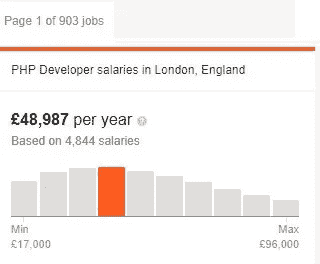
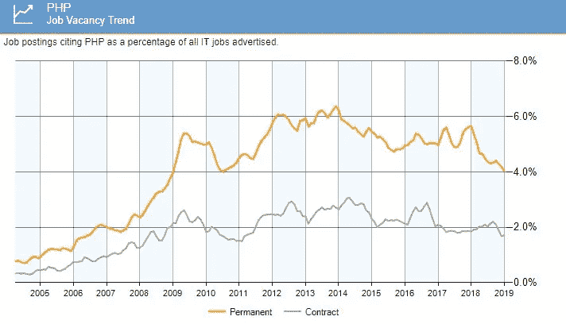
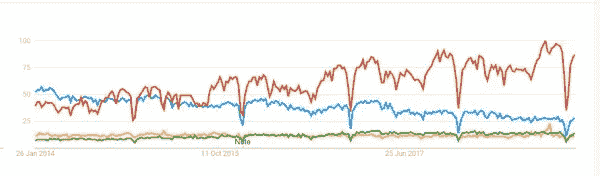
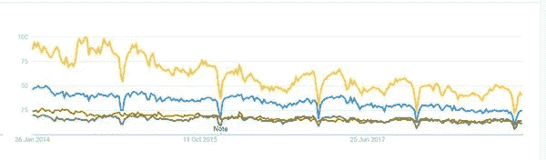
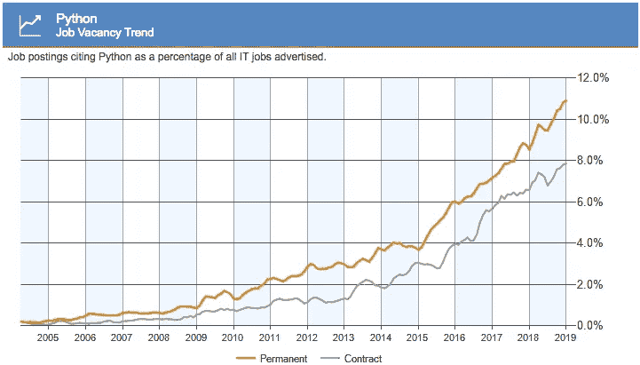

# 为什么沃伦·巴菲特会投资 PHP(你也应该投资)

> 原文：<https://medium.com/hackernoon/why-i-think-warren-buffett-should-invest-in-php-ffd722deb876>

大约一年前，发生了一件让我震惊的事，我相信，这件事永远改变了我的生活。

我仍然记得就像昨天发生的一样，

我刚到办公室，

像往常一样，

我向坐在我前面的同事道了早安，

我刚刚把一杯咖啡放在我桌子的右边，

离键盘和鼠标相当远，以确保杯子掉下来时我不会损坏任何东西，但又足够近，我可以抓住它，而不需要把眼睛从显示器上移开。

我是一个如此努力的人！

在某一点上，

几分钟后，几乎是环境和放松的键盘滴答声被我的一个同事打开门的爆炸声打断，你可以看到，他充满热情，脸上挂着微笑。

他坐下来，开始盯着我们。

他有一个重要的消息要告诉我们，你可以从他充满喜悦的闪亮的眼睛里看出来。

我试着问发生了什么事，

这种情绪的原因是什么，但我甚至没有时间张开嘴，几乎是以相当于 YouTube 上一个视频前 5 秒钟宣传员的速度大喊，我听到了这个致命的短语。

*昨天我投资了比特币！*

记得那些吗？

那时我们正处于密码狂潮中。

每份报纸、社交媒体上的帖子、博客和政治家都在谈论比特币。

对我们中的一些人来说，这是绝对的邪恶，所有这些炒作在几周内就会被其他人接受。这些加密的钱被认为是人类的救星，赋予普通人对抗强权的力量，

**他们是盖伊·福克斯**的数字对比。

我记得在同事之间，我们谈论了几个星期的利弊。

当不同的观点从“*比特币只是一个瞬间的投机*”到“*有一天我的侄子们将使用加密货币和区块链系统进行日常购物*”时，这个主题有太多的话要说。

老实说，我过去和现在在某些方面都更倾向于赞成而不是反对，

然而，

这是改天的话题。

(请随意在下面或 facebook 页面上写下您对此的看法)。

那个时刻留在我脑海中的原因是，回想起来，在那天晚上我回家的路上，我们谁也没有谈论过投资。

这适用于任何事情，从来没有听到我的任何同事谈论房地产，购买企业股票，或共同基金什么的。

尽管如此，**我的一个同事还是花了大约一个月的工资来购买比特币、以太网和所有这些好东西**。

我回到家，爬上楼梯想知道，

*“投资到底意味着什么*”

以下是剑桥大学在线词典中的定义:

投资是投入金钱、精力、时间等的行为。为赚钱、努力、时间等而投资。，用来做这个。

投资就是以某种形式获利，很酷吧？

我被迷住了！

我开始做研究，在网上找到导师，买了几本这方面的书，

一个接一个。

我一直是个狂热的读者。

著名的演说家吉米·罗恩曾经说过，我们是与我们相处时间最长的五个人的平均值。

这意味着，如果我们想提高我们的生活质量，我们必须阅读和分享我们重视的作家的思想，我们希望复制他们的成功。

虽然我不完全同意这句话(我是并且一直是我所有最亲密的朋友中唯一的程序员，可能就像你现在正在读这篇文章一样，当他们的计算机出现问题时，我是第一个打电话的人)，但我只能同意他的解决方案。

**阅读可以让你集思广益，从他的错误和经历中学习**，这在你的朋友圈子里是不可能的。

甚至在那个重大日子过去一年多后的今天，我平均每读三本书，就有一本是关于个人理财和投资的。

了解一些公司如何向客户提供产品和服务，

工作量，

我们在商店里发现的闪闪发光的物品背后的研究和准备，给你对日常生活的另一个新的视角。

就像你详细研究你想购买其股份的企业时所做的研究一样，

在这篇博文中，

我会用一个投资者的眼光来审视 [PHP](https://hackernoon.com/tagged/php) 以及竞争中谁值得‘购买’。

让我们开始吧…

# ROI —投资回报

我们今天的目标是回答这个问题:“*2019 年学什么编程语言最好*？”。

我们将一起做一个**不同后端编程语言之间的比较**。

做生意要检查的第一件事是投资回报，

正如我已经预料到的，投资是指将金钱、努力、时间和其他投入到某事中的行为。

在这种情况下，“某事”是学习一门[编程](https://hackernoon.com/tagged/programming)语言，比如 PHP。

让我们从几个简单的问题开始:

*为什么要学 PHP？*

*学了之后会有什么回报？*

在我写这篇文章的时候，在伦敦最大的在线平台之一上有 903 个工作列表，另外还有 230 个广告，也是在伦敦，在专门从事 IT 工作的平台上，平均工资为 48987 英镑。

不错，说实话一点也不差。

如果我们看看这个星球的科技中心，这个数字会增加很多，

目前在加利福尼亚州，有 1478 个广告，基于 1068 人的薪水，平均每年 106497 美元

在泛亚国家，广告数量较少，但增长率较高。

我想说的是，在海洋的两边，都有足够的需求来平静地入睡。

很明显，最近十年，由于程序员的数量多了很多，竞争也增加了很多。

但是这取决于投入在提高技能上的时间和工作质量，而不是需求

总结一下，

**我想说花时间提高你的 PHP 技能会有很好的回报。**

然而，我们不要忘记，我们还必须考虑外部因素和未来预测。

**外部因素:**

想成为网页开发者的人越来越多。

根据上一代人的说法，要成为程序员，你必须是个天才，

但是现在互联网带来了民主，我们听说朋友和熟人每天都在改变他们的职业。

任何人只要能在一段可爱小猫的视频和来自社交网络的通知之间每天集中注意力至少 10 分钟，就能在几个月内学会编程。

有专门的网站，其中包括让你跟上时代的课程，如果你仔细地遵循这些课程，凭借你学到的技能，即使在几个月的经验后，你也可以找到初级职位。

另一个需要注意的外部因素是我们所处的政治局势，

我不想把这篇文章看得太严肃，但是当你在找工作或者想改变目前的生活方式时，这种民族主义的感觉是没有用的。

无论你在哪里阅读这篇文章，看看这张图片:

英国有现在著名的英国退出欧盟，商业已经开始火了，

欧盟正在经历一场反欧洲主义浪潮，

美国有特朗普和它的墙，

中国去年没有增长这么多。

整件事似乎很糟糕，尤其是从一个从意大利搬到英国、经常参加会议的人的角度来看。

在这次会议中，我看到大约一半的 web 开发者来自其他国家。

停止政治事务，

回到 PHP！

下面的图表显示了从 2004 年到现在 PHP 开发人员的空缺趋势，

正如你所看到的，尽管现在出现了新的"*时髦的*"语言，PHP 在过去的 10 年里没有任何下降

事情看起来稳定了。

# 竞争对手(Python、Ruby、Java、Go)

是时候做一些市场调查，找到最“危险”的竞争对手了。

我们从区分和缩小范围开始，

我们在寻找什么？

如果你正在读这篇文章，你很有可能是或者想开始从事网络开发工作。

具体来说，

这里我们讨论的是后端开发。

就我个人而言，我喜欢将这部分分成子类别，通常是 3 个

它们是:

**脚本语言**，在这里我们可以找到 PHP、Python、Ruby 和 Nodejs 这样的语言。

**函数式语言**，以 Scala、Elixir、Haskell 等而闻名。

高性能语言这里我们讨论 Go，Rust，Java

其他值得一提的语言和平台是 C#，在某种程度上，全新的 AWS Lambda 非常有用，如果你想学习如何无服务器工作的话。

如你所见，竞争对手的名单已经够长了，但我向你保证，我只是触及了表面。

# 市值

在向你们展示数字之前，我想快速浏览一下上面提到的一些节目的表现(从受欢迎的角度来看)。

这是谷歌趋势的图表

在这个图表中，您可以看到 4 种后端语言以及它们的流行程度在过去 5 年中的变化。

特别是，

为了保持朋友之间的东西，所有的都是脚本语言。

红色的是 Python，虽然几年前就已经很流行了，但随着人工智能和机器学习的出现，它已经取得了很大的进步。

蓝色，仍然是第二，即使在近十年没有发布更新之后，(已经被认为是死亡的)PHP 语言。

在黄色和绿色的末端，我们分别有**红宝石**和**节点。**

**这两种语言被认为是所有开发人员的未来，但多年来只是水平移动**。

扩大我们的视野，考虑属于后端的其他类型的语言，我附上了另一个图表。

这一次，它包含了蓝色的 PHP，红色的 Go，黄色的 Java，最后，有史以来最重要和最著名的语言之一:绿色的 C ++。

**你可以很容易地发现 Java 显然是所有语言中最流行的语言，**

其次，PHP 和

最后去和 C ++平起平坐。

下面是从这两个图表中可以学到的经验。

最流行的编程语言在我们的时代仍然是最常用的(参见 Java 和 PHP)。

当然，现在任何人都可以发布新的语言或框架。

在这篇文章中，我实际上已经回顾了超过 24 个 PHP 开发框架。

这影响了最流行语言的流行和使用，因此出现了下降主题。

与此同时，我们有流星，这种语言在很短的时间内被大肆宣传，但在奥运会结束时却没有任何发展。

我想为 Python 写一篇特别的笔记。

这是一种奇妙的语言，也是第一种完全支持和足够数量的适合与人工智能、深度学习和机器学习合作的好库。

可能是近年来为数不多的有上升趋势的语言之一。

简言之，

这看起来像是网络开发者的网飞。

问题是当程序员创造出合适的语言并弥补差距时会发生什么？

第二个问题:

*这个世界真的需要所有这些数据分析师和数据科学家吗？*

# 管理层

另一个要分析的方面是管理。

*首席执行官够好吗？*

董事会是否有相当长远的眼光？

在本节中，

我们将采用上述语言中的一些相同的概念。

# 服务器端编程语言（Professional Hypertext Preprocessor 的缩写）

先从 PHP 开始，马上从答案开始。

对我来说，这是一个不！

我是说，

PHP 4.0 版本发布于 2000 年 5 月，

第五个版本在 2004 年夏天，很公平。

现在，

版本 7(注意我写的是 7)日期是 2015 年 12 月 3 日。

版本 6 无处可寻。

我知道可能会有一些问题，事情并不总是按计划进行，但是

最后，

从现在的版本到之前发布的正式版本已经过去了大约 11 年。

这是不好的，如果不是这个因素，你甚至不会读这篇文章。

必须指出的是，版本 7、7.1、7.2 和 7.3 每年都会发布，用 PHP 编写从来没有如此有趣和高效。

你想知道更多信息吗？

正如哈克里奥的男孩们所写的

PHP 7.x 比任何用 Python 3 编写的应用程序快 3 倍。

这是 Aman Goel 写的完整文章，看看 2018 年[Python vs Php](https://hackr.io/blog/python-vs-php-in-2018)

# Java 语言(一种计算机语言，尤用于创建网站)

Java 就不一样了，

这是从 1996 年到今天出版的版本列表。

JDK 1.0(1996 年 1 月 23 日)

JDK 1.1(1997 年 2 月 19 日)

J2SE 1.2(1998 年 12 月 8 日)

J2SE 1.3(2000 年 5 月 8 日)

J2SE 1.4(2002 年 2 月 6 日)

J2SE 5.0(2004 年 9 月 30 日)

Java SE 6(2006 年 12 月 11 日)

Java SE 7(2011 年 7 月 28 日)

Java SE 8(2014 年 3 月 18 日)

Java SE 9(2017 年 9 月 21 日)

Java SE 10(2018 年 3 月 20 日)

Java SE 11(2018 年 9 月 25 日)

你见过更稳定的东西吗？

最近，新语言占据了很大一部分市场份额，但这是一样的。

**如前所述，几十年前只发生在美国和欧洲最好的大学里的事情，现在由于有了互联网，可以在世界任何地方发生，**

不需要大型机器或大预算。

互联网让一切变得更加民主，这很好。

[这里有一篇关于 Java 历史的好文章](https://jaxenter.com/java-know-your-history-149484.html)

# 计算机编程语言

Python 3.0—2008 年 12 月 3 日
Python 3.1—2009 年 6 月 27 日
Python 3.2—2011 年 2 月 20 日
Python 3.3—2012 年 9 月 29 日
Python 3.4—2014 年 3 月 16 日
Python 3.5—2015 年 9 月 13 日
Python 3.6—2016 年 12 月 23 日
Python 3.7—2018 年 6 月 27 日

即使是 Python 的核心程序员也尽了最大努力，并且总是准时交付。

Python 的创造者吉多·范·罗苏姆成功地创造了一种很酷的语言，它有简单的语法，非常适合 TDD(测试驱动开发)。

我认识几十个学习并欣赏 Python 的 PHP 开发人员。

Python 程序员知道的一个问题是缺少 basic 语言安装提供的特性

因此，

如果你想使用它，你必须使用 Python 库、模块和框架来加速定制软件的开发。

# 去

没有比 Go 编程语言(也叫 Golang)更好的管理了。

罗伯特·格里斯默、罗布·派克和肯·汤普森都是来自谷歌本身的想法。

**在某些方面，围棋看起来像是老好人 c**

但是已经进化并为今天的应用做好了准备。

好消息是，虽然不是脚本语言，但它确实值得学习，即使你已经掌握了 PHP、Python、Node 或 Ruby 的大量知识

戈兰语是一种相对较新的语言。

事实上，

第一个版本于 2012 年春天发布，我们仍处于 2018 年 8 月的 1.11.4 版本。

[Uday hiwa rale 在这里解释了学习围棋的第一步是什么](/rungo/working-in-go-workspace-3b0576e0534a)

# 护城河

“护城河经济”一词，沃伦·巴菲特指的是一家公司相对于竞争对手保持竞争优势的能力。

**目标是保护其他业务的长期利润。**

本节的问题是:

*PHP 在编程界还有护城河吗？*

在说出这些数字之前，让我们先来看看这张图表。

去年 PHP 是 GitHub 仓库中第五大编写语言，是 StackOverflow 中第三大使用标签，

Java 的性能稍微好一点，因为您已经看到 Java 通常有更多的程序员，

Python 做的差不多，在 GitHub 上更好，在 StackOverflow 上更差。

以下是 Python 在职位空缺方面的惊人飞跃

Ruby 落后一点，Go 目前和另外一百种编程语言一起落后很多。

**我们为什么要用 GitHub 和 StackOverflow 做参考？**

原因很简单，GitHub 表明有多少项目是为某种语言创建和提交的，库越多，这种语言就越受欢迎。

StackOverflow 上的问题数量表明了该语言社区的支持程度。

如果你需要用你的代码解决一个问题，用 PHP 编程比用 Golang 编程更容易找到答案。

第一次接触这门语言有多容易？

以我们在本文中讨论的语言都不是很难为前提(我们在这里讨论的不是汇编语言)，

没有什么是不可能学会的，这里有一些关于后端语言的注意事项。

**Python 被认为非常容易学习，尤其是对于初学者，因为它的语法简单，可读性高。**

**PHP 稍微复杂一点**，但对于入门级来说仍然非常简单，鉴于其性质，当使用 OOP 和设计模式时，事情会变得成倍复杂[。](http://www.anastasionico.uk/blog/the-complete-guide-to-object-oriented-programming)

对于 Java，我们开始提高标准，对于那些还没有其他语言经验的人来说，这并不简单。

从语法到部署，Ruby 和 Go 在很多方面都是最复杂的。

但是我重申，只要稍加练习，没有什么是学不到的。

已经为每种语言创建了几组组件来简化您的工作，

**它们被称为框架**，在某些方面，尽管学习核心语言和它的框架可能看起来违反直觉，但这将使对所选语言的基本理解简单得多。

尤其是当你花时间分析和研究其他 web 开发人员创建的文件时。

但是不要马上接触这种语言。

在尝试 Laravel、Ruby on Rail、Django、Spring MCV 和相关框架之前，请确保您已经彻底理解了基本语法。

# 底线

净底线是指一家公司的净收益、净利润、净收入或每股收益

换句话说，

是题目的主旨。

在本文中，我们看到了关于 web 应用程序后端的多种特定编程语言的不同观点。

我认为并希望我是相当客观的，对上述所有语言都是软硬兼施。

在任何情况下，正如你刚才看到的，每种语言都有它的优点和缺点。

没有“事实上的”网络语言，

没有“*2019 年最佳编程语言”*的迹象，如果它存在，也不会持续这么久，因为新编程语言的数量每天都在增加。

有了这句话，

我想以几个月前看到的霍马理工大学的一个视频作为结束，我相信这是网上谈论这个话题的最好的视频之一。

对于读到这一行的人，请抓住这个机会，记住编程语言只是一种工具，

# [https://youtu.be/EiKK04Ht8QI](https://youtu.be/EiKK04Ht8QI)

无论你是新手还是有 25 年经验的 web 开发人员，你进入这个领域的唯一原因是表达你的创造力，创造我们现在生活的世界中不存在的功能。

没有理由仅仅因为别人选择了用其他语言编程，并且用其他语言编程更好，就和他们争论。

记住，没有哪个木匠会为了什么是最好的锤子而争斗。

现在轮到你了！

你对这个话题有什么看法？

你买过比特币吗？

*如果你喜欢这个内容并且你渴望更多的* [*加入脸书的社区*](https://www.facebook.com/anastasionico.uk/) *，在这里我们分享信息和新闻就像这个一样！*

*最初发表于*[*anastasionico . uk*](http://anastasionico.uk/blog/comparison-php-python-java-go)*。*