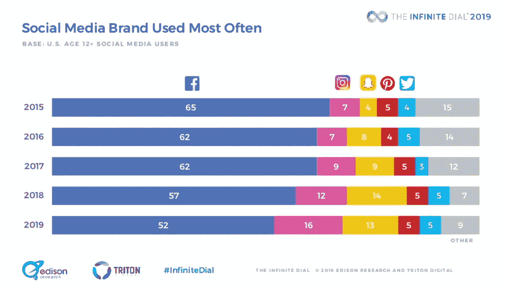
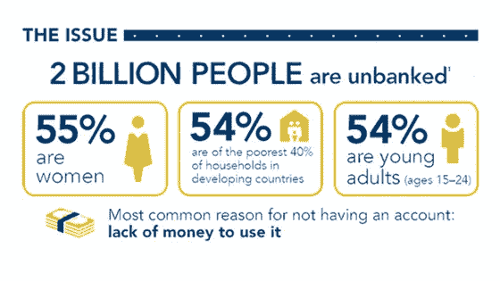
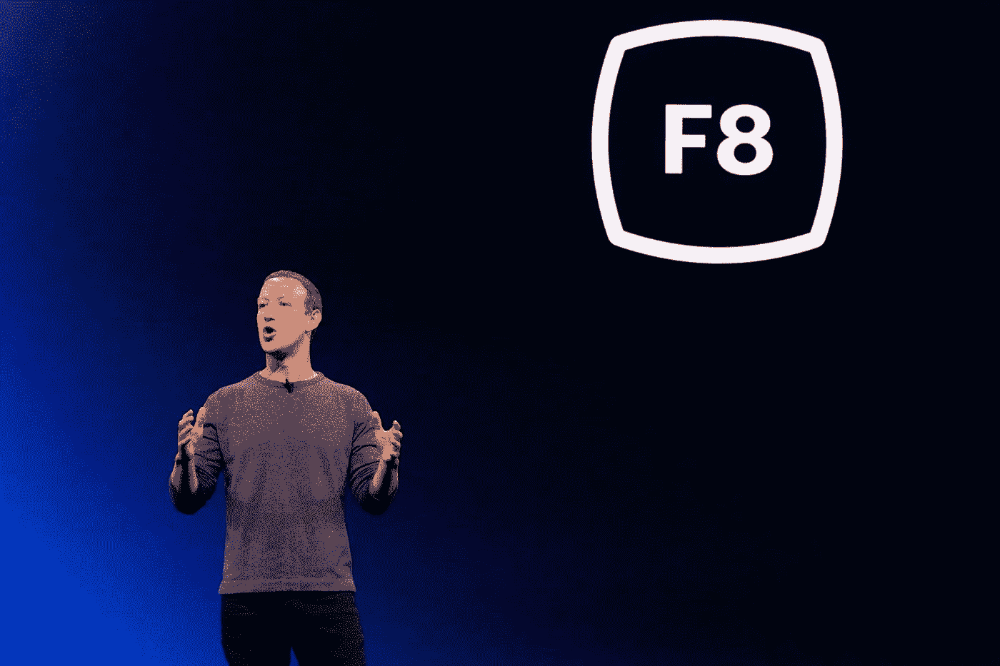

# 脸书为什么要开发“天秤币”？

> 原文：<https://medium.com/hackernoon/why-is-facebook-developing-globalcoin-3aee84db733c>

acebook 正式发布了其 Stablecoin 项目 Project Libra 的[发布日期，为 2020 年第一季度](https://www.bbc.com/news/business-48383460)。它将在大约十几个国家被用作数字支付系统，并计划在发布后扩展。

对于那些不熟悉脸书利用其区块链技术所做的事情的人来说，脸书正致力于 [**创造一种数字货币，让所有人都能负担得起和安全地进行支付，包括那些没有银行账户的人**](https://www.bbc.com/news/business-48383460) 。这将是他们在脸书信贷未能吸引用户后第二次尝试创造一种虚拟货币。

他们还分享了将在其新的数字支付平台上使用的令牌的新名称，' **GlobalCoin** ，'(现在是 Libra Coin，但在本文中我们将称为 GlobalCoin)以匹配其雄心。脸书[本月已经在日内瓦将其加密支付项目注册为“Libra Networks”](https://coincentral.com/facebook-fb-registers-secret-libra-crypto-project-in-geneva-as-data-privacy-concerns-loom/)，并报道称其将专注于“[投资、支付、融资、身份管理、分析、大数据、区块链和其他技术。](https://coincentral.com/facebook-fb-registers-secret-libra-crypto-project-in-geneva-as-data-privacy-concerns-loom/)

Facebook’s new GlobalCoin will soon be in the market ([source](https://www.independent.co.uk/life-style/gadgets-and-tech/news/facebook-cryptocurrency-globalcoin-when-release-date-bitcoin-zuckerberg-a8928151.html))

**脸书正在快速行动，以满足其承诺的日期**，[要求金融机构分享其用户的机密财务信息](https://coincentral.com/facebook-fb-registers-secret-libra-crypto-project-in-geneva-as-data-privacy-concerns-loom/)，[上个月已经与英国央行行长马克·卡尼讨论了推出加密货币](https://www.bbc.com/news/business-48383460)的机遇和风险。脸书也没有回避监管者，向美国财政部官员寻求操作和监管问题的建议。

看到脸书积极寻求一个可以让他们成为所有支付的中心并收集用户财务数据的项目，人们开始担忧，[美国参议院和银行委员会向扎克伯格发送了一封公开信，以确保他们理解脸书试图做什么。](https://www.banking.senate.gov/imo/media/doc/5.9.19%20Facebook%20Letter.pdf)

在经历了多年与用户信任的斗争后，人们很自然会想，为什么脸书在**这个可能会进一步侵蚀用户信任的项目上进展如此之快。还没有哪种加密货币是不稳定的，那么为什么脸书要下大赌注，认为他们能够做到这一点呢？**

# 它需要一个新的用例来迫使其 27 亿用户留下来

脸书知道，连续滚动新闻推送的日子即将结束，人们更喜欢离散的沟通渠道，就像微信在中国所做的那样。随着[更少的广告空间和广告定位信息](https://techcrunch.com/2019/05/05/facebook-is-pivoting/)、[以及数百万人离开脸书](https://mashable.com/article/facebook-losing-users-us/)，脸书需要一个新的理由让人们留在脸书。

The silver lining is that people are going to Instagram instead ([source](https://mashable.com/article/facebook-losing-users-us/))

脸书仍然对其保留的 52%的选民有意义，但它也知道它需要迅速转向大众想要的。这就是为什么脸书正在努力将脸书从在“市政厅”交谈转变为在“客厅”交谈

因此，这意味着**用例也必须快速转移**。脸书没有被用作一个巨大的麦克风，而是致力于满足客厅为个人提供的便利和舒适。因此，除了端到端加密提供的隐私之外，它还致力于成为一个一站式商店，用户不再需要穿越不同的网站或在其他地方做复杂的银行工作。

通过在脸书上提供你所有的金融能力，用户不再需要在他们需要一个新产品或需要偿还某人时遍历不同的应用程序。一切都可以在实例中完成，有了智能合同，人们不再需要为了实现财务承诺而相互信任。

Why even leave the house when all financial activities can be done at home? ([source](https://www.shutterstock.com/video/clip-4445501-young-woman-relaxing-on-sofa-laptop-closing))

这种便利将允许人们**在脸书**上执行大部分日常任务，而不必离开，这将增加其 27 亿用户的用户参与度。由于支付也需要汇款人和收款人的参与，GlobalCoin 可能会刺激其下一个主要增长。

# 当用户决定不看广告时，脸书需要一个新的激励让人们继续看他们的广告

相比过去，脸书声称这些法规不会帮助解决科技公司的主要问题，扎克伯格现在呼吁更多的政府法规。这背后的一个主要原因是，**脸书知道监管是不可避免的，他们更愿意在谈判中做出规定**，，这样脸书就可以提出他们可以处理的妥协方案。

Facebook hired Top State Department Lawyer, Jennifer Newstead, to help them with new regulations ([source](https://newsroom.fb.com/news/2019/04/newstead-and-pinette-join-facebook/))

脸书面临的一大任务将是，如果他们放弃对用户数据的牢牢控制，并让用户控制如何处理他们的数据，他们将如何生存。脸书将不得不转向一种不同的商业模式，这种模式仍然可以提取每个用户的数据。因此，为什么不付款呢？

付款是独一无二的，因为它告诉你什么是你认为必要的，因为你已经承诺放弃你辛苦赚来的钱。这也**激励人们寻找机会支付更少的**、**，即使他们放弃自己的数据或对某个公司的忠诚作为回报**。对脸书来说，还有什么比用户的数据和忠诚度更重要呢？

Loyalty market will be heavily disrupted by Facebook ([source](https://www.otterbine.com/resource-center/special-offers/))

例如，广告商提供的折扣金额可以考虑他们的广告在脸书上显示给超级用户的频率，或者更快地提供更大的覆盖范围，从而激励企业提供更大的折扣。这不会让脸书付出任何代价，同时增加了使用全球硬币的机会。

最后，由于所有交易都发生在 GlobalCoin 上，[脸书甚至可以奖励用户并创造一个独特的生态系统，这一点我在](https://hackernoon.com/recommendations-as-facebook-builds-a-new-privacy-focused-product-e2aa4bfd854)之前已经提到过。**如果脸书成功地控制了付费，而其他人却因为新规定而难以瞄准他们的广告**，猜猜广告商会去哪里？

此外，考虑到**区块链是一个不可变的账本**而**脸书需要访问每笔交易以确保没有洗钱发生**，猜猜谁将永久访问所有的采购？

# 脸书希望扰乱全球银行业，让所有人都可以获得银行服务

通过绕过银行，比特币已经开始扰乱 6000 亿美元的全球汇款市场，但许多人都避免使用比特币，因为“他们缺乏对其工作方式的了解”许多用户不希望冒由于技术复杂性而可能损失金钱的风险，也不希望比特币的波动性突然减少他们的汇款。

然而，如果脸书让这种体验变得直观，那么人们就没有理由再求助于传统的汇款银行了。**这一特点可能是脸书选择“全球硬币”这个名字的原因，因为他们希望人们忘记所有其他货币。**

传统的汇款巨头西联汇款意识到向区块链的转移是不可避免的，并且[已经于上月](https://www.coindesk.com/western-union-integrates-with-crypto-wallet-to-expand-philippines-remittances)与 Coins.ph 合作，coins . ph 是一家专门从事现金汇款的区块链初创公司。这笔交易将见证通过西联网络进行的国际和国内支付被发送到 Coins.ph 的“超过 500 万”用户的数字钱包中。

Traditional money tranfer giants are shifting to the blockchain too ([source](https://www.rappler.com/business/227439-coins-ph-users-can-now-receive-western-union-money-transfers))

因此，其他汇款巨头可能不得不效仿脸书的做法，因为失去与脸书的合作意味着失去你在汇款界的存在。这就类似于那些[在进入 Google 的零](https://www.nytimes.com/2018/02/20/magazine/the-case-against-google.html)的“PageRank”后，失去了所有的用户。尽管英国银行等一些银行一直在努力建立自己的加密货币，但没有一家银行能达到脸书的水平，这也解释了为什么所有银行都想与脸书对话。

此外，值得注意的是， **GlobalCoin 将为那些以前从未拥有过它的人——儿童和来自发展中国家的人——提供银行服务。随着经济活动转移到数字空间，脸书发展自己的经济，一些人可能会通过 GlobalCoin 获得第一笔收入。**

如果儿童和刚进入银行业的人用他们制作的 GlobalCoin 送礼物，接收者也需要使用 global coin。他们可以马上变现，但这给了他们一个下载并与脸书合作的理由。因此，脸书获得了第二次机会，让愤怒的用户再次尝试脸书。

Facebook is disrupting the banking industry by channeling in more users into banking ([source](/traxion-tech/5-things-you-probably-didnt-know-about-unbanked-people-8d8f4e0d95f5))

# 脸书希望通过解决银行这一最具信任问题的产品来证明自己可以再次成为一个值得信赖的产品。

正如扎克伯格在今年的 F8 会议上所说，“[[脸书]现在在隐私问题上名声不太好，说得轻一点](https://www.wired.com/story/f8-zuckerberg-future-is-private/?utm_campaign=wired&mbid=social_fb&utm_brand=wired&utm_medium=social&utm_source=facebook&utm_social-type=owned&fbclid=IwAR0X5Q0KW6Yzt9j6wXaosrUenO1Tk1x6u83snyEjoX1N1i5NlEJxwI6aqfg)。”许多人仍然对发生的事情感到失望，正如沃伦·巴菲特所说:“ [**建立一个声誉需要 20 年，而毁掉它只需要 5 分钟**](https://www.brainyquote.com/quotes/warren_buffett_108887) ”

Zuckerberg knows that regaining user trust is Facebook’s top priority ([source](https://www.wired.com/story/f8-zuckerberg-future-is-private/?utm_campaign=wired&mbid=social_fb&utm_brand=wired&utm_medium=social&utm_source=facebook&utm_social-type=owned&fbclid=IwAR0X5Q0KW6Yzt9j6wXaosrUenO1Tk1x6u83snyEjoX1N1i5NlEJxwI6aqfg))

不幸的是，在数字世界里，事情比其他行业发展得更快，脸书没有 20 年的时间。它还不到 20 岁，每个季度都必须达到华尔街的预期，这只会变得更加困难，因为他们的核心盈利战略面临数据保护法规的风险，就连扎克伯格也在呼吁。

脸书需要一个巨大的支点来说服其 27 亿用户，他们是值得信任的平台，也是所有经济交易的未来中心。考虑到这个项目还没有公布太多的细节，**扎克伯格推动早日实现这一目标是一个明确的信号，表明他正在押注 GlobalCoin，让脸书再次成为一个值得信赖的平台**。

这将如何影响隐私的未来将是另一个需要考虑的问题，因为区块链的初衷是恢复用户隐私，把权力还给人民。

正如伦敦经济学院研究员 Garrick Hileman 所说，“全球硬币项目可能是加密货币短暂历史中最重要的事件之一。”全球硬币将是扎克伯格最雄心勃勃的项目，并将决定脸书的未来方向。

或者更多关于脸书的天秤座项目，看看我其他的黑客故事吧！

为什么脸书现在发布他们的“区块链”项目 Libra 的白皮书？
脸书走了一条区块链项目的惯用路线，尽管它不是区块链，因为它已经意识到时机现在是脸书计划成功的关键。

[**你决定花费的稳定币将决定未来银行业如何发展**](https://hackernoon.com/the-stablecoin-you-decide-to-spend-will-determine-how-future-banking-unfolds-f4164058c1a0)稳定币将为我们提供选择使用哪种货币的选项，选择一种货币而不是另一种货币将首次具有意义。