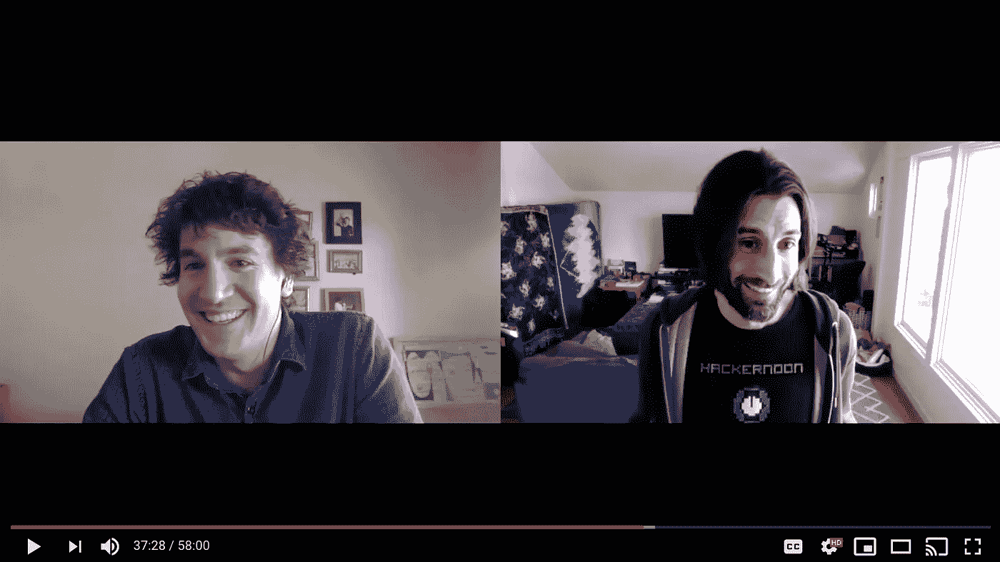

# 为什么 Hackernoon.com 要离开灵媒？

> 原文：<https://medium.com/hackernoon/why-is-hackernoon-com-leaving-medium-103cc541af85>

Hackernoon 的首席执行官兼创始人大卫·斯穆克。这是忙碌的一周，有很多错误的信息在流传，但我花时间和 [Trent Lapinski](http://hackernoon.com/@trentlapinski) 坐下来谈谈为什么我们要离开 Medium。

## [看这一集！](https://www.youtube.com/watch?v=Hy4Lduu9CKg)或在 [iTunes](https://itunes.apple.com/us/podcast/hacker-noon-podcast/id1436233955?mt=2#episodeGuid=hackernoon.podbean.com%2Fwhy-is-hackernooncom-leaving%25c2%25a0medium-17186b27f032bd3cd8dd7e2d534d8e2c) 、 [Google Play](https://play.google.com/music/m/Dtae7ck4fdsfwrpy5hjy64l6rsq?t=Why_is_Hackernooncom_leavingMedium-Hacker_Noon_Podcast) 或任何你[获得播客的地方](https://podcast.hackernoon.com/)收听。

如果对此有任何疑问，我可以在[DavidSmooke@Hackernoon.com](mailto:davidsmooke@hackernoon.com)找到。

回到网上！

**P.S.** 相关推文:[初始化资本的 Garry Tan](https://twitter.com/garrytan/status/1105311939066884096) ，[黑客午间声明](https://twitter.com/hackernoon/status/1105290961100259328)， [David Smooke 声明](https://twitter.com/DavidSmooke/status/1105520864043261953)， [TechCrunch 创始人迈克尔·阿灵顿](https://twitter.com/arrington/status/1105530079155613696)，[科技记者欧文](https://twitter.com/ow/status/1105462220517969920)，[更新条款](https://twitter.com/hackernoon/status/1106261550455676928) [媒体邮件&建议本故事片名](https://twitter.com/christhekeele/status/1105278973548748800)， [Ev Williams &过渡提案](https://twitter.com/DavidSmooke/status/1105522805968257024)

**P.P.S.** [看这一集！](https://www.youtube.com/watch?v=Hy4Lduu9CKg)或者在 [iTunes](https://itunes.apple.com/us/podcast/hacker-noon-podcast/id1436233955?mt=2#episodeGuid=hackernoon.podbean.com%2Fwhy-is-hackernooncom-leaving%25c2%25a0medium-17186b27f032bd3cd8dd7e2d534d8e2c) 、 [Google Play](https://play.google.com/music/m/Dtae7ck4fdsfwrpy5hjy64l6rsq?t=Why_is_Hackernooncom_leavingMedium-Hacker_Noon_Podcast) 或者任何你[得到你的播客](https://podcast.hackernoon.com/)的地方收听。