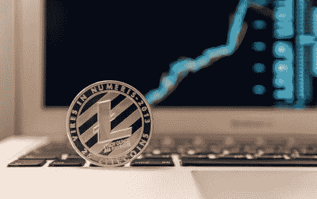

# 莱特币为什么做的这么好？

> 原文：<https://medium.com/hackernoon/why-is-litecoin-doing-so-well-b9e1c92217e2>

如今，莱特币的月涨幅为 62%，周涨幅为 24%，年涨幅更是高达 200%。在撰写本文时，莱特币的价格仅下跌了 2%，但仍有可能说，在加密市场最近的飙升中，莱特币表现非常出色。

莱特币 2019 年初的价格约为 30 美元，这意味着 2018 年价格大幅下跌。和以往一样，人们在寻找这种命运逆转的原因。Billy Bambrough 在《福布斯》杂志上撰文认为，这可能部分是因为比特币即将在明年 5 月减半。Halvenings 似乎总是引发价格飙升。比特币事件将导致矿工因挖掘新的比特币区块而获得的比特币数量从 12.5 比特币降至 6.25 比特币。“我们将在这个时间点囤积比特币，”比特币和加密货币基金经理布莱恩·凯利告诉美国消费者新闻与商业频道。“我们不会卖掉它。通常情况下，比特币价格下跌一年后会反弹，一年后又会反弹。因此，我们才刚刚开始这个阶段[……]减少供应通常是乐观的。”

**莱特币减半和更多使用**

莱特币将于今年 8 月将其矿工奖励减半，如果适用于比特币因减半而减少供应的经济理论是正确的，它也将适用于莱特币，莱特币的采矿奖励将从 25 莱特币降至 12.5 莱特币。

在之前的比特币 halvenings 期间发生了什么，这是每 210，000 个区块被挖掘后发生的固定事件。例如，在 2012 年 11 月第一次比特币减半事件大约一年后，比特币价格达到了 1000 美元的历史最高水平。2016 年的 halvening 似乎加速了 2017 年的牛市，当时比特币触及近 2 万美元。

但不仅仅是 Litecoin 即将到来的降价推高了它的价格。在过去的几个月里，litecoin 经历了一些技术改进，它可以通过比特币基地 Visa 卡在全球数百万个地方使用。比特币基地用户可以通过一个新的应用程序选择在卡上使用哪种加密货币，该应用程序支持在比特币基地平台上买卖的所有加密资产。该应用程序还提供即时收据、交易摘要和支出类别，以帮助人们跟踪他们的支出。

一段时间以来，莱特币一直被视为比特币最可信的对手之一；也许这是它最终宣称自己是加密市场的有力竞争者的一年。