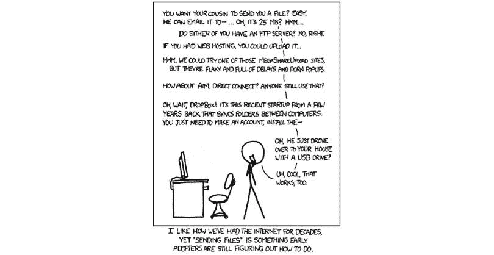
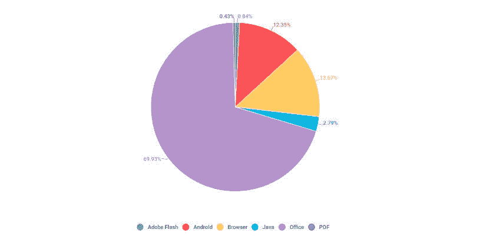
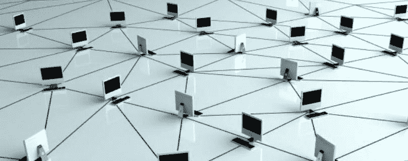
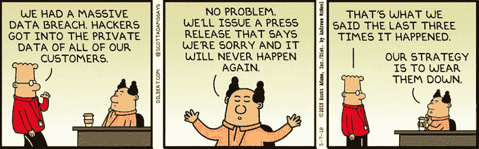

# 为什么物理邮件仍被用于共享敏感文档？

> 原文：<https://medium.com/hackernoon/why-is-physical-mail-still-being-used-to-share-sensitive-documents-660ea3a65c4>

## 所有邪恶的公司、政府和黑客都渴望得到你的机密信息，难怪你会担心把这些信息发到网上。

自从互联网发明以来，人们一直在寻找个人数据，因为如今这些信息比黄金更有价值。如果有人用关于公司的私人商业信息入侵服务器怎么办？或者当有人获得了一个主要政治家的个人电子邮件？还记得 2016 年希拉里和她的[泄露邮件](https://en.m.wikipedia.org/wiki/2016_Democratic_National_Committee_email_leak)吗；那次事件很可能影响了总统选举的结果。从名人[照片云被黑](https://etcanada.com/photos/95827/celebrities-who-got-hacked/#image-64742)到脸书[泄密](https://www.theverge.com/2019/4/3/18293978/facebook-app-developers-leak-user-records-data-cloud-servers)，可能性无穷无尽。

谷歌发布的一项详细研究提到，他们发现超过 19 亿个用户名和密码在黑市上交易。几乎每个人都可以在这个列表中，如果你通过公共服务保存或发送一些机密信息，它很容易泄露。这就是为什么，尽管听起来很荒谬，机密文件经常通过物理邮寄的方式在 DVD 或 USB 拇指驱动器上发送。

[https://xkcd.com/](https://xkcd.com/)

在本文中，我们将探索新的技术解决方案，这些解决方案旨在提供通过互联网发送文件、数据和文档的新方法，而不会将其中包含的数据置于风险之中。我们讨论的是 [Authpaper Delivery](https://www.authpaper.io/) 、 [BitTorrent](https://www.bittorrent.com/btt/) 和 [Filecoin](https://filecoin.io/) ，在这里我们将看到为什么它们在安全性方面优于当今市场上所有其他集中式解决方案。

# 当前(无效)的解决方案

有许多方法可以传输、存储和签署数据，最常用的方法是电子邮件。正如我们已经看到的，即使是最高层的政治家也会在他们的个人收件箱中存储敏感信息。因此，熟练的黑客有多种方式获得他们想要的东西。他们可以使用网络钓鱼技术，通过社会工程技能或各种特洛伊木马程序获得完全访问权限，或者他们可以通过监控发送电子邮件(SMTP)的服务器和接收电子邮件(POP)的服务器之间的[流量](https://www.visiondesign.com/how-does-email-work-a-simple-illustrated-explanation/)来执行[嗅探攻击](https://en.m.wikipedia.org/wiki/Sniffing_attack)。

这就是为什么即使它是最常见的通信工具之一，尤其是对公司来说，电子邮件也是一种非常不安全的发送文件的方式，电子邮件黑客的长期历史显然强化了这一事实。它唯一的好处是它是许多互联网用户最简单和最熟悉的工具。每个人都有一个电子邮件地址，使用它是没问题的，只是不要通过电子邮件发送任何重要的东西。有专门的解决方案。但是那些真的像他们宣称的那样安全吗？

[Adobe 文档云解决方案 Adobe Sign](https://acrobat.adobe.com/us/en/documents/esignatures.html) 和 [DocuSign](https://www.docusign.com/products/electronic-signature) 是两种允许用户在线存储文档并签名的服务，就像你签署常规纸质合同一样，但使用了[电子签名](https://blog.signaturit.com/en/what-is-an-electronic-signature-)。因此，现在您只需点击一个按钮，而不必打印、签署、扫描和发送文档。这两种服务都可以在手机上使用，它们简化了远程用户之间处理文档的过程。你可能会问，弱点在哪里？整个云的事情，这是一个很大的安全漏洞。云提供商不断成为攻击的目标，因为他们很容易被感染:一旦你将病毒注入云服务器，它就能同时感染所有用户。如果您处理大量文档，这些服务可以帮助加快您的日常工作，但是您必须牺牲安全性，并且要明白其他人可能会未经授权访问您的文档。它可能比电子邮件更安全，但仍不足以让你将最重要的数据托付给它。

还有另一种基于云的解决方案，允许您与其他人共享文件，该方案使用包括加密、身份和授权策略在内的高级保护措施。这就是微软 Azure [权限管理系统](https://docs.microsoft.com/en-us/azure/information-protection/what-is-azure-rms) (RMS)，用户可以安全地向需要重要公司数据的人分配权限，同时防止未经授权的访问(或者至少假设它是安全的)。当我们谈论微软的时候，它与微软 Office 文档一起工作最好是有意义的。

[https://securelist.com/it-threat-evolution-q3-2018-statistics/88689/](https://securelist.com/it-threat-evolution-q3-2018-statistics/88689/)

想法是好的，但现实更严酷。您可以找到写保护如何被[移除](https://dl.acm.org/citation.cfm?id=3027022)的描述，或者更糟糕的是，写保护如何被悄悄地移除，这样得到的文档仍然可以声称是写保护的，从而暗示被修改的内容是由受害者生成的。这就为通过编造受害者没有创建的文件来陷害他人留下了很大的机会。幸运的是，这些安全漏洞被修复了，因为这个描述被发送给了微软。但是它还有多少未公开的漏洞呢？

所有这些解决方案的作用都很好，但是它们不能提供处理机密文档所需的安全性。那么，区块链科技如何帮助完成这项任务呢？

# 区块链解决方案(更加有效)

与所有其他形式的存储和传输数据相比，区块链有一个重大优势——它不能被修改。写在区块链上的每一个字节的信息都会永远留在那里。任何行为都可以被追踪和验证，包括文件的签名。如果发生法律纠纷，将签名和文件保存在区块链上可以作为无可争议的证据。那么，有什么基于区块链的解决方案可以提供这种信任呢？

[https://www.makeuseof.com/tag/p2p-peer-peer-file-sharing-works/](https://www.makeuseof.com/tag/p2p-peer-peer-file-sharing-works/)

首先，现在最流行的服务是 [BitTorent](https://www.bittorrent.com/btt/) 。根据 2018 年[的一项小型研究](https://www.vice.com/en_us/article/d3q45v/bittorrent-usage-increases-netflix-streaming-sites)，整个文件共享占全球下游流量的 3%和上游流量的 22%，其中 97%的流量来自 BitTorrent。BitTorrent 主要被认为是一种文件共享服务，尤其是作为一种盗版手段，但它并不仅限于这种用途。这是一个分散的点对点协议，可以用来与其他用户直接共享文件，如文档，而不必担心干扰。是什么让 BitTorrent 的协议如此安全？

BitTorrent 就像网络中的一群计算机，不需要中央服务器。由不断上传和下载文件的节点组成的网络。成功下载后，该节点准备开始与网络中的所有其他活动节点共享新下载的文件。另外，它的效率很高。通过将每个文件分成更小的部分来最大化传输速度，这允许单个节点同时从任意数量的可用节点下载。遗憾的是，传输的文件没有加密。如果任何人获得了为传输机密文件而创建的链接，他/她就可以下载并阅读它。最近，BitTorrent 在 Tron 区块链上有了自己的令牌，可以用来给创作者小费或为更快的下载付费，但这不是区块链的预期用途，因为其核心功能仍然存在安全问题。然而，作为一个协议，可以在它的基础上开发新的解决方案。这正是所发生的事情。

[Authpaper Delivery](https://www.authpaper.io/) 开发了一种基于 BitTorrent 协议、区块链和其他技术安全发送文件的方法。其结果是一个点对点平台，用于传送机密数据、签署数据并创建不可伪造的传送记录，至少开发者是这样认为的。文件欺诈和伪造对受害者来说是相当昂贵的问题。现在，Authpaper Delivery 为这些问题提供了一个技术解决方案，它基于 Authpaper 团队多年来一直致力于开发的软件。这项技术现已获得专利，并在国际上享有盛誉。他们的解决方案允许交付任何类型的文件，从文档到大文件，如电影、软件或系统映像，因为它使用 BitTorent 协议来传输文件。例如，电影制片人可以通过网络发送未发行的电影，而电影泄露到互联网的风险较小。但是这种安全感从何而来？

除了指定的收件人之外，所有发送的数据都是保密的，因为在通过公共网络发送之前，这些数据由两个私钥加密。任何获得 torrent 链接的人都可以下载文件，但只有拥有这两个密钥的人才能阅读发送的文件。BitTorrent 网络节点现在有了一个额外的角色，不仅存储加密数据，而且验证和记录所有数据操作及其传递。对于他们的工作，他们会得到平台的代币，即“纸币”(AUPC)。该过程如下所示:

*   网络上的任何用户都可以用他/她的电子邮件和名字发布文档，并将其发送给其他人
*   接收者授权传输并签署数据
*   一旦他们签了字，他们就不能否认
*   防伪系统防止伪造文件上的签名和印章

另一个位于区块链的选择是 [Filecoin](https://filecoin.io/) 。这是一个分散式存储网络，来自 [IPFS 协议](https://en.wikipedia.org/wiki/InterPlanetary_File_System)的创造者，一个分散式存储网络，矿工们通过在他们的硬盘上提供存储空间来赚取代币。Filecoin 将有关其文件的信息存储在[加密哈希](https://en.wikipedia.org/wiki/Cryptographic_hash_function)中，以识别和分发存储在网络上的数据，因此存储在网络上的数据无法被第三方访问。只有文件的所有者才能访问它。

无论如何，就目前而言，Filecoin 网络很难找到足够的矿工来存储大型文件，这使得存储大型数据文件非常昂贵，尤其是在对分散空间的需求很高的情况下。并且它不提供文档签名功能，而 Authpaper Delivery 成功地将该功能集成到了它的协议中。

# 结论

当然，物理邮件不会立即消失，当前的集中式解决方案也不会——区块链技术仍处于起步阶段，他们还有很长的路要走。当风险不是很高时，集中式系统在很多情况下是有用的。如果你发送一个不太重要的文档，你可以在 DocuSign 中签名。但是，如果您的文件的重要性非常高，例如，如果它是一份房地产合同，您必须使用最安全的传输方式，现在，这就是区块链。文件伪造仍然是一件事，与目前的技术，它比以往任何时候都更容易做到。

[https://dilbert.com/](https://dilbert.com/)

久而久之，越来越多通常在线下完成的普通动作将在网上进行。文档签名和数据传输将是其中之一。目前，世界上大多数国家都在使用中央系统，但随着审查制度的蔓延，人们开始关心隐私和言论自由。这就是为什么我们可以期待更多的人开始使用 BitTorrent、Filecoin 和 Authpaper 交付解决方案。人们以物理方式传递文档，因为在某些情况下他们不信任在线集中平台。但是在分散的系统中，没有人可以信任，它只是工作——这是一件好事。