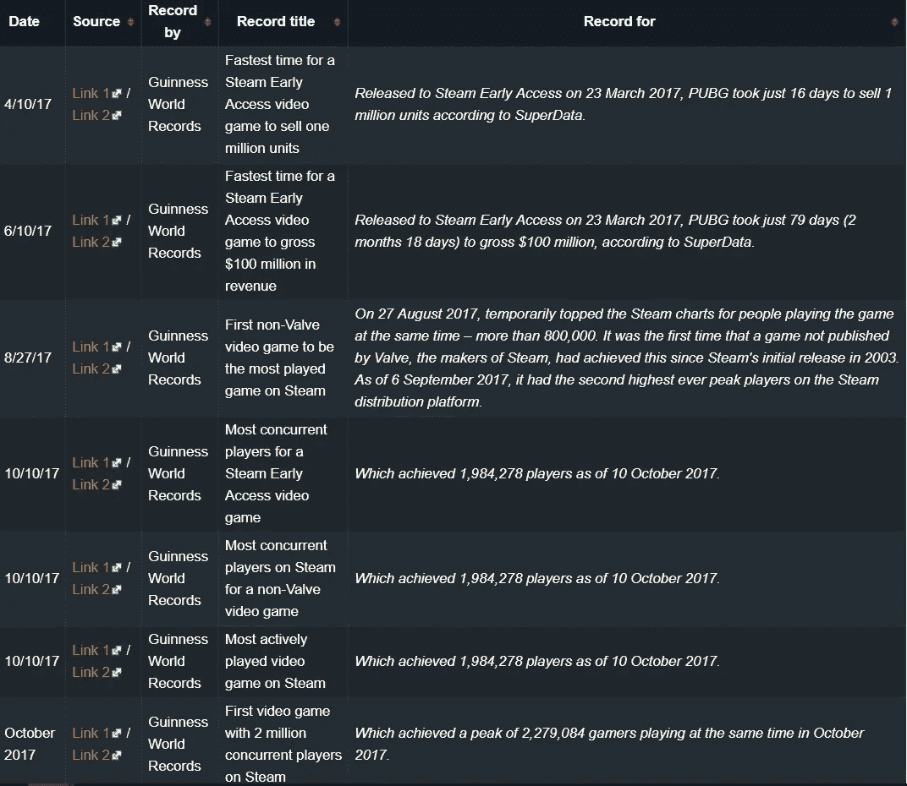
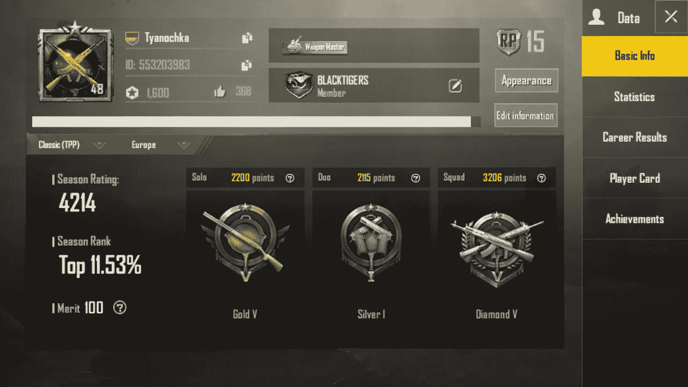
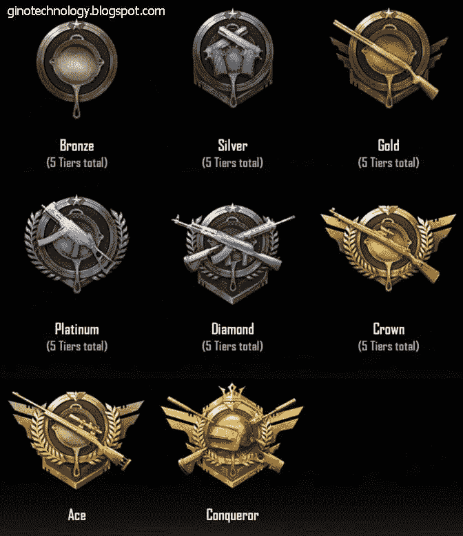
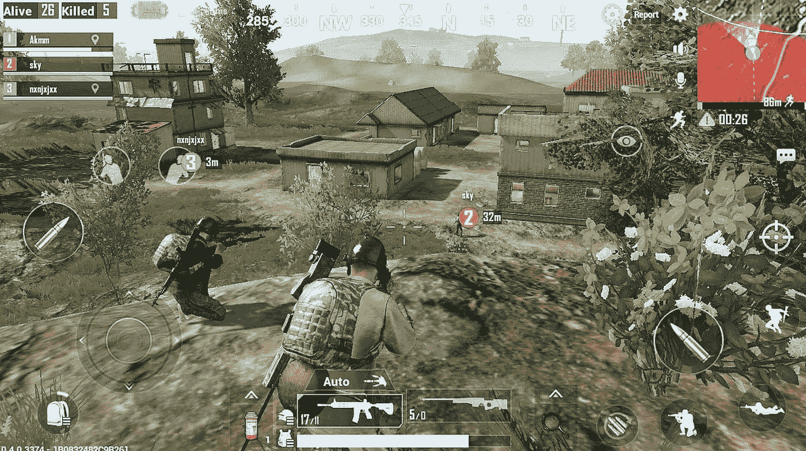

# PubG 为什么这么容易上瘾？

> 原文：<https://medium.com/hackernoon/why-is-pubg-so-addictive-353cbb394e8a>

流行性感冒正在蔓延。

这种缺失已经达到了一个青少年在不被允许玩游戏的时候甚至自杀的程度。虽然这可能是一个极端，但现在人们将玩游戏置于其他日常事务之上已经司空见惯。

在这种情况下，了解这款游戏到底有什么让你不能放下手机将会很有趣。

Source: PubG Website

# 关于 PubG

对于那些现在知道游戏起源的人来说，这个视频应该会让你充实起来:

The origins of PubG

# 数字和统计:

1.  2017 年 3 月发布的 PubG PC 早期接入
2.  在早期发行的前 4 个月，游戏进行了 1000 万轮，游戏在 3 天内**赚了 1100 万美元(甚至在正式发行之前)**
3.  在早期发布的一个月内售出 100 万份
4.  到 2017 年 9 月，**打破了 dota 2 130 万并发在线玩家的记录**，到 10 月，它在 Steam 上有 200 万并发玩家
5.  10 月，它**击败了《英雄联盟》,成为韩国有史以来玩得最多的电脑游戏**
6.  2017 年 12 月正式发布 PubG PC，2018 年 2 月发布移动版
7.  PubG mobile 获得了 2018 年的**游戏，最具竞争力的头衔，也是全球粉丝最喜欢的 Google Play 奖项**
8.  PubG Mobile 拥有 **2 亿 mn 月玩家和 3000 万 mn 日玩家(不包括中国**)([2018 年 12 月数字](https://expandedramblings.com/index.php/pubg-facts-and-statistics/))
9.  **总玩家的 8%来自印度**，33%来自中国([2018 年 10 月数字](https://expandedramblings.com/index.php/pubg-facts-and-statistics/))
10.  **每天在 PubG 上花费的平均金额:110 万美元**
11.  2018 年 PubG 收入:10.3 亿美元(不包括安卓系统)

# 世界纪录:

[Source: GamePedia](https://pubg.gamepedia.com/Awards)

这些数字表明了它的受欢迎程度和上瘾的性质。让我们深入探究它令人上瘾的原因:

# 格式

这是皇家战役第一次被改编

## 大逃杀游戏

非常坦率地说，这是第一款大规模发行的皇家战役格式的电子游戏。在此之前流行的视频游戏，如 GTA 系列，Assasin 的信条等，都是紧密导向的故事，其中你是一个生活在体验中的角色。生存模式仅限于服务器和流媒体游戏，如《反恐精英》，这种游戏从未离开过狂热流媒体用户的电脑。因为你必须非常优秀才能参与其中。

PubG 是第一款允许业余玩家玩生存游戏的游戏。而且赢了！这是由他们的算法辅助的(后面会有更多)

## 蓝色区域

虽然 PubG 中的地图是巨大而精致的，你可以在任何地方登陆来开始游戏，但蓝色区域(用圆圈表示)确保幸存者必须在一个较小的战区中战斗到底，并且结束迫在眉睫。这确保了游戏不会永远持续下去，也确保了一个孤独幸存者的胜利。

一个典型的游戏持续最多 35-40 分钟，如果你以吃鸡肉晚餐结束的话，这个数字在不同的地图和游戏之间会有 5-10 分钟的差异。

对于用户来说，这意味着他们知道他们玩的地图的平均游戏性，他们可以在任何有空的时候玩游戏。

## 按你的方式玩

这个游戏不会强迫你用某种方式去玩，它只是给你工具，让你运用自己的策略去赢得游戏。因为这是一个以目标为导向的游戏，你可以不断尝试不同的技术，尝试不同的枪，在不同的地方着陆，尝试进攻或防守——这完全是你的选择。

> 这个自由的暗示允许玩家和他们的队伍建立策略，并且花越来越多的时间玩，试图为难以捉摸的鸡肉晚餐完善他们的策略

# 该算法

## 和与你水平相当的人一起玩

> 游戏的配对算法保证你总是和与你技能水平不相上下的人一起玩。

所以，如果你是一个初学者，你只能和初学者一起玩，和专家一起玩，你赢的机会会大大增加。

这确保了你的胜率保持在高水平，你也能从游戏中获得你需要的肾上腺素。你可能会连续输掉 5 场比赛，但是接下来的 2 场你会赢，你获胜的希望会继续。

当用户在重复尝试后不能赢得游戏时，大多数多人游戏失去粘性。PubG 算法通过改变你玩的玩家池来增加难度。

也许令人惊讶的是，你的排名并不影响相亲过程，至少不直接影响。开发人员表示，该算法不会将你或你的二人组或小队与同一级别的球员进行匹配，而是会更深入地查看你的一生统计数据，以确保你与技能水平大致相同的球员进行比赛。

> 开发者解释说，根据你在游戏中的整体表现，还有一个单独的 MMR。它决定了你将要面对的玩家，并且不考虑你的等级点数。由于每场比赛需要大量的玩家，单靠排名不足以提供平衡的游戏，所以他们需要一个辅助系统来加强匹配算法。

## 评分和经验值的游戏

一个普通的用户资料有很多附加的统计数据。

[Source: imgur](https://imgur.com/gallery/LKn6OyK)

每个用户都试图获得更高的赛季排名，同时试图增加他的排名水平。这需要大量的游戏性和并发匹配。

每玩一个游戏就获得 BP(战斗点数)、XP(经验点数)和等级点数(总、生存和击杀)。

BP 允许您进行免费的应用内购买，而 XP 帮助您提高等级。

**评分点**根据您在每场比赛中的表现分配。杀死，位置，游戏中的玩家数量，以及你的实际等级都被考虑在内来计算在特定比赛中获得的 RP。根据你的位置，也有可能丢失 RP。它们在您的档案中累积为等级。

[Source: Gino Technology](https://www.ginotechnology.xyz/2018/09/list-order-of-rankrank-pubg-mobile.html)

没有确切的信息，但显然你在比赛中的最终排名可能会对排名积分的计算产生最大的影响。

> 根据开发者的说法，你可以通过“*持续玩游戏*获得称号。从专家开始的升级难度成倍增加，并且受到“*更高的等级和杀死数*”的影响。

经验和评级帮助你获得徽章，为你打开更多的独家好东西。这些徽章提升了你在游戏中的地位，并使你有资格获得象征性的胜利，如你可以使用的风格化的枪

请注意，你在单人、双人和小队游戏中有单独的排名，尽管你没有每个地图的单独排名。第三人称和第一人称游戏也有不同的排名。

> 现在，随着你的位置越来越高，如果你表现不好，你失去的分数会比你表现好时得到的分数多。所以每次你在比赛中表现不好，你必须打更多的比赛来弥补。

## 免费赠品和鸡肉晚餐的诱惑

从你注册的那一刻起，你就获得了免费赠品，以及奖励你所取得的每一项成就的奖品。

> 即使是每日登录，也会每 7 天奖励一个英雄箱

你可以定制你的虚拟角色，给他们特定的电影，当他们赢得游戏时，得到里面有神秘战利品的箱子，当你通过某一关时可以解锁的专属物品。

> 这是典型的情感满足，你不断追求下一个最好的东西，不断攀登无止境的阶梯。有趣的是，在这里你与多人竞争，竞争的基本本能开始发挥作用。

他们也有皇家通行证关卡，在那里你可以通过完成每日和每周的任务来赚取 RPs，这给了你进入皇家通行证的机会。这允许你以衣服和配件的库存的形式获得专属奖励，你可以用它们来定制你的角色，给他们特定的表情动作，如舞蹈等。

# 用户体验

## 可以在任何像样的智能手机上玩

玩 PubG Mobile 不需要非常高端的手机。

Android: Android 5.1.1 或更高版本，至少 2GB 内存

iOS:在 iPhone 5s 或更高版本上运行的 iOS 9 或更高版本

虽然这些只是 PUBG Mobile 的最低要求，但这表明对于任何想要享受游戏的人来说，进入的门槛都非常低。通常，为了获得良好的游戏体验，你要么需要一台高端电脑，要么需要一部非常高端的手机。

> PubG 让你更容易尝试游戏。

## 与脸书/推特联系:

通过连接到社交网络进行登录，PubG 可以确保个人资料得到验证，并且机器人不会相互攻击。它还可以确保您自动与已经在玩游戏的朋友建立联系。

这增强了社交体验，不像其他战斗游戏，你可以和你的朋友一起直观地玩完整个游戏，这在之前的其他游戏中是不可能的。

> 这也导致了巨大的网络效应，因为学校和大学里的孩子和青少年组成了他们的球队，像小队一样比赛，FOMO 效应开始大爆发！

## 界面

PubG 或许是 PC 游戏向手机最好的移植之一。默认情况下，按钮被放置在正确的位置(可以定制)，当你靠近它们时，自动拾取物品。

对于你来说，没有学习曲线来适应界面，所有的动作在 1-2 个游戏中变得直观。

## 与您的朋友实时聊天

> 这是第一款允许你在战斗游戏中与朋友聊天的手机游戏。这可以让你在适当的时候提醒你的队员，在旅途中决定策略，并且在游戏中创造一种集体的感觉。你是团队中的一员，你的任务是赢得令人垂涎的鸡肉晚餐。

戴上耳机，你也可以找到在山的另一边开火的另一个玩家，所以你可以小心翼翼地从一个掩体移动到另一个掩体，试图看到他们。你可以发现一个玩家或者一个小队是否在附近，他们是靠近还是离开。这种精确程度足以让用户对是战还是逃做出正确的判断。

# 总之:

PubG 是第一个沉浸式游戏，允许你和你的朋友一起玩，和他们聊天，并在游戏中建立你自己的策略。

就其本身而言，算法会注意游戏的玩法，并根据你的专业知识进行定制。它能够带来与 PC 版相同的战术节奏和张力，正是这种猫捉老鼠的战斗让人们爱上了这款游戏。

我本人是这个游戏的超级粉丝，每天都想吃鸡肉晚餐。

你今天吃了几顿鸡肉晚餐？

## 参考资料:

 [## PUBG 赛季排名分布和玩家比例-2019 年 1 月

### 玩家未知战场的等级分布每月更新。找出玩家在…中的等级百分比

www.esportstales.com](https://www.esportstales.com/pubg/seasonal-rank-distribution-and-players-percentage-by-tier)  [## PUBG 移动排名系统指南:了解你的排名

### PUBG Mobile 从 PUBG 的 PC 版本中获得了很多线索，但时不时地会反过来。大众…

www.gamezebo.com](https://www.gamezebo.com/2018/10/05/pubg-mobile-ranking-system-explained/)  [## 有趣的 PUBG 事实和统计数据

### 文章最后更新:由克雷格·史密斯归档于:标签为:所有统计，在线公司统计，MMORPG 游戏…

expandedramblings.com](https://expandedramblings.com/index.php/pubg-facts-and-statistics/)