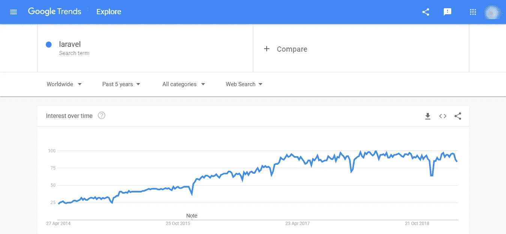

# 为什么 Laravel 是您企业的最佳选择

> 原文：<https://medium.com/hackernoon/why-laravel-is-a-good-choice-for-your-business-4c2f8f355912>

## 互联网上充满了事实和数据，展示了为什么选择 Laravel 而不是其他 PHP 开发框架。在本文中，我们将了解为什么您应该考虑雇佣 Laravel 开发人员。

Why Choose Laravel Developers

Laravel 是通用的，它装载了几个特性来加速开发过程。开源框架允许开发人员减少项目开销，因此与其他框架相比，它在性能和可伸缩性方面效率更高。

[创建一个 Laravel RESTful API](https://medium.freecodecamp.org/how-to-build-a-laravel-rest-api-with-test-driven-development-c4bb6417db3c) 是构建一个单一接口的最佳选择，它是多样化需求的理想选择，如内置面向对象库、文档清晰性和 MVC 模式、高端认证、单元测试和缓存；使其成为市场上最高效、最有竞争力的框架之一。由于它的多功能性，Laravel 也有一个 [**大型社区**](https://laracasts.com/discuss) 的支持，这有助于简化开发过程。这也是选择 Laravel 框架进行开发的主要原因之一。

如果我们考虑不同的 [**PHP 框架**](https://technostacks.com/blog/php-frameworks/) ，Laravel 的受欢迎程度上升最快。这要归功于辉煌的 Laravel 生态系统及其先进的工具箱。此外，它还为编码人员和 web 应用程序客户端提供了一种协调的感觉。

# **为什么 Laravel 是最好的 PHP 框架**

下面你可以看到谷歌趋势图流行的 Laravel 框架。很明显，Laravel 是有史以来最好的 PHP 框架。

Laravel Google Trends Popularity

**Laravel 最激动人心的功能如下:**

访问关系数据库管理系统(RDBMS)的简单方法

以最佳方式维护应用程序

顶级文档

模块化包装系统

简单流畅的语法

无与伦比的用户模型

最佳产品支持和包装

有许多公司使用 Laravel 框架进行构建。比如 LaravelIO、邻里借贷、Deltanet Travel、 [5iQ](https://fiiviq.com/) 、Laravel Tricks 等。

# 为什么要为你的网络开发项目雇佣 Laravel 开发人员

## 解锁定制和集成

每个公司都有自己的一套规则和协议。没有公司喜欢为任何人改变它。因此，在开发应用程序时，需要考虑公司的系统来集成和定制编码。如果代码是定制的，那么应用程序将对公司更有利。因此，雇佣一名 Laravel 开发人员成为关键。它将集成和定制提高到了一个新的水平，并为组织提供了正确的技术领域。

## 吸引全球观众

这也是为什么大部分客户更愿意雇佣 [**拉勒维尔发展公司**](https://technostacks.com/) 进行商业项目的最大原因。

一个有经验的 Laravel 开发人员可以在 CMS 应用程序的帮助下创建一个多语言应用程序。这可以给观众带来丰富的体验。观众会喜欢它，因为许多人非常依赖多语言应用程序。因此，它可以吸引或说服受众使用该应用程序。一旦你的网站或应用程序有了流量，你的业务肯定会蓬勃发展，因为你的业务会有更广泛的受众。

## 通过包装和产品提供帮助

Laravel 有很多包和产品。这些包和产品需要高度复杂的知识来评估和处理它们。这就是 Laravel 开发人员的作用所在。他或她可以从包装中容易获得的指南中获得指导。也有许多支持 Laravel 的 [**PHP 开发工具**](https://technostacks.com/blog/php-development-ides-tools/) 可用，因此开发者很容易使用它。

## 实现完美的数据传输

当您第一次从当前的业务 web 应用程序转换到 PHP 框架时，您会面临许多问题。有很多机会会丢失一些现有的数据。不仅如此，过渡还需要适当的援助。然而，当公司雇佣一个专家 Laravel 开发人员时，他们知道如何从现有的业务 web 应用程序迁移到 Laravel PHP 框架。他们有保护数据安全的经验。他们也会帮助你熟悉新的环境。

## 对于技术驱动的商业市场至关重要

在拓展任何业务时，了解你的竞争对手是必要的。在 21 世纪，根据你的竞争对手修改你的计划是很重要的。

实施了许多更具技术性的策略。在大多数大公司中常见的一种策略是为 web 开发项目提供 Laravel 程序员的永久职位。

## 顺畅的支付网关集成

世界正在慢慢走向数字支付。创建支付网关是必要的，这样商业才能繁荣。根据[调查](/iquii/digital-payments-a-growing-trend-with-a-focus-on-customer-experience-d31fa69664bc)，如果允许数字支付方式，企业可以增长数倍。

使用 Laravel 可以成功地集成支付网关，并且它提供了支付网关与网站的无缝结合。一个 Laravel 开发者，如果被雇用，可以集成支付网关，这将顺利增加公司或组织的业务规模。

## 在实际环境中的直接测试

Laravel 是目前世界上最实用的 PHP 开发框架之一。它允许你同时作为编码者和管理者工作。因此，如果一个精通 Laravel 的人被赋予了 web 开发的工作，他或她可以用一种更实际和更基础的方法来面对它。Laravel 还让您可以轻松地测试代码。

## 该框架本质上是高度安全的

使用 Laravel 最大的一个优势就是安全性。在安全问题上你可以放心。 [Laravel 使用 CSRF 保护](https://laravel.com/docs/5.8/csrf)，因此没有跨站请求的机会。还有其他提供数据安全性的强大功能。

## 未来是拉勒维尔

如果你了解顶级公司或电子商务公司的见解，你就会知道他们是如何依赖 PHP 框架的。我们之前也提到过，Laravel 是最好的 PHP 开发框架之一，它同时集成了程序员和经理。

## **关键要点**

Laravel 已经成为最近最好的 PHP 开发框架之一。据估计，随着时间的推移，它将在不久的将来发挥的影响将更大，更先进。有如此多的技术功能，人们可以期望通过 Laravel 开发人员毫不费力地实现，同时为您的 web 开发项目招聘人员。

如前所述，公司或您的个人项目需要 Laravel 开发人员的几个关键原因是，他们完全了解专业知识，能够执行一切优先考虑安全性的工作，并且能够在不占用太多时间的情况下处理小问题。因此，每个公司都应该考虑雇佣任何级别的 Laravel 开发人员来组建一个具体的团队。这不仅是今天向前迈出的一步，也为未来创造了光明和阳光。