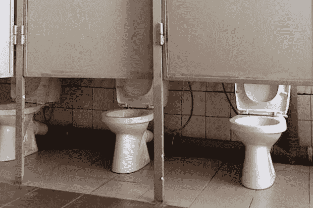

# 为什么新的社交网络声音可能不是脸书更好的答案

> 原文：<https://medium.com/hackernoon/why-new-social-network-voice-might-not-be-a-better-answer-to-facebook-be75557e6da0>

**“所有动物都是平等的，但有些动物比其他动物更平等”**

乔治·奥威尔的[小说](https://www.dictionary.com/browse/novel) *动物庄园*中控制政府的猪的宣言。这句话是对政府虚伪的评论，这些政府宣称其公民绝对平等，但却将权力和特权给予一小撮精英。

Block.one 是 [EOS](https://www.coindesk.com/71-million-galaxy-digital-sells-stake-in-eos-blockchain-maker-block-one) 背后的[数十亿美元的](https://www.bloomberg.com/news/articles/2019-05-22/thiel-backed-crypto-startup-pays-out-6-567-return)公司，现在渴望建立一个名为 [Voice](https://voice.com/) 的新社交网络。现在是替代脸书的时候了，但是这些人是建造它的合适人选吗？

这篇文章可以用一个简单的问题来概括:为什么你必须位于特定的司法管辖区，才能对你的数据拥有特定的权利，以及如何使用这些数据？

## 根据 voice.com 的说法

> 我们认为社交网络是时候进行一次大改造了。从机器人暴民，到数据跟踪，到我们反馈背后的黑幕算法，社交媒体一直不是我们的好朋友。

我非常关注他们在隐私政策中选择使用的词语。有很多我不喜欢的地方，但我只强调一个方面，因为这是他们整个业务的基础。

## 我担心他们根据权限区别对待用户的方式。除非你生活在一个有强有力的隐私法保护你的国家，否则 Voice 不会比脸书好到哪里去。

# 这是我最关心的部分

> **特定司法管辖区的个人——您的权利**
> 
> 如果您位于某些司法管辖区，您可能拥有以下权利:

为什么您必须位于特定的司法管辖区才能拥有特定的权利？如果我只能问队员一个问题，那就是这个了。

为什么 Voice (Block.one)不能让每个人，无论在哪里，都拥有同样的权利？区块链不是在让互联网和使用互联网的人民主化吗？为什么他们根据居住地点来限制谁获得什么样的福利？

**我对该案文的拟议修改:**

**您的权利，无论您住在哪里**

无论你住在哪里，你都有以下权利，因为我们相信每个人都应该被平等对待。

> 根据适用的数据保护法，有权访问我们掌握的关于您的个人信息以及一些相关信息。

为什么我们必须受到适用的数据保护法的保护？这意味着生活在一个几乎没有保护的国家的个人将会遭受痛苦——就像他们在脸书一样 Voice 有什么不同吗？

**我提议对案文的修改:**

有权访问我们掌握的关于您的个人信息以及所有相关信息，不受保护您的法律的约束。

> 有权要求更正或删除我们掌握的任何不准确的个人信息。
> 
> 有权随时反对我们将您的个人信息用于直接营销目的，您**可能**有权反对我们在**某些**其他情况下处理您的部分或全部个人信息(并要求删除这些信息)。

我关心的是“可能”和“一些”这两个词。

**我提议的文本:**

有权要求更正或删除我们掌握的任何不准确的个人信息。

有权随时反对我们将您的个人信息用于直接营销目的，并且您有权在所有其他情况下反对我们处理您的部分或全部个人信息(并要求删除这些信息)。

> 数据可移植性权利，这意味着在以下情况下有权以结构化、常用和机器可读的格式接收您的个人信息:对您的个人信息的处理是基于您的同意或履行合同的需要，或者:该处理是通过自动化手段进行的。

世界上的每个人都有数据可移植性的权利。它不应该被限制在那些生活在有法律要求的国家的人们身上。

**我的拟议案文:**

我们将使您可以随时轻松地移植数据。

您的数据可移植性权利是指在以下情况下以结构化、常用、人类可读和机器可读的格式接收您的个人信息的权利:对您的个人信息的处理是基于您的同意或履行合同的需要，或；该处理是通过自动化手段进行的。

(“我们会让它变得容易”这句话极其重要，因为脸书支持数据可移植性——但这很难做到，而且你得到的东西绝不容易重用)。

> 要了解有关这些权利的更多信息(包括这些权利是否适用于您)和/或如果您希望行使这些权利，请通过以下方式联系我们。

哇哦。我将重复这一点以使其深入人心…了解更多关于这些权利的信息，包括**如果** **适用于您** …

# 总结一下…

我很不高兴的是，一个新的社交网络背后的人不更加关心每个人的隐私权——他们不应该做最起码的事情。

遵守法律是必要的，但他们应该为社会中的每个人制定更高的标准。

*[*保罗*](/@paul__walsh) *最终读取介质上的每一个响应，你可以* [*在 Twitter 上和他聊天*](http://twitter.com/paul__walsh) *或* [*给他发邮件*](mailto:paul@metacert.com) *。**